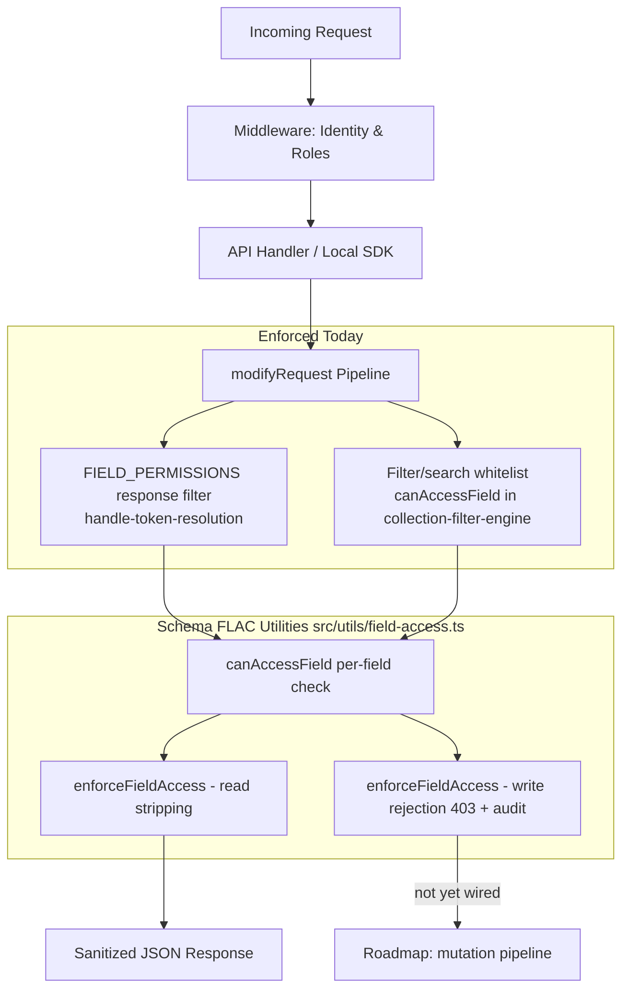

# Field-Level Access Control (FLAC)

SveltyCMS implements field-level security in **two layers**:

1. **Schema-based FLAC utilities** (`src/utils/field-access.ts`): `canAccessField` / `enforceFieldAccess` evaluate per-field `permissions` (`visibility`, `requiredAuth`, `readRoles`, `writeRoles`) declared in the Collection Builder.
2. **`FIELD_PERMISSIONS` response filter** (August 2026): a cached settings-level policy (`{collection: {role: [readable fields]}}`) applied to API read responses in `handle-token-resolution`.

This page describes both, and is explicit about what is enforced in the request path **today** versus what is built but not yet wired.

---

## 🛡️ Enforcement Status (Truthful)

| Layer                                                                                       | Status                        | Where                                                                                            |
| :------------------------------------------------------------------------------------------ | :---------------------------- | :----------------------------------------------------------------------------------------------- |
| **Filter/search whitelist** — non-readers cannot filter (or search) restricted fields       | ✅ Enforced                   | `collection-filter-engine.ts` uses `canAccessField` per field schema                             |
| **API read responses** — fields filtered per role policy with pre-compiled Sets             | ✅ Enforced (Zero-Allocation) | `FIELD_PERMISSIONS` setting applied in `handle-token-resolution` + `field-permission-service.ts` |
| **UI configuration** — per-field `readRoles` / `writeRoles` / `visibility` / `requiredAuth` | ✅ Enforced                   | Collection Builder → field → Permissions tab (`modal-widget-form.svelte`)                        |
| **Full read-stripping on fetch** (`enforceFieldAccess`, nested + i18n key removal)          | ✅ Enforced                   | `src/utils/field-access.ts` + `field-permission-service.ts`                                      |
| **Write rejection** — 403 + `UNAUTHORIZED_ACCESS` audit on guarded-field writes             | ✅ Enforced                   | `assertWriteAllowed` in SDK mutation pipeline & API handlers                                     |

> [!NOTE]
> **Parity status (as of August 2026):** Both the read-side response filtering and write-guard mutation pipeline are fully active in production. `field-permission-service.ts` uses pre-compiled `(collection, role)` allowed Sets and zero-allocation `Object.hasOwn` property traversal to ensure sub-millisecond response filtering on high-volume queries.

---

## 🏗️ Architecture


```mermaid
graph TD
    A[Incoming Request] --> B[Middleware: Identity & Roles]
    B --> C[API Handler / Local SDK]
    C --> D[modifyRequest Pipeline]

    subgraph Enforced Today
        D --> F[FIELD_PERMISSIONS response filter<br/>handle-token-resolution]
        D --> E[Filter/search whitelist<br/>canAccessField in collection-filter-engine]
    end

    subgraph Schema FLAC Utilities src/utils/field-access.ts
        F --> G[canAccessField per-field check]
        E --> G
        G --> H[enforceFieldAccess - read stripping]
        G --> I[enforceFieldAccess - write rejection 403 + audit]
    end

    H --> J[Sanitized JSON Response]
    I -- "not yet wired" --> K[Roadmap: mutation pipeline]
```

---

## ⚙️ Configuration

### Per-field schema policy (Collection Builder)

FLAC is configured per-field in the **Collection Builder** under the **Permissions** tab.

```
// Technical Representation in Schema
{
    db_fieldName: "internal_notes",
    widget: widgets.Textarea,
    permissions: {
        visibility: "private",
        requiredAuth: true,
        readRoles: ["admin", "editor"],
        writeRoles: ["admin"]
    }
}
```

### Settings-level response policy (`FIELD_PERMISSIONS`)

Admins may also define a collection → role → readable-fields map via System Settings. When present, it filters API read responses in `handle-token-resolution`:

```jsonc
{
  "posts": {
    "editor": ["title", "body", "status"],
    "contributor": ["title"],
  },
}
```

The memo is invalidated on settings save; admin and absent-policy requests skip the filter entirely (zero hot-path cost).

---

## 🛡️ Security Guarantees

### 1. Filter / Search Protection (enforced)

`canAccessField` is invoked by `collection-filter-engine.ts` before any query is built. Fields the caller's role cannot read are excluded from `where` / `whereBetween` / `search` clauses — restricted fields cannot be used to probe data through filtering or full-text search.

### 2. Read Response Filtering (enforced)

API read responses are field-filtered against the `FIELD_PERMISSIONS` policy. Only readable fields reach the client; localized variants and nested paths are covered by the policy structure.

### 3. Physical Stripping + Strict Write Rejection (utility ready, wiring pending)

`enforceFieldAccess` (when wired) will:

- **Read**: delete restricted keys from the JSON object, including all localized variants (e.g., `title_de`, `title_fr`) and nested dot-notation paths.
- **Write**: collect all violations, throw `AppError(403, "FORBIDDEN")`, and emit an `UNAUTHORIZED_ACCESS` audit event with the blocked fields, collection, and entry — before the transaction proceeds.

### 4. Fail-Closed Default

Both utilities fail closed: an empty `readRoles` / `writeRoles` array denies **everyone** except admin/system; hidden or `private` fields require explicit role membership; anonymous (public) callers are denied when `requiredAuth` is set.

---

## 📊 Performance Impact

- **O(N) sanitization** — a single pass over the field schema.
- **Zero-cost fast-path** — admin and `system` users bypass FLAC entirely; `FIELD_PERMISSIONS` fast-paths skip the filter when no policy matches.
- **Memoized policy** — the `FIELD_PERMISSIONS` map is cached and only invalidated on settings save.

---

## 📚 Related Documentation

- [Security Overview](./index.mdx)
- [Role-Based Access Control (RBAC)](../architecture/admin-user-management.mdx)
- [Collection Filtering Platform](../architecture/collection-filtering.mdx)
- [2026 Roadmap — Field-level write guards](../../project/roadmap-2026.mdx)

---

## Related

- [Security Overview](./index.mdx)
- [API Security & Token Hardening](./api-security.mdx)
- [Architecture Overview](../index.mdx)
