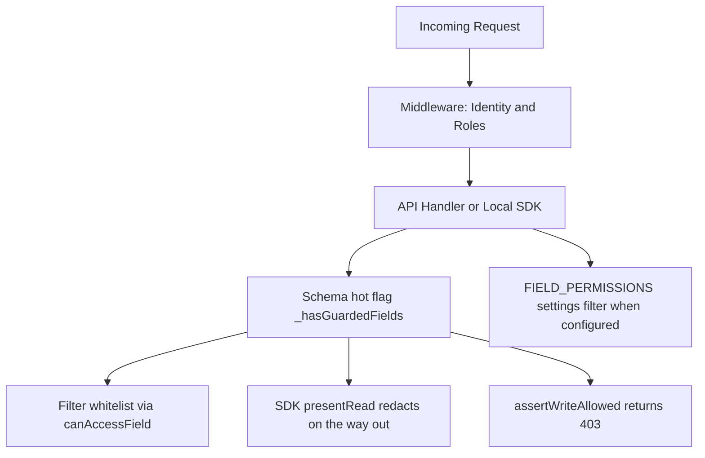

# Field-Level Access Control (FLAC)

SveltyCMS implements field-level security in **two layers**, plus optional
**at-rest encryption** for designated fields (`encrypt: true` — see
[Field-Level Encryption](./field-level-encryption.mdx)):

1. **Schema-based FLAC utilities** (`src/utils/field-access.ts`): `canAccessField` / `enforceFieldAccess` evaluate per-field `permissions` (`visibility`, `requiredAuth`, `readRoles`, `writeRoles`) declared in the Collection Builder.
2. **`FIELD_PERMISSIONS` response filter** (August 2026): a cached settings-level policy (`{collection: {role: [readable fields]}}`) applied to API read responses in `handle-token-resolution`.

This page describes both, and is explicit about what is enforced in the request path **today** versus what is built but not yet wired.

---

## 🛡️ Enforcement Status (Truthful)

| Layer                                                                                       | Status                        | Where                                                                                            |
| :------------------------------------------------------------------------------------------ | :---------------------------- | :----------------------------------------------------------------------------------------------- |
| **Filter/search whitelist** — non-readers cannot filter (or search) restricted fields       | ✅ Enforced                   | `collection-filter-engine.ts` uses `canAccessField` per field schema                             |
| **API read responses** — fields filtered per role policy with pre-compiled Sets             | ✅ Enforced (Zero-Allocation) | `FIELD_PERMISSIONS` setting applied in `handle-token-resolution` + `field-permission-service.ts` |
| **UI configuration** — per-field `readRoles` / `writeRoles` / `visibility` / `requiredAuth` | ✅ Enforced                   | `fieldDeclaresGuard` + `canAccessField`. Private with an empty role list is admin-only.          |
| **Schema read redaction** — private / role-restricted fields removed on SDK reads           | ✅ Enforced                   | `presentRead` in `collections-namespace.ts` after the cache read. The cached row stays complete. |
| **Settings read filter** (`FIELD_PERMISSIONS`)                                              | ✅ Enforced when configured   | `handle-token-resolution`. Point-read GET/HEAD skips that hook; schema redaction still runs.     |
| **Write rejection** — 403 + `UNAUTHORIZED_ACCESS` audit on guarded-field writes             | ✅ Enforced                   | `assertWriteAllowed` in the SDK mutation pipeline and API handlers                               |

> [!NOTE]
> **Parity status (September 2026):** Schema visibility and role lists are enforced on SDK reads and on writes. `FIELD_PERMISSIONS` remains a separate settings filter. Unguarded collections skip both checks. The warm read lane declines a non-admin when any field is guarded, so it never caches a body that still contains a private field for that caller.

---

## 🏗️ Architecture


```mermaid
graph TD
    A[Incoming Request] --> B[Middleware: Identity and Roles]
    B --> C[API Handler or Local SDK]
    C --> D[Schema hot flag _hasGuardedFields]

    D --> E[Filter whitelist via canAccessField]
    D --> F[SDK presentRead redacts on the way out]
    D --> G[assertWriteAllowed returns 403]
    C --> H[FIELD_PERMISSIONS settings filter when configured]
```

---

## ⚙️ Configuration

### Per-field schema policy (Collection Builder)

FLAC is configured per-field in the **Collection Builder** under the **Permissions** tab.

```
// Technical Representation in Schema
{
    db_fieldName: "internal_notes",
    widget: widgets.Textarea,
    permissions: {
        visibility: "private",
        requiredAuth: true,
        readRoles: ["admin", "editor"],
        writeRoles: ["admin"]
    }
}
```

### Settings-level response policy (`FIELD_PERMISSIONS`)

Admins may also define a collection → role → readable-fields map via System Settings. When present, it filters API read responses in `handle-token-resolution`:

```jsonc
{
  "posts": {
    "editor": ["title", "body", "status"],
    "contributor": ["title"],
  },
}
```

The memo is invalidated on settings save; admin and absent-policy requests skip the filter entirely (zero hot-path cost).

---

## 🛡️ Security Guarantees

### 1. Filter / Search Protection (enforced)

`canAccessField` is invoked by `collection-filter-engine.ts` before any query is built. Fields the caller's role cannot read are excluded from `where` / `whereBetween` / `search` clauses — restricted fields cannot be used to probe data through filtering or full-text search.

### 2. Read Response Filtering (enforced)

Two independent filters:

- **Schema.** `presentRead` calls `redactReadEnvelope` on `find`, `findById`, `findByIds`, search, and collection streams. A private field and its `field_de` siblings are removed for anyone who is not an admin. The cache stores the full row.
- **Settings.** `FIELD_PERMISSIONS` filters responses in `handle-token-resolution` when that setting exists. Point-read GET/HEAD skips that hook. Schema redaction still applies.

### 3. Write Rejection (enforced)

`assertWriteAllowed` runs for non-admins when `fieldDeclaresGuard` is true. It collects every denied field, writes an `UNAUTHORIZED_ACCESS` audit event, and throws 403 before the transaction.

### 4. Fail-Closed Default

`permissions.visibility: "private"` with an empty role list is admin-only on read and on write. A role listed in `readRoles` or `writeRoles` is allowed for that operation. `requiredAuth` denies anonymous callers. A public field with an empty role list is not a guard: the fast path stays on, which matches the Permissions tab ("empty selection follows visibility"). `canAccessField` still denies an empty role array when a caller asks about that field directly, which is how filters behave.

---

## 📊 Performance Impact

- **O(N) sanitization** — a single pass over the field schema.
- **Zero-cost fast-path** — admin and `system` users bypass FLAC entirely; `FIELD_PERMISSIONS` fast-paths skip the filter when no policy matches.
- **Memoized policy** — the `FIELD_PERMISSIONS` map is cached and only invalidated on settings save.

---

## 📚 Related Documentation

- [Security Overview](./index.mdx)
- [Role-Based Access Control (RBAC)](../../guides/configuration/access-management.mdx)
- [Collection Filtering Platform](../architecture/collection-filtering.mdx)
- [2026 Roadmap — Field-level write guards](../../project/roadmap-2026.mdx)

---

## Related

- [Security Overview](./index.mdx)
- [API Security & Token Hardening](./api-security.mdx)
- [Architecture Overview](../index.mdx)
