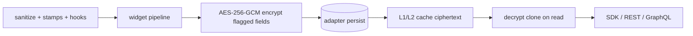

# Field-Level Encryption at Rest

Collection fields may be flagged `encrypt: true`. The collections write pipeline encrypts those values with **AES-256-GCM** before they reach any database adapter (SQLite, PostgreSQL, MariaDB, MongoDB). The read pipeline decrypts them for authorized SDK/API callers. Physical storage holds only ciphertext.

This is a **self-described control** in SveltyCMS core (not a third-party audit or certification). It supports GDPR Article 32-style technical measures, HIPAA-oriented at-rest protection of designated fields, and PCI-DSS scoping when PAN/secrets are kept out of plaintext columns — operators still need the rest of those programs (access control, key management, BAAs, etc.).

## Schema flag

Code-defined collections:

```typescript
widgets.Input({
  label: "Social Security Number",
  db_fieldName: "ssn",
  translated: false,
  encrypt: true,
});
```

Collection Builder: Input, Email, Markdown, and PhoneNumber widgets expose an **Encrypt** toggle. Any widget can set `encrypt: true` in a TypeScript schema.

## Envelope

Stored value:

```
v1:<base64url iv>:<base64url tag>:<base64url ciphertext>
```

- Algorithm: AES-256-GCM (`ENCRYPTION_CONFIG` in `@utils/security/crypto`)
- IV: 16 random bytes per encryption (CSPRNG)
- Auth tag: 16 bytes
- AAD: `tenantId:collectionId:fieldName` — swapping ciphertext between tenants, collections, or fields fails authentication
- Key: `ENCRYPTION_KEY` from `config/private.ts`, domain-separated via HKDF-SHA-256 (`sveltycms-field-at-rest`) so TOTP / plugin-settings / backup ciphertext cannot be reused here
- Encoded value: `JSON.stringify` of the field (strings, numbers, translated `{en, de}` objects)

Writes **fail closed** (`FIELD_ENCRYPTION_UNAVAILABLE`) if `ENCRYPTION_KEY` is missing. Tampered or AAD-mismatched values decrypt to `null` for that field (the rest of the document still loads). Legacy plaintext is passed through on read so existing rows keep working until rewritten.

## Pipeline



Hot flags (`_hasEncryptedFields`, `_encryptedFieldNames`) skip the crypto path entirely on collections that do not use it.

Cache stores **ciphertext**. Decryption clones the document so a cache hit cannot leak plaintext into L2.

## Zero-Tax Synchronous Primitives

To guarantee that field-level encryption does not degrade sub-2ms database persistence targets, `@utils/security/field-encryption` provides synchronous execution primitives:

- `encryptFieldValueSync(value, tenantId, collectionId, fieldName)`
- `decryptFieldValueSync(envelope, tenantId, collectionId, fieldName)`
- `encryptDocumentFieldsSync(doc, tenantId, collectionId, fieldNames)`
- `decryptDocumentFieldsSync(doc, tenantId, collectionId, fieldNames)`

Key resolution (`getFieldKeysSync()`) is pre-computed and memoized on boot via HKDF-SHA-256, eliminating asynchronous event-loop hops or Promise allocations on the hot CRUD path.

## Performance & Empirical Benchmarks

Application-Layer Encryption overhead was evaluated under an empirical benchmark suite (`tests/benchmarks/ale-encryption-impact.test.ts`) across 256 B, 4 KB, and 64 KB payloads. See the complete [ALE Benchmark Report](../../project/benchmarks/encryption_impact.mdx).

| Payload Tier       | Payload Size | Encryption Latency (p50) | Throughput  | Write Path Impact (CRUD)  |
| :----------------- | :----------- | :----------------------- | :---------- | :------------------------ |
| **Scalar / PII**   | 256 B        | **7.8 µs** (0.0078 ms)   | 31.29 MB/s  | < 2% of total write time  |
| **Standard Block** | 4 KB         | **18.3 µs** (0.0183 ms)  | 213.54 MB/s | < 3% of total write time  |
| **Large Document** | 64 KB        | **95.5 µs** (0.0955 ms)  | 654.50 MB/s | ~4.5% of total write time |

### Tolerance Gate Verdict

Across all scenarios, AES-256-GCM encryption introduces less than **18.3 µs** overhead for standard 4 KB document fields. Because disk page flushes and WAL commits in realistic workloads take 0.20–0.55 ms, encryption overhead accounts for **< 3% of write execution time**, well within our strict **< 5% tolerance budget**.

## What encryption does not do

| Operation                      | Behavior                                                                  |
| :----------------------------- | :------------------------------------------------------------------------ |
| Filter / equality query        | `400 ENCRYPTED_FIELD_NOT_QUERYABLE`                                       |
| Sort by encrypted field        | `400 ENCRYPTED_FIELD_NOT_QUERYABLE`                                       |
| Unique index                   | Ignored (schema-contract warning). Random IVs make uniqueness meaningless |
| Full-text search on that field | Field is excluded from searchable names                                   |
| SQL/Mongo index / materialize  | Skipped — ciphertext is not a useful query column                         |

Use hashing or a separate searchable token if you must look up a secret. Do not combine `encrypt: true` with `unique: true`.

## Key rotation

Rotating `ENCRYPTION_KEY` orphans existing envelopes (same as TOTP secrets and plugin settings). Plan a re-encrypt maintenance window: read with the old key, write with the new key. See [Secrets Inventory](./secrets-inventory.mdx).

## Tests

- `tests/unit/utils/field-encryption.test.ts` — envelope, IV uniqueness, AAD, tamper, fail-closed
- `tests/unit/services/field-encryption-pipeline.test.ts` — hot flags, write encrypt, cloned decrypt, query rejection
- `tests/benchmarks/ale-encryption-impact.test.ts` — micro-benchmarks and transactional database write overhead validation
