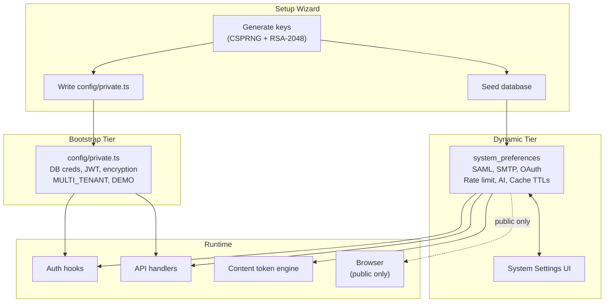

# Secrets & Tokens Inventory

SveltyCMS stores secrets in two tiers:



| Tier          | Location                        | When loaded                           | Managed via                                    |
| ------------- | ------------------------------- | ------------------------------------- | ---------------------------------------------- |
| **Bootstrap** | `config/private.ts`             | At server start, before DB connection | File-only (generated during setup)             |
| **Dynamic**   | Database (`system_preferences`) | After DB initializes                  | System Settings UI (`/config/system-settings`) |

---

## Bootstrap Secrets (`config/private.ts`)

These **must** be available before the database connection is established. The server cannot start without them.

| Key                 | Purpose                                                                       | Generated           | Rotatable                      |
| ------------------- | ----------------------------------------------------------------------------- | ------------------- | ------------------------------ |
| `DB_TYPE`           | Which database adapter to load (`sqlite`, `mariadb`, `postgresql`, `mongodb`) | ❌ User-configured  | ⚠️ Requires setup re-run       |
| `DB_HOST`           | Database server hostname or file path (SQLite)                                | ❌ User-configured  | ⚠️ Requires setup re-run       |
| `DB_PORT`           | Database server port                                                          | ❌ User-configured  | ⚠️ Requires setup re-run       |
| `DB_NAME`           | Database name                                                                 | ❌ User-configured  | ⚠️ Requires setup re-run       |
| `DB_USER`           | Database username                                                             | ❌ User-configured  | ⚠️ Requires setup re-run       |
| `DB_PASSWORD`       | Database password                                                             | ❌ User-configured  | ✅ Change in DB + update file  |
| `DB_RETRY_ATTEMPTS` | Max connection retry attempts (default: 5)                                    | ❌ Default          | ✅ Edit file                   |
| `DB_RETRY_DELAY`    | Delay between retries in ms (default: 3000)                                   | ❌ Default          | ✅ Edit file                   |
| `JWT_SECRET_KEY`    | Signs all session tokens and JWTs                                             | ✅ CSPRNG (32-char) | ⚠️ Invalidates all sessions    |
| `ENCRYPTION_KEY`    | Encrypts sensitive fields at rest                                             | ✅ CSPRNG (32-char) | ⚠️ Requires data re-encryption |
| `MULTI_TENANT`      | Enables multi-tenant isolation mode                                           | ❌ Default `false`  | ✅ Edit file + restart         |
| `DEMO`              | Enables ephemeral demo tenant mode                                            | ❌ Default `false`  | ✅ Edit file + restart         |

> [!CAUTION]
> Rotating `JWT_SECRET_KEY` invalidates **all** user sessions. Rotating `ENCRYPTION_KEY` requires re-encrypting all stored encrypted data. Plan maintenance windows accordingly.

---

## Dynamic Secrets (Database)

These are seeded into the database during setup and managed via the **System Settings UI** at `/config/system-settings`. Changes take effect on next request (no restart required unless noted).

### Security & Authentication

| Key                                  | Type    | Default         | UI Group | Notes                                                                                           |
| ------------------------------------ | ------- | --------------- | -------- | ----------------------------------------------------------------------------------------------- |
| `PASSWORD_MIN_LENGTH`                | Public  | `8`             | Security | Enforced by `Auth.validatePasswordStrength()`                                                   |
| `RATE_LIMIT_SECRET`                  | Private | `""` (auto-gen) | Security | Signing secret for rate limiter cookies; falls back to `JWT_SECRET_KEY + "-ratelimit"` if empty |
| `USE_2FA`                            | Private | `false`         | —        | Enable two-factor authentication globally                                                       |
| `TWO_FACTOR_AUTH_BACKUP_CODES_COUNT` | Private | `10`            | —        | Number of backup codes per 2FA user                                                             |
| `USE_GOOGLE_OAUTH`                   | Public  | `false`         | OAuth    | Enable Google OAuth login                                                                       |
| `GOOGLE_CLIENT_ID`                   | Private | `""`            | OAuth    | OAuth 2.0 client ID                                                                             |
| `GOOGLE_CLIENT_SECRET`               | Private | `""`            | OAuth    | OAuth 2.0 client secret                                                                         |
| `GOOGLE_API_KEY`                     | Private | `""`            | OAuth    | Google services API key                                                                         |
| `GOOGLE_MAPS_API_KEY`                | Public  | `""`            | OAuth    | Google Maps client-side key                                                                     |

### SAML / Enterprise SSO

| Key                            | Type    | Default         | UI Group              | Notes                                  |
| ------------------------------ | ------- | --------------- | --------------------- | -------------------------------------- |
| `SAML_CLIENT_SECRET_VERIFIER`  | Private | `""` (auto-gen) | SAML / Enterprise SSO | Validates identity provider assertions |
| `SAML_ENCRYPTION_KEY`          | Private | `""` (auto-gen) | SAML / Enterprise SSO | Encrypts SAML assertions               |
| `SAML_JWT_SIGNING_PRIVATE_KEY` | Private | `""` (auto-gen) | SAML / Enterprise SSO | RSA-2048 PEM private key               |
| `SAML_JWT_SIGNING_PUBLIC_KEY`  | Private | `""` (auto-gen) | SAML / Enterprise SSO | RSA-2048 PEM public key                |

### SMTP / Email

| Key              | Type    | Default | UI Group     | Notes                        |
| ---------------- | ------- | ------- | ------------ | ---------------------------- |
| `SMTP_HOST`      | Private | `""`    | Email / SMTP | SMTP server hostname         |
| `SMTP_PORT`      | Private | `587`   | Email / SMTP | SMTP port                    |
| `SMTP_USER`      | Private | `""`    | Email / SMTP | SMTP username                |
| `SMTP_PASS`      | Private | `""`    | Email / SMTP | SMTP password (sensitive)    |
| `SMTP_MAIL_FROM` | Private | `""`    | Email / SMTP | From address for sent emails |
| `SMTP_EMAIL`     | Private | `""`    | Email / SMTP | Reply-to address             |

### Redis / Caching

| Key              | Type    | Default       | UI Group | Notes                 |
| ---------------- | ------- | ------------- | -------- | --------------------- |
| `USE_REDIS`      | Private | `false`       | —        | Enable Redis L2 cache |
| `REDIS_HOST`     | Private | `"localhost"` | —        | Redis host            |
| `REDIS_PORT`     | Private | `6379`        | —        | Redis port            |
| `REDIS_PASSWORD` | Private | `""`          | —        | Redis password        |

### Cache TTLs (seconds)

| Key                 | Default | Description                            |
| ------------------- | ------- | -------------------------------------- |
| `CACHE_TTL_SCHEMA`  | `600`   | Schema/collection definitions (10 min) |
| `CACHE_TTL_WIDGET`  | `600`   | Widget data (10 min)                   |
| `CACHE_TTL_THEME`   | `300`   | Theme configurations (5 min)           |
| `CACHE_TTL_CONTENT` | `180`   | Content data (3 min)                   |
| `CACHE_TTL_MEDIA`   | `300`   | Media metadata (5 min)                 |
| `CACHE_TTL_SESSION` | `86400` | User sessions (24 hours)               |
| `CACHE_TTL_USER`    | `60`    | User permissions (1 min)               |
| `CACHE_TTL_API`     | `300`   | API responses (5 min)                  |

### Sessions & Authentication Lifecycle

| Key                          | Default  | Description                                 |
| ---------------------------- | -------- | ------------------------------------------- |
| `SESSION_CLEANUP_INTERVAL`   | `300000` | Expired session cleanup interval (ms)       |
| `MAX_IN_MEMORY_SESSIONS`     | `1000`   | Max sessions in memory cache                |
| `DB_VALIDATION_PROBABILITY`  | `0.1`    | Probability of DB re-validation per request |
| `SESSION_EXPIRATION_SECONDS` | `86400`  | Session lifetime (24 hours)                 |

### AI / LLM

| Key                       | Type    | Default                    | Notes                                     |
| ------------------------- | ------- | -------------------------- | ----------------------------------------- |
| `AI_PROVIDER`             | Private | `"ollama"`                 | AI backend                                |
| `OLLAMA_URL`              | Private | `"http://localhost:11434"` | Local Ollama endpoint                     |
| `AI_MODEL_CHAT`           | Private | `"ministral-3:latest"`     | Chat/assistant model                      |
| `AI_MODEL_VISION`         | Private | `"llava:latest"`           | Image tagging model                       |
| `USE_AI_TAGGING`          | Private | `false`                    | Enable AI image tagging                   |
| `USE_REMOTE_AI_KNOWLEDGE` | Private | `false`                    | Remote knowledge base (mcp.sveltycms.com) |

### Third-Party Integrations

| Key                       | Type    | Default  | Notes                       |
| ------------------------- | ------- | -------- | --------------------------- |
| `CF_API_TOKEN`            | Private | `""`     | Cloudflare cache purging    |
| `CF_ZONE_ID`              | Private | `""`     | Cloudflare zone identifier  |
| `CF_PURGE_MODE`           | Private | `"tags"` | `tags` or `all`             |
| `USE_MAPBOX`              | Private | `false`  | Mapbox integration toggle   |
| `MAPBOX_API_TOKEN`        | Private | `""`     | Mapbox public token         |
| `SECRET_MAPBOX_API_TOKEN` | Private | `""`     | Mapbox server-side token    |
| `TWITCH_TOKEN`            | Private | `""`     | Twitch API token            |
| `TIKTOK_TOKEN`            | Private | `""`     | TikTok API token            |
| `DEMO_TTL`                | Public  | `60`     | Demo session TTL in minutes |

---

## Runtime-Generated Tokens

These are generated at runtime and never stored in configuration files.

| Token                    | Location                                      | Lifetime                  | Notes                            |
| ------------------------ | --------------------------------------------- | ------------------------- | -------------------------------- |
| **Session cookies**      | Browser (`__Host-session_id` or `session_id`) | Session TTL (default 24h) | Signed with `JWT_SECRET_KEY`     |
| **CSRF tokens**          | Browser (`__Host-csrf_token`)                 | Session                   | Double-submit cookie pattern     |
| **Demo tenant cookies**  | Browser (`__Host-demo_tenant_id`)             | `DEMO_TTL` minutes        | Ephemeral tenant assignment      |
| **API keys** (`sck_...`) | Database (SHA-256 hashed)                     | Permanent until revoked   | Plaintext shown once on creation |
| **Website tokens**       | Database (SHA-256 hashed)                     | Permanent until revoked   | Bearer auth for external clients |
| **TOTP replay registry** | In-memory (per-process)                       | 30-second window          | Prevents code reuse              |
| **Rate limit counters**  | In-memory (per-process)                       | Per-window                | IP/Cookie-scoped                 |

---

## Security Properties

### Category: `public` vs `private`

- **Public** settings are exposed to the client via `+layout.server.ts` → `global-settings.svelte.ts`. They are safe for browser access (e.g., `SITE_NAME`, `PASSWORD_MIN_LENGTH`, `DEMO_TTL`).
- **Private** settings never leave the server. They are loaded via `getPrivateSettingSync()` / `getPrivateSetting()` and only accessible in `.server.ts` files, hooks, and API handlers.

### Content Token Leak Prevention

Bootstrap secrets (`DB_USER`, `DB_PASSWORD`, `JWT_SECRET_KEY`, `ENCRYPTION_KEY`) are impossible to leak through the content templating system (`{{ }}`):

| Token prefix     | Data source                        | Can access bootstrap secrets?               |
| ---------------- | ---------------------------------- | ------------------------------------------- |
| `{{ entry.* }}`  | Collection data (user content)     | No                                          |
| `{{ user.* }}`   | Hardcoded allowlist of 7 fields    | No — blocked fields return empty string     |
| `{{ site.* }}`   | `publicEnv` (public settings only) | No — private settings never reach the store |
| `{{ system.* }}` | Hardcoded timestamps               | No                                          |

No user — regardless of role — can access `DB_USER`, `DB_PASSWORD`, or any bootstrap
secret through the content token engine, API, or UI.

### Schema Validation

All settings are validated against two Valibot schemas:

| Schema                | File                                     | Validates                                    |
| --------------------- | ---------------------------------------- | -------------------------------------------- |
| `privateConfigSchema` | `src/databases/private-config-schema.ts` | All private settings (bootstrap + DB-driven) |
| `publicConfigSchema`  | `src/databases/public-config-schema.ts`  | All public settings exposed to client        |

### Environment Variable Overrides

All settings can be overridden via environment variables (e.g., `SVELTYCMS_DEMO=true bun run dev`). Environment variables take precedence over both `private.ts` and database values. The `config-state.ts` module handles the merge order:

```
Environment variable → config/private.ts → Database (system_preferences) → Schema default
```

---

## Key Rotation

| Secret               | Rotation Interval | Impact                                   |
| -------------------- | ----------------- | ---------------------------------------- |
| `JWT_SECRET_KEY`     | Every 90 days     | All sessions invalidated                 |
| `ENCRYPTION_KEY`     | Every 180 days    | Encrypted data must be re-encrypted      |
| `RATE_LIMIT_SECRET`  | Every 90 days     | Rate limit states unaffected             |
| `TEST_API_SECRET`    | Every 30 days     | Integration tests need update            |
| API keys (`sck_...`) | Every 90 days     | Create new → update service → revoke old |
| SAML signing keys    | Every 180 days    | Update identity provider metadata        |

---

## Related

- [Security Overview](./index.mdx)
- [Login Security](./login-security.mdx)
- [Authentication System](./authentication-system.mdx)
- [System Settings Configuration](../../guides/configuration/system-settings.mdx)
- [Setup Wizard](../../guides/configuration/setup-wizard.mdx)
