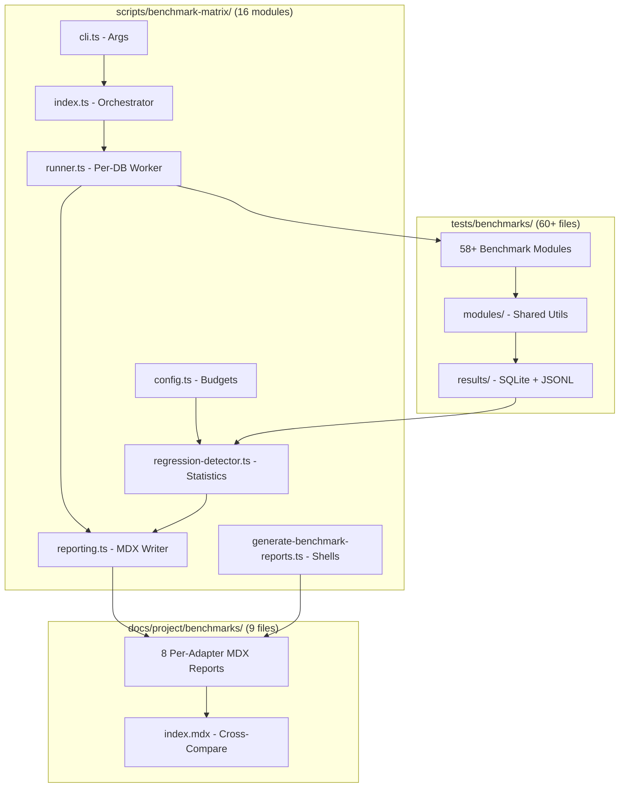
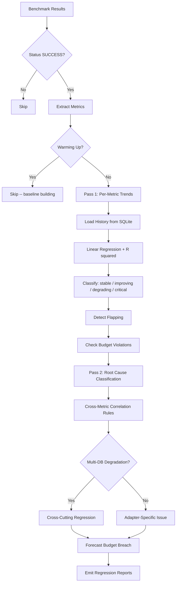
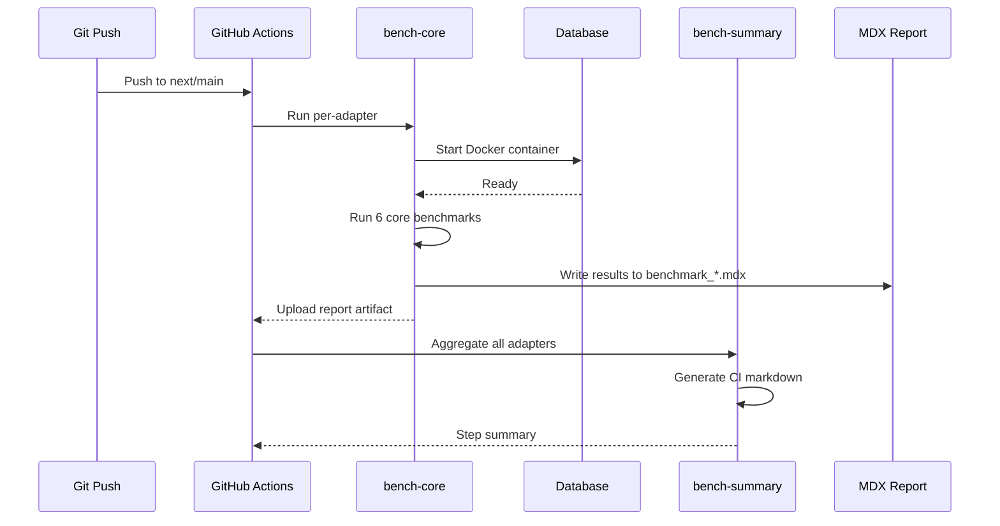
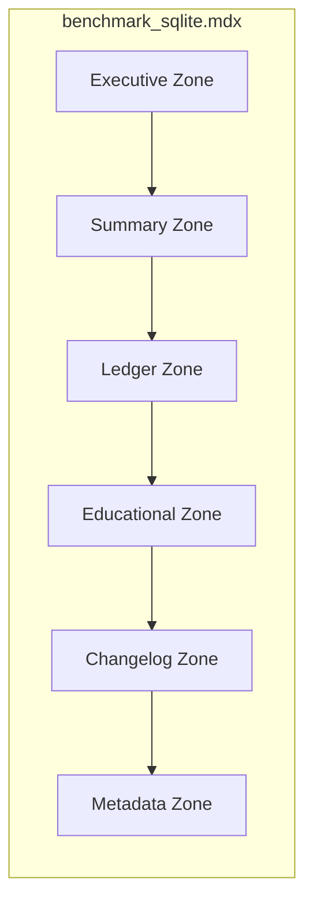

# Benchmark Matrix & Performance Regression System

The SveltyCMS benchmark matrix is a CI-integrated performance validation system that runs 58+ benchmark test modules against 8 database configurations (4 adapters × 2 Redis states), detects regressions via statistical analysis, generates per-adapter MDX reports with trend visualizations, and includes a pre-flight sanitizer that validates benchmark environment integrity before any measurement begins.

## Overview

- **Orchestration**: `scripts/benchmark-matrix/index.ts` spawns isolated DB servers, runs all applicable benchmarks, and generates reports.
- **Sanitizer**: `tests/benchmarks/modules/benchmark-sanitizer.ts` validates collection cleanliness, CRUD sanity, and warmup isolation before benchmarks.
- **Harness tests**: `tests/unit/benchmarks/benchmark-harness.test.ts` (11 tests) validates `assertSuccess()`, warmup isolation, and error visibility in the benchmark framework itself.
- **Statistical engine**: Two-pass architecture — linear regression per metric, then cross-metric correlation for root cause classification.
- **CI integration**: `ci.yml` `bench-core` job runs core benchmarks per adapter; the full matrix can run on schedule or demand.
- **History**: All runs persist in `tests/benchmarks/results/history.sqlite` for trend analysis.
- **Reports**: 8 auto-generated MDX files in `docs/project/benchmarks/` with executive summaries, full audit ledgers, and trend visualizations.

## Architecture



### Directory Layout

| Path                        | Role                                        | Files      |
| :-------------------------- | :------------------------------------------ | :--------- |
| `scripts/benchmark-matrix/` | Orchestration, runner, reporting, CLI       | 16 modules |
| `tests/benchmarks/`         | 58+ benchmark test modules                  | 60+ files  |
| `tests/benchmarks/modules/` | Shared utility modules                      | 10 files   |
| `docs/project/benchmarks/`  | 8 auto-generated MDX reports + index        | 9 files    |
| `tests/benchmarks/results/` | History SQLite, JSONL results, CI summaries | runtime    |

### Orchestration Layer (`scripts/benchmark-matrix/`)

| Module                          | Purpose                                                                |
| :------------------------------ | :--------------------------------------------------------------------- |
| `index.ts`                      | Main orchestrator — spawns servers, runs groups, aggregates            |
| `runner.ts`                     | Per-DB test runner with concurrency control                            |
| `reporting.ts`                  | `generateFinalReport()`, `writeRankedExecutiveSummary()`, MDX patching |
| `regression-detector.ts`        | Two-pass statistical engine — slope analysis + root cause              |
| `benchmark-scripts.ts`          | Canonical register of all 58+ benchmark test modules                   |
| `generate-benchmark-reports.ts` | Generates clean MDX report shells (one LEDGER tag per test)            |
| `generate-ci-markdown.ts`       | CI summary table for GitHub Actions `$GITHUB_STEP_SUMMARY`             |
| `cli.ts`                        | CLI argument parsing (`--sql`, `--db`, `--only`, etc.)                 |
| `config.ts`                     | Performance budgets, DB capabilities, adapter overrides                |
| `types.ts`                      | TypeScript interfaces for `BenchmarkScript`, `BenchmarkResult`         |
| `utils.ts`                      | Statistical helpers (regression, stddev, trend classification)         |
| `server.ts`                     | Server lifecycle management (start, health-check, stop)                |
| `setup-benchmarks.ts`           | Benchmark collection seeding via `LocalCMS`                            |
| `audit-benchmarks.ts`           | Post-run audit validation                                              |
| `benchmark-persistence.ts`      | JSONL result persistence                                               |
| `logger.ts`                     | Structured logging with timing                                         |

### Shared Modules (`tests/benchmarks/modules/`)

| Module                   | Purpose                                                          |
| :----------------------- | :--------------------------------------------------------------- |
| `benchmark-analysis.ts`  | Trend analysis, root cause classification, budget checking       |
| `benchmark-executive.ts` | Executive summary builder — sparklines, quadrant charts, rollups |
| `benchmark-history.ts`   | SQLite history store — persist/load benchmark runs               |
| `benchmark-mdx.ts`       | MDX zone patching — markers, ledger assembly, truth tables       |
| `benchmark-reporting.ts` | `finalizeReport()`, `reportBenchmark()`, run summary tables      |
| `benchmark-utils.ts`     | Re-exports helpers from `src/utils/benchmark-paths.ts`           |

### Report Files (`docs/project/benchmarks/`)

| File                             | Adapter                        |
| :------------------------------- | :----------------------------- |
| `benchmark_sqlite.mdx`           | SQLite                         |
| `benchmark_sqlite_redis.mdx`     | SQLite + Redis                 |
| `benchmark_postgresql.mdx`       | PostgreSQL                     |
| `benchmark_postgresql_redis.mdx` | PostgreSQL + Redis             |
| `benchmark_mariadb.mdx`          | MariaDB                        |
| `benchmark_mariadb_redis.mdx`    | MariaDB + Redis                |
| `benchmark_mongodb.mdx`          | MongoDB                        |
| `benchmark_mongodb_redis.mdx`    | MongoDB + Redis                |
| `index.mdx`                      | Cross-adapter comparison index |

## Local Benchmark Safety (July 2026)

Local benchmarks use a sandboxed environment that protects live developer data in `config/` and `.compiledCollections/`. Two profiles govern behavior:

| Profile      | When                                     | Behavior                                                                                                                   |
| ------------ | ---------------------------------------- | -------------------------------------------------------------------------------------------------------------------------- |
| **local**    | `config/private.ts` exists (dev machine) | Runtime env-only config, isolated `benchmark_shared` DB, sandbox compiled/manifest/media trees, external services disabled |
| **ci-fresh** | No `config/private.ts` (CI runners)      | Setup wizard runs, writes `private.test.ts` under `TEST_MODE`, simulates first install                                     |

### Sandbox Isolation (`src/utils/benchmark-sandbox.ts`)

| Live Path                            | Sandbox Equivalent                                                    |
| ------------------------------------ | --------------------------------------------------------------------- |
| `.compiledCollections/`              | `.compiledCollections/test/_local_sandbox/`                           |
| `.compilation-manifest.json`         | `.compiledCollections/test/_local_sandbox/.compilation-manifest.json` |
| `config/database/sveltycms.db`       | `config/database/benchmark_shared.db`                                 |
| `mediaFolder/`                       | `config/benchmark-sandbox/media/`                                     |
| `config/collections/*.ts` (non-test) | Bootstrap regen skipped; writes blocked (fail-closed)                 |

### External Services Guard (`src/utils/benchmark-runtime.ts`)

When `BENCHMARK=true` or `BENCHMARK_MODE=true`, the following are explicitly disabled:

- **Redis cache** — `cache-service.ts` skips L2 connection
- **Email/SMTP** — `email.server.ts` returns `{ benchmark_sandbox: true }`
- **AI translation** — `ai-translation.ts` returns `null`
- **Webhooks** — `webhook-service.ts` and `automation-service.ts` skip triggers
- **Background jobs** — `job-queue-service.ts` disables polling

### Preflight (`scripts/verify-benchmark-local.ts`)

Runs automatically before `bun run benchmark` and `bun run benchmark:core`. Checks:

- Build exists with full testing harness (bench mode)
- Live `config/private.ts` does not use test DB names (`benchmark_shared`, `sveltycms_test`)
- Prints isolation boundaries: database, compiled root, media sandbox, external services status

```bash
COMPILE_ALL_ADAPTERS=true bun run build
bun run benchmark --db=sqlite          # preflight runs first
bun run benchmark:core --db=sqlite     # CI parity core suite
```

## Key Features

### Statistical Regression Detection

The system uses a two-pass architecture:

**Pass 1 — Per-adapter trend analysis:**

- Loads last 20 runs of each metric from `history.sqlite`
- Computes linear regression slope, R², and standard deviation
- Classifies trend direction via `classifyTrend(slope, sd, budget, current, sampleSize)`
- Requires minimum 3 runs (`MIN_RUNS_FOR_TREND`) before statistical analysis

**Pass 2 — Root cause classification:**

- Gathers all non-stable MetricTrends across the adapter
- Applies `CORRELATION_RULES` from `config.ts` to match degrading metrics
- Three correlation rules: `middleware` (hooks + collections + authAvg), `adapter` (dbRaw + collections + graphqlAvg + indexPressure), `native` (memGrowth + mediaAvg)

**Enhancements (July 2026):**

- **Flapping detection**: Metrics alternating pass/fail across runs are flagged "unstable" even on flat trend lines — catches non-deterministic tests.
- **Improvement detection**: Significant improvements (pct < −20%) emitted as positive notes.
- **Cross-DB correlation**: Same metric degrading across multiple adapters flagged as "cross-cutting regression" (code change, not DB-specific).
- **Budget forecasting**: Upward-trending metrics projected forward to estimate runs until budget breach.

### Performance Budgets

Defined in `scripts/benchmark-matrix/config.ts` with per-adapter overrides:

```typescript
export const PERFORMANCE_BUDGET = {
  coldStartMs: 5_000,
  collections: 5, // REST/Collections p95 (ms)
  graphqlAvg: 12, // GraphQL Avg (ms)
  dbRaw: 50, // DB Raw p95 (ms)
  hooks: 2.0, // Hooks/Middleware (ms)
  memGrowth: 60, // Memory Growth (MB)
  securityMs: 25,
  indexPressure: 250,
} as const;

export const ADAPTER_BUDGET_OVERRIDES = {
  sqlite: { indexPressure: 250, dbRaw: 80 },
  postgresql: { indexPressure: 100, dbRaw: 30 },
  mariadb: { indexPressure: 150, dbRaw: 40 },
  mongodb: { indexPressure: 150, dbRaw: 40 },
};
```

### History Persistence

Runs persist in `tests/benchmarks/results/history.sqlite` via `benchmark-history.ts`:

- Table `runs` with columns: `run_id`, `test_id`, `db_type`, `redis`, `phase`, `avg_ms`, `p95_ms`, `rps`, `error_count`, `status`, `timestamp`
- Deduplication index on `(run_id, run_mode, test_id, db_type, redis, phase)`
- Auto-prunes to 50 runs per test to stay lean
- Also persisted as JSONL (`results/*.jsonl`) for portability

### Warming-Up Detection

After a baseline reset or cold start, the system detects "warming-up" state:

- Checks `reset_events` table for recent resets
- Metrics >30% above recent average flag as warming
- Prevents false regression alarms during baseline rebuilding

### Executive Summaries

Each report includes:

- **Pass/fail status** with sparklines for core metrics
- **Dimension health** rollup (latency, memory, throughput, cache)
- **Quadrant chart** (Mermaid) — delta% vs absolute ms, categorizing tests
- **Historical pulse** — sparklines for each test across last runs
- **Issues table** — actionable regressions with root cause and code paths
- **Host environment** — CPU, memory, OS details

### Mermaid Visualizations

Reports include embedded Mermaid diagrams:

- **Trend charts** (line graphs) — per-metric history over last N runs
- **Quadrant charts** — scatter plot of delta% vs absolute latency, with quadrant labels
- These auto-render in the docs site and GitHub markdown

**Two-pass regression detection flow:**



**CI benchmark pipeline:**



**Report zone structure:**



### CI Integration

**`bench-core` job (per-adapter):**

1. Runs 6 core benchmarks per adapter (truth-latency, database-performance, transaction-acid, cache-performance, hooks-performance, rest-api-performance)
2. Reports pass/fail via `generate-ci-markdown.ts`

**`bench-summary` job (post-matrix):**

1. Aggregates all per-adapter MDX reports
2. Produces `ci-summary.json` and `$GITHUB_STEP_SUMMARY`

**Quality gate (`precheck-shared.ts`):**

- `push` tier: runs `bench-core` on changed code
- `full` tier: runs complete bench matrix

## Commands Reference

### Full Matrix

```bash
# Run the complete benchmark matrix for a specific adapter
bun run scripts/benchmark-matrix/index.ts --db=sqlite
bun run scripts/benchmark-matrix/index.ts --db=postgresql
bun run scripts/benchmark-matrix/index.ts --db=mongodb

# With Redis caching layer
bun run scripts/benchmark-matrix/index.ts --db=sqlite --redis

# Continue past individual test failures (still records + finalizes report)
bun run scripts/benchmark-matrix/index.ts --db=sqlite --continue-on-error

# Skip build (already built)
bun run scripts/benchmark-matrix/index.ts --db=sqlite --no-build
```

### Single Test with Recording

```bash
# Record mode — persists results to history for trend analysis
BENCHMARK_RECORD=1 bun test tests/benchmarks/auth-performance.test.ts

# Run a specific benchmark test with matrix environment
BENCHMARK_RECORD=1 BENCHMARK_MATRIX=1 bun test tests/benchmarks/truth-latency.test.ts
```

### Report Generation

```bash
# Regenerate clean report shells (resets all LEDGER tags)
bun run scripts/benchmark-matrix/generate-benchmark-reports.ts --force-all

# Regenerate only SQLite shell
bun run scripts/benchmark-matrix/generate-benchmark-reports.ts --force-sqlite
```

### CI-Core Benchmarks

```bash
# Run CI-core benchmarks for all adapters
bun run scripts/run-core-benchmarks.ts

# Run for a single adapter
bun run scripts/run-core-benchmarks.ts --db=sqlite
bun run scripts/run-core-benchmarks.ts --db=postgresql
```

### All Benchmarks (Standalone)

```bash
# Run all 34 standalone benchmarks sequentially with recording
bun run scripts/run-all-benchmarks.ts
```

## Report Structure

Each per-adapter MDX report (`docs/project/benchmarks/benchmark_*.mdx`) contains distinct zones controlled by marker comments:

### Zone Markers

```markdown
<!-- ── ZONE: executive ── -->
<!-- ── ZONE: summary ── -->
<!-- ── ZONE: ledger ── -->
<!-- ── ZONE: educational ── -->
<!-- ── ZONE: changelog ── -->
<!-- ── ZONE: metadata ── -->
```

| Zone            | Content                                               | Updated By               |
| :-------------- | :---------------------------------------------------- | :----------------------- |
| **Executive**   | Pass/fail, dimension health, issues, quadrant chart   | `benchmark-executive.ts` |
| **Summary**     | Current run latency table, historical archive         | `benchmark-reporting.ts` |
| **Ledger**      | Full audit of all 58+ benchmark modules (collapsed)   | `benchmark-mdx.ts`       |
| **Educational** | Static explanation of benchmark methodology           | Manual edits only        |
| **Changelog**   | Budget changes, methodology updates, script additions | Manual edits only        |
| **Metadata**    | Host environment, run timestamps, DB info             | `benchmark-reporting.ts` |

### Executive Zone Sub-Markers

```markdown
<!-- ── fix_notes ── -->
<!-- ── partial_watermark ── -->
<!-- ── alerts ── -->
```

**Fix notes**: Actionable remediation suggestions for detected regressions.
**Partial watermark**: Shown when not all tests completed (incomplete run).
**Alerts**: Critical budget violations or cross-cutting regressions.

### Summary Zone Sub-Markers

```markdown
<!-- ── run_overlay ── -->
<!-- ── history_tables ── -->
```

**Run overlay**: Current run's latency matrix (scenario, latency, trend, budget, result).
**History tables**: Archive of past runs with sparklines.

### Ledger Zone Sub-Markers

Each benchmark module gets a per-tag collapsed section:

```markdown
<!-- ── TAG: rest-api-performance ── -->
<details>
<summary><strong>REST API Performance</strong></summary>
...
</details>
<!-- ── END TAG: rest-api-performance ── -->
```

Within each tag:

- **Trend heading**: 🟢/🔴/⚪ icon with delta% and run count
- **Insight**: Root cause analysis, code paths to check
- **Truth table**: Per-scenario latency data
- **Run summary**: Abbreviated results table

## Adding New Benchmarks

### Step 1: Create the Test Module

Create `tests/benchmarks/<name>.test.ts` following the existing pattern:

```typescript
/**
 * @file tests/benchmarks/my-new-benchmark.test.ts
 * @description Benchmark: My New Feature Performance
 *
 * ### Scenarios:
 * - warm: Steady-state CRUD operations
 * - cold: First-request latency
 */
import { describe, it, expect } from "vitest";
import { setupBenchmarkServer, reportBenchmark } from "./modules/benchmark-utils";
import { resolve } from "node:path";

const TEST_FILE = resolve(__dirname, import.meta.filename ?? __filename);

describe("My New Feature", () => {
  it("warm steady-state performance", async () => {
    const { api } = await setupBenchmarkServer();

    const start = performance.now();
    const res = await api.get("/api/my-feature");
    const duration = performance.now() - start;

    expect(res.status).toBe(200);

    await reportBenchmark({
      testFile: TEST_FILE,
      avgMs: duration,
      p95Ms: duration, // or compute from multiple iterations
      rps: 1000 / duration,
      scenario: "warm",
    });

    await api.close();
  });
});
```

### Step 2: Register in `benchmark-scripts.ts`

Add an entry to the `BENCHMARK_SCRIPTS` array in `scripts/benchmark-matrix/benchmark-scripts.ts`:

```typescript
{
  path: "tests/benchmarks/my-new-benchmark.test.ts",
  label: "My New Feature",
  shortLabel: "My Feature",
  level: "standard",
  section: "Feature Performance",   // section header in the ledger
  intensity: "medium",
  estimatedMs: 15_000,
  desc: "Measures CRUD and query performance for my new feature",
  strategy: "all",                   // "all" | "sql" | "once"
  tags: ["feature", "crud"],
  metricCategory: "latency",
  codePaths: ["src/services/my-feature.ts", "src/databases/my-adapter.ts"],
  correlatedWith: ["rest-api-performance"],   // optional
},
```

Key fields:

- **`strategy`**: `"all"` = run on every adapter; `"sql"` = only SQL adapters (PostgreSQL, MariaDB, SQLite); `"once"` = run once total
- **`level`**: `"core"` runs in CI `bench-core`; `"standard"` runs in full matrix
- **`section`**: Groups related benchmarks under a common `<details>` in the ledger
- **`codePaths`**: Source files to check when this benchmark degrades — appears in root cause insights
- **`correlatedWith`** / **`antiCorrelatedWith`**: Cross-metric hints for root cause classification

### Step 3: Regenerate Report Shells

```bash
bun run scripts/benchmark-matrix/generate-benchmark-reports.ts --force-all
```

This ensures all 8 per-adapter MDX files have a `<!-- ── TAG: my-new-benchmark ── -->` section.

### Step 4: Verify

```bash
# Single test with recording
BENCHMARK_RECORD=1 bun test tests/benchmarks/my-new-benchmark.test.ts

# Full matrix for SQLite
bun run scripts/benchmark-matrix/index.ts --sql --only=my-new-benchmark
```

## Troubleshooting

| Symptom                                     | Likely Cause                              | Fix                                                       |
| :------------------------------------------ | :---------------------------------------- | :-------------------------------------------------------- |
| "No benchmark history yet"                  | First run — no baseline data              | Run with `BENCHMARK_RECORD=1` at least 3 times            |
| Report has no trend arrows                  | Less than 3 recorded runs for that metric | Run at least 3 times to build baseline                    |
| Report shows "warming up"                   | Recent baseline reset or cold start       | Run additional times to stabilize                         |
| Flapping metric flagged                     | Non-deterministic test                    | Check for race conditions, async timing, or external deps |
| Cross-cutting regression detected           | Same metric slow across multiple adapters | Likely a code change — review recent commits              |
| Budget forecast shows imminent breach       | Upward trend approaching budget limit     | Optimize the relevant code path before the budget is hit  |
| Matrix fails with "build/index.js missing"  | Build not completed                       | Run `bun run build` first                                 |
| `benchmark_*.mdx` has duplicate LEDGER tags | Report shell regeneration needed          | Run `generate-benchmark-reports.ts --force-all`           |

## Related

- [Testing Index](./index.mdx)
- [CI Performance Metrics](./ci-performance-metrics.mdx)
- [Benchmark & Test Isolation](./benchmark-isolation.mdx)
- [Performance Benchmarks Index](../project/benchmarks/index.mdx)
- [Performance Architecture](../../reference/database/performance-architecture.mdx)
- [Testing Scripts Catalog](./testing-scripts.mdx)
