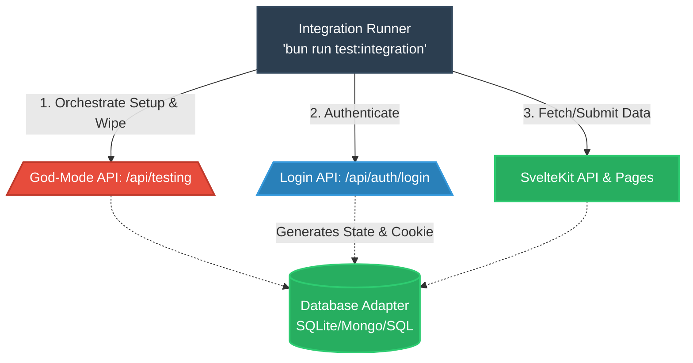

# Black-Box Testing Architecture

SveltyCMS has pivoted to a **100% Black-Box Testing** strategy for all integration and E2E tests. This transition removes the reliance on internal code imports (`@src/*`) within test files, ensuring that the CMS is tested exactly as a user or API consumer would experience it.



## Why Black-Box Testing?

### 1. 🛡️ Maximum Security Verification

By removing "backdoor" imports like `dbAdapter` or `Auth` from tests, we guarantee that:

- **No Side-Loading**: Tests cannot bypass security hooks or permission guards.
- **Authentic RBAC**: Authentication is performed via real API calls (`/api/auth/login`), verifying the entire security handshake.
- **Production Parity**: Tests run against a production-built `preview` server, catching SSR and build-specific issues that unit tests miss.
- **Network Consistency**: Standardization on **`127.0.0.1:4173`** for all local testing avoids IPv6/IPv4 resolution inconsistencies across different OS environments.

### 2. 🧪 100% Database Agnosticism

Internal imports often carry database-specific assumptions (e.g., Mongoose schemas). Black-Box testing treats the CMS as a "black box" that responds to HTTP:

- The same test suite works bit-for-bit across **MongoDB, PostgreSQL, MariaDB, and SQLite**.
- Tests only care about the JSON response, not the underlying SQL or NoSQL implementation.

### 2.1. Default Runner Scope

`bun run test:integration` now defaults to the maintained black-box surface only:

- `tests/integration/api/**`
- `tests/integration/routes/**`
- `tests/integration/sdk/**`
- `tests/integration/setup-*.test.ts`
- `tests/integration/databases/contract.test.ts`

Legacy adapter/import-heavy database specs are still available for local investigation, but they are **opt-in** via `--suite=internal-db` and are not part of pull request CI.

### 3. ⚡ Integrated Performance Auditing

Testing over HTTP allows us to measure real-world latency:

- **Baseline**: Target < 50ms for core API responses.
- **Regressions**: Automatic alerts if middle-ware overhead (hooks) increases response times.

---

## The "God Mode" Testing API

To allow automated tests to manage state without internal imports, we expose a secure orchestration endpoint:

**Endpoint**: `/api/testing`  
**Guard**: Strictly enabled ONLY when `TEST_MODE=true` environment variable is set.

### 🔒 Triple-Lock Security Guard

To ensure this powerful endpoint never becomes a liability, it is protected by three layers of security:

1.  **Build-Time Stripping**: The testing API is physically excluded from production builds. The code literally does not exist in the final artifact.
2.  **Cryptographic Handshake**: Requires a `x-test-secret` header matching a unique UUID. This secret is now standardized across the **Benchmark Matrix**, **Integration Runner**, and **Playwright E2E** suites via a central configuration.
3.  **Network Lock**: Strictly refuses any request not originating from `127.0.0.1` or `::1`.

## ⚡ Benchmarking Integration (Audit Update)

Our black-box methodology extends to the **Enterprise Performance Audit**. Individual benchmarks now support:

- **Dynamic Port Selection**: Tests run on isolated ports to prevent cross-process pollution.
- **Trend Detection**: Every run automatically compares latency against historical data in `history.jsonl` with visual 🟢/🔴 indicators.
- **Benchmark Stability**: Implementation of the `BENCHMARK_STABLE` mode and `refreshCollectionsCache()` logic. This ensures that dynamically created benchmark collections are instantly synchronized across the system via zero-latency filesystem-to-store hydration.
- **Auto-Registration**: New benchmark modules automatically register their findings in the MDX technical ledger without manual boilerplate.

### Available Actions

| Action           | Description                                                              |
| :--------------- | :----------------------------------------------------------------------- |
| `reset`          | Wipes the database (clears all collections/tables).                      |
| `seed`           | Initializes default roles, permissions, and an Admin user.               |
| `create-user`    | Idempotently creates test users with specific roles (Editor, Developer). |
| `get-user`       | Fetches a user by email for state verification.                          |
| `get-user-count` | Returns the total number of registered users.                            |
| `cleanup`        | Surgically wipes specific users or data without resetting the system.    |

---

## Test Execution Flow

1. **Build**: `bun run build` generates the production bundle.
2. **Preview**: `TEST_MODE=true HOST=127.0.0.1 PORT=4173 node build/index.js` starts the built app.
3. **Orchestrate**: Test helper calls `/api/testing` (with secure handshake) to prepare the database.
4. **Login**: Test helper calls `/api/auth/login` to obtain a session cookie.
5. **Execute**: Bun/Playwright performs HTTP requests against the live endpoints.
6. **Verify**: Assertions are made on JSON responses and HTTP status codes.

### Canonical CI Commands

```bash
# Maintained black-box API/routes/sdk/setup suite
bun run scripts/run-integration-tests.ts --suite=api --db=sqlite

# Cross-database behavioral parity
bun run scripts/run-integration-tests.ts --db=postgresql tests/integration/databases/contract.test.ts
```

## Security Matrix Testing

Every core endpoint is now triply-verified:

- **Admin**: Verifies functionality.
- **Restricted Role**: Verifies `403 Forbidden` (RBAC enforcement).
- **Public**: Verifies `401 Unauthorized` (Auth enforcement).

### 🔄 2026 Redirection Logic

Black-box tests now explicitly verify the "Smart Onboarding" redirection flow:

- **Empty CMS**: Verifies that Admins are redirected to `/config/collectionbuilder` immediately after login.
- **Error Recovery**: Verifies that any failure during collection detection falls back to the root path `/` for a safe user experience.

## 🛡️ Core Verification Principles

To ensure our 100% black-box integration tests are robust, all current and future endpoint test suites MUST explicitly cover these critical boundaries:

### 1. Multi-Tenancy Security Boundaries

Endpoints managing sensitive data or authentication must be verified against rigorous multi-tenant isolation scenarios:

- **Cross-Tenant Spoofing**: Prepare two separate tenant contexts (Tenant-A and Tenant-B). Attempt to execute `PUT`/`DELETE` operations against Tenant-A's resources while authenticated as Tenant-B. Assert the API strictly enforces a `403 Forbidden` response.
- **Missing Context**: Dispatch requests lacking necessary tenant payload headers/locals and assert strict rejection (e.g. `500 TENANT_REQUIRED` or `400`).

### 2. Cache Invalidation Verification (Preventing Stale UI)

A common pitfall in headless architecture is failing to properly clear caches on mutation.

- **Read-After-Write Consistency**: After a successful `PUT` or `DELETE` request, immediately issue a `GET` request to verify the stale cache was correctly bypassed/purged and the updated state is returned.
- **Failure Gracefulness**: When possible via environmental simulation (like halting Redis), verify that cache deletion failures do not crash the primary mutation transaction (e.g., the API should still return `200 Success` despite an internal cache warning).

### 3. Progressive Degradation & DB-Agnostic Fallbacks

When falling back from unified interfaces to adapter-specific implementations (e.g., `TokenAdapter`), tests should verify both code paths:

- Tests must pass successfully regardless of whether the primary unified interface handles the action or if the system safely falls back to dynamic adapter imports. This guarantees complete DB-agnostic operations.

### 4. Direct Handler vs. Network Layer (MSW)

For specialized testing of edge cases (e.g. injecting network failures or verifying ESM mocking with `vi.hoisted()`), these principles are mirrored in our White-Box Unit Tests. However, in the Black-Box suite, verify the _Network Layer_ explicitly (fetching via HTTP) to guarantee that SvelteKit's parsing, middleware chain, and payload validation operate as a single harmonious unit.

### 5. Widget Logic Validation (No-Mount Strategy)

To maintain extreme test velocity, widgets are tested as logic units rather than UI components. By isolating the `validationSchema` from the Svelte component, we verify the data contract without the overhead of DOM mounting.

- **Portable Verification**: Tests reside within the widget folder (`src/widgets/custom/.../tests/`) and execute via Bun.
- **Strict Contracts**: Every widget must pass a "Boundary Chaos" test, ensuring it rejects invalid data types and out-of-range values.
- **Schema Parity**: Unit tests use the exact same Valibot schema that the production API uses for server-side validation.

---

> [!IMPORTANT]
> **Safety Protocol**: Black-Box tests MUST use `config/private.test.ts`. The system includes hard-coded safety logic in `db.ts` that will terminate execution if a test attempt is detected against a production database.

> [!IMPORTANT]
> **No Backdoor Policy**: SveltyCMS has a zero-backdoor policy for security. Integration tests do NOT bypass authentication via:
>
> - ❌ API keys or bearer tokens
> - ❌ Test-only bypass headers (e.g., `x-test-token`)
> - ❌ Hardcoded credentials
>
> Tests authenticate like real users by calling `/api/auth/login` with seeded test credentials. The `/api/testing` endpoint is used only for state orchestration and is removed in production builds.
