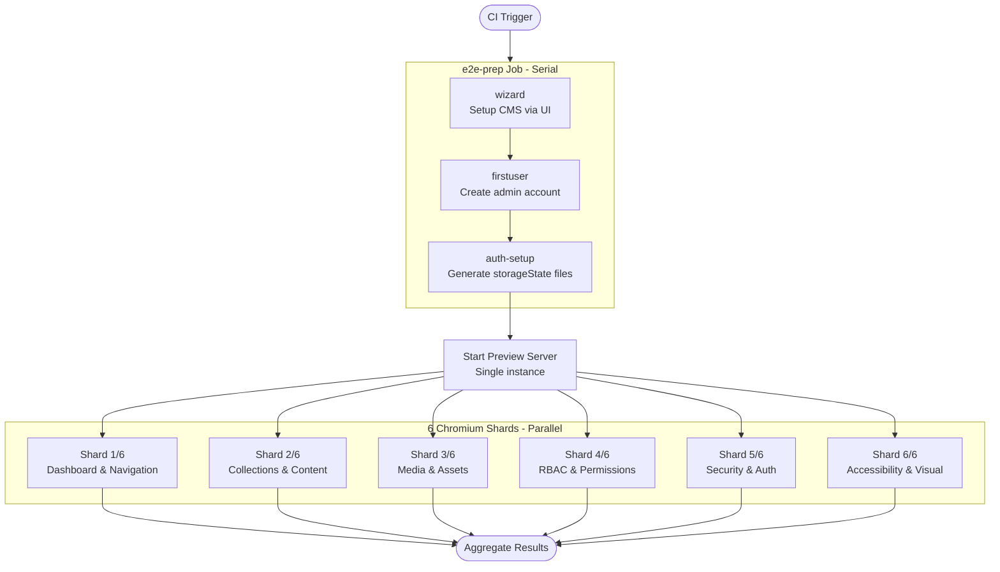

# Black-box E2E – Simplified 4-Project Architecture

SveltyCMS uses a streamlined **4-project pipeline** to achieve high-concurrency E2E testing with minimal CI overhead. Each project handles a distinct phase of the test lifecycle, with all browser tests sharing a single server instance.

## Pipeline Overview

```
wizard → firstuser → auth-setup → chromium (6 shards)
```

| Phase | Project      | Purpose                                                                         | Runs                                           |
| ----- | ------------ | ------------------------------------------------------------------------------- | ---------------------------------------------- |
| 1     | `wizard`     | Installs the CMS via the setup wizard UI                                        | Once per CI run (serial)                       |
| 2     | `firstuser`  | Creates the initial admin account                                               | Once per CI run (serial, depends on wizard)    |
| 3     | `auth-setup` | Generates `storageState` files (admin, editor, author) for all subsequent tests | Once per CI run (serial, depends on firstuser) |
| 4     | `chromium`   | All functional, security, accessibility, and regression specs                   | 6 parallel shards (depends on auth-setup)      |

## Phase Diagram



## CI Job Structure

The previous architecture used **19 CI jobs** (one per Playwright project). The simplified architecture uses only **3 CI job definitions**:

| CI Job              | Playwright Projects                 | Concurrency                                    | Purpose                                              |
| ------------------- | ----------------------------------- | ---------------------------------------------- | ---------------------------------------------------- |
| `e2e-prep`          | `wizard`, `firstuser`, `auth-setup` | Serial                                         | Bootstrap the CMS and generate shared auth state     |
| `e2e-chromium` (×6) | `chromium`                          | Parallel (6 **grep groups**, each `shard=1/1`) | Named suites via `--grep` (not N/6 of the full list) |
| `e2e-report`        | —                                   | Serial (merge)                                 | Aggregate shard reports into a single HTML report    |

All 6 chromium shards connect to **one preview server instance** started by the CI runner, eliminating redundant cold starts.

## Benefits

| Metric                | Before (19 Projects) | After (4 Projects)   | Improvement              |
| --------------------- | -------------------- | -------------------- | ------------------------ |
| CI job count          | 19                   | 3 (6 sharded)        | **68% reduction**        |
| Server startups       | 19 (one per project) | 1 (shared)           | **95% reduction**        |
| Total CI runtime      | ~70–110 min          | ~12–15 min           | **~85% faster**          |
| Auth state generation | Repeated per-project | Once in `auth-setup` | Eliminates N× redundancy |
| Report fragmentation  | 19 separate reports  | 1 merged report      | Unified debugging        |

## Database Isolation

Each worker within a chromium shard uses **header-based database routing** for full isolation:

1. **Header Propagation**: Playwright sends an `x-test-worker-index` header with every request.
2. **Dynamic Connection Map**: The SQLite adapter maps each worker index to a dedicated file (e.g., `cms_worker_1.db`, `cms_worker_2.db`).
3. **Zero Contention**: Every worker operates on its own physical database, enabling parallel execution without locks or conflicts.

## Project Details

### 1. `wizard` – CMS Installation

- Navigates to `/` and detects the setup wizard
- Fills database choice, admin credentials, site name
- Submits the form and verifies the system is marked as installed
- **Single worker, serial execution** – runs exactly once per CI run

### 2. `firstuser` – Initial Admin Account

- Logs in with the credentials created by the wizard
- Validates dashboard access and session persistence
- Prepares the system for multi-role auth state generation
- **Single worker, serial execution** – depends on wizard completion

### 3. `auth-setup` – Shared Authentication State

- Logs in as admin and saves `admin.json` storage state
- Invites an editor and author, then completes signup via the real UI flow
- Saves `editor.json` and `author.json` storage states
- These files are shared across **all 6 chromium shards**
- **Single worker, serial execution** – depends on firstuser completion

### 4. `chromium` – All Functional Tests

- Runs **all** spec files: dashboard, collections, media, RBAC, security, accessibility, visual regression
- Split into 6 parallel jobs by **named `--grep` groups** (Config, Builder, Users, Media, Auth, Admin)
- Each group runs **all** matching tests (`--shard=1/1`) — do **not** combine grep with `--shard=N/6` (that dropped ~5/6 of each suite)
- Each job reuses the `storageState` files from `auth-setup`
- Each job starts its own preview server from the e2e-prep artifact

## Why This Works

The key insight driving the simplification: **auth state is shared, not per-project**. Previously, each of the 19 projects repeated the login/setup flow independently, wasting ~3–5 minutes per project on redundant bootstrapping. By extracting setup into dedicated serial projects and sharing the resulting `storageState` files, the chromium tests start instantly with pre-authenticated sessions.

The single-server model eliminates the dominant cost of the old architecture: **19 cold starts** of the SvelteKit preview server (~30s–2min each depending on adapter). One warm server serves all 6 shards concurrently.

## Related

- [Test Documentation](./index.mdx)
- [Security Testing](./security-testing.mdx)
- [Architecture Overview](../reference/architecture/index.mdx)
- [Benchmark Matrix](./benchmark-matrix.mdx)
