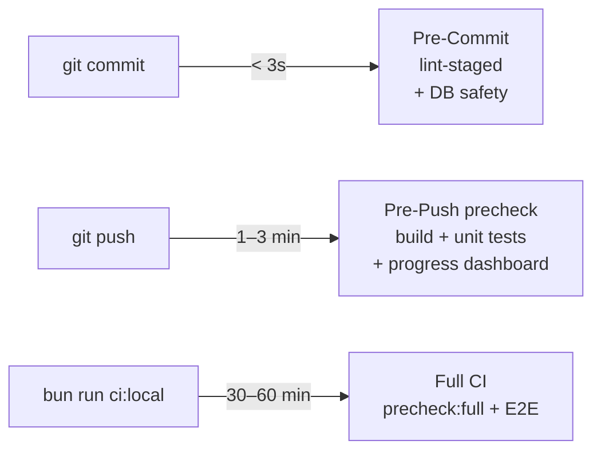

# Git Workflow & Local Quality Gate

## Introduction

SveltyCMS uses a comprehensive Git workflow with automated testing and semantic versioning to ensure code quality and streamline the release process. A mandatory **Local Quality Gate** is enforced via native Git hooks to ensure that only verified code reaches the repository.

Our CI/CD and Local pipeline uses:

- **Native Git Hooks**: Zero-dependency quality gate (`.githooks/pre-commit`).
- **Vitest (jsdom)**: Unified unit testing for components, stores, services, and API handlers.
- **Unified Formatting**: oxfmt-powered `bun run format` for lightning-fast cleanup.
- **Vitest Unit Suite**: Fast unit testing (1,100+ tests in under 10 seconds for the full suite).
- **Playwright**: Comprehensive E2E testing across multiple database backends.
- **Tag-Driven Releases**: Push a `v*` tag to `main` to trigger npm publish + GitHub Release.
- **Standardized Network**: Always use `127.0.0.1` for local consistency.

---

## 🛡️ Mandatory Local Quality Gate

Before any commit or push, SveltyCMS runs automated checks via native Git hooks. Activate them once per clone:

```bash
git config core.hooksPath .githooks
```

### Unified Precheck Manifest (`scripts/precheck-shared.ts`)

All local gates share a **single task manifest** in `scripts/precheck-shared.ts`. The orchestrator `scripts/precheck.ts` runs it in two tiers:

| Tier     | Entry point                                  | When              |
| :------- | :------------------------------------------- | :---------------- |
| **push** | `.githooks/pre-push` → `bun run verify:push` | Every `git push`  |
| **full** | `bun run verify:full` or `bun run ci:local`  | Manual, before PR |

Each task maps to a `ci.yml` job (`format`, `unit`, `db-tests`, `bench-core`, etc.) so local failures match GitHub failures.

`scripts/quality-gate.ts` is a thin wrapper that calls `runPrecheckCli({ tier: "push" })`.

#### Pre-commit (~2–3s) — staged files only

`.githooks/pre-commit` runs:

1. **Test config safety** — `scripts/check-test-db-safety.ts` blocks unsafe `config/private.test.ts`.
2. **lint-staged** — `oxfmt`, `oxlint`, `slop-scanner` on staged `src/`; `lint-docs` on staged `docs/`.

Fast feedback only. No build, integration, or E2E on commit.

#### Pre-push (~1–3 min) — Fast gate with progress dashboard

`.githooks/pre-push` runs `bun run verify:push` via `scripts/precheck.ts`. Declarative task registry with progress dashboard, adaptive ETA, and error remediation hints:

| Check                                                 | CI job           | Est. |
| :---------------------------------------------------- | :--------------- | :--- |
| Test Config Safety                                    | —                | 1s   |
| Format + tree-clean verification                      | `format`         | 3s   |
| Slop scanner + import validation                      | `lint`           | 5s   |
| oxlint + admin-theme lint (if admin routes changed)   | `lint`           | 8s   |
| Docs lint + benchmark MDX lint (always)               | —                | 4s   |
| `bun audit --severity=high` (if packages changed)     | `security-audit` | 30s  |
| `bun run check` (type check)                          | `check`          | 15s  |
| Full unit tests (**always**)                          | `unit`           | 60s  |
| Production build (`COMPILE_ALL_ADAPTERS`, **always**) | `build`          | 120s |

**DB integration + benchmarks are CI-only on push tier.** Opt in with `--include-db-tasks` for local CI simulation.

```bash
bun run verify:push                         # pre-push gate
bun run scripts/precheck.ts --plan          # dry-run — see what WOULD run
bun run verify:push --include-db-tasks      # push + DB matrix + benchmarks
```

---

## Branching Strategy

We have two primary, long-lived branches: `main` and `next`.

### `main` Branch (Production)

- **Purpose**: Production-ready, stable code. This branch represents the latest official release.
- **Protection**: Protected branch requiring pull request reviews.
- **Automated Actions**:
  - Runs full Playwright + Vitest test suite.
  - **Tag-driven releases**: pushing a `v*` tag triggers npm publish + GitHub Release with auto-generated notes from commits.
- **Version source**: Git tags, not `package.json`.

### `next` Branch (Development)

- **Purpose**: Development and staging. This is the primary branch for all new features.
- **Automated Actions**:
  - ✅ Runs full test suite on every push.
  - ✅ Tests across multiple databases (MongoDB, PostgreSQL, MariaDB).
  - ✅ No automatic releases (tests only).

---

## Commit Message Convention

Our automated release process depends on a strict commit message format. We use the **Conventional Commits** specification.

### Commit Message Model (Conventional Commits + TQA)

We follow an enhanced **Conventional Commits** specification to maintain a clear Technical Ledger.

**Format:**

```
<type>(<scope>): <subject> [TQA-Verified]
```

**Types:**

- `tqa` - **Resilience & Integrity**: Adding chaos tests, state-machine audits, or GDPR verification.
- `perf` - **Throughput & Latency**: Memory leak fixes, JIT optimizations, and benchmark improvements.
- `feat` - **Feature**: New functionality.
- `fix` - **Stability**: Bug fixes.
- `refactor` - **Clean Code**: Internal restructuring without behavior changes.

**Mandatory Scopes:**

- `resilience`: For any changes to circuit breakers or failover logic.
- `temporal`: For timezone/date normalization changes.
- `concurrency`: For locking and atomic transaction changes.
- `ledger`: For documentation and benchmark result updates.

---

## Automated Testing Architecture

### 🧪 Vitest Unit Tests (1,100+ tests)

- **Speed**: ⚡ Lightning fast (under 10 seconds for the full 1,100+ suite).
- **Location**: `tests/unit/`
- **Runner**: Vitest with jsdom for components, stores, services, and API logic.
- **Command**: `bun run test:unit`

### 🔗 Contract Tests (Adapter Parity)

- **Purpose**: Identical assertions run against all 4 databases (SQLite, MongoDB, PostgreSQL, MariaDB).
- **Location**: `tests/integration/databases/contract.test.ts`
- **Contracts**: Adapter, Auth, Permission, Setup Gating, Resilience.
- **Command**: `bun run test:integration`

### 🎭 Playwright Tests (E2E)

- **Purpose**: Browser automation for critical user journeys.
- **Standard**: Always point to `127.0.0.1:4173` via `TEST_MODE=true`.
- **Location**: `tests/e2e/`

### 🧠 Smart Test Orchestrator

- **Purpose**: Reads `git diff` and selects required test suites. Unknown changes fail closed.
- **Command**: `bun run test:smart`

### 🔍 AI Slop Scanner

- **Purpose**: Detects unsafe `{@html}`, legacy Svelte 4 patterns, missing ARIA, RTL violations, dead exports.
- **Command**: `bun run slop`

### 🧬 Mutation Tester

- **Purpose**: Introduces deliberate bugs; verifies tests catch them. Target: >85% kill rate.
- **Command**: `bun run mutate`

---

## Tiered Local Testing Strategy

SveltyCMS uses a **three-tier testing strategy** that balances developer velocity with full CI parity. Each tier corresponds to a different Git lifecycle event:



### Tier 1: Pre-Commit (`.githooks/pre-commit`) — Fast Feedback

Runs automatically on every `git commit`. Target: **~2–3 seconds** on staged files only.

| Check              | Tool                              |
| :----------------- | :-------------------------------- |
| Test config safety | `check-test-db-safety.ts`         |
| Formatting         | oxfmt (staged)                    |
| Slop Scanner       | `slop-scanner.ts` (staged `src/`) |
| Linting            | oxlint (staged)                   |
| Docs lint          | `lint-docs.ts` (staged `docs/`)   |

### Tier 2: Pre-Push (`.githooks/pre-push`) — CI Core Gate

Runs automatically on every `git push` via `bun run verify:push`. Catches the same integration and benchmark failures that previously only surfaced on GitHub (e.g. MariaDB JSON encoding, PostgreSQL credential drift).

| Check                             | Tool                                      |
| :-------------------------------- | :---------------------------------------- |
| Full static analysis + unit tests | `precheck-shared.ts` declarative registry |
| Production build                  | `vite build` + `COMPILE_ALL_ADAPTERS`     |
| Progress dashboard with ETA       | Adaptive correction factor                |
| ciJob parity validation           | `validateCiParity()` scans `ci.yml`       |

**DB integration + benchmarks are CI-only on push tier.** Use `--include-db-tasks` to opt in locally, or run `bun run verify:full` (local CI parity).

Manual equivalent: `bun run gate` or `bun run verify:push`.

> [!NOTE]
> The script is named `verify:push` (not `precheck`) because npm/bun treat a `precheck` script as a lifecycle hook that runs automatically before `check`, which would recurse infinitely.

> [!CAUTION]
> `--no-verify` is blocked by `scripts/git-safe.ts`. Use `bun run git push` — bypassing requires the system `git` binary path deliberately.

### Tier 3: Local CI Simulator (`bun run ci:local`) — Full Parity

Run manually before opening a pull request. Runs **full-tier precheck** (same manifest as push, but always-on scans and dependency audit) plus Playwright E2E.

```bash
# Full precheck + E2E (Docker DBs required)
bun run ci:local

# Single adapter
bun run ci:local -- --db=postgresql

# Skip Playwright (precheck only)
bun run ci:local -- --skip-e2e

# Skip benchmarks
bun run ci:local -- --skip-benchmarks

# Precheck without E2E (no config backup dance)
bun run verify:full
```

`ci:local` backs up `config/private.ts`, runs tests, then restores your live config. A warning is printed when live CMS artifacts are detected — no disposable-worktree requirement.

**Prerequisites:** Docker Desktop with MongoDB (27017), MariaDB (3306), and PostgreSQL (5432) on `127.0.0.1`.

---

## Scripts Audit

All scripts in `scripts/` and their role in the testing pipeline:

### Core Scripts (Testing Pipeline)

| Script                     | Role                                         | Called By                                       |
| :------------------------- | :------------------------------------------- | :---------------------------------------------- |
| `precheck-shared.ts`       | Single CI-parity task manifest               | `precheck.ts`, `quality-gate.ts`, `ci-local.ts` |
| `precheck.ts`              | Unified orchestrator (`push` / `full` tiers) | `.githooks/pre-push`, `bun run verify:push`     |
| `quality-gate.ts`          | Thin wrapper → `precheck` push tier          | `bun run gate`                                  |
| `run-integration-tests.ts` | DB matrix test runner                        | CI, precheck, ci-local                          |
| `run-core-benchmarks.ts`   | `bench-core` parity per adapter              | CI, precheck, ci-local                          |
| `test-db-credentials.ts`   | Canonical Docker credentials + env blocks    | precheck, CI, integration runner                |
| `check-test-db-safety.ts`  | Blocks unsafe test config                    | pre-commit, precheck                            |
| `slop-scanner.ts`          | AI/code smell detector                       | lint-staged, precheck                           |
| `ci-local.ts`              | Full precheck + E2E with config backup       | `bun run ci:local`                              |
| `test-smart.ts`            | Git-diff-aware test selector                 | `bun run test:smart` (manual)                   |

### Utility Scripts

| Script                       | Role                           | Command                  |
| :--------------------------- | :----------------------------- | :----------------------- |
| `security-audit.ts`          | Security vulnerability scanner | `bun run audit:security` |
| `mutation-test.ts`           | Mutation testing               | `bun run mutate`         |
| `generate-sbom.ts`           | SBOM generation                | `bun run audit:sbom`     |
| `bundle-stats.ts`            | Bundle size analysis           | `bun run build:stats`    |
| `upgrade.ts`                 | Automated core updates         | `bun run upgrade`        |
| `setup-system.ts`            | System bootstrap               | Dev setup helper         |
| `cache-clear.ts`             | Cache management               | Maintenance utility      |
| `generate-core-countries.js` | Country data generator         | Address widget data      |

---

## Best Practices

### Commit Workflow

1.  **Stage changes**: `git add .`
2.  **Commit**: `git commit -m "feat(auth): add OAuth2 support"` — pre-commit lint-staged runs automatically.
3.  **Push**: `bun run git push origin feat/my-feature` — pre-push precheck runs with progress dashboard, adaptive ETA, and error remediation hints.
4.  **Before PR**: Run `bun run verify:full` for local CI parity, or `bun run ci:local` for full E2E simulation.

### Manual Verification

If you want to run checks outside the hook lifecycle:

```bash
# Pre-push gate manually (same as git push hook)
bun run verify:push
bun run gate

# Full CI core without E2E
bun run verify:full

# Full CI including Playwright
bun run ci:local

# Smart Test Orchestrator — auto-detects what to test from git diff
bun run test:smart

# AI Slop Scanner — detect code smells
bun run slop

# Mutation Tester — verify tests catch real bugs
bun run mutate
```

### Security & Slop Regression Check

For changes touching auth, middleware, or API routes, also run:

```
bun test tests/unit/hooks/defense-in-depth.test.ts tests/unit/hooks/authentication.test.ts tests/unit/hooks/authorization.test.ts tests/unit/role-permission-access.test.ts
bun run slop
```

> [!NOTE]
> On Windows (PowerShell), always use `;` to chain commands. Avoid `&&` as it is not natively supported in PowerShell.

---

## Troubleshooting

### "Permission Denied" on Git Hook

If you are on Linux/macOS and the hook fails to execute:

```
chmod +x .githooks/pre-commit .githooks/pre-push
```

### "Database connection failed" in Tests

Ensure you are using `127.0.0.1` in your `config/private.test.ts` and that the test database is accessible.

### Bypassing Hooks

`bun run git commit` and `bun run git push` block `--no-verify`. Bypassing requires invoking the system Git binary directly — a deliberate act, not muscle memory. **CI will reject the same failures the hooks catch.**

### Docker DB Not Reachable During Pre-Push

If precheck reports `postgresql is not reachable at 127.0.0.1:5432`:

```bash
docker compose -f tests/docker-compose.yml --profile postgresql up -d
docker compose -f tests/docker-compose.yml --profile mariadb up -d
docker compose -f tests/docker-compose.yml --profile mongodb up -d
```

Credentials must match `src/utils/test-db-credentials.ts` (image defaults: `postgres/postgres`, `root/mariadb`, mongo no-auth).

---

## Related Documentation

- [Test Status Report](/docs/tests/test-status)
- [API Testing](/docs/tests/api-testing)
- [Testing Strategy](/docs/tests/testing-strategy)
