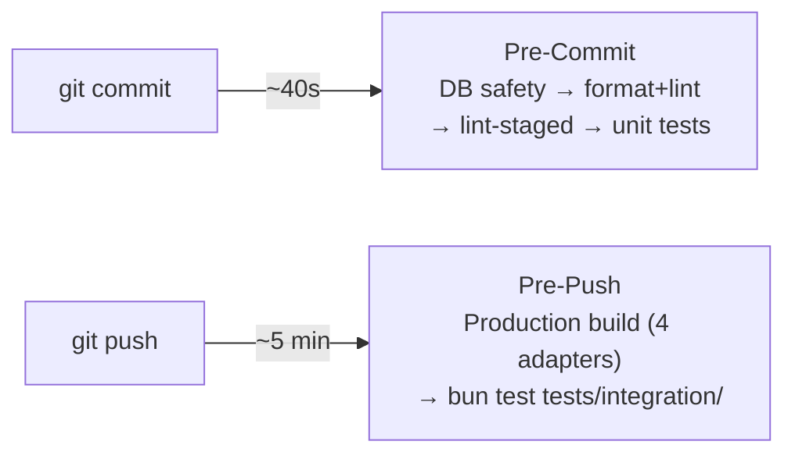

# Git Workflow & Local Quality Gate

## Introduction

SveltyCMS uses a comprehensive Git workflow with automated testing and semantic versioning to ensure code quality and streamline the release process. A mandatory **Local Quality Gate** is enforced via native Git hooks to ensure that only verified code reaches the repository.

Our CI/CD and Local pipeline uses:

- **Native Git Hooks**: Zero-dependency quality gate (`.githooks/pre-commit`).
- **Vitest (jsdom)**: Unified unit testing for components, stores, services, and API handlers.
- **Unified Formatting**: oxfmt-powered `bun run format` for lightning-fast cleanup.
- **Vitest Unit Suite**: Fast unit testing (1,100+ tests in under 10 seconds for the full suite).
- **Playwright**: Comprehensive E2E testing across multiple database backends.
- **Tag-Driven Releases**: Push a `v*` tag to `main` to trigger npm publish + GitHub Release.
- **Standardized Network**: Always use `127.0.0.1` for local consistency.

---

## 🛡️ Mandatory Local Quality Gate

Before any commit or push, SveltyCMS runs automated checks via native Git hooks. Activate them once per clone:

```bash
git config core.hooksPath .githooks
```

### Git Hook Overview

SveltyCMS uses native Git hooks for local quality gates — no external precheck orchestrator script required.

#### Pre-commit (`check-test-db-safety.ts` → format+lint → lint-staged → unit tests)

`.githooks/pre-commit` runs:

1. **Database safety** — `scripts/check-test-db-safety.ts` blocks unsafe `private.test.ts`, live `private.ts` pointing at test DBs, and **matching live/test DB names** (user data protection).
2. **Format + lint** — `bun run check` (oxfmt + oxlint).
3. **Lint-staged** — `bun run gate:fast`.
4. **Unit tests** — `vitest run` (skipped if only docs changed).

> [!IMPORTANT]
> **No double-run rule:** the full unit suite (including hooks security tests) runs on **pre-commit only**. Pre-push runs build + SQLite integration — do not re-run the entire unit suite on push. Focused re-run: `bun run test:security`.
>
> **Live data rule:** automated local runs never use `config/private.ts` or the user database — only `private.test.ts` + isolated DB names.

#### Pre-push (~5 min) — production build + SQLite integration tests

`.githooks/pre-push` runs:

| Check                         | Command                                   | Est.     |
| :---------------------------- | :---------------------------------------- | :------- |
| Production build (4 adapters) | `COMPILE_ALL_ADAPTERS=true bun run build` | ~45–120s |
| SQLite integration tests      | `bun test tests/integration/`             | ~60–180s |

**Security regression is not re-run on push.** DB integration (multi-adapter matrix) and benchmarks are CI-only.

```bash
bun run gate                               # pre-push gate (build + SQLite integration)
bun run prepush                            # same as gate
bun test --timeout 300000 tests/integration/   # Integration only (needs build/)
bun run test:doctor                        # unit + SQLite integration + gate map
```

---

## Branching Strategy

We have two primary, long-lived branches: `main` and `next`.

### `main` Branch (Production)

- **Purpose**: Production-ready, stable code. This branch represents the latest official release.
- **Protection**: Protected branch requiring pull request reviews.
- **Automated Actions**:
  - Runs full Playwright + Vitest test suite.
  - **Tag-driven releases**: pushing a `v*` tag triggers npm publish + GitHub Release with auto-generated notes from commits.
- **Version source**: Git tags, not `package.json`.

### `next` Branch (Development)

- **Purpose**: Development and staging. This is the primary branch for all new features.
- **Automated Actions**:
  - ✅ Runs full test suite on every push.
  - ✅ Tests across multiple databases (MongoDB, PostgreSQL, MariaDB).
  - ✅ No automatic releases (tests only).

---

## Commit Message Convention

Our automated release process depends on a strict commit message format. We use the **Conventional Commits** specification.

### Commit Message Model (Conventional Commits + TQA)

We follow an enhanced **Conventional Commits** specification to maintain a clear Technical Ledger.

**Format:**

```
<type>(<scope>): <subject> [TQA-Verified]
```

**Types:**

- `tqa` - **Resilience & Integrity**: Adding chaos tests, state-machine audits, or GDPR verification.
- `perf` - **Throughput & Latency**: Memory leak fixes, JIT optimizations, and benchmark improvements.
- `feat` - **Feature**: New functionality.
- `fix` - **Stability**: Bug fixes.
- `refactor` - **Clean Code**: Internal restructuring without behavior changes.

**Mandatory Scopes:**

- `resilience`: For any changes to circuit breakers or failover logic.
- `temporal`: For timezone/date normalization changes.
- `concurrency`: For locking and atomic transaction changes.
- `ledger`: For documentation and benchmark result updates.

---

## Automated Testing Architecture

### 🧪 Vitest Unit Tests

- **Speed**: ⚡ Fast feedback on every commit (full suite via pre-commit).
- **Location**: `tests/unit/`
- **Runner**: Vitest with jsdom for components, stores, services, and API logic.
- **Command**: `bun run test:unit` · focused security: `bun run test:security`

### 🔗 Contract Tests (Adapter Parity)

- **Purpose**: Identical assertions run against all 4 databases (SQLite, MongoDB, PostgreSQL, MariaDB).
- **Location**: `tests/integration/databases/contract.test.ts`
- **Contracts**: Adapter, Auth, Permission, Setup Gating, Resilience.
- **Command**: `bun run test:integration`

### 🎭 Playwright Tests (E2E)

- **Purpose**: Browser automation for critical user journeys.
- **Standard**: Always point to `127.0.0.1:4173` via `TEST_MODE=true`.
- **Location**: `tests/e2e/`

### 🧠 Smart Test Orchestrator

- **Purpose**: Reads `git diff` and selects required test suites. Unknown changes fail closed.
- **Command**: `bun run test:smart`

### 🔍 AI Slop Scanner

- **Purpose**: Detects unsafe `{@html}`, legacy Svelte 4 patterns, missing ARIA, RTL violations, dead exports.
- **Command**: `bun run slop`

---

## Tiered Local Testing Strategy

SveltyCMS uses a **three-tier testing strategy** that balances developer velocity with full CI parity. Each tier corresponds to a different Git lifecycle event:



### Tier 1: Pre-Commit (`.githooks/pre-commit`) — Fast Feedback

Runs automatically on every `git commit`. Target: **~40 seconds** (full unit suite; skipped if only docs changed).

| Check              | Tool                             |
| :----------------- | :------------------------------- |
| Test config safety | `check-test-db-safety.ts`        |
| Format + lint      | `bun run check` (oxfmt + oxlint) |
| Lint-staged        | `bun run gate:fast`              |
| Unit tests         | `bun run test:unit` (Vitest)     |

### Tier 2: Pre-Push (`.githooks/pre-push`) — Production Build + Integration

Runs automatically on every `git push`. Catches build and integration failures before they reach CI.

| Check                         | Command                                   |
| :---------------------------- | :---------------------------------------- |
| Production build (4 adapters) | `COMPILE_ALL_ADAPTERS=true bun run build` |
| SQLite integration tests      | `bun test tests/integration/`             |

**Multi-adapter DB integration + benchmarks are CI-only.**

Manual equivalent: `bun run prepush` (alias for pre-push hook via hardened git wrapper).

> [!CAUTION]
> `--no-verify` is blocked by `scripts/git-safe.ts`. Use `bun run git push` — bypassing requires the system `git` binary path deliberately.

### Tier 3: Full CI Parity — CI Pipeline

CI runs the complete matrix automatically on every PR/push to `next`. Covers what local hooks skip:

- **Whitebox**: format + lint + type check + secret scan + deploy backdoor probe
- **Build**: `COMPILE_ALL_ADAPTERS=true` production build
- **DB tests**: Full multi-adapter matrix (MongoDB, PostgreSQL, MariaDB, SQLite)
- **E2E**: Playwright prep + 6 shards (chromium)
- **Benchmarks**: Performance regression detection

All local test commands must use **`config/private.test.ts` only** — they must **not** rename, overwrite, or connect through the developer's `config/private.ts` (live user data). Isolation is env + policy (`private-config-policy.ts`), not backup/restore of live config.

**Prerequisites for local integration tests:** Docker Desktop with MongoDB (27017), MariaDB (3306), and PostgreSQL (5432) on `127.0.0.1`.

---

## Scripts Audit

All scripts in `scripts/` and their role in the testing pipeline:

### Core Scripts (Testing Pipeline)

| Script                          | Role                                     | Called By                      |
| :------------------------------ | :--------------------------------------- | :----------------------------- |
| `test-doctor.ts`                | Gate map + unit + SQLite integration     | `bun run test:doctor` (manual) |
| `test-smart.ts`                 | Git-diff-aware test selector             | `bun run test:smart` (manual)  |
| `security-audit.ts`             | Security vulnerability scanner           | `bun run security`             |
| `run-e2e.ts`                    | Unified E2E runner (CI/dev modes)        | `bun run test:e2e`             |
| `check-test-db-safety.ts`       | Blocks unsafe test config                | pre-commit                     |
| `scan-secret-misuse.ts`         | Secret exposure static analysis          | CI whitebox / manual           |
| `verify-prod-build-backdoor.ts` | Checks /api/testing stripped in deploy   | CI build / whitebox            |
| `verify-benchmark-local.ts`     | Blocks local benchmarks on test DB names | Manual                         |
| `bundle-stats.ts`               | Bundle size analysis                     | `bun run build:stats`          |
| `check-bundle-size.ts`          | CI bundle size gate                      | CI build job                   |
| `generate-sbom.ts`              | Software bill of materials generation    | `bun run audit:sbom`           |

### Utility Scripts

| Script                       | Role                           | Command               |
| :--------------------------- | :----------------------------- | :-------------------- |
| `security-audit.ts`          | Security vulnerability scanner | `bun run security`    |
| `generate-sbom.ts`           | SBOM generation                | `bun run audit:sbom`  |
| `bundle-stats.ts`            | Bundle size analysis           | `bun run build:stats` |
| `upgrade.ts`                 | Automated core updates         | `bun run upgrade`     |
| `setup-system.ts`            | System bootstrap               | Dev setup helper      |
| `generate-core-countries.js` | Country data generator         | Address widget data   |

---

## Best Practices

### Commit Workflow

1.  **Stage changes**: `git add .`
2.  **Commit**: `git commit -m "feat(auth): add OAuth2 support"` — pre-commit hook runs (DB safety → format+lint → lint-staged → unit tests).
3.  **Push**: `bun run git push origin feat/my-feature` — pre-push hook runs (production build → `bun test tests/integration/`).
4.  **Before PR**: Ensure CI passes — local hooks already guarantee the same gate.

### Manual Verification

If you want to run checks outside the hook lifecycle:

```bash
# Pre-commit gate manually
bun run precommit

# Pre-push gate manually
bun run gate
# or: bun run prepush

# Unit + SQLite integration + gate map
bun run test:doctor

# Integration tests (SQLite; needs build/)
bun test --timeout 300000 tests/integration/

# Smart Test Orchestrator — auto-detects what to test from git diff
bun run test:smart

# AI Slop Scanner — detect code smells
bun run slop
```

### Security & Slop Regression Check

For changes touching auth, middleware, or API routes, also run:

```bash
bun run test:security
bun run slop
```

> [!NOTE]
> On Windows (PowerShell), always use `;` to chain commands. Avoid `&&` as it is not natively supported in PowerShell.

---

## Troubleshooting

### "Permission Denied" on Git Hook

If you are on Linux/macOS and the hook fails to execute:

```
chmod +x .githooks/pre-commit .githooks/pre-push
```

### "Database connection failed" in Tests

Ensure you are using `127.0.0.1` in your `config/private.test.ts` and that the test database is accessible.

### Bypassing Hooks

`bun run git commit` and `bun run git push` block `--no-verify`. Bypassing requires invoking the system Git binary directly — a deliberate act, not muscle memory. **CI will reject the same failures the hooks catch.**

### Docker DB Not Reachable During Pre-Push

If the pre-push hook or local CI reports `postgresql is not reachable at 127.0.0.1:5432`:

```bash
docker compose -f tests/docker-compose.yml --profile postgresql up -d
docker compose -f tests/docker-compose.yml --profile mariadb up -d
docker compose -f tests/docker-compose.yml --profile mongodb up -d
```

Credentials must match `src/utils/test-db-credentials.ts` (image defaults: `postgres/postgres`, `root/mariadb`, mongo no-auth).

---

## Related Documentation

- [Test Status Report](/docs/tests/test-status)
- [API Testing](/docs/tests/api-testing)
- [Testing Strategy](/docs/tests/testing-strategy)
