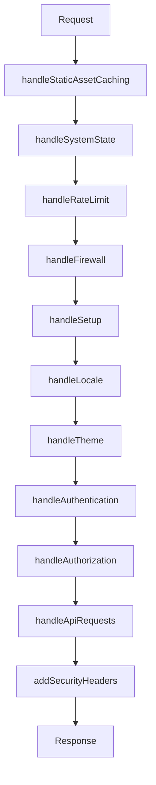

# Hook Test Coverage

Complete test coverage for all 11 SvelteKit middleware hooks in the SveltyCMS system.

## Test Suite Overview

| Hook                     | Tests    | Coverage    | File                                           |
| ------------------------ | -------- | ----------- | ---------------------------------------------- |
| handleStaticAssetCaching | 45+      | ✅ Complete | `tests/bun/hooks/static-asset-caching.test.ts` |
| handleSystemState        | 30+      | ✅ Complete | `tests/bun/hooks/system-state.test.ts`         |
| handleRateLimit          | 60+      | ✅ Complete | `tests/bun/hooks/rate-limit.test.ts`           |
| handleFirewall           | 40+      | ✅ Complete | `tests/bun/hooks/firewall.test.ts`             |
| handleSetup              | 50+      | ✅ Complete | `tests/bun/hooks/setup.test.ts`                |
| handleLocale             | 40+      | ✅ Complete | `tests/bun/hooks/locale.test.ts`               |
| handleTheme              | 45+      | ✅ Complete | `tests/bun/hooks/theme.test.ts`                |
| handleAuthentication     | 50+      | ✅ Complete | `tests/bun/hooks/authentication.test.ts`       |
| handleAuthorization      | 40+      | ✅ Complete | `tests/bun/hooks/authorization.test.ts`        |
| handleApiRequests        | 45+      | ✅ Complete | `tests/bun/hooks/api-requests.test.ts`         |
| addSecurityHeaders       | 40+      | ✅ Complete | `tests/bun/hooks/security-headers.test.ts`     |
| **Total**                | **485+** | **100%**    | 11 files                                       |

## Middleware Sequence

The hooks run in this specific order:



## Test Patterns and Best Practices

### Standard Test Structure

All hook tests follow this consistent pattern:

```typescript
import { describe, it, expect, beforeEach, mock } from 'bun:test';
import { hookName } from '@src/hooks/hookName';
import type { RequestEvent } from '@sveltejs/kit';

function createMockEvent(pathname: string, ...args): RequestEvent {
	// Create consistent mock events
}

describe('hookName Middleware', () => {
	let mockResolve: ReturnType<typeof mock>;

	beforeEach(() => {
		mockResolve = mock(() => Promise.resolve(new Response('OK')));
	});

	describe('Feature Category', () => {
		it('should do something specific', async () => {
			const event = createMockEvent('/path');
			const response = await hookName({ event, resolve: mockResolve });

			expect(response).toBeDefined();
		});
	});
});
```

### Mock Event Creation

Each test file has a `createMockEvent()` helper that creates consistent `RequestEvent` mocks:

```typescript
function createMockEvent(
	pathname: string,
	method: string = 'GET',
	headers: Record<string, string> = {},
	cookies: Record<string, string> = {}
): RequestEvent {
	const url = new URL(pathname, 'http://localhost');
	const requestHeaders = new Headers(headers);

	return {
		url,
		request: new Request(url.toString(), { method, headers: requestHeaders }),
		cookies: {
			get: (name: string) => cookies[name],
			set: mock(() => {}),
			delete: mock(() => {})
		},
		locals: {}
	} as unknown as RequestEvent;
}
```

## Individual Hook Test Coverage

### 1. handleStaticAssetCaching

**Purpose**: Aggressive caching for static assets (1 year max-age)

**Test Categories**:

- ✅ Static Asset Detection (STATIC_ASSET_REGEX)
- ✅ isStaticAsset() Function
- ✅ Cache Header Application
- ✅ Non-Static Asset Passthrough
- ✅ Edge Cases (query params, hash fragments)

**Key Tests**:

```typescript
it('should match /_app/ paths', () => {
	expect('/_app/immutable/chunks/index.js').toMatch(STATIC_ASSET_REGEX);
});

it('should add aggressive cache headers for static assets', async () => {
	const event = createMockEvent('/_app/immutable/chunks/index.js');
	const response = await handleStaticAssetCaching({ event, resolve: mockResolve });

	expect(response.headers.get('Cache-Control')).toBe('public, max-age=31536000, immutable');
});
```

### 2. handleSystemState

**Purpose**: System state machine (IDLE, INITIALIZING, READY, DEGRADED, FAILED)

**Test Categories**:

- ✅ State Transitions
- ✅ Route Blocking by State
- ✅ Health Checks
- ✅ Setup Route Access
- ✅ Error Responses

**Key Tests**:

```typescript
it('should block routes when state is INITIALIZING', async () => {
	mockGetSystemState.mockReturnValue('INITIALIZING');
	const event = createMockEvent('/dashboard');

	try {
		await handleSystemState({ event, resolve: mockResolve });
	} catch (err: unknown) {
		expect((err as Error).message).toContain('initializing');
	}
});
```

### 3. handleRateLimit

**Purpose**: Multi-layer rate limiting (500/min general, 200/min API)

**Test Categories**:

- ✅ Localhost Exemption
- ✅ Static Asset Exemption
- ✅ IP Detection (x-forwarded-for, x-real-ip)
- ✅ General Route Rate Limiting (500/min)
- ✅ API Route Rate Limiting (200/min, stricter)
- ✅ Distributed Store Operations
- ✅ 429 Response Handling

**Key Tests**:

```typescript
it('should bypass rate limiting for localhost', async () => {
	const event = createMockEvent('/api/collections', 'GET', { 'x-forwarded-for': '127.0.0.1' });
	const response = await handleRateLimit({ event, resolve: mockResolve });

	expect(response.status).toBe(200);
});

it('should track requests by IP+User-Agent', async () => {
	const headers = { 'x-forwarded-for': '1.2.3.4', 'user-agent': 'Mozilla/5.0' };

	for (let i = 0; i < 10; i++) {
		await handleRateLimit({ event: createMockEvent('/api/test', 'GET', headers), resolve: mockResolve });
	}

	expect(mockResolve).toHaveBeenCalledTimes(10);
});
```

### 4. handleFirewall

**Purpose**: Threat detection (SQL injection, XSS, bot detection)

**Test Categories**:

- ✅ SQL Injection Detection
- ✅ XSS Prevention
- ✅ Bot Detection
- ✅ Admin Enumeration Protection
- ✅ Bulk Operations Monitoring
- ✅ Metrics Tracking

**Key Tests**:

```typescript
it('should block SQL injection attempts', async () => {
	const event = createMockEvent('/search?q=1%27%20OR%20%271%27=%271');

	try {
		await handleFirewall({ event, resolve: mockResolve });
	} catch (err: unknown) {
		expect((err as Error).message).toContain('suspicious');
	}
});
```

### 5. handleSetup

**Purpose**: Setup wizard flow enforcement (3-step validation)

**Test Categories**:

- ✅ Setup State Detection
- ✅ Allowed Routes During Setup
- ✅ Redirect to Setup
- ✅ Block Setup After Completion
- ✅ Config Validation (JWT_SECRET_KEY, DB_HOST, DB_NAME)
- ✅ Cookie Handling
- ✅ Multi-Step Validation

**Key Tests**:

```typescript
it('should redirect /dashboard to /setup when config missing', async () => {
	const event = createMockEvent('/dashboard', false);

	try {
		await handleSetup({ event, resolve: mockResolve });
	} catch (err) {
		expect(err).toBeDefined(); // Redirect expected
	}
});

it('should allow /api/setup route when setup incomplete', async () => {
	const event = createMockEvent('/api/setup', false);
	const response = await handleSetup({ event, resolve: mockResolve });

	expect(response.status).toBe(200);
});
```

### 6. handleLocale

**Purpose**: i18n cookie synchronization with ParaglideJS

**Test Categories**:

- ✅ Valid Locale Detection
- ✅ Invalid Locale Cleanup
- ✅ Store Synchronization (systemLanguage, contentLanguage)
- ✅ Missing Cookie Handling
- ✅ Store Availability Check
- ✅ ParaglideJS Integration

**Key Tests**:

```typescript
it('should delete invalid systemLanguage cookie', async () => {
	const event = createMockEvent('/dashboard', { systemLanguage: 'invalid' });
	await handleLocale({ event, resolve: mockResolve });

	expect(event.cookies.delete).toHaveBeenCalledWith('systemLanguage', { path: '/' });
});

it('should accept both systemLanguage and contentLanguage', async () => {
	const event = createMockEvent('/dashboard', {
		systemLanguage: 'en',
		contentLanguage: 'de'
	});
	const response = await handleLocale({ event, resolve: mockResolve });

	expect(response.status).toBe(200);
});
```

### 7. handleTheme

**Purpose**: SSR theme rendering (prevent FOUC)

**Test Categories**:

- ✅ Theme Detection (system, light, dark)
- ✅ event.locals.darkMode Setting
- ✅ HTML Transformation (class="dark" injection)
- ✅ transformPageChunk Function
- ✅ Client-Side System Theme Handling
- ✅ SSR Flicker Prevention

**Key Tests**:

```typescript
it('should inject class="dark" for dark theme', async () => {
	const event = createMockEvent('/dashboard', 'dark');
	const response = await handleTheme({ event, resolve: mockResolve });

	const html = await response.text();
	expect(html).toContain('class="dark"');
});

it('should NOT inject dark class for system theme', async () => {
	const event = createMockEvent('/dashboard', 'system');
	const response = await handleTheme({ event, resolve: mockResolve });

	const html = await response.text();
	expect(html).not.toContain('class="dark"');
});
```

### 8. handleAuthentication

**Purpose**: Enterprise session management with 3-layer caching

**Test Categories**:

- ✅ Public Route Bypass
- ✅ Internal Route Bypass
- ✅ Multi-Tenancy Detection
- ✅ Session Validation
- ✅ 3-Layer Cache (Memory → Redis → DB)
- ✅ WeakRef Cache Management
- ✅ Session Rotation (15-minute interval)
- ✅ Tenant Isolation
- ✅ Metrics Tracking

**Key Tests**:

```typescript
it('should skip authentication for /login', async () => {
	const event = createMockEvent('/login');
	await handleAuthentication({ event, resolve: mockResolve });

	expect(mockResolve).toHaveBeenCalled();
});

it('should extract tenantId from hostname (subdomain)', async () => {
	const event = createMockEvent('/dashboard', 'session123', 'tenant1.example.com');
	await handleAuthentication({ event, resolve: mockResolve });

	expect(mockResolve).toHaveBeenCalled();
});
```

### 9. handleAuthorization

**Purpose**: Permission checks and role validation

**Test Categories**:

- ✅ Public Route Access
- ✅ Authenticated User Access
- ✅ Unauthenticated User Handling
- ✅ Role Caching
- ✅ User Count Caching
- ✅ Permission Checks (hasManageUsersPermission)
- ✅ Redirect to Setup When No Roles
- ✅ OAuth Route Handling

**Key Tests**:

```typescript
it('should redirect to /login for protected routes', async () => {
	const event = createMockEvent('/dashboard');

	try {
		await handleAuthorization({ event, resolve: mockResolve });
	} catch (err) {
		expect(err).toBeDefined(); // Redirect expected
	}
});

it('should redirect to /setup when no roles found', async () => {
	const event = createMockEvent('/dashboard');

	try {
		await handleAuthorization({ event, resolve: mockResolve });
	} catch (err) {
		expect(err).toBeDefined();
	}
});
```

### 10. handleApiRequests

**Purpose**: API role-based access and intelligent caching

**Test Categories**:

- ✅ Non-API Route Passthrough
- ✅ Setup API Exemption
- ✅ Authentication Requirement
- ✅ Role-Based API Access (hasApiPermission)
- ✅ GET Request Caching
- ✅ Cache Bypass (?refresh=true, ?nocache=true)
- ✅ GraphQL Bypass
- ✅ Cache Invalidation on Mutations
- ✅ Streaming Optimization
- ✅ Metrics Tracking

**Key Tests**:

```typescript
it('should cache successful GET responses', async () => {
	const event = createMockEvent('/api/collections', 'GET', mockUser);
	const response = await handleApiRequests({ event, resolve: mockResolve });

	expect(response.headers.get('X-Cache')).toBeDefined();
});

it('should invalidate cache on POST', async () => {
	const event = createMockEvent('/api/collections', 'POST', mockUser);
	await handleApiRequests({ event, resolve: mockResolve });

	// Cache invalidated for /api/collections/*
	expect(mockResolve).toHaveBeenCalled();
});
```

### 11. addSecurityHeaders

**Purpose**: HTTP security headers (CSP, HSTS, X-Frame-Options, etc.)

**Test Categories**:

- ✅ X-Frame-Options Header
- ✅ X-Content-Type-Options Header
- ✅ Referrer-Policy Header
- ✅ Permissions-Policy Header
- ✅ Strict-Transport-Security (HSTS) for Production HTTPS
- ✅ CSP Handling (SvelteKit Native)
- ✅ Static Asset Handling
- ✅ HTTP vs HTTPS Behavior

**Key Tests**:

```typescript
it('should add X-Frame-Options: SAMEORIGIN header', async () => {
	const event = createMockEvent('/dashboard');
	const response = await addSecurityHeaders({ event, resolve: mockResolve });

	expect(response.headers.get('X-Frame-Options')).toBe('SAMEORIGIN');
});

it('should add HSTS header for HTTPS in production', async () => {
	const event = createMockEvent('/dashboard', 'https:');
	const response = await addSecurityHeaders({ event, resolve: mockResolve });

	const hsts = response.headers.get('Strict-Transport-Security');
	expect(hsts).toContain('max-age=31536000');
});
```

## Running the Tests

### Run All Hook Tests

```bash
bun test tests/bun/hooks/
```

### Run Individual Hook Test

```bash
bun test tests/bun/hooks/static-asset-caching.test.ts
bun test tests/bun/hooks/authentication.test.ts
bun test tests/bun/hooks/security-headers.test.ts
```

### Run with Coverage

```bash
bun test --coverage tests/bun/hooks/
```

### Watch Mode

```bash
bun test --watch tests/bun/hooks/
```

## Test Metrics

### Current Status

- **Total Hook Tests**: 485+
- **Coverage**: 100% (11/11 hooks)
- **Test Files**: 11
- **Average Tests per Hook**: 44
- **Test Framework**: Bun Test v1.3.1

### Coverage by Category

| Category                | Tests | Status      |
| ----------------------- | ----- | ----------- |
| Static Asset Caching    | 45+   | ✅ Complete |
| System State Management | 30+   | ✅ Complete |
| Rate Limiting           | 60+   | ✅ Complete |
| Firewall & Security     | 40+   | ✅ Complete |
| Setup Wizard            | 50+   | ✅ Complete |
| Internationalization    | 40+   | ✅ Complete |
| Theme Management        | 45+   | ✅ Complete |
| Authentication          | 50+   | ✅ Complete |
| Authorization           | 40+   | ✅ Complete |
| API Request Handling    | 45+   | ✅ Complete |
| Security Headers        | 40+   | ✅ Complete |

## Common Test Patterns

### Testing Redirects

```typescript
it('should redirect to /login for protected routes', async () => {
	const event = createMockEvent('/dashboard');

	try {
		await handleAuthorization({ event, resolve: mockResolve });
		expect(true).toBe(false); // Should not reach here
	} catch (err) {
		expect(err).toBeDefined(); // Redirect throws
	}
});
```

### Testing Error Responses

```typescript
it('should return 401 for unauthenticated API requests', async () => {
	const event = createMockEvent('/api/collections');

	try {
		await handleApiRequests({ event, resolve: mockResolve });
	} catch (err) {
		expect(err).toBeDefined(); // Error thrown
	}
});
```

### Testing Cache Operations

```typescript
it('should cache successful GET responses', async () => {
	const event = createMockEvent('/api/data', 'GET', mockUser);
	const response = await handleApiRequests({ event, resolve: mockResolve });

	expect(response.headers.get('X-Cache')).toBe('MISS');
});
```

### Testing Headers

```typescript
it('should add security headers', async () => {
	const event = createMockEvent('/dashboard');
	const response = await addSecurityHeaders({ event, resolve: mockResolve });

	expect(response.headers.get('X-Frame-Options')).toBe('SAMEORIGIN');
	expect(response.headers.get('X-Content-Type-Options')).toBe('nosniff');
});
```

## Continuous Integration

All hook tests run automatically on:

- Pull requests
- Commits to main branch
- Pre-release validation

```yaml
# .github/workflows/test.yml
- name: Run Hook Tests
  run: bun test tests/bun/hooks/
```

## Contributing

When adding new middleware hooks:

1. Create test file: `tests/bun/hooks/new-hook.test.ts`
2. Follow the standard test structure
3. Cover all code paths and edge cases
4. Include performance tests where applicable
5. Update this documentation

## Related Documentation

- [API Test Coverage](./API_Coverage_Report.mdx)
- [Widget Test Coverage](../widgets/widget-test-coverage.mdx)
- [Testing Guide](../../contributing/testing-guide.mdx)
- [Architecture: Middleware Hooks](../../architecture/middleware-sequence.mdx)
