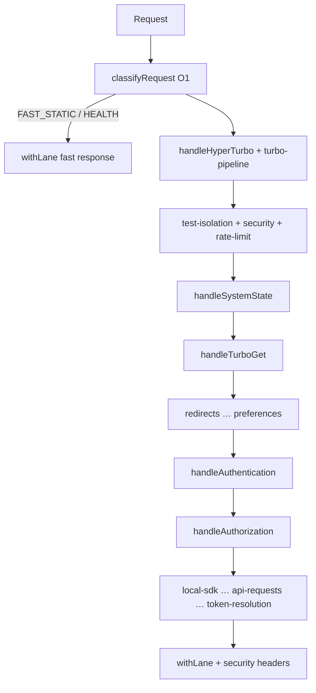

# Hook Test Coverage

Complete test coverage for SvelteKit middleware hooks, the **Request Lane Router**, and security suites in the SveltyCMS system.

> [!NOTE]
> Per-file test counts drift — treat the table as a **file map**, not a live ledger. Live health: [Test Status](./test-status.mdx). Always use **`vitest`** imports (`vi.fn()`), never `bun:test`.

## Test Suite Overview

| Test Suite            | Coverage    | File                                             |
| --------------------- | ----------- | ------------------------------------------------ |
| System State          | ✅ Complete | `tests/unit/hooks/system-state.test.ts`          |
| System State Security | ✅ Complete | `tests/unit/hooks/system-state-security.test.ts` |
| Setup                 | ✅ Complete | `tests/unit/hooks/setup.test.ts`                 |
| Rate Limit            | ✅ Complete | `tests/unit/hooks/rate-limit.test.ts`            |
| Route Access Audit    | ✅ Complete | `tests/unit/hooks/route-access-audit.test.ts`    |
| File Server Tenant    | ✅ Complete | `tests/unit/hooks/file-server-tenant.test.ts`    |

| Test Suite                 | Coverage    | File                                                  |
| -------------------------- | ----------- | ----------------------------------------------------- |
| Authentication             | ✅ Complete | `tests/unit/hooks/authentication.test.ts`             |
| API Keys Authentication    | ✅ Complete | `tests/unit/hooks/api-keys-authentication.test.ts`    |
| Bearer Authentication      | ✅ Complete | `tests/unit/hooks/bearer-authentication.test.ts`      |
| Guest Authentication       | ✅ Complete | `tests/unit/hooks/guest-authentication.test.ts`       |
| Magic Links Authentication | ✅ Complete | `tests/unit/hooks/magic-links-authentication.test.ts` |

| Test Suite          | Coverage    | File                                        |
| ------------------- | ----------- | ------------------------------------------- |
| Authorization       | ✅ Complete | `tests/unit/hooks/authorization.test.ts`    |
| API Requests        | ✅ Complete | `tests/unit/hooks/api-requests.test.ts`     |
| Token Resolution    | ✅ Complete | `tests/unit/hooks/token-resolution.test.ts` |
| Security Headers    | ✅ Complete | `tests/unit/hooks/security-headers.test.ts` |
| CSP Headers         | ✅ Complete | `tests/unit/hooks/csp-headers.test.ts`      |
| Defense-in-Depth    | ✅ Complete | `tests/unit/hooks/defense-in-depth.test.ts` |
| Adversarial Testing | ✅ Complete | `tests/unit/hooks/adversarial.test.ts`      |

| Test Suite (Lane Router / Turbo)    | Coverage     | File                                                            |
| ----------------------------------- | ------------ | --------------------------------------------------------------- |
| Request classifier + response cache | ✅ Complete  | `tests/unit/core/request-classifier-and-response-cache.test.ts` |
| Turbo GET lane                      | ✅ Complete  | `tests/unit/hooks/handle-turbo-get-lane.test.ts`                |
| Lane headers (integration)          | ✅ Live HTTP | `tests/integration/api/request-lane-headers.test.ts`            |
| Hooks lane smoke (E2E)              | ✅ Browser   | `tests/e2e/routes/system/hooks-lane-smoke.spec.ts`              |

## Performance Benchmarks (Audit)

All hooks are benchmarked via `tests/benchmarks/hooks-performance.test.ts` which measures 3 pipeline layers under production load (600+ iterations each):

| Metric                       | Latest (SQLite) | Budget | What it measures                  |
| ---------------------------- | :-------------: | :----: | --------------------------------- |
| **Turbo Pipeline (Light)**   |   0.289ms avg   |  <5ms  | Health / turbo lane               |
| **Full Security + Auth**     |   0.457ms avg   |  <5ms  | Session + RBAC + security stack   |
| **Mutation + Audit Logging** |   1.376ms avg   |  <5ms  | Write with fire-and-forget audit  |
| **Auth Overhead**            |   **0.168ms**   |   —    | Turbo → Full Auth delta (overlay) |
| **Compression Ratio (br)**   |    ~65% avg     |   —    | Brotli on cache HIT payloads      |
| **Compression Ratio (gzip)** |    ~58% avg     |   —    | Gzip on cache HIT payloads        |

**Note**: Audit is now fire-and-forget (context captured before resolve, logged in detached promise). HOOK_TIMING_ENABLED gate disables per-request instrumentation in production and under BENCHMARK=true for cleaner benchmarks. Compression metrics captured via X-\* headers.

## Middleware Sequence

Production order (READY pipeline) after O(1) **lane classification**. Full reference: [server-hooks](../reference/architecture/server-hooks.mdx).


```mermaid
graph TD
    A[Request] --> L[classifyRequest O1]
    L -->|FAST_STATIC / HEALTH| R[withLane fast response]
    L --> B[handleHyperTurbo + turbo-pipeline]
    B --> C[test-isolation + security + rate-limit]
    C --> D[handleSystemState]
    D --> E[handleTurboGet]
    E --> F[redirects … preferences]
    F --> G[handleAuthentication]
    G --> H[handleAuthorization]
    H --> I[local-sdk … api-requests … token-resolution]
    I --> J[withLane + security headers]
```

## Test Patterns and Best Practices

### Standard Test Structure

All hook tests follow this consistent pattern (**Vitest**, not `bun:test`):

````
import { describe, it, expect, beforeEach, vi } from "vitest";
import { hookName } from "@src/hooks/hookName";
import type { RequestEvent } from "@sveltejs/kit";

function createMockEvent(pathname: string, ...args): RequestEvent {
  // Create consistent mock events with mandatory locals.roles and locals.tenantId
}

describe("hookName Middleware", () => {
  let mockResolve: ReturnType<typeof vi.fn>;

  beforeEach(() => {
    mockResolve = vi.fn(() => Promise.resolve(new Response("OK")));
  });

  describe("Feature Category", () => {
    it("should do something specific", async () => {
      const event = createMockEvent("/path");
      const response = await hookName({ event, resolve: mockResolve });

      expect(response).toBeDefined();
    });
  });
});
```text

### Mock Event Creation

Each test file has a `createMockEvent()` helper that creates consistent `RequestEvent` mocks:

````

function createMockEvent(
pathname: string,
method: string = "GET",
headers: Record<string, string> = {},
cookies: Record<string, string> = {},
): RequestEvent {
const url = new URL(pathname, "http://localhost");
const requestHeaders = new Headers(headers);

return {
url,
request: new Request(url.toString(), { method, headers: requestHeaders }),
cookies: {
get: (name: string) => cookies[name],
set: vi.fn(() => {}),
delete: vi.fn(() => {}),
},
locals: {
tenantId: "test-tenant",
roles: [{ name: "admin", isAdmin: true, permissions: [] }],
},
} as unknown as RequestEvent;
}

```text

## Individual Hook Test Coverage

### 1. handleSystemState

**Purpose**: System state machine (IDLE, INITIALIZING, READY, DEGRADED, FAILED)

**Test Categories**:

- ✅ State Transitions
- ✅ Route Blocking by State
- ✅ Health Checks
- ✅ Setup Route Access
- ✅ Error Responses

**Key Tests**:

```

it("should block routes when state is INITIALIZING", async () => {
mockGetSystemState.mockReturnValue("INITIALIZING");
const event = createMockEvent("/dashboard");

try {
await handleSystemState({ event, resolve: mockResolve });
} catch (err: unknown) {
expect((err as Error).message).toContain("initializing");
}
});

```text

### 2. handleSetup

**Purpose**: Setup wizard flow enforcement (3-step validation)

**Test Categories**:

- ✅ Setup State Detection
- ✅ Allowed Routes During Setup
- ✅ Redirect to Setup
- ✅ Block Setup After Completion
- ✅ Config Validation (JWT_SECRET_KEY, DB_HOST, DB_NAME)
- ✅ Cookie Handling
- ✅ Multi-Step Validation

**Key Tests**:

```

it("should redirect /dashboard to /setup when config missing", async () => {
const event = createMockEvent("/dashboard", false);

try {
await handleSetup({ event, resolve: mockResolve });
} catch (err) {
expect(err).toBeDefined(); // Redirect expected
}
});

it("should allow /setup route when setup incomplete", async () => {
const event = createMockEvent("/setup", false);
const response = await handleSetup({ event, resolve: mockResolve });

expect(response.status).toBe(200);
});

```text

### 3. handleAuthentication

**Purpose**: Enterprise session management with 4-layer caching (turbo → LRU → Redis/store → DB)

**Test Categories**:

- ✅ Public Route Bypass
- ✅ Internal Route Bypass
- ✅ Multi-Tenancy Detection
- ✅ Session Validation
- ✅ 4-Layer Cache (Turbo → Memory → Redis → DB)
- ✅ **Single-Flight Coalescing** (concurrent cold validations → one DB lookup, no logout race)
- ✅ **Transient vs Invalid** (DB blip keeps the cookie; definitive invalidation deletes it)
- ✅ **Blocked-User Cut-Off** (block → cache purge → DB re-validation rejects)
- ✅ Session Rotation (15-minute interval, TTL-bounded, device info carried)
- ✅ Session Device Policy eviction (`single-per-device` / `single-per-user` / `allow-multiple`)
- ✅ `SESSION_TTL_HOURS` applied at login and rotation
- ✅ **Idle timeout** (`SESSION_IDLE_HOURS`) — sliding clock on the session-cache LRU, signs out idle sessions
- ✅ **Credential-free session snapshots** — password hash / TOTP secret / backup codes / reset & refresh tokens never enter caches or stores; password-verifying endpoints re-fetch from DB
- ✅ **Session context anomaly (log-only)** — IP/user-agent drift logged once per session per hour, never locks out
- ✅ **Max sessions per user** (`SESSION_MAX_PER_USER`) — LRU eviction of the least recently active session at login
- ✅ **Cross-session revoke re-auth** (stateless HMAC proof, `REAUTH_REQUIRED` enforcement)
- ✅ **Admin session console API** (list/revoke another user's sessions)
- ✅ Tenant Isolation
- ✅ Metrics Tracking

**Key Tests**:

```

it("should skip authentication for /login", async () => {
const event = createMockEvent("/login");
await handleAuthentication({ event, resolve: mockResolve });

expect(mockResolve).toHaveBeenCalled();
});

it("should extract tenantId from hostname (subdomain)", async () => {
const event = createMockEvent("/dashboard", "session123", "tenant1.example.com");
await handleAuthentication({ event, resolve: mockResolve });

expect(mockResolve).toHaveBeenCalled();
});

```text

### 4. handleAuthorization

**Purpose**: Permission checks and role validation

**Test Categories**:

- ✅ Public Route Access
- ✅ Authenticated User Access
- ✅ Unauthenticated User Handling
- ✅ Role Caching
- ✅ User Count Caching
- ✅ Permission Checks (hasManageUsersPermission)
- ✅ Redirect to Setup When No Roles
- ✅ OAuth Route Handling

**Key Tests**:

```

it("should redirect to /login for protected routes", async () => {
const event = createMockEvent("/dashboard");

try {
await handleAuthorization({ event, resolve: mockResolve });
} catch (err) {
expect(err).toBeDefined(); // Redirect expected
}
});

it("should redirect to /setup when no roles found", async () => {
const event = createMockEvent("/dashboard");

try {
await handleAuthorization({ event, resolve: mockResolve });
} catch (err) {
expect(err).toBeDefined();
}
});

```text

### 5. handleApiRequests

**Purpose**: API role-based access via the **Fail-Closed Dispatcher** and intelligent caching

**Test Categories**:

- ✅ Non-API Route Passthrough
- ✅ Setup API Exemption
- ✅ Authentication Requirement
- ✅ Role-Based API Access (hasApiPermission)
- ✅ GET Request Caching
- ✅ Cache Bypass (?refresh=true, ?nocache=true)
- ✅ GraphQL Bypass
- ✅ Cache Invalidation on Mutations
- ✅ Streaming Optimization
- ✅ Metrics Tracking

**Key Tests**:

```

it("should cache successful GET responses", async () => {
const event = createMockEvent("/api/collections", "GET", mockUser);
const response = await handleApiRequests({ event, resolve: mockResolve });

expect(response.headers.get("X-Cache")).toBeDefined();
});

it("should invalidate cache on POST", async () => {
const event = createMockEvent("/api/collections", "POST", mockUser);
await handleApiRequests({ event, resolve: mockResolve });

// Cache invalidated for /api/collections/\*
expect(mockResolve).toHaveBeenCalled();
});

```text

### 6. addSecurityHeaders

**Purpose**: HTTP security headers (CSP, HSTS, X-Frame-Options, etc.)

**Test Categories**:

- ✅ X-Frame-Options Header
- ✅ X-Content-Type-Options Header
- ✅ Referrer-Policy Header
- ✅ Permissions-Policy Header
- ✅ Strict-Transport-Security (HSTS) for Production HTTPS
- ✅ CSP Handling (SvelteKit Native)
- ✅ Static Asset Handling
- ✅ HTTP vs HTTPS Behavior

**Key Tests**:

```

it("should add X-Frame-Options: SAMEORIGIN header", async () => {
const event = createMockEvent("/dashboard");
const response = await addSecurityHeaders({ event, resolve: mockResolve });

expect(response.headers.get("X-Frame-Options")).toBe("SAMEORIGIN");
});

it("should add HSTS header for HTTPS in production", async () => {
const event = createMockEvent("/dashboard", "https:");
const response = await addSecurityHeaders({ event, resolve: mockResolve });

const hsts = response.headers.get("Strict-Transport-Security");
expect(hsts).toContain("max-age=31536000");
});

```text

### 7. Token Resolution

**Purpose**: Bearer token validation, resolution, and multi-tenant isolation

**Test Categories**:

- ✅ Token parsing and validation
- ✅ Bearer token extraction
- ✅ Token expiry handling
- ✅ Multi-tenant token isolation

---

### 8. CSP Headers

**Purpose**: Content Security Policy enforcement to prevent XSS and data injection

**Test Categories**:

- ✅ CSP header presence and values
- ✅ Script source restrictions
- ✅ Style source restrictions
- ✅ Report-URI configuration

---

### 9. Defense-in-Depth

**Purpose**: Multi-layer security verification — middleware, dispatcher, handler, and page action enforcement

**Test Categories**:

- ✅ Middleware-level blocking
- ✅ Dispatcher fail-closed authorization
- ✅ Handler-level admin verification
- ✅ Page action permission guards
- ✅ Cookie prefix hardening (`__Host-`)
- ✅ Setup completion gating
- ✅ Media permission checks (write/delete)

---

### 10. Adversarial Testing

**Purpose**: Fuzz testing and malicious input handling for all hook layers

**Test Categories**:

- ✅ Malformed header injection
- ✅ Path traversal attempts
- ✅ Encoding-based bypass attempts
- ✅ HTTP method smuggling
- ✅ Large payload rejection
- ✅ Concurrent connection fuzzing

---

### 11. Authentication Sub-Suites

The following files test specific authentication mechanisms beyond the core handleAuthentication hook:

| Test Suite                  | File                                                        |
| --------------------------- | ----------------------------------------------------------- |
| API Keys Authentication     | `tests/unit/hooks/api-keys-authentication.test.ts`          |
| Bearer Authentication       | `tests/unit/hooks/bearer-authentication.test.ts`            |
| Guest Authentication        | `tests/unit/hooks/guest-authentication.test.ts`             |
| Magic Links Authentication  | `tests/unit/hooks/magic-links-authentication.test.ts`       |
| Session Snapshots & Anomaly | `tests/unit/auth/sessions/session-user.test.ts`                      |

---

### 12. System State Security

**Purpose**: Security-specific system state checks — unauthorized access during init, degraded, and failed states

**Test Categories**:

- ✅ Route blocking during non-READY states
- ✅ Graceful degradation responses
- ✅ Setup route access during INITIALIZING
- ✅ Tenant isolation under failure

---

## Running the Tests

### Run All Hook Tests

```

bun test tests/unit/hooks/

```text

### Run Individual Hook Test

```

bun run test:unit -- authentication
bun run test:unit -- security-headers

```text

### Run with Coverage

```

bun test --coverage tests/unit/hooks/

```text

### Watch Mode

```

bun test --watch tests/unit/hooks/

```text

## Test Metrics

### Current Status

- **Total Hook Tests**: 317+
- **Test Files**: 16
- **Average Tests per File**: 20
- **Test Framework**: Vitest (vi) / Bun Test v1.3.10

### Coverage by Category

| Category                    | Tests | Status      |
| --------------------------- | ----- | ----------- |
| Static Asset Caching        | 6     | ✅ Complete |
| System State Management     | 26    | ✅ Complete |
| System State Security       | 14    | ✅ Complete |
| Setup Wizard                | 16    | ✅ Complete |
| Authentication (all)        | 81    | ✅ Complete |
| Authorization               | 23    | ✅ Complete |
| API Request Handling        | 28    | ✅ Complete |
| Token Resolution            | 5     | ✅ Complete |
| Security Headers            | 38    | ✅ Complete |
| CSP Headers                 | 10    | ✅ Complete |
| Defense-in-Depth            | 25    | ✅ Complete |
| Adversarial Testing         | 20    | ✅ Complete |

## Common Test Patterns

### Testing Redirects

```

it("should redirect to /login for protected routes", async () => {
const event = createMockEvent("/dashboard");

try {
await handleAuthorization({ event, resolve: mockResolve });
expect(true).toBe(false); // Should not reach here
} catch (err) {
expect(err).toBeDefined(); // Redirect throws
}
});

```text

### Testing Error Responses

```

it("should return 401 for unauthenticated API requests", async () => {
const event = createMockEvent("/api/collections");

try {
await handleApiRequests({ event, resolve: mockResolve });
} catch (err) {
expect(err).toBeDefined(); // Error thrown
}
});

```text

### Testing Cache Operations

```

it("should cache successful GET responses", async () => {
const event = createMockEvent("/api/data", "GET", mockUser);
const response = await handleApiRequests({ event, resolve: mockResolve });

expect(response.headers.get("X-Cache")).toBe("MISS");
});

```text

### Testing Headers

```

it("should add security headers", async () => {
const event = createMockEvent("/dashboard");
const response = await addSecurityHeaders({ event, resolve: mockResolve });

expect(response.headers.get("X-Frame-Options")).toBe("SAMEORIGIN");
expect(response.headers.get("X-Content-Type-Options")).toBe("nosniff");
});

```text

## Continuous Integration

All hook tests run automatically on:

- Pull requests
- Commits to main branch
- Pre-release validation

```

# .github/workflows/test.yml

- name: Run Hook Tests
  run: bun test tests/unit/hooks/

```text

## Contributing

When adding new middleware hooks:

1. Create test file: `tests/unit/hooks/new-hook.test.ts`
2. Follow the standard test structure
3. Cover all code paths and edge cases
4. Include performance tests where applicable
5. Update this documentation

## Related Documentation

- [API Test Coverage](./api-test-coverage.mdx)
- [Widget Test Coverage](./widget-test-coverage.mdx)
- [Testing Guide](./strategy.mdx)
- [Architecture: Middleware Hooks](../reference/architecture/server-hooks.mdx)
```
