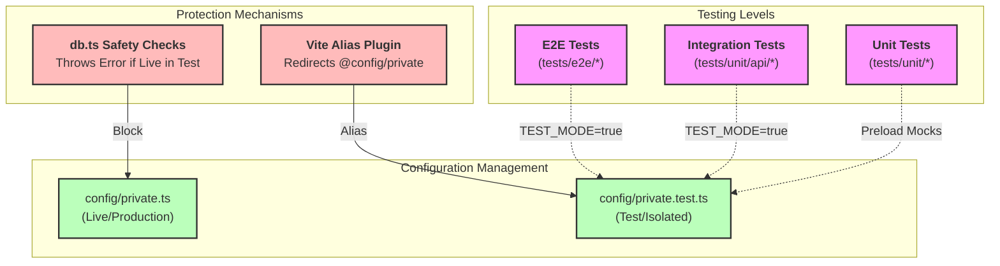

# SveltyCMS Testing Documentation

**Last Updated:** February 22, 2026
**Total Tests:** ~308 unit tests (passing)
**Pass Rate:** 100% (308 passing, 0 failing)

## Quick Links

- [Testing Overview & Strategy](./overview.mdx)
- **[Testing Strategy (White-Box vs Black-Box)](./testing-strategy.mdx)** (New)
- **[Black-Box Testing Architecture](./black-box-testing.mdx)** (Strategic Pivot)
- **[E2E Stabilization Report](./e2e-stabilization-report.mdx)** (Playwright Fixes)
- [Test Status Report](./test-status.mdx)
- [API Coverage Report](./api-testing.mdx)

### Running Tests Locally

Use the helper script to run integration tests:

```bash
# Run all integration tests (starts server automatically)
bun run test:integration

# Run a specific test file
bun test tests/integration/api/graphql.test.ts

# Debug mode (verbose logs)
TEST_MODE=true bun run test:integration
```

### CI Environment

.

## Test Architecture & Isolation

SveltyCMS employs a strict isolation strategy to ensure tests never touch production data and run in a predictable environment.



## Testing Strategy: The 2026 Industry Optimum

SveltyCMS employs an **Isomorphic Hybrid Testing** model. This strategy balances two critical needs:

1.  **White-Box Density (Unit Tests)**: High-speed validation of internal functions, state runes, and utility logic. These tests use deep mocking to isolate components and ensure every logical branch is exercised.
2.  **Black-Box Integrity (Integration & E2E)**: Decoupled validation of the system via its public APIs and UI. These tests treat the CMS as a "Black Box," ensuring that internal refactors (e.g., changing from MongoDB to PostgreSQL) do not break external functionality.

### Why this makes sense in 2026?

As frameworks move toward no-runtime compilation (Svelte 5), unit tests catch compiler-related reactivity issues, while black-box tests protect against breaking changes in the database-agnostic layer.

---

## Test Frameworks Overview

SveltyCMS uses two complementary test frameworks to ensure comprehensive quality coverage:

### 🧪 Bun Test - Unit & Integration Tests

- **Purpose**: Fast, lightweight testing for business logic, services, and API endpoints
- **Location**: `tests/unit/`
- **Test Count**: ~650 tests
- **Execution Time**: ~2-15 seconds

**What It Tests**:

- ✅ Services (auth, security, caching)
- ✅ Utilities (validation, formatting, crypto)
- ✅ Stores (system state, UI state, loading)
- ✅ Widgets (validation, rendering, security)
- ✅ Middleware Hooks (all 11 hooks)
- ✅ API Endpoints (integration tests)
- ✅ Database Operations (MongoDB currently)

**Why Bun?**

- 100x faster than Jest/Mocha
- Native TypeScript support (no transpilation)
- Built-in mocking
- Perfect for headless CMS architecture

### 🎭 Playwright - End-to-End Tests

- **Purpose**: Browser automation for critical user journeys
- **Location**: `tests/e2e/`
- **Test Count**: ~40 tests
- **Execution Time**: ~30-60 seconds

**What It Tests**:

- ✅ Setup Wizard flow
- ✅ Login/Authentication
- ✅ Content CRUD operations
- ✅ Admin dashboard
- ✅ User management

**Why Playwright?**

- Cross-browser testing (Chromium, Firefox, WebKit)
- Reliable auto-waiting
- Screenshot/video recording on failure
- Parallel execution

---

## GitHub Actions Automation

All tests run automatically in CI/CD via GitHub Actions:

**Workflow**: `.github/workflows/playwright.yml`

```yaml
jobs:
  unit-tests:
    runs-on: ubuntu-latest
    steps:
      - Run Bun unit tests (~308 tests)
      - Execution time: ~2 seconds

  integration-tests:
    runs-on: ubuntu-latest
    services:
      mongodb: # MongoDB service container
    steps:
      - Clean config directory
      - Start dev server
      - Seed test database
      - Run Bun integration tests (~225 tests)
      - Execution time: ~15 seconds

  e2e-tests:
    runs-on: ubuntu-latest
    services:
      mongodb:
    steps:
      - Clean config directory
      - Install Playwright browsers
      - Start dev server
      - Seed test database
      - Run Playwright E2E tests (~40 tests)
      - Execution time: ~60 seconds
```

> [!IMPORTANT]
> **Security Note**: All GitHub workflows use **pinned commit SHAs** for actions and enforce **frozen lockfiles** (`bun install --frozen-lockfile`) to protect against supply chain attacks. Do not change these to version tags without verifying the commit SHA.

**When Tests Run**:

- **On Pull Request**: All tests must pass before merge
- **On Push to main/next**: Full test suite + release checks
- **Manual Trigger**: Via `workflow_dispatch`

### Future: Multi-Database Matrix Testing

> **Status**: **Implemented** for all supported databases
>
> ```yaml
> strategy:
>   matrix:
>     database: [mongodb, postgresql, mariadb, sqlite]
> ```
>
> This ensures SveltyCMS works correctly with all supported databases via Drizzle ORM.

---

## Local Testing (Before Committing)

### Quick Start

```bash
# Run ALL tests (unit + integration + E2E)
bun run test:all

# Run specific test types
bun run test:unit          # Fast (~2s) - No server needed
bun run test:integration   # Medium (~45s) - Automatic server start
bun run test:e2e           # Slow (~60s) - Requires server + browser
```

> [!IMPORTANT]
> **Test Config Isolation**: Local tests **ALWAYS** use `config/private.test.ts`, which is configured to use **SQLite** by default (`sveltycms_test.db`). The system will throw a fatal error if it detects an attempt to load the live `config/private.ts` while `NODE_ENV=test`, protecting your local development database.

### Local Integration Testing (SQLite Default)

Since the `config/private.test.ts` defaults to SQLite, you can run integration tests immediately without setting up external database containers.

1. **Verify Config**: Ensure `config/private.test.ts` exists (it is git-ignored but generated by setup or CI). If missing, create it with `DB_TYPE: 'sqlite'`.
2. **Build Application**:
   ```bash
   bun run build
   ```
   _Integration tests use the production build via `vite preview`. You must rebuild if you change source code._
3. **Run Tests**:
   ```bash
   bun run test:integration
   ```
   _This script automatically checks for port 4173 availability, starts the preview server in TEST_MODE, and runs the full integration suite against the local SQLite test database._

### Unit Tests Only (Fastest)

```bash
# All unit tests
bun run test:unit

# Specific test files
bun test tests/unit/services/security-response-service.test.ts
bun test tests/unit/stores/system.test.ts
bun test tests/unit/widgets/rich-text.test.ts

# Watch mode (re-run on file changes)
bun test --watch tests/unit/services/
```

### Integration Tests (Requires Server)

```bash
# Terminal 1: Start preview server (with test mode)
TEST_MODE=true bun run preview --port 4173

# Terminal 2: Run integration tests
bun test tests/unit/api/
bun test tests/unit/hooks/
bun test tests/unit/databases/
```

Or use the automated script:

```bash
# Automatically starts server, waits for ready, runs tests
bun run test:integration
```

### E2E Tests (Requires Server + Browser)

```bash
# Automated (recommended)
bun run test:e2e  # Starts server, seeds DB, runs Playwright

# Manual
# Terminal 1: Start server
bun run dev

# Terminal 2: Seed database
bun run scripts/seed-test-db.ts

# Terminal 3: Run Playwright
bun x playwright test tests/e2e/
```

### Smart Testing (Local Development)

```bash
# Intelligent test runner
bun run scripts/test-smart.ts
```

This script:

1. Checks if server is running (starts if needed)
2. Detects if system is configured
3. Runs appropriate tests (setup tests OR full suite)
4. Cleans up after itself

---

## Test Status & Coverage

**Current Status (February 15, 2026)**

| Category          | Passing  | Failing | Skipped | Total    |
| ----------------- | -------- | ------- | ------- | -------- |
| Unit Tests        | 308      | 0       | 0       | 308      |
| Integration Tests | ~300     | 0       | 0       | ~300     |
| E2E Tests         | ~40      | 0       | 0       | ~40      |
| **TOTAL**         | **~648** | **0**   | **0**   | **~648** |

> **Note**: Integration and E2E tests require a running preview server. Run `bun run test:integration` or `bun run test:e2e` for full test coverage.

**Recently Fixed ✅**

- `tests/unit/hooks/authorization.test.ts` (22 tests) - Fixed mock database adapter
- `tests/unit/hooks/theme.test.ts` (40 tests) - Fixed mockResolve signature
- `tests/unit/hooks/firewall.test.ts` (27 tests) - Fixed logger import
- All unit tests now passing (308/308) - February 2026

**Known Issues ⚠️**

- **Integration tests require running server**: Use `bun run test:integration` which auto-starts the preview server
- **E2E tests require browser setup**: Run `bunx playwright install` first
- **Type check warnings for `$env/dynamic/private`**: These are SvelteKit virtual modules that resolve at runtime

[See Test Status Report](/docs/tests/test-status) for detailed breakdown.

---

## Documentation Index

### Core Testing Guides

- [Test Status Report](/docs/tests/test-status) - Current pass/fail rates, known issues
- [E2E Testing Guide](/docs/tests/e2e) - Playwright setup and best practices
- [Git Workflow & CI/CD](/docs/tests/git-workflow) - GitHub Actions automation

### Coverage Reports

- [API Test Coverage](/docs/tests/api-coverage) - REST API endpoint testing (460+ tests)
- [Hook Test Coverage](/docs/tests/hook-coverage) - Middleware hooks (11 hooks, 485+ tests)
- [Store Test Coverage](/docs/tests/store-coverage) - Svelte stores (system, UI, loading)
- [Widget Test Coverage](/docs/tests/widget-coverage) - Widget validation and security
- [Utility Test Coverage](/docs/tests/utility-coverage) - Helper functions and utilities

### Specific Test Documentation

- [API Test Summary](/docs/tests/api-summary) - Quick API test overview
- [User API Tests](/docs/tests/user-api-tests) - User management endpoint tests
- [Database Tests](/docs/tests/database-tests) - Database adapter testing

---

## Why Bun for Testing SveltyCMS?

SveltyCMS is an agnostic headless SvelteKit CMS - it works with multiple databases and focuses on API-first architecture. Bun is the perfect testing framework for this use case:

### 🚀 Speed & Performance

**Lightning-Fast Execution**

- Up to 100x faster than Jest/Mocha
- Our 76-test utility suite completes in ~1.5 seconds
- Full API test suite (460+ tests) completes in ~15-20 seconds
- Instant feedback during development

**Why Speed Matters for a Headless CMS:**

- Rapid iteration on API endpoints
- Quick validation of database operations
- Immediate feedback on widget validation and security
- Faster CI/CD pipelines = faster releases

### 🎯 Perfect Match for Headless CMS Architecture

**Database Agnostic Testing**

- SveltyCMS supports MongoDB, PostgreSQL, MySQL, MariaDB
- Bun's speed allows testing against multiple database adapters without painful wait times
- Future: Matrix testing across all databases in parallel

**Headless CMS Requirements**

- REST API testing (460+ endpoint tests)
- GraphQL API validation
- Widget system testing (security, validation, rendering)
- Multi-tenant isolation testing
- Cache layer verification (Redis operations)
- Authentication & authorization flows

### Native TypeScript Support

- Zero configuration - Bun runs `.ts` files directly
- No transpilation overhead
- Perfect for SvelteKit's TypeScript-first approach
- Type-safe test code matches production code

### ⚡ Built-in Features

```typescript
// Just import and go - no jest.config.js, no babel setup
import { describe, it, expect, mock } from 'bun:test';

// Native mocking
const mockFn = mock(() => 'mocked value');

// Async/await support
it('should handle async operations', async () => {
	const result = await fetchData();
	expect(result).toBeDefined();
});
```

---

## Test Organization

### Directory Structure

```
tests/
├── bun/                    # Bun unit & integration tests
│   ├── setup.ts           # Global test setup
│   ├── mocks/             # Mock implementations
│   ├── api/               # API integration tests
│   ├── databases/         # Database adapter tests
│   ├── hooks/             # Middleware hook tests
│   ├── services/          # Service layer tests
│   ├── stores/            # Svelte store tests
│   ├── utils/             # Utility function tests
│   └── widgets/           # Widget validation tests
│
├── playwright/            # Playwright E2E tests
│   ├── setup-wizard.spec.ts
│   ├── login.spec.ts
│   └── helpers/           # Test helpers
│
└── scripts/               # Test automation scripts
    ├── seed-test-db.ts    # Database seeding for tests
    └── test-smart.ts      # Intelligent test runner
```

### Test File Naming Convention

- **Unit Tests**: `*.test.ts` (e.g., `security-response-service.test.ts`)
- **Integration Tests**: `*.test.ts` in `api/`, `hooks/`, `databases/`
- **E2E Tests**: `*.spec.ts` (e.g., `login.spec.ts`)

---

## Best Practices

### For Developers

1. **Run tests locally before committing**
   ```bash
   bun run test:unit  # Quick sanity check
   ```
2. **Write tests for new features**
   - Unit tests for business logic
   - Integration tests for API endpoints
   - E2E tests for critical user flows (if needed)
3. **Use watch mode during development**
   ```bash
   bun test --watch tests/unit/services/my-new-service.test.ts
   ```
4. **Check CI before merging**
   - All tests must pass in GitHub Actions
   - Review test failures in PR checks

### For Test Writers

1. **Follow existing patterns**
   - See [Hook Test Coverage](/docs/tests/hook-coverage) for examples
2. **Use descriptive test names**
   ```typescript
   it('should return 401 for unauthenticated API requests', async () => {
   	// Test implementation
   });
   ```
3. **Mock external dependencies**
   ```typescript
   import { mock } from 'bun:test';
   const mockDb = mock(() => ({ users: [] }));
   ```
4. **Test edge cases**
   - Empty inputs
   - Invalid data
   - Error conditions

---

## Troubleshooting

### Common Issues

**"Server did not start in time"**

- Check if port 4173 is already in use
- Run `bun run test:integration` specifically to see detailed logs
- Increase timeout in `scripts/run-integration-tests.ts`

**"Cannot find module '@src/...'"**

- Ensure `bunfig.toml` has correct path aliases
- Run `bun install` to refresh dependencies

**"Test timeout"**

- Integration tests need running server
- Use `bun run test:integration` (auto-starts server)
- Or start server manually in separate terminal

**"Database connection failed"**

- Ensure MongoDB is running (for integration/E2E tests)
- Check `DB_HOST`, `DB_PORT`, `DB_NAME` env vars
- Run `bun run scripts/seed-test-db.ts` manually to debug

---

## Contributing

**When adding new tests:**

1. **Choose the right test type**:
   - Unit test: Pure functions, no external dependencies
   - Integration test: API endpoints, database operations
   - E2E test: Critical user journeys only
2. **Update documentation**:
   - Add test count to relevant coverage report
   - Update this index if adding new test category
3. **Verify in CI**:
   - Push to PR and check GitHub Actions
   - All tests must pass before merge

---

## Related Documentation

- [Architecture Overview](/docs/architecture)
- [API Documentation](/docs/api)
- [Contributing Guide](/docs/contributing)
- [Development Setup](/docs/development)
