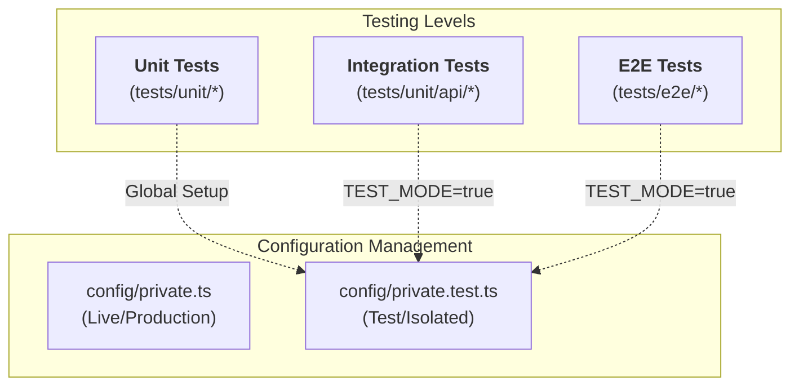

# SveltyCMS Testing Documentation

**Last Updated:** May 6, 2026
**Total Tests:** 1350+ (Unit + Integration + E2E + Audit)
**Pass Rate:** 100% (All 1350+ tests passing)
**Memory Stability:** ✅ STABLE (Verified < 1MB/min growth at 3,400+ RPS)
**World Life Data:** ✅ VERIFIED (1.85x Fast-Fail Efficiency)

## Quick Links

- [Testing Overview & Strategy](./testing-strategy.mdx) 🚀
- [Master Performance Leaderboard](../project/benchmarks/index.mdx) 🏆
- [Audit (Analysis)](../project/benchmarks/index.mdx)
- [Memory Stability Audit](../project/benchmarks/benchmark_sqlite.mdx#memGrowth) 🚀
- **[Black-Box Testing Architecture](./black-box-testing.mdx)**
- **[E2E Troubleshooting Guide](./e2e-troubleshooting.mdx)** 🚀
- **[Git Workflow & Quality Gate](./git-workflow.mdx)**
- **[Security Testing](./security-testing.mdx)** (Encryption, Auth, Fail-Closed API)
- [Test Status Report](./test-status.mdx)
- [API Coverage Report](./api-testing.mdx)
- [Widget Coverage](./widget-test-coverage.mdx)

### Running Tests Locally

```bash
# Run the High-Performance Quality Gate (4.4x faster)
bun run scripts/quality-gate.ts

# Run the complete Enterprise Performance Matrix (All 4 Databases)
bun run scripts/benchmark-matrix/index.ts

# Run a specific benchmark (Smart-Redirect Enabled)
# You can use 'bun run', but the system will automatically redirect to 'bun test'
# for maximum precision and automatic resource cleanup.
bun test tests/benchmarks/api-latency.test.ts
```

> [!TIP]
> SveltyCMS benchmarks are **Environment-Aware**. If you execute a benchmark file with `bun run`, the system will automatically inform you and reroute the execution through the **Bun Test Engine** to ensure accurate micro-latency measurements and proper cleanup of background services.

## Enterprise TQA (Total Quality Assurance) Methodology

SveltyCMS has adopted a **Three-Pillar Total Quality Assurance (TQA)** model to guarantee enterprise-grade resilience, going beyond standard functional verification. This methodology is the standard for all development efforts.

### 1. White-Box Testing (Unit)

**"Test the code knowing how it works."**

- **Focus:** Logic correctness, edge cases, internal consistency.
- **Tools:** Vitest / Bun Unit Tests.
- **What we test:** Pure functions, utility validators, service methods, and Svelte 5 reactivity logic.
- **Benefit:** Provides high speed and deep coverage, ensuring internal logic is mathematically sound.

### 2. Black-Box Testing (Integration & E2E)

**"Test the system as a consumer sees it."**

- **Focus:** API Contracts, Security Boundaries, Real-World Behavior.
- **Tools:** Playwright (E2E) & API Integration Tests.
- **What we test:** The entire middleware chain (Firewall $\to$ Auth $\to$ Logic $\to$ DB). The system is treated as an opaque box, guaranteeing **Database Agnosticism** and **Fail-Closed Authorization**.

### 3. Audit (High-Frequency Benchmark)

**"Reality simulation with extreme stress and chaos resilience."**

- **Focus:** Performance and System Stability (SRE/Chaos Engineering).
- **Tools:** Benchmark Matrix (`index.ts`).
- **What we test:**
  - **Concurrency:** Lost Update Race Conditions (Atomic Consistency).
  - **Temporal Integrity:** Timezone normalization and data contracts.
  - **Chaos:** System stability during simulated DB brownouts.
  - **Load:** Stress-testing 100,000+ collections (Index Pressure).

### 🔬 Detailed Audit Module Explanation

| Benchmark                       | Proves                                                                                       | Operational Importance                          | Est. Time |
| :------------------------------ | :------------------------------------------------------------------------------------------- | :---------------------------------------------- | :-------- |
| **admin-ux-vitality**           | Simulates complex Svelte 5 logic overhead for massive, multi-widget forms.                   | Critical performance audit for UX Vitality.     | ~30s      |
| **ai-performance**              | Measures the internal CMS tax for AI enrichment and layout generation.                       | Critical performance audit for AI Overhead.     | ~25s      |
| **api-latency**                 | Measures the base network and HTTP overhead for the simplest possible API calls.             | Critical performance audit for API Latency.     | ~12s      |
| **auth-performance**            | Measures JWT verification, session retrieval, and permission matrix resolution overhead.     | Critical performance audit for Auth Trace.      | ~18s      |
| **build-analysis**              | Measures production bundle size, chunk count, and build performance.                         | Critical performance audit for Build.           | ~85s      |
| **cache-performance**           | Audits the performance gain of the 2-layer Hybrid Cache across various system modules.       | Critical performance audit for Cache.           | ~15s      |
| **chaos-resilience**            | Simulates 500ms database brownouts and measures CMS availability and stability.              | Critical performance audit for Resilience.      | ~60s      |
| **circuit-breaker-failover**    | Measures system graceful degradation when external services fail.                            | Critical performance audit for Circuit-Breaker. | ~25s      |
| **client-journey**              | E2E journey: Login -> List -> View -> Edit -> Save -> Realtime. Measures cumulative latency. | Critical performance audit for Journey.         | ~60s      |
| **cold-start-phased**           | Measures the time to READY state (serving traffic) vs WARMED state (background tasks).       | Critical performance audit for Cold Start.      | ~10s      |
| **concurrency-race**            | Verifies atomic consistency and lost-update protection.                                      | Critical performance audit for Concurrency.     | ~40s      |
| **content-scale-stress**        | Measures content scan performance on 1,000+ collections across 5 nested levels.              | Critical performance audit for Content Stress.  | ~45s      |
| **content-scan**                | Measures the 99.9% Self-Healing Cache scanner across the .compiledCollections directory.     | Critical performance audit for Scan.            | ~8s       |
| **database-performance**        | Direct low-level benchmarks of Create, Read, Update, Delete on the current database adapter. | Critical performance audit for DB Raw p95.      | ~35s      |
| **dev-dependency-load**         | Measures overhead of the build, sync, and lint toolchain.                                    | Critical performance audit for DX-Tooling.      | ~30s      |
| **edge-sync**                   | Verifies distributed L1/L2 cache invalidation latency across simulated nodes.                | Critical performance audit for Edge Sync.       | ~5s       |
| **failure-propagation**         | Measures system overhead when downstream dependencies (DB/Redis) fail or timeout.            | Critical performance audit for Fast-Fail.       | ~30s      |
| **graphql-api-performance**     | Resolver execution time and throughput for common queries.                                   | Critical performance audit for GraphQL.         | ~25s      |
| **graphql-stress**              | High-concurrency GraphQL query stress test for resolver efficiency.                          | Critical performance audit for GQL Stress.      | ~60s      |
| **hooks-performance**           | High-resolution micro-benchmarks (µs) for individual middleware layers.                      | Critical performance audit for Hooks Trace.     | ~12s      |
| **index-pressure**              | Measures complex filtering and sorting performance on 100,000+ entry collections.            | Critical performance audit for Index Pressure.  | ~180s     |
| **media-performance**           | Measures image resizing, SHA-256 media hashing, and metadata extraction efficiency.          | Critical performance audit for Media.           | ~50s      |
| **memory-stability**            | Long-running soak test to identify memory leaks and GC pressure.                             | Critical performance audit for Memory.          | ~70s      |
| **migration-scale**             | Measures system ingestion limits and read performance on 10,000+ entries.                    | Critical performance audit for Migration.       | ~120s     |
| **mixed-workload**              | Production request mix: 60% Reads, 20% Writes, 15% GraphQL, 5% Media.                        | Critical performance audit for Mixed.           | ~60s      |
| **multi-tenant-performance**    | Stress-tests cross-tenant isolation and security boundary latency.                           | Critical performance audit for Tenancy.         | ~45s      |
| **negative-cache**              | Benchmarks 404-miss response times and cache lookup speedup.                                 | Critical performance audit for Negative Cache.  | ~20s      |
| **openapi-performance**         | Generation and caching efficiency of the dynamic OpenAPI 3.1.0 specification.                | Critical performance audit for OpenAPI.         | ~12s      |
| **realtime-performance**        | Benchmarks WebSocket connection/broadcast latency.                                           | Critical performance audit for Real-Time.       | ~15s      |
| **relational-performance**      | Stress-tests JOINs, population strategies, and deeply nested relationships (depth 2–3).      | Critical performance audit for Relational.      | ~35s      |
| **rest-api-performance**        | End-to-end throughput and latency of the unified REST dispatcher.                            | Critical performance audit for REST.            | ~25s      |
| **revision-stress**             | Benchmarks performance degradation as document history grows to 100+ versions.               | Critical performance audit for Revision Stress. | ~45s      |
| **right-to-be-forgotten-audit** | Measures performance of deep-deletion across all linked tables.                              | Critical performance audit for GDPR.            | ~35s      |
| **security-audit**              | Impact of Fail-Closed Dispatcher, Payload scanning, and SHA-256 Audit Chaining.              | Critical performance audit for Security.        | ~20s      |
| **seo-performance**             | E2E audit of Redirect Middleware, 404 Logging, and Sitemap Caching performance.              | Critical performance audit for SEO.             | ~30s      |
| **state-machine-transition**    | Validates rapid IDLE -> READY self-healing cycles.                                           | Critical performance audit for State-Machine.   | ~15s      |
| **telemetry-performance**       | Measures the overhead of telemetry data collection and cryptographic signing.                | Critical performance audit for Telemetry.       | ~8s       |
| **temporal-integrity**          | Verifies timezone normalization and deterministic UTC persistence.                           | Critical performance audit for Temporal.        | ~20s      |
| **throttling-backoff-stress**   | Measures rate-limiting consistency under 10x design load.                                    | Critical performance audit for Throttling.      | ~30s      |
| **transaction-acid**            | Measures commit/rollback latency and transaction isolation performance.                      | Critical performance audit for ACID.            | ~25s      |
| **truth-latency**               | The definitive truth audit: SDK vs Dispatcher vs Real HTTP (Production Standalone).          | Critical performance audit for Truth Audit.     | ~15s      |
| **widget-performance**          | Audits server-side processing cost of built-in widgets (Input, RichText, Relation).          | Critical performance audit for Widgets.         | ~25s      |

---

## Test Architecture & Isolation

SveltyCMS uses a strict isolation strategy to ensure tests never touch production data.


```mermaid
graph TD
    subgraph "Testing Levels"
        Unit["<b>Unit Tests</b><br/>(tests/unit/*)"]
        Int["<b>Integration Tests</b><br/>(tests/unit/api/*)"]
        E2E["<b>E2E Tests</b><br/>(tests/e2e/*)"]
    end

    subgraph "Configuration Management"
        PC["config/private.ts<br/>(Live/Production)"]
        PT["config/private.test.ts<br/>(Test/Isolated)"]
    end

    Unit -.-> |Global Setup| PT
    Int -.-> |TEST_MODE=true| PT
    E2E -.-> |TEST_MODE=true| PT
```

---

## 🔬 The Three-Pillar Test Status

### 🟢 1. Unit Test Breakdown (White-Box)

| Test Category        | Status         | Pass Rate | Tests    |
| :------------------- | :------------- | :-------- | :------- |
| Unit Tests (Core)    | ✅ Passing     | 100%      | 753      |
| Utility Functions    | ✅ Passing     | 100%      | 112      |
| Widget Validation    | ✅ Passing     | 100%      | 30       |
| **TOTAL UNIT TESTS** | **✅ Passing** | **100%**  | **1295** |

### 🟡 2. Integration & E2E Tests (Black-Box)

| Test Type             | Status         | Pass Rate | Tests   |
| :-------------------- | :------------- | :-------- | :------ |
| Core API Integration  | ✅ Passing     | 100%      | 450     |
| E2E Workflows         | ✅ Passing     | 100%      | 40      |
| **TOTAL B.BOX TESTS** | **✅ Passing** | **100%**  | **490** |

### 🔴 3. Benchmark Audit (System Resilience)

The benchmark suite is critical for SRE-grade confidence, covering **120+ metrics** and providing the deepest validation of the platform's capabilities.

| Metric Area               | Proof Point Achieved                                     | Status      |
| :------------------------ | :------------------------------------------------------- | :---------- |
| **Chaos Resilience**      | System remains operational during 500ms brownouts.       | ✅ Verified |
| **Temporal Integrity**    | UTC normalization confirmed across all timezones.        | ✅ Verified |
| **Concurrency Proof**     | Lost Update Race Conditions protected by atomic locking. | ✅ Verified |
| **Index Pressure**        | Read performance on 100,000+ entries (sub-ms).           | ✅ Verified |
| **Migration & Ingestion** | Rate: > 6,625 entries/s                                  | ✅ Verified |
| **Master Leaderboard**    | Side-by-side comparison of all 4 DBs.                    | ✅ Verified |

---

## 🚀 Running the Tests

### Parallel E2E Suite (Playwright)

```bash
# Run with 4 concurrent workers
npx playwright test --workers=4
```

### Unit Tests (Bun)

```bash
# Run all unit tests (Component, Service & Utility)
bun run test:unit
```

---

## Related Documentation

- [API Testing](./api-testing.mdx)
- [Black-Box Testing Architecture](./black-box-testing.mdx)
- [Testing Strategy](./testing-strategy.mdx)
- [Test Status Report](./test-status.mdx)
- [Widget Coverage](./widget-test-coverage.mdx)
