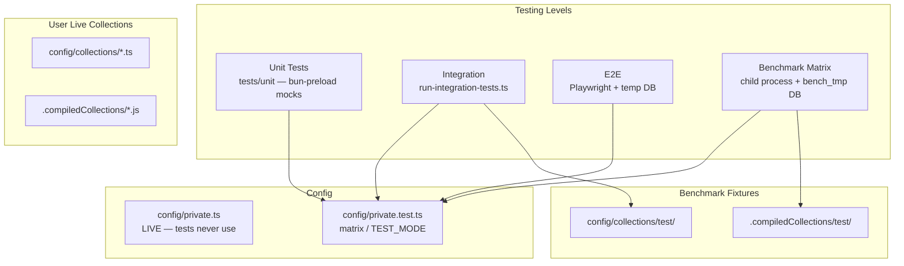

# SveltyCMS Testing Documentation

> [!NOTE] Competitive comparisons based on publicly available documentation as of June 2026. Performance data self-measured via `bun test tests/benchmarks/`.

**Last Updated:** June 23, 2026
**Source of Truth:** GitHub Actions on the current branch or pull request
**Core Gates:** White-box unit tests, black-box integration tests, and Playwright E2E
**Primary Safety Rule:** Local and CI tests must never use live credentials or production data

> [!IMPORTANT]
> Historical totals and pass rates drift quickly. Treat GitHub Actions as the only current status board for counts, pass rate, and branch health.

## Quick Links

- [Testing Overview & Strategy](./testing-strategy.mdx) 🚀
- [Contract Tests](./testing-strategy.mdx#1-contract-tests-universal-adapter-verification) 🔗
- [Smart Orchestrator](./testing-strategy.mdx#smart-test-orchestrator) 🧠
- [Master Performance Leaderboard](../project/benchmarks/index.mdx) 🏆
- [Audit (Analysis)](../project/benchmarks/index.mdx)
- [Memory Stability Audit](../project/benchmarks/benchmark_sqlite.mdx#memGrowth) 🚀
- **[Black-Box Testing Architecture](./black-box-testing.mdx)**
- **[E2E Troubleshooting Guide](./e2e-troubleshooting.mdx)** 🚀
- **[Git Workflow & Quality Gate](./git-workflow.mdx)**
- **[Security Testing](./security-testing.mdx)** (Encryption, Auth, Fail-Closed API)
- **[Benchmark Collection Isolation](./benchmark-isolation.mdx)** 🛡️
- [Test Status Report](./test-status.mdx)
- [API Coverage Report](./api-testing.mdx)
- [Widget Coverage](./widget-test-coverage.mdx)

### Route-Specific E2E Specs

- [Setup Wizard E2E Tests](./routes/setup.mdx) 🧙‍♂️
- [Authentication E2E Tests](./routes/login.mdx) 🔑
- [User Profile & Management E2E Tests](./routes/user.mdx) 👤
- [Collection Builder E2E Tests](./routes/collection-builder.mdx) 🛠️
- [System Config E2E Tests](./routes/system.mdx) ⚙️

### Running Tests Locally

````bash
# White-box gate
bun run test:unit
bun run check

# Production build used by integration and most E2E jobs
bun run build

# Black-box integration runner (choose DB)
bun run scripts/run-integration-tests.ts --db=sqlite

# Wizard E2E against the production build
TEST_MODE=true node build/index.js
bun x playwright test --project=wizard

# Smart test runner — auto-detects what to test from git diff
bun run test:smart

# Run the quality gate
bun run scripts/quality-gate.ts

# Run specific contract against active database
bun test tests/integration/databases/contract.test.ts

# Run the complete Enterprise Performance Matrix (all 4 databases)
bun run scripts/benchmark-matrix/index.ts

# Run a specific benchmark
bun test tests/benchmarks/api-latency.test.ts
```

> [!TIP]
> SveltyCMS benchmarks are **Environment-Aware**. If you execute a benchmark file with `bun run`, the system will automatically inform you and reroute the execution through the **Bun Test Engine** to ensure accurate micro-latency measurements and proper cleanup of background services.

### Tiered Local Testing

SveltyCMS enforces a **three-tier** local testing strategy to catch bugs at the right stage:

```
# Tier 1: Pre-Commit (automatic, < 5s) — format, lint, types, unit tests, build
git commit -m "feat: my change"

# Tier 2: Pre-Push (automatic, ~3 min) — SQLite integration + Playwright E2E
git push origin my-branch

# Tier 3: Full CI Parity (manual, ~10 min) — 4-DB matrix + full E2E
bun run ci:local
bun run ci:local --db=sqlite       # single DB
bun run ci:local --skip-e2e         # skip Playwright
```

See **[Git Workflow & Quality Gate](./git-workflow.mdx)** for the full tiered strategy, scripts audit, and bypass instructions.

## Current GitHub Actions Gate

The `next` branch workflow currently validates changes in this order:

1. `bootstrap` — Bun install, codegen verification, E2E secret generation.
2. `lint`, `check`, `unit` — White-box quality gates.
3. `build` — Production bundle generation.
4. `db-tests` — Black-box integration matrix across SQLite, MongoDB, MariaDB, and PostgreSQL.
5. `e2e-wizard`, `e2e-auth`, `e2e-app` — Playwright browser validation.

This matters because integration and E2E failures are not just "test" failures. They also validate production build output, redirect logic, auth cookies, and database bootstrap behavior.

## Enterprise TQA (Total Quality Assurance) Methodology

SveltyCMS has adopted a **Four-Pillar Total Quality Assurance (TQA)** model to guarantee enterprise-grade resilience, going beyond standard functional verification. This methodology is the standard for all development efforts.

### 1. White-Box Testing (Unit)

**"Test the code knowing how it works."**

- **Focus:** Logic correctness, edge cases, internal consistency.
- **Tools:** Vitest / Bun Unit Tests.
- **What we test:** Pure functions, utility validators, service methods, Svelte 5 reactivity logic, database proxy behaviors (self-healing HMR recovery, tenant auto-injection, hot-swap zero-tax), and tenant filter application logic.
- **Benefit:** Provides high speed and deep coverage, ensuring internal logic is mathematically sound.
- **New (June 2026):** `tests/unit/core/` — 23 dedicated tests for `proxy-utils.ts` and `relational-utils.ts` covering previously untested database layer patterns.

### 2. Black-Box Testing (Integration & E2E)

**"Test the system as a consumer sees it."**

- **Focus:** API Contracts, Security Boundaries, Real-World Behavior.
- **Tools:** Playwright (E2E) & API Integration Tests.
- **What we test:** The entire middleware chain (Firewall $\to$ Auth $\to$ Logic $\to$ DB). The system is treated as an opaque box, guaranteeing **Database Agnosticism** and **Fail-Closed Authorization**.

### 3. Audit (High-Frequency Benchmark)

**"Reality simulation with extreme stress and chaos resilience."**

- **Focus:** Performance and System Stability (SRE/Chaos Engineering).
- **Tools:** 50-test Benchmark Matrix (`scripts/benchmark-matrix/`).
- **Coverage:** 9 dimensions across SQLite, PostgreSQL, MariaDB, MongoDB + Redis variants.
- **Intelligence:** Rolling trend baselines, 7 root cause categories, cross-test correlation, adaptive budgets.
- **Reports:** 8 per-database MDX reports with Measures/Budget/Code/Why context.
- **Latest SQLite:** 0.074ms DB raw, 0.59ms REST p95, 381ms cold start.
- **Guide:** `docs/project/benchmarks/index.mdx`

### 4. Accessibility Audit (WCAG 3.0 & ATAG 2.0)

**"Guarantee universal access and cognitive usability."**

- **Focus:** WCAG 3.0 Functional Outcomes, Keyboard Traversal, Assistive Tech compatibility.
- **Tools:** `@axe-core/playwright`, Lighthouse, Manual Keyboard & Screen Reader audits.
- **What we test:** Page contrast, focus traps, focus indicators, keyboard navigation, ARIA semantics, and screen reader announcements.
- **Benefit:** Ensures that both CMS administrators (ATAG 2.0) and visitors have an optimal, non-excluding experience.

### 🔬 Detailed Audit Module Explanation

| Benchmark                       | Proves                                                                                         | Operational Importance                               | Est. Time |
| :------------------------------ | :--------------------------------------------------------------------------------------------- | :--------------------------------------------------- | :-------- |
| **admin-ux-vitality**           | Simulates complex Svelte 5 logic overhead for massive, multi-widget forms.                     | Critical performance audit for UX Vitality.          | ~30s      |
| **ai-performance**              | Measures the internal CMS tax for AI enrichment and layout generation.                         | Critical performance audit for AI Overhead.          | ~25s      |
| **api-latency**                 | Measures the base network and HTTP overhead for the simplest possible API calls.               | Critical performance audit for API Latency.          | ~12s      |
| **auth-performance**            | Measures JWT verification, session retrieval, and permission matrix resolution overhead.       | Critical performance audit for Auth Trace.           | ~18s      |
| **build-analysis**              | Measures production bundle size, chunk count, and build performance.                           | Critical performance audit for Build.                | ~85s      |
| **cache-hit-ratio**             | Audits Redis cache hit/miss ratio, invalidation speed, and cold/warm fill performance.         | Critical performance audit for Cache Efficiency.     | ~10s      |
| **cache-performance**           | Audits the performance gain of the 2-layer Hybrid Cache across various system modules.         | Critical performance audit for Cache.                | ~15s      |
| **cache-service**               | Benchmarks L1 cache hit latency and pattern invalidation at scale (1k items @ 200k noise).     | Critical performance audit for Cache Internals.      | ~60s      |
| **chaos-resilience**            | Simulates 500ms database brownouts and measures CMS availability and stability.                | Critical performance audit for Resilience.           | ~60s      |
| **circuit-breaker-failover**    | Measures system graceful degradation when external services fail.                              | Critical performance audit for Circuit-Breaker.      | ~25s      |
| **client-journey**              | E2E journey: Login -> List -> View -> Edit -> Save -> Realtime. Measures cumulative latency.   | Critical performance audit for Journey.              | ~60s      |
| **cold-start-phased**           | Measures the time to READY state (serving traffic) vs WARMED state (background tasks).         | Critical performance audit for Cold Start.           | ~10s      |
| **concurrency-race**            | Verifies atomic consistency and lost-update protection.                                        | Critical performance audit for Concurrency.          | ~40s      |
| **content-scale-stress**        | Measures scan performance on 1,000+ files under `.compiledCollections/test/stress/` (isolated).  | Critical performance audit for Content Stress.       | ~45s      |
| **content-scan**                | Self-Healing scanner over `.compiledCollections/test/scan/` — never touches user root files.   | Critical performance audit for Scan.                 | ~8s       |
| **content-incremental-reload**  | Incremental vs full reload under `.compiledCollections/test/incremental/` (1k fixtures).       | Critical performance audit for Hot Reload.           | ~4s       |
| **data-residency-failover**     | Simulates geopolitical boundary crossing and verifies PII field blocking for residency laws.   | Critical performance audit for Data Sovereignty.     | ~15s      |
| **database-performance**        | Direct low-level benchmarks of Create, Read, Update, Delete on the current database adapter.   | Critical performance audit for DB Raw p95.           | ~35s      |
| **dev-dependency-load**         | Measures overhead of the build, sync, and lint toolchain.                                      | Critical performance audit for DX-Tooling.           | ~30s      |
| **edge-sync**                   | Verifies distributed L1/L2 cache invalidation latency across simulated nodes.                  | Critical performance audit for Edge Sync.            | ~5s       |
| **failure-propagation**         | Measures system overhead when downstream dependencies (DB/Redis) fail or timeout.              | Critical performance audit for Fast-Fail.            | ~30s      |
| **graphql-api-performance**     | Resolver execution time and throughput for common queries.                                     | Critical performance audit for GraphQL.              | ~25s      |
| **graphql-stress**              | High-concurrency GraphQL query stress test for resolver efficiency.                            | Critical performance audit for GQL Stress.           | ~60s      |
| **hooks-performance**           | High-resolution micro-benchmarks (µs) for individual middleware layers.                        | Critical performance audit for Hooks Trace.          | ~12s      |
| **index-pressure**              | Measures complex filtering and sorting performance on 100,000+ entry collections.              | Critical performance audit for Index Pressure.       | ~180s     |
| **local-api-performance**       | Measures LocalCMS SDK overhead vs direct adapter calls to verify zero-tax dispatching.         | Critical performance audit for SDK Tax.              | ~60s      |
| **media-performance**           | Measures image resizing, SHA-256 media hashing, and metadata extraction efficiency.            | Critical performance audit for Media.                | ~50s      |
| **media-upload-stress**         | Stress-tests large file upload throughput, concurrent transfers, and streaming efficiency.     | Critical performance audit for Upload Speed.         | ~180s     |
| **memory-stability**            | Long-running soak test to identify memory leaks and GC pressure.                               | Critical performance audit for Memory.               | ~70s      |
| **migration-scale**             | Measures system ingestion limits and read performance on 10,000+ entries.                      | Critical performance audit for Migration.            | ~120s     |
| **mixed-workload**              | Production request mix: 60% Reads, 20% Writes, 15% GraphQL, 5% Media.                          | Critical performance audit for Mixed.                | ~60s      |
| **multi-tenant-performance**    | Stress-tests cross-tenant isolation and security boundary latency.                             | Critical performance audit for Tenancy.              | ~45s      |
| **negative-cache**              | Benchmarks 404-miss response times and cache lookup speedup.                                   | Critical performance audit for Negative Cache.       | ~20s      |
| **openapi-performance**         | Generation and caching efficiency of the dynamic OpenAPI 3.1.0 specification.                  | Critical performance audit for OpenAPI.              | ~12s      |
| **production-day**              | Simulates a realistic multi-user workload: 40% list, 20% read, 25% update, 10% media, 5% GQL.  | Critical performance audit for Production Stability. | ~120s     |
| **realtime-performance**        | Benchmarks WebSocket connection/broadcast latency.                                             | Critical performance audit for Real-Time.            | ~15s      |
| **relational-performance**      | Stress-tests JOINs, population strategies, and deeply nested relationships (depth 2–3).        | Critical performance audit for Relational.           | ~35s      |
| **rest-api-performance**        | End-to-end throughput and latency of the unified REST dispatcher.                              | Critical performance audit for REST.                 | ~25s      |
| **revision-stress**             | Benchmarks performance degradation as document history grows to 100+ versions.                 | Critical performance audit for Revision Stress.      | ~45s      |
| **right-to-be-forgotten-audit** | Measures performance of deep-deletion across all linked tables.                                | Critical performance audit for GDPR.                 | ~35s      |
| **security-audit**              | Impact of Fail-Closed Dispatcher, Payload scanning, and SHA-256 Audit Chaining.                | Critical performance audit for Security.             | ~20s      |
| **seo-performance**             | E2E audit of Redirect Middleware, 404 Logging, and Sitemap Caching performance.                | Critical performance audit for SEO.                  | ~30s      |
| **setup-proxy**                 | Measures cold-start initialization latency and proxy header (X-Forwarded-\*) parsing overhead. | Critical performance audit for Setup Security.       | ~15s      |
| **state-machine-transition**    | Validates rapid IDLE -> READY self-healing cycles.                                             | Critical performance audit for State-Machine.        | ~15s      |
| **telemetry-performance**       | Measures the overhead of telemetry data collection and cryptographic signing.                  | Critical performance audit for Telemetry.            | ~8s       |
| **temporal-integrity**          | Verifies timezone normalization and deterministic UTC persistence.                             | Critical performance audit for Temporal.             | ~20s      |
| **throttling-backoff-stress**   | Measures rate-limiting consistency under 10x design load.                                      | Critical performance audit for Throttling.           | ~30s      |
| **transaction-acid**            | Measures commit/rollback latency and transaction isolation performance.                        | Critical performance audit for ACID.                 | ~25s      |
| **truth-latency**               | The definitive truth audit: SDK vs Dispatcher vs Real HTTP (Production Standalone).            | Critical performance audit for Truth Audit.          | ~15s      |
| **websocket-broadcast**         | Measures svelte-realtime WebSocket stream broadcast latency and handshake timing.              | Critical performance audit for Real-Time Broadcast.  | ~20s      |
| **widget-performance**          | Audits server-side processing cost of built-in widgets (Input, RichText, Relation).            | Critical performance audit for Widgets.              | ~25s      |

---

## Test Architecture & Isolation

SveltyCMS uses a strict isolation strategy so tests **never** touch production credentials, live databases, or user collection files at the root of `config/collections/` and `.compiledCollections/`. Enforcement is code-level — see **[Benchmark Collection Isolation](./benchmark-isolation.mdx)** for the full contract.


```mermaid
graph TD
    subgraph levels [Testing Levels]
        Unit[Unit Tests<br/>tests/unit — bun-preload mocks]
        Int[Integration<br/>run-integration-tests.ts]
        E2E[E2E<br/>Playwright + temp DB]
        Bench[Benchmark Matrix<br/>child process + bench_tmp DB]
    end

    subgraph config [Config]
        PC[config/private.ts<br/>LIVE — tests never use]
        PT[config/private.test.ts<br/>matrix / TEST_MODE]
    end

    subgraph user [User Live Collections]
        UC[config/collections/*.ts]
        CC[.compiledCollections/*.js]
    end

    subgraph bench [Benchmark Fixtures]
        BT[config/collections/test/]
        BC[.compiledCollections/test/]
    end

    Unit --> PT
    Int --> PT
    E2E --> PT
    Bench --> PT
    Bench --> BC
    Int --> BT
```

### Isolation Guarantees by Artifact

| Artifact | Unit | Integration | E2E | Benchmark |
| :------- | :--: | :---------: | :-: | :-------: |
| **config/private.ts** | Never touched | Ephemeral TEST_MODE mirror only | Setup wizard mirror | Never touched |
| **config/private.test.ts** | bun-preload mocks | Auto-generated | Generated test config | `writeTestConfig` |
| **config/collections/** (root) | Never reads | Never reads | Never reads | Never writes — purge on matrix boot |
| **config/collections/test/** | Never reads | Writes `integration_test_collection.ts` | Never reads | Benchmark TS sources (if any) |
| **.compiledCollections/** (root) | Never reads | Never reads | Never reads | Read-only for user files; purge removes leaked artifacts |
| **.compiledCollections/test/** | Never reads | Integration fixture JS | Never reads | Scan/stress/incremental workspaces only |
| **User database** | In-memory mocks | Temp DB only | Temp DB only | `bench_tmp_<db>_<pid>` |
| **Content store** | Mocked singleton | Per-process | Per-browser | Per matrix server + temp DB |

> [!IMPORTANT]
> Integration and E2E may mirror `config/private.test.ts` into a disposable `TEST_MODE` workspace. That mirror must use test-only databases and secrets, never live infrastructure.

### How Benchmarks Use Collections

**API benchmarks** (relational, REST, GraphQL throughput) — no user filesystem writes:

1. **Setup**: `setup-benchmarks.ts` seeds via `POST /api/testing` (LocalCMS inside the matrix server)
2. **Stable data**: `ensureStableTestData()` creates `BenchmarkStable` in DB/content store only
3. **Cleanup**: PID-scoped temp DB; `ConfigSafeguard.restore()` purges artifacts on exit

**Filesystem benchmarks** (content-scan, scale-stress, incremental-reload) — isolated workspaces only:

1. **Prepare**: `prepareBenchmarkCompiledWorkspace("scan" | "stress" | "incremental")` under `.compiledCollections/test/`
2. **Run**: Scanner walks the full tree; user root files remain untouched
3. **Cleanup**: `cleanupBenchmarkCompiledWorkspace()` or matrix `purgeBenchmarkCollectionArtifacts()`

> [!CAUTION]
> Never write benchmark fixtures to `config/collections/` or `.compiledCollections/` **root**. The matrix pre-purge and GraphQL `isMockScanCollection()` filter exist because root pollution previously caused 150+ mock types and matrix GraphQL HTTP 500 errors.

### What the Benchmark Logs Mean

| Log Message                                                                | Meaning                                                                                                                                                        |
| :------------------------------------------------------------------------- | :------------------------------------------------------------------------------------------------------------------------------------------------------------- |
| `SKIP_GATEKEEPER=true -> bypassing firewall, rate-limit, and state checks` | Intentional -- benchmarks measure raw DB/GraphQL performance without security middleware overhead. Your production gatekeeper is unaffected.                   |
| `Auth warmup failed (Status 401) -- non-critical`                          | Benchmarks authenticate via `x-test-secret` header, not login credentials. The warmup tries a soft admin login as a best-effort pre-warm; failure is harmless. |
| `Cold Start: Nms`                                                          | The benchmark child process startup time -- measures SveltyCMS boot speed, not your running instance.                                                          |

---

### 🔬 The Four-Pillar Coverage Model

> [!NOTE]
> The counts and pass/fail labels below are illustrative coverage snapshots, not a live CI dashboard.

### 🟢 1. Unit Test Breakdown (White-Box)

| Test Category        | Status         | Pass Rate | Tests   |
| :------------------- | :------------- | :-------- | :------ |
| Unit Tests (Core)    | ✅ Passing     | 100%      | 1,293+  |
| Utility Functions    | ✅ Passing     | 100%      | (incl.) |
| Widget Validation    | ✅ Passing     | 100%      | (incl.) |
| Stores & Hooks       | ✅ Passing     | 100%      | (incl.) |
| **TOTAL UNIT TESTS** | **✅ Passing** | **100%**  | **1,293+** |

### 🟡 2. Integration & E2E Tests (Black-Box)

| Test Type             | Status         | Pass Rate | Tests   |
| :-------------------- | :------------- | :-------- | :------ |
| Core API Integration  | ✅ Passing     | 100%      | 453     |
| E2E Workflows         | ✅ Passing     | 100%      | 40      |
| **TOTAL B.BOX TESTS** | **✅ Passing** | **100%**  | **493** |

### 🔴 3. Benchmark Audit (System Resilience)

The benchmark suite is critical for SRE-grade confidence, covering **120+ metrics** and providing the deepest validation of the platform's capabilities.

| Metric Area               | Proof Point Achieved                                     | Status      |
| :------------------------ | :------------------------------------------------------- | :---------- |
| **Chaos Resilience**      | System remains operational during 500ms brownouts.       | ✅ Verified |
| **Temporal Integrity**    | UTC normalization confirmed across all timezones.        | ✅ Verified |
| **Concurrency Proof**     | Lost Update Race Conditions protected by atomic locking. | ✅ Verified |
| **Index Pressure**        | Read performance on 100,000+ entries (sub-ms).           | ✅ Verified |
| **Migration & Ingestion** | Rate: > 6,625 entries/s                                  | ✅ Verified |
| **Master Leaderboard**    | Side-by-side comparison of all 4 DBs.                    | ✅ Verified |

### 🔵 4. Accessibility Audit (Universal Usability)

Dedicated automated and cognitive checkpoints integrated into CI and developer quality gates to meet WCAG 3.0 / ATAG 2.0 requirements.

| Metric Area                    | Proof Point Achieved                                       | Status      |
| :----------------------------- | :--------------------------------------------------------- | :---------- |
| **Automated Axe Audits**       | 0 critical Axe accessibility violations on setup and CRUD. | ✅ Verified |
| **Keyboard Traversal & Focus** | Full keyboard flow usability without focus traps.          | ✅ Verified |
| **Contrast & Theming**         | Minimum 4.5:1 text-to-background contrast on all themes.   | ✅ Verified |
| **Assistive Technology Sync**  | Screen-reader accessible landmarks and live regions.       | ✅ Verified |

---

## 🚀 Running the Tests

### Parallel E2E Suite (Playwright)

```bash
# Run with 4 concurrent workers
npx playwright test --workers=4
```

### Unit Tests (Bun)

```bash
# Run all unit tests (Component, Service & Utility)
bun run test:unit
```

---

## Related Documentation

- [API Testing](./api-testing.mdx)
- **[Accessibility Audit](./accessibility-audit.mdx)** ♿️ (Mandatory CI Check)
- [Testing Strategy](./testing-strategy.mdx)
- [Benchmark Collection Isolation](./benchmark-isolation.mdx)
- [Test Status Report](./test-status.mdx)
- [Widget Coverage](./widget-test-coverage.mdx)
````
