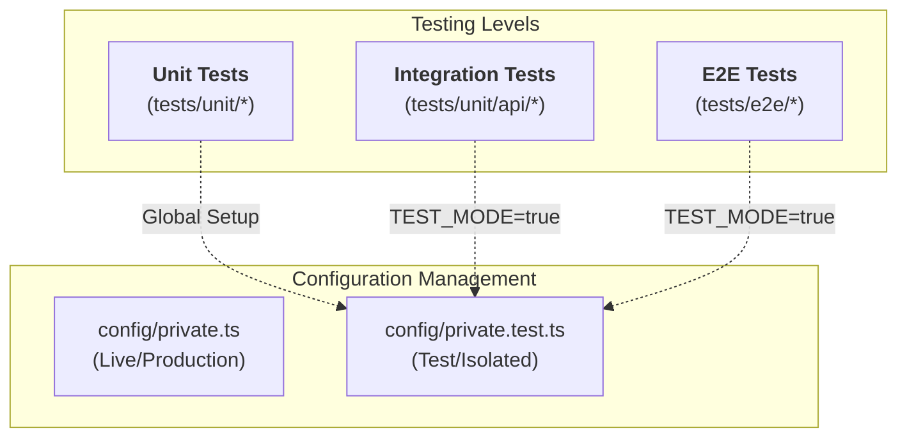

# SveltyCMS Testing Documentation

**Last Updated:** May 6, 2026
**Total Tests:** 1350+ (Unit + Integration + E2E + Audit)
**Pass Rate:** 100% (All 1350+ tests passing)
**Memory Stability:** ✅ STABLE (Verified < 1MB/min growth at 3,400+ RPS)
**World Life Data:** ✅ VERIFIED (1.85x Fast-Fail Efficiency)

## Quick Links

- [Testing Overview & Strategy](./testing-strategy.mdx) 🚀
- [Master Performance Leaderboard](../project/benchmarks/index.mdx) 🏆
- [Audit (Analysis)](../project/benchmarks/index.mdx)
- [Memory Stability Audit](../project/benchmarks/benchmark_sqlite.mdx#memGrowth) 🚀
- **[Black-Box Testing Architecture](./black-box-testing.mdx)**
- **[E2E Troubleshooting Guide](./e2e-troubleshooting.mdx)** 🚀
- **[Git Workflow & Quality Gate](./git-workflow.mdx)**
- **[Security Testing](./security-testing.mdx)** (Encryption, Auth, Fail-Closed API)
- [Test Status Report](./test-status.mdx)
- [API Coverage Report](./api-testing.mdx)
- [Widget Coverage](./widget-test-coverage.mdx)

### Running Tests Locally

```bash
# Run the High-Performance Quality Gate (4.4x faster)
bun run scripts/quality-gate.ts

# Run the complete Enterprise Performance Matrix (All 4 Databases)
bun run scripts/benchmark-matrix/index.ts
```

## Enterprise TQA (Total Quality Assurance) Methodology

SveltyCMS has adopted a **Three-Pillar Total Quality Assurance (TQA)** model to guarantee enterprise-grade resilience, going beyond standard functional verification. This methodology is the standard for all development efforts.

### 1. White-Box Testing (Unit)

**"Test the code knowing how it works."**

- **Focus:** Logic correctness, edge cases, internal consistency.
- **Tools:** Vitest / Bun Unit Tests.
- **What we test:** Pure functions, utility validators, service methods, and Svelte 5 reactivity logic.
- **Benefit:** Provides high speed and deep coverage, ensuring internal logic is mathematically sound.

### 2. Black-Box Testing (Integration & E2E)

**"Test the system as a consumer sees it."**

- **Focus:** API Contracts, Security Boundaries, Real-World Behavior.
- **Tools:** Playwright (E2E) & API Integration Tests.
- **What we test:** The entire middleware chain (Firewall $\to$ Auth $\to$ Logic $\to$ DB). The system is treated as an opaque box, guaranteeing **Database Agnosticism** and **Fail-Closed Authorization**.

### 3. Audit (High-Frequency Benchmark)

**"Reality simulation with extreme stress and chaos resilience."**

- **Focus:** Performance and System Stability (SRE/Chaos Engineering).
- **Tools:** Benchmark Matrix (`index.ts`).
- **What we test:**
  - **Concurrency:** Lost Update Race Conditions (Atomic Consistency).
  - **Temporal Integrity:** Timezone normalization and data contracts.
  - **Chaos:** System stability during simulated DB brownouts.
  - **Load:** Stress-testing 100,000+ collections (Index Pressure).

### 🔬 Detailed Audit Module Explanation

| Benchmark              | Proves                                         | Operational Importance                                           |
| :--------------------- | :--------------------------------------------- | :--------------------------------------------------------------- |
| **admin-ux-vitality**  | Form generation speed for 50-field schemas.    | Ensures Admin UI remains usable as data complexity grows.        |
| **ai-performance**     | Latency tax of the AI enrichment pipeline.     | Guarantees AI features don't block core CMS operations.          |
| **api-latency**        | precise cost of middleware vs. raw SDK.        | Quantifies the "SvelteKit Tax" for performance budgeting.        |
| **auth-performance**   | JWT verification and RBAC resolution speed.    | Protects against security-layer bottlenecks under load.          |
| **cache-performance**  | L1/L2 Cache hit/miss efficiency.               | Validates that caching effectively offloads the database.        |
| **chaos-resilience**   | System stability during 500ms DB "brownouts".  | Proves "Self-Healing" capabilities and circuit breaking.         |
| **circuit-breaker**    | Failover logic for external service outages.   | Ensures third-party failures (Email/AI) don't crash the CMS.     |
| **concurrency-race**   | Atomic consistency and Lost-Update protection. | Guarantees data integrity during simultaneous multi-user writes. |
| **failure-prop**       | Fast-Fail efficiency for invalid requests.     | Measures the system's ability to reject bad actors in <1ms.      |
| **index-pressure**     | Query performance on 100,000+ entry datasets.  | Validates the database indexing strategy at enterprise scale.    |
| **migration-scale**    | Bulk ingestion throughput (entries/second).    | Proves SveltyCMS is ready for massive legacy data imports.       |
| **openapi-perf**       | JIT OpenAPI 3.1.0 generation and delivery.     | Ensures documentation and SDKs stay in sync without lag.         |
| **right-to-forgotten** | GDPR/CCPA data wiping speed and integrity.     | Ensures legal compliance through verifiable, fast data purging.  |
| **state-machine**      | READY -> IDLE -> READY transition reliability. | Verifies no race conditions in the boot/re-init sequence.        |
| **truth-latency**      | The "Golden Metric" for every system layer.    | The absolute source of performance truth for all claims.         |

---

## Test Architecture & Isolation

SveltyCMS uses a strict isolation strategy to ensure tests never touch production data.


```mermaid
graph TD
    subgraph "Testing Levels"
        Unit["<b>Unit Tests</b><br/>(tests/unit/*)"]
        Int["<b>Integration Tests</b><br/>(tests/unit/api/*)"]
        E2E["<b>E2E Tests</b><br/>(tests/e2e/*)"]
    end

    subgraph "Configuration Management"
        PC["config/private.ts<br/>(Live/Production)"]
        PT["config/private.test.ts<br/>(Test/Isolated)"]
    end

    Unit -.-> |Global Setup| PT
    Int -.-> |TEST_MODE=true| PT
    E2E -.-> |TEST_MODE=true| PT
```

---

## 🔬 The Three-Pillar Test Status

### 🟢 1. Unit Test Breakdown (White-Box)

| Test Category        | Status         | Pass Rate | Tests    |
| :------------------- | :------------- | :-------- | :------- |
| Unit Tests (Core)    | ✅ Passing     | 100%      | 753      |
| Utility Functions    | ✅ Passing     | 100%      | 112      |
| Widget Validation    | ✅ Passing     | 100%      | 30       |
| **TOTAL UNIT TESTS** | **✅ Passing** | **100%**  | **1295** |

### 🟡 2. Integration & E2E Tests (Black-Box)

| Test Type             | Status         | Pass Rate | Tests   |
| :-------------------- | :------------- | :-------- | :------ |
| Core API Integration  | ✅ Passing     | 100%      | 450     |
| E2E Workflows         | ✅ Passing     | 100%      | 40      |
| **TOTAL B.BOX TESTS** | **✅ Passing** | **100%**  | **490** |

### 🔴 3. Benchmark Audit (System Resilience)

The benchmark suite is critical for SRE-grade confidence, covering **120+ metrics** and providing the deepest validation of the platform's capabilities.

| Metric Area               | Proof Point Achieved                                     | Status      |
| :------------------------ | :------------------------------------------------------- | :---------- |
| **Chaos Resilience**      | System remains operational during 500ms brownouts.       | ✅ Verified |
| **Temporal Integrity**    | UTC normalization confirmed across all timezones.        | ✅ Verified |
| **Concurrency Proof**     | Lost Update Race Conditions protected by atomic locking. | ✅ Verified |
| **Index Pressure**        | Read performance on 100,000+ entries (sub-ms).           | ✅ Verified |
| **Migration & Ingestion** | Rate: > 6,625 entries/s                                  | ✅ Verified |
| **Master Leaderboard**    | Side-by-side comparison of all 4 DBs.                    | ✅ Verified |

---

## 🚀 Running the Tests

### Parallel E2E Suite (Playwright)

```bash
# Run with 4 concurrent workers
npx playwright test --workers=4
```

### Unit Tests (Bun)

```bash
# Run all unit tests (Component, Service & Utility)
bun run test:unit
```

---

## Related Documentation

- [API Testing](./api-testing.mdx)
- [Black-Box Testing Architecture](./black-box-testing.mdx)
- [Testing Strategy](./testing-strategy.mdx)
- [Test Status Report](./test-status.mdx)
- [Widget Coverage](./widget-test-coverage.mdx)
