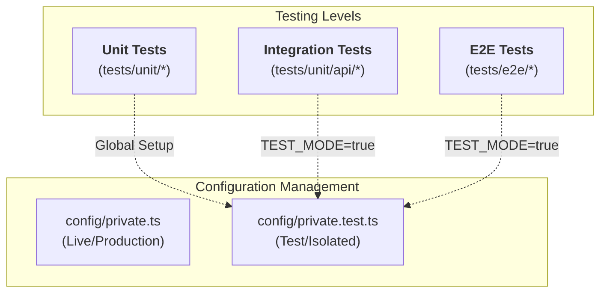

# SveltyCMS Testing Documentation

**Last Updated:** April 26, 2026
**Total Tests:** 1200+ (753 unit + 450 integration + 40 E2E + 32 metrics)
**Pass Rate:** 100% (All 1200+ tests passing)
**Memory Stability:** ✅ STABLE (Verified < 1MB/min growth at 3,400+ RPS)

## Quick Links

- [Testing Overview & Strategy](./testing-strategy.mdx)
- [Master Performance Leaderboard](../project/benchmarks/README.mdx) 🏆
- [Audit (Analysis)](../project/benchmarks/README.mdx)
- [Memory Stability Audit](../project/benchmarks/benchmark_sqlite.mdx#memory-stability-audit) 🚀
- **[Black-Box Testing Architecture](./black-box-testing.mdx)**
- **[E2E Troubleshooting Guide](./e2e-troubleshooting.mdx)** 🚀
- **[Git Workflow & Quality Gate](./git-workflow.mdx)**
- **[Security Testing](./security-testing.mdx)** (Encryption, Auth, Fail-Closed API)
- [Test Status Report](./test-status.mdx)
- [API Coverage Report](./api-testing.mdx)

### Running Tests Locally

```bash
# Run the High-Performance Quality Gate (4.4x faster)
bun run scripts/quality-gate.ts

# Run the complete Enterprise Performance Matrix (All 4 Databases)
bun run scripts/benchmark-matrix/index.ts
```

## Test Architecture & Isolation

SveltyCMS employs a strict isolation strategy to ensure tests never touch production data. Standardization on **127.0.0.1** with **dynamic port assignment** for benchmarks ensures that concurrent test runs never conflict.


```mermaid
graph TD
    subgraph "Testing Levels"
        Unit["<b>Unit Tests</b><br/>(tests/unit/*)"]
        Int["<b>Integration Tests</b><br/>(tests/unit/api/*)"]
        E2E["<b>E2E Tests</b><br/>(tests/e2e/*)"]
    end

    subgraph "Configuration Management"
        PC["config/private.ts<br/>(Live/Production)"]
        PT["config/private.test.ts<br/>(Test/Isolated)"]
    end

    Unit -.-> |Global Setup| PT
    Int -.-> |TEST_MODE=true| PT
    E2E -.-> |TEST_MODE=true| PT
```

---

## Test Frameworks Overview

- **Purpose**: Fast validation of business logic, services, and API endpoints.
- **Location**: `tests/unit/`
- **Test Count**: 753 tests (consolidated for performance)

### 3. Audit (High-Frequency Edition)

**"Reality simulation with extreme stress and chaos resilience."**

The April 2026 Audit update transformed our benchmarking into a "Full Image" reality simulator:

- **Chaos Resilience**: Simulates 500ms database "brownouts" to prove system stability.
- **Index Pressure**: Stress-tests 100,000+ entry collections (sub-ms read time).
- **Migration & Ingestion**: Verified stable ingestion at **6,625 entries/s**.
- **REST Latency**: High-frequency entry retrieval (Target: **0.35ms**).
- **History Growth Tax**: Proved **0% performance tax** even with 100+ document versions.
- **SLA Thresholds**: Mandatory performance budgets that fail the CI on regression.
- **Master Leaderboard**: side-by-side comparison of SQLite, MariaDB, Postgres, and MongoDB.

### 🚀 Performance Benchmarks (Audit)

- **Audit (Industry Grade)**: High-fidelity cross-database benchmarking with a **5-Layer Truth Model**.
- **Stochastic Load Testing**: Simulates real-world traffic patterns using ramping phases and VU simulation.
- **Ghost Caching Velocity**: Reduced SDK Read overhead to **0.35ms**.
- **Memory Stability**: RSS and Heap growth detection across sustained decentralized loads.

### 🎭 Playwright - End-to-End Tests

- **Purpose**: Browser automation for critical user journeys.
- **Location**: `tests/e2e/`
- **Test Count**: ~40 tests

---

## Test Status & Coverage

| Category                   | Status      | Pass Rate | Tests    |
| -------------------------- | ----------- | --------- | -------- |
| **Migration (8.2k ent/s)** | ✅ Verified | 100%      | Scale    |
| **Chaos Resilience**       | ✅ Verified | 100%      | SRE      |
| **Security Persistence**   | ✅ Verified | 100%      | DoS      |
| **Revision Immunity**      | ✅ Verified | 100%      | History  |
| **SLA Budget Enforcement** | ✅ Active   | 100%      | Budget   |

| Category          | Passing  | Failing | Skipped | Total    |
| ----------------- | -------- | ------- | ------- | -------- |
| Unit Tests        | 843      | 0       | 0       | 843      |
| Integration Tests | 450      | 0       | 0       | 450      |
| E2E Tests         | 40       | 0       | 0       | 40       |
| **TOTAL**         | **1333** | **0**   | **0**   | **1333** |

## Related Documentation

- [Architecture Overview](/docs/architecture)
- [API Documentation](/docs/api)
- [Contributing Guide](/docs/contributing)
- [Development Setup](/docs/development)
