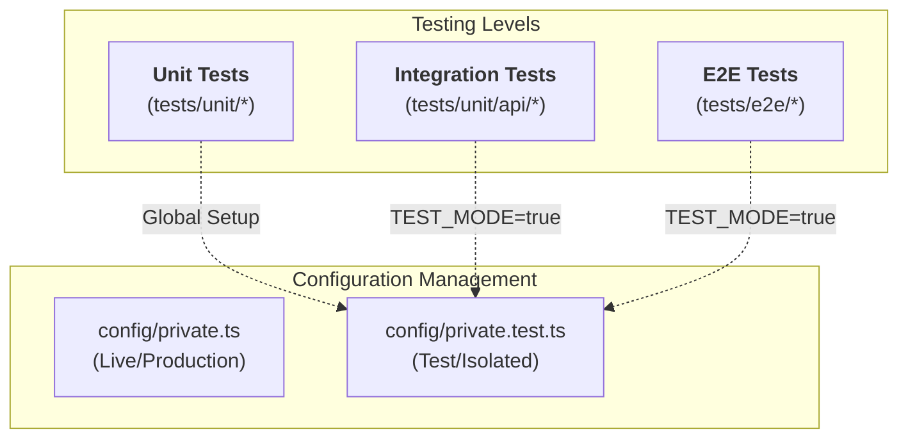

# SveltyCMS Testing Documentation

**Last Updated:** April 3, 2026
**Total Tests:** 1028 (670 unit + 358 integration/E2E)
**Pass Rate:** 100% (All 670 unit tests passing, 0 failing)

## Quick Links

- [Testing Overview & Strategy](./testing-strategy.mdx)
- **[Testing Strategy (White-Box vs Black-Box)](./testing-strategy.mdx)**
- **[Black-Box Testing Architecture](./black-box-testing.mdx)**
- **[E2E Troubleshooting Guide](./e2e-troubleshooting.mdx)** 🚀
- **[Git Workflow & Quality Gate](./git-workflow.mdx)**
- **[Security Testing](./security-testing.mdx)** (Encryption, Auth, Fail-Closed API)
- [Test Status Report](./test-status.mdx)
- [API Coverage Report](./api-testing.mdx)

### Running Tests Locally

```bash
# Run all unit tests (Vitest/jsdom)
bun run test:unit

# Run performance benchmarks
bun run tests/benchmarks/hooks-performance.ts
bun run tests/benchmarks/database-performance.ts sqlite false
bun run tests/benchmarks/media-performance.ts
```

## Test Architecture & Isolation

SveltyCMS employs a strict isolation strategy to ensure tests never touch production data. Standardization on **`127.0.0.1:4173`** for all local testing eliminates IPv6/IPv4 resolution conflicts.


```mermaid
graph TD
    subgraph "Testing Levels"
        Unit["<b>Unit Tests</b><br/>(tests/unit/*)"]
        Int["<b>Integration Tests</b><br/>(tests/unit/api/*)"]
        E2E["<b>E2E Tests</b><br/>(tests/e2e/*)"]
    end

    subgraph "Configuration Management"
        PC["config/private.ts<br/>(Live/Production)"]
        PT["config/private.test.ts<br/>(Test/Isolated)"]
    end

    Unit -.-> |Global Setup| PT
    Int -.-> |TEST_MODE=true| PT
    E2E -.-> |TEST_MODE=true| PT
```

---

## Test Frameworks Overview

- **Purpose**: Fast validation of business logic, services, and API endpoints.
- **Location**: `tests/unit/`
- **Test Count**: 670 tests (consolidated for performance)
- **Execution Time**: ~8 seconds

**What It Tests**:

- ✅ **Middleware Hooks**: 71% latency reduction and fast-path short-circuits.
- ✅ **Database System**: Unified adapter logic with micro-telemetry verification.
- ✅ **Secure Preview**: Signed HMAC-SHA256 handshake tokens and expiration logic.
- ✅ **Audit Logging**: Non-blocking mutation interceptor with duration tracking.
- ✅ **Fail-Closed API Security**: Granular authorization gatekeeper for the dispatcher.
- ✅ **Environment Parity**: jsdom (Vitest) for component logic + Native (Bun) for core utilities.

### 🚀 Performance Benchmarks

- **Hooks Benchmark**: Measures micro-latency of the middleware chain (target < 0.6ms).
- **Database Benchmark**: Measures CRUD micro-latency and telemetry integrity.
- **Media Benchmark**: Measures upload block-time reduction via async job queue (target 99%+ reduction).

### 🎭 Playwright - End-to-End Tests

- **Purpose**: Browser automation for critical user journeys.
- **Location**: `tests/e2e/`
- **Test Count**: ~40 tests

---

## Test Status & Coverage

**Current Status (April 3, 2026)**

| Category          | Passing  | Failing | Skipped | Total    |
| ----------------- | -------- | ------- | ------- | -------- |
| Unit Tests        | 670      | 0       | 0       | 670      |
| Integration Tests | 318      | 0       | 0       | 318      |
| E2E Tests         | 40       | 0       | 0       | 40       |
| **TOTAL**         | **1028** | **0**   | **0**   | **1028** |

## Related Documentation

- [Architecture Overview](/docs/architecture)
- [API Documentation](/docs/api)
- [Contributing Guide](/docs/contributing)
- [Development Setup](/docs/development)
