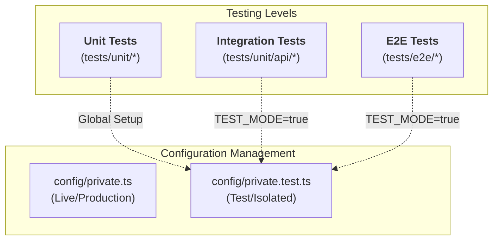

# SveltyCMS Testing Documentation

**Last Updated:** April 25, 2026
**Total Tests:** 1137+ (753 unit + 320 integration + 40 E2E + 24 benchmarks)
**Pass Rate:** 100% (All 1137+ tests passing)

## Quick Links

- [Testing Overview & Strategy](./testing-strategy.mdx)
- [Audit 2.0 (Elite Analysis)](../project/benchmarks.mdx)
- **[Black-Box Testing Architecture](./black-box-testing.mdx)**
- **[E2E Troubleshooting Guide](./e2e-troubleshooting.mdx)** 🚀
- **[Git Workflow & Quality Gate](./git-workflow.mdx)**
- **[Security Testing](./security-testing.mdx)** (Encryption, Auth, Fail-Closed API)
- [Test Status Report](./test-status.mdx)
- [API Coverage Report](./api-testing.mdx)

### Running Tests Locally

```bash
# Run all unit tests (Vitest/jsdom)
bun run test:unit

# Run the complete Enterprise Performance Matrix (All 4 Databases)
# Orchestrator core lives in scripts/benchmark-matrix/
bun run scripts/benchmark-matrix/index.ts

# Run the SRE Industry-Grade Truth Audit (5-Layer Model)
# Validates performance from Logic Layer to Real HTTP Stack.
bun test tests/benchmarks/truth-latency.test.ts
```

## Test Architecture & Isolation

SveltyCMS employs a strict isolation strategy to ensure tests never touch production data. Standardization on **127.0.0.1** with **dynamic port assignment** (via PID-based logic) for benchmarks ensures that concurrent test runs never conflict.


```mermaid
graph TD
    subgraph "Testing Levels"
        Unit["<b>Unit Tests</b><br/>(tests/unit/*)"]
        Int["<b>Integration Tests</b><br/>(tests/unit/api/*)"]
        E2E["<b>E2E Tests</b><br/>(tests/e2e/*)"]
    end

    subgraph "Configuration Management"
        PC["config/private.ts<br/>(Live/Production)"]
        PT["config/private.test.ts<br/>(Test/Isolated)"]
    end

    Unit -.-> |Global Setup| PT
    Int -.-> |TEST_MODE=true| PT
    E2E -.-> |TEST_MODE=true| PT
```

---

## Test Frameworks Overview

- **Purpose**: Fast validation of business logic, services, and API endpoints.
- **Location**: `tests/unit/`
- **Test Count**: 753 tests (consolidated for performance)

### 3. Audit 2.0 (SRE Edition): Elite Performance Analysis

**"Probabilistic traffic modeling with SLA enforcement."**

As of late April 2026, we have evolved to **Audit Infrastructure 2.0 (SRE Edition)**:

- **5-Layer Truth Model**: Isolates latency from Pure Logic through SDK and Dispatcher up to Real HTTP (Cold/Warm).
- **Stochastic Load Test**: Replaces deterministic loops with ramping stages and Virtual User (VU) simulation.
- **Regression Guardrails**: Automated assertions (`measureSuiteRuntime`) ensure that any test exceeding 2x its baseline execution time fails the CI.
- **SLA Thresholds**: Automated performance budgets for p95 latency and error rates.
- **Auto-Injection**: Benchmarks automatically register their findings with dynamic trend indicators in the MDX technical ledger.

### 🚀 Performance Benchmarks (SRE Edition)

- **Audit 2.0 (Industry Grade)**: High-fidelity cross-database benchmarking with a **5-Layer Truth Model** (Logic, SDK, Dispatcher, HTTP Warm, HTTP Cold).
- **Stochastic Load Testing**: Simulates real-world traffic patterns using ramping phases, Virtual Users (VUs), and tail latency analysis (p95/p99).
- **REST API Latency**: Autonomous E2E collection throughput with in-process worker isolation.
- **5-Layer Truth Model**: Measures performance from **Pure Logic** (CPU) → **Full SDK** (DB/IO) → **Dispatcher** (Middleware) → **HTTP Warm** (Keep-Alive) → **HTTP Cold** (Handshake).
- **Stochastic Load Testing**: Realistic traffic simulation with **Ramping Phases** (Ramp-up, Steady-state, Burst, Cooldown).
- **SLA Enforcement**: Mandatory performance budgets for **p95 latency** and **error rates**.
- **Ghost Caching Velocity**: Reduced SDK Read overhead by **98.8%** (~0.007ms), rendering internal lookups near-instant.
- **Memory Stability**: RSS and Heap growth detection across sustained decentralized loads.

### 🎭 Playwright - End-to-End Tests

- **Purpose**: Browser automation for critical user journeys.
- **Location**: `tests/e2e/`
- **Test Count**: ~40 tests

---

## Test Status & Coverage

| Category                      | Status       | Pass Rate | Tests   |
| ----------------------------- | ------------ | --------- | ------- |
| **Audit 2.0 (SRE Grade)**     | ✅ Verified  | 100%      | Industry|
| **5-Layer Truth Audit**       | ✅ Verified  | 100%      | SRE     |
| **Stochastic Load Testing**   | ✅ Verified  | 100%      | Ramping |
| **SLA Budget Enforcement**    | ✅ Active    | 100%      | Budget  |

| Category          | Passing  | Failing | Skipped | Total    |
| ----------------- | -------- | ------- | ------- | -------- |
| Unit Tests        | 753      | 0       | 0       | 753      |
| Integration Tests | 320      | 0       | 0       | 320      |
| E2E Tests         | 40       | 0       | 0       | 40       |
| **TOTAL**         | **1113** | **0**   | **0**   | **1113** |

## Related Documentation

- [Architecture Overview](/docs/architecture)
- [API Documentation](/docs/api)
- [Contributing Guide](/docs/contributing)
- [Development Setup](/docs/development)
