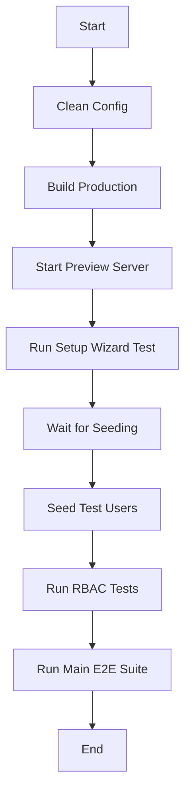

# SveltyCMS Test Architecture

## Overview

This document describes how SveltyCMS testing works, including the complete test lifecycle, user management, and test isolation strategy.

**Last Updated:** January 24, 2026  
**Author:** SveltyCMS Team

---

## Table of Contents

1. [Test Types](#test-types)
2. [Test User Management](#test-user-management)
3. [Test Lifecycle](#test-lifecycle)
4. [GitHub Actions Workflow](#github-actions-workflow)
5. [Configuration Isolation](#configuration-isolation)
6. [Comparison with Existing Documentation](#comparison-with-existing-documentation)
7. [Suggested Improvements](#suggested-improvements)

---

## Test Types

SveltyCMS uses a multi-layered testing approach:

### 1. Unit Tests (⚡ Fast)
- **Framework:** Bun Test
- **Location:** `tests/bun/services`, `tests/bun/utils`, `tests/bun/stores`, `tests/bun/widgets`
- **Count:** ~222 tests
- **Duration:** ~2-5 seconds
- **Dependencies:** None (no server, no database)
- **Purpose:** Test individual functions, services, and utilities in isolation

**Example:**
```bash
bun run test:unit
```

### 2. Integration Tests (🔌 Medium)
- **Framework:** Bun Test
- **Location:** `tests/bun/api`, `tests/bun/databases`, `tests/bun/hooks`
- **Count:** ~50+ tests
- **Duration:** ~15-30 seconds
- **Dependencies:** Running server (port 4173), Database (MongoDB/MariaDB)
- **Purpose:** Test API endpoints, database operations, and middleware hooks

**Example:**
```bash
bun run test:integration
```

### 3. End-to-End Tests (🎭 Slow)
- **Framework:** Playwright
- **Location:** `tests/playwright`
- **Count:** ~10+ tests
- **Duration:** ~2-3 minutes
- **Dependencies:** Running server (port 4173), Database, Browser (Chromium)
- **Purpose:** Test complete user workflows and UI interactions

**Example:**
```bash
bun run test:e2e
```

---

## Test User Management

### Default Users

SveltyCMS creates different users for different test scenarios:

| User | Email | Password | Role | Created By | Purpose |
|------|-------|----------|------|------------|---------|
| **Admin** | `admin@example.com` | `Admin123!` | `admin` | Setup Wizard | Full system access, created during initial setup |
| **Developer** | `developer@example.com` | `Developer123!` | `developer` | Seed Script | API + config access, no user management |
| **Editor** | `editor@example.com` | `Editor123!` | `editor` | Seed Script | Content management only, no settings |

### User Creation Flow

#### 1. Admin User (Setup Wizard)
The admin user is created by the **Setup Wizard** during the first test run:

```typescript
// tests/playwright/setup-wizard.spec.ts
await page.locator('#admin-username').fill('admin');
await page.locator('#admin-email').fill('admin@example.com');
await page.locator('#admin-password').fill('Admin123!');
```

This creates:
- The first user in the system
- Database tables and initial schema
- System configuration file (`config/private.ts`)

#### 2. Developer & Editor Users (Seed Script)
Additional test users are created by the **seed script** after setup completes:

```typescript
// tests/bun/helpers/auth.ts
export async function createTestUsers(): Promise<void> {
  const users = [
    testFixtures.users.admin,      // Admin (may already exist)
    testFixtures.users.developer,  // Developer user
    testFixtures.users.editor      // Editor user
  ];
  
  // Create each user via API
  for (const user of users) {
    await fetch(`${BASE_URL}/api/user/createUser`, {
      method: 'POST',
      body: JSON.stringify({
        email: user.email,
        password: user.password,
        role: user.role,
        username: user.username
      })
    });
  }
}
```

The seed script is called in GitHub Actions:
```yaml
- name: 👥 Seed Test Users
  run: bun run scripts/seed-test-db.ts
  env:
    API_BASE_URL: 'http://localhost:4173'
```

### Test Fixtures

All test user credentials are centralized in `tests/bun/helpers/testSetup.ts`:

```typescript
export const testFixtures = {
  users: {
    admin: {
      username: 'admin',
      email: 'admin@example.com',
      password: 'Admin123!',
      role: 'admin'
    },
    developer: {
      username: 'developer',
      email: 'developer@example.com',
      password: 'Developer123!',
      role: 'developer'
    },
    editor: {
      username: 'editor',
      email: 'editor@example.com',
      password: 'Editor123!',
      role: 'editor'
    }
  }
};
```

---

## Test Lifecycle

### Local Development

1. **Fresh Install** (First Run)
   ```bash
   # 1. Clean state
   rm -rf config/private.ts config/collections
   
   # 2. Start server
   bun run dev
   
   # 3. Run setup wizard test
   bunx playwright test tests/playwright/setup-wizard.spec.ts
   
   # 4. Seed additional users
   bun run scripts/seed-test-db.ts
   
   # 5. Run full test suite
   bunx playwright test
   ```

2. **Subsequent Runs** (System Already Configured)
   ```bash
   # Server already configured, just run tests
   bun run test:e2e
   ```

### GitHub Actions (CI/CD)

The CI workflow follows this sequence:



#### Detailed Workflow Steps

1. **Clean Config**
   ```yaml
   - name: Clean config
     run: |
       rm -rf config/collections
       rm -f config/private.ts
   ```
   Ensures fresh install state

2. **Build Production**
   ```yaml
   - name: Build Production
     run: bun run build
   ```
   Creates optimized production build

3. **Start Preview Server**
   ```yaml
   - name: Start Preview Server
     run: |
       nohup bun run preview > preview-e2e.log 2>&1 &
       bun x wait-on http://localhost:4173
   ```
   Starts server in background

4. **Run Setup Wizard Test**
   ```yaml
   - name: 🧙‍♂️ Run Setup Wizard Test (Seeds DB)
     run: bunx playwright test tests/playwright/setup-wizard.spec.ts
   ```
   - Creates database connection
   - Creates admin user
   - Seeds initial data

5. **Wait for Seeding**
   ```yaml
   - name: ⏳ Wait for Seeding
     run: |
       for i in {1..30}; do
         STATUS=$(curl -s http://localhost:4173/api/setup/status)
         IS_SEEDING=$(echo $STATUS | jq -r '.isSeeding // true')
         if [ "$IS_SEEDING" = "false" ]; then
           break
         fi
         sleep 2
       done
   ```
   Waits for async seeding to complete

6. **Seed Test Users**
   ```yaml
   - name: 👥 Seed Test Users
     run: bun run scripts/seed-test-db.ts
   ```
   Creates developer and editor users

7. **Run RBAC Tests**
   ```yaml
   - name: 🔐 Run RBAC Tests
     run: bunx playwright test tests/playwright/role-based-access.spec.ts
   ```
   Tests role-based permissions

8. **Run Main E2E Suite**
   ```yaml
   - name: 🧪 Run Main E2E Suite
     run: bunx playwright test --grep-invert "setup-wizard|role-based"
   ```
   Runs remaining E2E tests

---

## Configuration Isolation

### Production vs Test Configuration

SveltyCMS uses different configuration files for production and testing:

| Environment | Config File | Purpose | Safety |
|-------------|-------------|---------|--------|
| **Production** | `config/private.ts` | Real database connection | Never touched by tests |
| **Test** | `config/private.test.ts` | Test database connection | Auto-generated, disposable |

### Vite Alias Resolution

The system uses a Vite alias to automatically load the correct config:

```typescript
// vite.config.ts
resolve: {
  alias: {
    '@config/private': process.env.TEST_MODE === 'true'
      ? path.resolve(__dirname, 'config/private.test.ts')
      : path.resolve(__dirname, 'config/private.ts')
  }
}
```

### Environment Variables

| Variable | Purpose | Example |
|----------|---------|---------|
| `TEST_MODE` | Enables test mode | `true` |
| `API_BASE_URL` | Server URL for tests | `http://localhost:4173` |
| `DB_TYPE` | Database type | `mongodb`, `mariadb` |
| `DB_HOST` | Database host | `localhost` |
| `DB_PORT` | Database port | `27017`, `3306` |
| `DB_NAME` | Database name | `sveltycms_test` |
| `DB_USER` | Database user | `admin`, `testuser` |
| `DB_PASSWORD` | Database password | `admin`, `testpass` |

### Safety Mechanisms

1. **Test Mode Check**
   ```typescript
   if (process.env.TEST_MODE !== 'true') {
     throw new Error('Cannot run tests without TEST_MODE=true');
   }
   ```

2. **Database Name Check**
   ```typescript
   if (!dbName.includes('test')) {
     throw new Error('Database name must contain "test"');
   }
   ```

3. **Auto-cleanup**
   ```typescript
   // Clean up after tests
   await cleanupTestDatabase();
   await fs.unlink('config/private.ts');
   await fs.unlink('config/private.test.ts');
   ```

---

## Comparison with Existing Documentation

### What's Already Documented

The existing documentation (`docs/testing.mdx`, `docs/tests/index.mdx`) covers:

✅ **Test Types** - Unit, Integration, E2E  
✅ **Test Frameworks** - Bun, Playwright  
✅ **Running Tests** - Commands and scripts  
✅ **Test Coverage** - Current status and counts  
✅ **Best Practices** - Writing and organizing tests  
✅ **Troubleshooting** - Common issues and fixes  

### What Was Missing (Now Added)

This document adds critical information that was missing:

🆕 **Test User Management** - How admin, developer, and editor users are created  
🆕 **Test Lifecycle** - Step-by-step flow from fresh install to test execution  
🆕 **GitHub Actions Workflow** - Detailed CI/CD test orchestration  
🆕 **Configuration Isolation** - How test config is separated from production  
🆕 **User Creation Flow** - Diagram and explanation of when each user is created  

### Relationship to Other Docs

- **`docs/testing.mdx`** - High-level overview, should link to this document
- **`docs/tests/index.mdx`** - Test catalog, should reference this for architecture
- **`docs/tests/e2e-testing-guide.mdx`** - Playwright-specific, complements this doc
- **`docs/tests/test-status.mdx`** - Current status, separate concern

---

## Suggested Improvements

### 1. Improve Test User Creation

**Current Issue:** Test users are created in a separate seed script that runs after setup wizard, which can cause race conditions.

**Suggestion:** Create a unified seeding approach:

```typescript
// Proposed: tests/bun/helpers/setupComplete.ts
export async function completeTestSetup() {
  // 1. Run setup wizard
  await runSetupWizard();
  
  // 2. Wait for seeding
  await waitForSeeding();
  
  // 3. Create additional test users
  await createTestUsers();
  
  // 4. Verify all users exist
  await verifyTestUsers();
}
```

### 2. Add Test User Verification

**Current Issue:** Tests fail silently if users don't exist.

**Suggestion:** Add a verification step before running RBAC tests:

```yaml
- name: ✅ Verify Test Users
  run: |
    curl -f http://localhost:4173/api/user/login \
      -d '{"email":"developer@example.com","password":"Developer123!"}' \
      -H "Content-Type: application/json" || \
      (echo "❌ Developer user not found!" && exit 1)
```

### 3. Improve Configuration Management

**Current Issue:** Multiple config files can get out of sync.

**Suggestion:** Use environment variables exclusively in tests:

```typescript
// Instead of creating config/private.test.ts, use ENV vars
const dbConfig = {
  type: process.env.DB_TYPE,
  host: process.env.DB_HOST,
  // ... from environment
};
```

### 4. Add Test Data Fixtures

**Current Issue:** Each test creates its own test data.

**Suggestion:** Create reusable test data fixtures:

```typescript
// tests/fixtures/collections.ts
export const testCollections = {
  posts: {
    name: 'Posts',
    fields: [
      { name: 'title', type: 'text' },
      { name: 'content', type: 'richtext' }
    ]
  }
};

// tests/fixtures/users.ts
export const testUsers = {
  admin: { /* ... */ },
  developer: { /* ... */ },
  editor: { /* ... */ }
};
```

### 5. Add Signed-Out User Tests

**Current Issue:** No tests for unauthenticated users.

**Suggestion:** Add a test suite for public/signed-out scenarios:

```typescript
// tests/playwright/public-access.spec.ts
test.describe('Signed Out User Access', () => {
  test('should redirect to login when accessing dashboard', async ({ page }) => {
    await page.goto('/dashboard');
    await expect(page).toHaveURL(/\/login/);
  });
  
  test('should allow access to public API endpoints', async ({ page }) => {
    const response = await page.request.get('/api/public/status');
    expect(response.ok()).toBeTruthy();
  });
  
  test('should block access to protected API endpoints', async ({ page }) => {
    const response = await page.request.get('/api/user/profile');
    expect(response.status()).toBe(401);
  });
});
```

### 6. Add Role Permission Matrix

**Current Issue:** Permissions are scattered across code and tests.

**Suggestion:** Create a central permission matrix:

```typescript
// src/databases/auth/permissionMatrix.ts
export const permissionMatrix = {
  '/config/systemsetting': ['admin', 'developer'],
  '/config/user': ['admin'],
  '/config/accessManagement': ['admin'],
  '/collection': ['admin', 'developer', 'editor'],
  '/api/collections': ['admin', 'developer', 'editor']
};

// Use in tests
test('Developer can access system settings', async ({ page }) => {
  await loginAsDeveloper(page);
  const allowedRoutes = getRoutesForRole('developer');
  for (const route of allowedRoutes) {
    await page.goto(route);
    expect(page.url()).toContain(route);
  }
});
```

### 7. Improve Test Isolation

**Current Issue:** Tests can interfere with each other.

**Suggestion:** Add isolation mechanisms:

```typescript
// Use test.beforeEach for isolation
test.beforeEach(async ({ page }) => {
  // Clear cookies
  await page.context().clearCookies();
  
  // Clear localStorage
  await page.evaluate(() => localStorage.clear());
  
  // Reset database to known state
  await resetTestDatabase();
});
```

### 8. Add Performance Benchmarks

**Current Issue:** No performance testing.

**Suggestion:** Add performance benchmarks:

```typescript
// tests/performance/api-benchmarks.test.ts
test('API should respond within 100ms', async () => {
  const start = Date.now();
  const response = await fetch('/api/collections');
  const duration = Date.now() - start;
  
  expect(duration).toBeLessThan(100);
  expect(response.ok()).toBeTruthy();
});
```

---

## Test Strategy Summary

### For Fresh Install Testing

1. ✅ **Start with clean state** - Remove all config files
2. ✅ **Run setup wizard** - Create admin user and database connection
3. ✅ **Seed additional users** - Create developer and editor users
4. ✅ **Run tests** - Execute full test suite

### For Signed-Out User Testing

1. 🆕 **Test public endpoints** - Ensure they're accessible
2. 🆕 **Test protected endpoints** - Ensure they return 401
3. 🆕 **Test login flow** - Ensure users can sign in
4. 🆕 **Test redirects** - Ensure unauthorized access redirects to login

### For Signed-In Admin Testing

1. ✅ **Test full system access** - Admin can access everything
2. ✅ **Test user management** - Admin can create/edit/delete users
3. ✅ **Test system settings** - Admin can modify configuration
4. ✅ **Test API access** - Admin can use all API endpoints

### For Signed-In Developer/Editor Testing

1. ✅ **Test permitted access** - Users can access allowed routes
2. ✅ **Test forbidden access** - Users are blocked from restricted routes
3. ✅ **Test API permissions** - Users can only access permitted endpoints
4. ✅ **Test role-specific features** - Each role has appropriate capabilities

---

## Conclusion

SveltyCMS uses a comprehensive testing strategy that balances speed, reliability, and comprehensive coverage. The test architecture is designed to:

- ✅ **Isolate test data** from production data
- ✅ **Support multiple databases** (MongoDB, MariaDB, PostgreSQL, MySQL)
- ✅ **Test role-based permissions** (Admin, Developer, Editor)
- ✅ **Run efficiently in CI/CD** (GitHub Actions)
- ✅ **Enable fast local development** (Unit tests in ~2 seconds)

By following this architecture and implementing the suggested improvements, we can ensure SveltyCMS remains reliable, secure, and maintainable.
