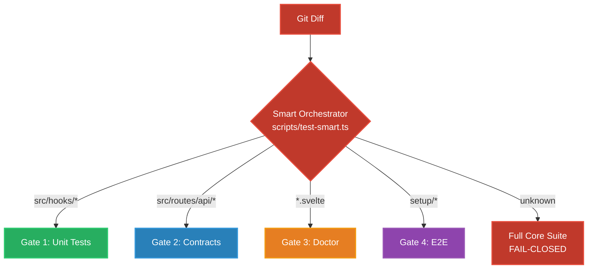

# Testing Strategy: Four-Gate Architecture

SveltyCMS uses a **four-gate testing architecture** enforced by a Smart Test Orchestrator. Every changed file triggers exactly the tests that verify it. Unknown changes fail closed into the full core suite.



## The Four Gates

| Gate             | Trigger                                                         | Tooling                             | Tests What                                            |
| ---------------- | --------------------------------------------------------------- | ----------------------------------- | ----------------------------------------------------- |
| **1 — Unit**     | Touch `src/hooks/`, `src/stores/`, `src/utils/`, `src/widgets/` | Vitest (jsdom)                      | Pure logic, runes, schemas, state machines            |
| **2 — Contract** | Touch `src/routes/api/`, adapters, auth modules                 | Black-box HTTP + `contract.test.ts` | Cross-DB parity, RBAC fail-closed, auth, setup gating |
| **3 — Doctor**   | Touch `*.svelte`, `vite.config.ts`                              | `svelte-check` + `oxlint`           | Type safety, bad Svelte 5 patterns, missing ARIA      |
| **4 — E2E**      | Touch `src/routes/setup/`, `tests/e2e/`                         | Playwright                          | User journeys, keyboard nav, visual flows             |

---

## Canonical Test Harness

All tests use a **single source of truth** for fixtures and contracts:

```
tests/harness/
  fixtures.ts    — Fixed tenants, users, roles, tokens (no Math.random()/Date.now())
  contracts.ts   — AdapterContract, AuthContract, PermissionContract, SetupGatingContract
  index.ts       — Barrel export
```

**Rule**: No test file invents its own tenant ID, user fixture, or mock data. Import from `@tests/harness`.

---

## 1. Contract Tests (Universal Adapter Verification)

**"Prove every database behaves identically."**

File: `tests/integration/databases/contract.test.ts` | Runner: `bun run test:integration`

The Contract Test is the single source of truth for cross-database behavioral parity. It runs the same assertions against whichever adapter is active:

| Contract                | What It Verifies                                                      |
| ----------------------- | --------------------------------------------------------------------- |
| **AdapterContract**     | connect/disconnect, CRUD lifecycle, tenant isolation                  |
| **AuthContract**        | login, bad credentials, session validation, account lockout           |
| **PermissionContract**  | admin access, editor denial, viewer denial, public 401, unknown → 403 |
| **SetupGatingContract** | `/api/setup/*` blocked after setup, `/setup` → `/login` redirect      |
| **ResilienceContract**  | concurrent request handling, valid JSON on all errors                 |

Every adapter (SQLite, MongoDB, PostgreSQL, MariaDB) MUST pass every assertion. If one adapter fails, it's a bug.

---

## 2. White-Box Testing (Unit)

**"Test pure logic knowing how it works."**

Files: `tests/unit/**/*.test.ts` | Runner: `bun run test:unit` | Tests: 1,063 (118 files, 0 failures)

These tests have full access to internal code structure. They're fast (milliseconds), parallelizable, and catch logic regressions immediately.

**Rule**: Every bug fix must add a regression test.

---

## 3. Black-Box Testing (Integration)

**"Test the API as a consumer sees it."**

Runner: `bun run test:integration` | Tests: ~450

Real HTTP requests against a running server. Verifies middleware chain, RBAC enforcement, and DB agnosticism.

---

## 4. E2E Testing (Browser)

**"Test the full user journey in a real browser."**

Files: `tests/e2e/*.spec.ts` | Runner: `npx playwright test` | Scenarios: ~40

---

## Smart Test Orchestrator

```bash
bun run test:smart              # reads git diff, runs only needed suites
bun run test:smart --all        # runs everything
bun run test:smart --list       # previews without executing
bun run test:smart --suite=auth # filters by suite name
```

**Fail-Closed Policy**: If changed files don't match any rule → runs full core suite. Flaky = unstable core. No automatic retries.

### File-to-Suite Mapping

| Changed Files                         | Runs                                 |
| ------------------------------------- | ------------------------------------ |
| `src/hooks/handle-authentication.ts`  | Auth & Security unit tests           |
| `src/routes/api/[...path]/+server.ts` | Authorization & RBAC unit tests      |
| `src/databases/**/*.ts`               | Full adapter contract matrix         |
| `src/widgets/**/*.ts`                 | Widget unit + schema + accessibility |
| `src/**/*.svelte`                     | Svelte Doctor (check + lint)         |
| `src/routes/setup/**`                 | E2E Setup Wizard                     |
| Unknown/untracked                     | Full core suite (fail-closed)        |

---

## Layer Selection Guide

| If you're testing...                      | Use this layer                                  |
| ----------------------------------------- | ----------------------------------------------- |
| Cross-database adapter parity             | Contract — `contract.test.ts` against all 4 DBs |
| A validation schema (Valibot)             | Unit — `safeParse()` with edge cases            |
| An API endpoint returning JSON            | Integration — real HTTP, real DB                |
| Whether an editor can access admin routes | Integration — RBAC through real middleware      |
| The setup wizard flow                     | E2E — Playwright fills real forms               |
| Keyboard tab order through a modal        | E2E — `page.keyboard.press("Tab")`              |

---

## Related Documentation

- [Test Status Report](./test-status.mdx)
- [Utility Test Coverage](./utility-test-coverage.mdx)
- [API Testing](./api-testing.mdx)
- [E2E Testing Guide](./e2e-testing-guide.mdx)
- [Black-Box Testing Architecture](./black-box-testing.mdx)
