# Widget System Architecture

This document serves as the technical reference for the SveltyCMS Widget System. It details the internal mechanisms that enable type safety, runtime extensibility, and performance.

## 🏗️ System Overview

The architecture is composed of four main subsystems:

1.  **Factory System**: Standardized widget creation and typing.
2.  **Store Management**: State management, discovery, and access control.
3.  **Database Layer**: Persistent configuration and tenant isolation.
4.  **Runtime Discovery**: Zero-downtime loading of marketplace widgets.

```mermaid
graph TB
    subgraph "Widget Factory System"
        WF[widget/factory.ts<br/>createWidget()]
        WT[widget/types.ts<br/>Type Definitions]
    end

    subgraph "Widget Store Management"
        WS[widgetStore.svelte.ts<br/>State Management]
        WD[widgetDiscovery.ts<br/>Filesystem Scanner]
    end

    subgraph "Runtime System"
        CR[Collection Runtime<br/>Field Instances]
        MW[MissingWidget.svelte<br/>Fallback Handler]
    end

    WF --> WS
    WD --> WS
    WS --> CR
    CR --> MW

    style WF fill:#e1f5fe
    style WS fill:#f3e5f5
    style CR fill:#e8f5e8
```

---

## 🏭 Widget Factory System

The `createWidget` function is the core of the system. It enforces the 3-Pillar structure and generates the necessary TypeSafety for consumers.

```typescript
// src/widgets/widgetFactory.ts
export function createWidget<TProps extends WidgetProps>(config: WidgetConfig<TProps>) {
	// 1. Create immutable widget definition
	const widgetDefinition: WidgetDefinition = {
		widgetId: config.Name,
		Name: config.Name
		// ... paths and schema
	};

	// 2. Return factory function for field instances
	const widgetFactory = (fieldConfig: FieldConfig<TProps>): FieldInstance => {
		return {
			widget: widgetDefinition,
			...config.defaults,
			...fieldConfig
		};
	};

	return widgetFactory;
}
```

---

## 🧩 Runtime Discovery & The 3-Layer System

SveltyCMS implements a **three-layer discovery system** to support zero-downtime marketplace installations while maintaining performance.

### The Layers


1.  **Core Widgets**: Imported via `import.meta.glob('../widgets/core/*/index.ts', { eager: true })`. Always present.
2.  **Custom Widgets**: Imported via `import.meta.glob('../widgets/custom/*/index.ts', { eager: true })`. Can be toggled.
3.  **Marketplace Widgets**: Scanned using `fs.readdir` at server startup and imported dynamically using `import(/* @vite-ignore */ path)`. This bypasses the bundler, allowing new files to be added without a rebuild.

### Cache Invalidation & Health

When widgets change state (install/enable/disable), the system automatically ensures consistency:

```typescript
// src/stores/widgetStore.svelte.ts
async updateStatus(widgetName, status) {
    // 1. Update DB & Memory

    // 2. Auto-invalidate affected caches
    await cacheService.clearByPattern('query:collections:*');
    await cacheService.clearByPattern('api:widgets:*');

    // 3. Health Re-check
    const validation = await validateCollections(currentActive);
    if (!validation.isValid) {
        updateServiceHealth('widgets', 'unhealthy', ...);
    }
}
```

---

## 🔄 Data Flow & Lifecycle diagrams

### Widget Lifecycle

```mermaid
sequencer
    participant FS as Filesystem
    participant WD as Widget Discovery
    participant WS as Widget Store
    participant DB as Database
    participant UI as User Interface

    FS->>WD: Scan widgets on startup
    WD->>DB: Compare with stored config
    WD->>WS: Load active widgets
    WS->>UI: Populate widget list
    UI->>WS: Enable/disable widgets
    WS->>DB: Persist changes
```

### Multilingual Data Flow

SveltyCMS uses a dual-language system (`systemLanguage` for UI, `contentLanguage` for data).

```mermaid
sequenceDiagram
    participant User
    participant Input as Input Component
    participant Store as app Singleton
    participant Widget as Widget Logic
    participant DB as Database

    User->>Store: Switch language (en → de)
    Store->>Input: Language change notification
    Input->>Widget: Access value[_language]
    Widget-->>Input: "Guten Tag" (German value)

    User->>Input: Edit text
    Input->>Widget: updateValue({...value, de: "Neuer Text"})
    Widget->>DB: Save multilingual object
```



---

## 🗄️ Database Integration

Widgets configuration is stored in the `widgets` table, while content is stored in the `collections` data (NoSQL-style or Relational depending on adapter).

```sql
CREATE TABLE widgets (
  id INTEGER PRIMARY KEY,
  name VARCHAR(255) UNIQUE NOT NULL,
  widget_type ENUM('core', 'custom'),
  is_active BOOLEAN DEFAULT true,
  tenant_id VARCHAR(255),
  configuration JSON
);
```

### Multi-Tenant Isolation

- **Core Widgets**: Global, always active.
- **Custom/Marketplace Widgets**: Tenant-specific. Tenant A can have `SEO` enabled while Tenant B has it disabled.
- **Discovery**: The `widgetStore` initializes with a `tenantId`, filtering the active list accordingly.

---

## 🚀 Performance Optimizations

1.  **Code Splitting**: Custom and Marketplace widgets are lazy-loaded chunks.
2.  **LRU Caching**: Widget instances are cached to avoid factory overhead.
3.  **Memory Management**: Unused widget components are garbage collected when not in view.
4.  **Batch Loading**: The `modifyRequestBatch` API allows widgets to aggregate data fetching (e.g., Relation widgets fetching multiple IDs in one query).
