# Widget System Documentation

Welcome to the comprehensive SveltyCMS widget system documentation. The widget system is built on a modern **3-Pillar Architecture** providing type safety, performance optimization, and developer-friendly patterns.

## 📚 Documentation Structure

### Core Documentation



```mermaid
graph TD
    INDEX[📚 Widget System Index<br/>You are here]

    VISUAL[📊 Visual Overview<br/>Mermaid diagrams & flows]
    OVERVIEW[🏗️ Widget System Overview<br/>High-level concepts & features]
    ARCH[⚙️ Widget Architecture<br/>Technical implementation]
    DEV[👨‍💻 Development Guide<br/>Creating custom widgets]

    INDEX --> VISUAL
    INDEX --> OVERVIEW
    INDEX --> ARCH
    INDEX --> DEV

    style INDEX fill:#e1f5fe
    style VISUAL fill:#ffeb3b,color:#000
    style OVERVIEW fill:#f3e5f5
    style ARCH fill:#fff8e1
    style DEV fill:#e8f5e8
```

### 0. [Visual Overview](/docs/widgets/widget-system-visual-overview.mdx) ⭐

**Visual guide** with comprehensive Mermaid diagrams explaining the entire system.

**Covers:**

- 🎯 Complete system flow diagrams
- 🏗️ 3-Pillar architecture deep dive
- 🔄 Widget lifecycle & data flow
- 🏪 Store state management
- 🗄️ Database relationships
- 📊 Performance strategies

**Read this when:** You prefer visual learning or need to understand system interactions.

### 1. [Widget System Overview](/docs/widgets/widget-system-overview.mdx)

**Start here** for understanding the widget system concepts and capabilities.

**Covers:**

- 🏗️ 3-Pillar Architecture (Definition, Input, Display)
- 🎯 Widget types (Core vs Custom)
- 🔄 System features and lifecycle
- 📁 Directory structure
- 🚀 Performance optimizations

**Read this when:** You're new to the widget system or need a high-level understanding.

### 2. [Widget Architecture](/docs/widgets/widget-architecture.mdx)

**Technical deep-dive** into the widget system implementation.

**Covers:**

- 🏭 Widget Factory System
- 🏪 Widget Store Management
- 🗄️ Database Integration
- 🔧 Runtime Implementation
- 🛡️ Type Safety
- 📊 Performance Optimizations
- 🚀 **Batch Data Loading** (New `modifyRequestBatch` API)

**Read this when:** You need to understand how the system works internally or debug issues.

### 3. [Development Guide](/docs/widgets/widget-development-guide.mdx)

**Practical tutorial** for creating and customizing widgets.

**Covers:**

- 🚀 Quick start tutorial
- 📝 Step-by-step widget creation
- 🔧 Advanced features
- 🧪 Testing strategies
- 📦 Widget management
- 🚀 Deployment best practices

**Read this when:** You want to create custom widgets or modify existing ones.

### 4. [Widget Security](/docs/security/widget-security.mdx)

**Comprehensive security guide** for widget development and implementation.

**Covers:**

- 🛡️ XSS prevention techniques
- 🔒 Injection attack protection
- 📁 File upload validation
- 🌐 SSRF prevention
- 🔐 IDOR protection
- ✅ Input sanitization patterns
- 🧪 Security testing

**Read this when:** You need to understand or implement widget security measures.

### 5. [Multilingual Widget Guide](/docs/widgets/widget-multilingual-guide.mdx)

**Complete guide** to building multilingual widgets.

**Covers:**

- 🌍 Translation architecture
- 🔄 Language-aware components
- 💾 Database storage patterns
- 🎯 Content vs system languages
- ✅ Best practices

**Read this when:** You're building widgets that need translation support.

## 🎯 Quick Navigation

### For Different Roles


### By Task

| I want to...                   | Read this                                                            | Section                |
| ------------------------------ | -------------------------------------------------------------------- | ---------------------- |
| Understand widget concepts     | [System Overview](/docs/widgets/widget-system-overview.mdx)          | Core Concepts          |
| Use widgets in collections     | [System Overview](/docs/widgets/widget-system-overview.mdx)          | Quick Start            |
| Create a custom widget         | [Development Guide](/docs/widgets/widget-development-guide.mdx)      | Step-by-Step Tutorial  |
| Understand the factory pattern | [Architecture](/docs/widgets/widget-architecture.mdx)                | Factory System         |
| Debug widget issues            | [Architecture](/docs/widgets/widget-architecture.mdx)                | Runtime Implementation |
| Configure widget validation    | [Development Guide](/docs/widgets/widget-development-guide.mdx)      | Advanced Features      |
| Enable/disable widgets         | [System Overview](/docs/widgets/widget-system-overview.mdx)          | Widget Management      |
| Optimize widget performance    | [Architecture](/docs/widgets/widget-architecture.mdx)                | Performance            |
| Implement widget security      | [Widget Security](/docs/security/widget-security.mdx)                | Security Fixes         |
| Add translation support        | [Multilingual Guide](/docs/widgets/widget-multilingual-guide.mdx)    | Translation Patterns   |
| Install widgets at runtime     | [Runtime Discovery](/docs/architecture/runtime-widget-discovery.mdx) | Dynamic Loading        |

## 🚀 Quick Start Examples

### Using Existing Widgets

```typescript
// In a collection schema
import { widgets } from '@src/widgets';

export default {
	fields: [
		widgets.Input({
			label: 'Title',
			required: true,
			maxLength: 100
		}),
		widgets.RichText({
			label: 'Content',
			translated: true
		}),
		widgets.Date({
			label: 'Published Date',
			required: true
		})
	]
};
```

### Creating a Simple Custom Widget

```typescript
// src/widgets/custom/rating/index.ts
import { createWidget } from '@src/widgets/factory';

const RatingWidget = createWidget({
	Name: 'Rating',
	Icon: 'mdi:star',
	Description: 'Star rating widget',
	inputComponentPath: '/src/widgets/custom/rating/Input.svelte',
	displayComponentPath: '/src/widgets/custom/rating/Display.svelte',
	validationSchema: number(),
	defaults: {
		maxRating: 5,
		allowHalfStars: false
	}
});

export default RatingWidget;
```

## 📖 Individual Widget Documentation

Each widget includes its own comprehensive documentation:

### Core Widgets

- **[Input Widget](/src/widgets/core/input/input.mdx)** - Text input with validation
- **[Rich Text Widget](/src/widgets/core/richText/richText.mdx)** - WYSIWYG editor
- **[Date Widget](/src/widgets/core/date/date.mdx)** - Date and time picker
- **[Media Upload Widget](/src/widgets/core/mediaUpload/mediaUpload.mdx)** - File upload
- **[Relation Widget](/src/widgets/core/relation/relation.mdx)** - Entity relationships

### Custom Widgets

- **[SEO Widget](/src/widgets/custom/seo/seo.mdx)** - SEO meta tags and schema
- **[Address Widget](/src/widgets/custom/address/address.mdx)** - Address with geocoding
- **[Currency Widget](/src/widgets/custom/currency/currency.mdx)** - Monetary values
- **[Color Picker Widget](/src/widgets/custom/colorPicker/colorPicker.mdx)** - Color selection

## 🛠️ System Features

### 3-Pillar Architecture

Every widget follows the same architectural pattern:

1. **📋 Definition** (`index.ts`) - Widget configuration and validation
2. **✏️ Input** (`Input.svelte`) - Interactive editing component
3. **👁️ Display** (`Display.svelte`) - Optimized display component

### Key Capabilities

- ✅ **Type Safety** - Full TypeScript support throughout
- 🔄 **Dynamic Loading** - Widgets loaded on-demand for performance
- 🏢 **Multi-Tenant** - Different widget configurations per tenant
- 🔒 **Security** - Permission-based widget access control
- 📚 **Self-Documenting** - Each widget includes MDX documentation
- 🧪 **Testable** - Comprehensive testing support
- 🌍 **Multilingual** - Built-in translation support via `contentLanguage` for all text-based widgets

### Multilingual Widget Support

SveltyCMS widgets support multilingual content through the `translated` field property:

**Enable Translation:**

```typescript
// Collection field configuration
{
  widget: 'input',
  label: 'Article Title',
  db_fieldName: 'title',
  translated: true,  // ← Enables multilingual support
  required: true
}
```

**Data Storage Format:**

```typescript
// Database-agnostic format (MongoDB nested, SQL relational)
{
  "title": {
    "en": "Hello World",
    "de": "Hallo Welt",
    "fr": "Bonjour le monde"
  }
}
```

**Supported Widgets:**

| Widget Type | Multilingual   | Use Case                                  |
| ----------- | -------------- | ----------------------------------------- |
| input       | ✅ Yes         | Text content per language                 |
| richText    | ✅ Yes         | Rich HTML content per language            |
| email       | ✅ Yes         | Localized email templates                 |
| phoneNumber | ✅ Yes         | International phone with localized labels |
| number      | ✅ Yes         | Localized number formatting               |
| seo         | ✅ Yes         | SEO metadata per language                 |
| relation    | ✅ Conditional | Display fields translated                 |
| megaMenu    | ✅ Yes         | Menu structure per language               |

**Learn More:**

- [Language Architecture](/docs/architecture/language-architecture.mdx) - Complete multilingual system guide
- [Widget Architecture - Multilingual Section](/docs/widgets/widget-architecture.mdx#multilingual-widget-architecture) - Implementation patterns
- [Widget Development Guide - Translation Support](/docs/widgets/widget-development-guide.mdx#translation-support) - Building translatable widgets

## 🔗 Related Documentation

### API References

- **[Widget API](/docs/api/Widget_API.mdx)** - REST API endpoints
- **[Collection API](/docs/api/Collection_API.mdx)** - Collection management
- **[GraphQL API](/docs/api/GraphQL_API.mdx)** - GraphQL schema generation

### Architecture Guides

- **[Runtime Widget Discovery](/docs/architecture/runtime-widget-discovery.mdx)** - Zero-downtime widget installation
- **[Validation Instant Feedback](/docs/architecture/validation-instant-feedback.mdx)** - Smart validation system
- **[Collection Store Dataflow](/docs/architecture/collection-store-dataflow.mdx)** - Data flow patterns
- **[Database Methods](/docs/architecture/database-methods.mdx)** - Database operations
- **[Code Structure](/docs/architecture/code-structure.mdx)** - Overall codebase structure
- **[Language Architecture](/docs/architecture/language-architecture.mdx)** - Multilingual system

### Security Documentation

- **[Widget Security](/docs/security/widget-security.mdx)** - Comprehensive widget security guide
- **[Security Overview](/docs/security/index.mdx)** - System-wide security measures
- **[Authentication System](/docs/architecture/authentication-system.mdx)** - User authentication
- **[Cryptography Module](/docs/architecture/cryptography-module.mdx)** - Encryption and hashing

### Development Resources

- **[Widget Test Coverage](/docs/tests/widget-test-coverage.mdx)** - Testing documentation
- **[Contributing Guide](/docs/contributing/contributing-docs.mdx)** - Contributing to widgets

---

## 🧪 Testing

### Widget Test Coverage

SveltyCMS includes comprehensive testing for all widgets:

- **✅ 359+ Tests**: Covering core widgets, custom widgets, and factory architecture
- **✅ 86% Coverage**: Complete widget system code coverage
- **✅ Type Safety**: Full TypeScript validation testing
- **✅ Multilingual**: Translation support testing
- **✅ Database**: Aggregation and query testing

**Test Suite Breakdown**:

| Category           | Tests | Status        | Coverage                               |
| ------------------ | ----- | ------------- | -------------------------------------- |
| Core Widgets (10)  | 150+  | ✅ Created    | Validation, multilingual, aggregations |
| Custom Widgets (9) | 120+  | ✅ Created    | Email, SEO, Phone, Number, Currency    |
| Widget System      | 60+   | ✅ 35 Passing | Factory, types, schemas                |
| Architecture       | 16    | ✅ 100%       | Modern factory pattern                 |

### Run Widget Tests

```bash
# All widget tests
bun test tests/bun/widgets/

# Specific test files
bun test tests/bun/widgets/core-widgets.test.ts
bun test tests/bun/widgets/custom-widgets.test.ts
bun test tests/bun/widgets/widget-system.test.ts

# With coverage
bun test --coverage tests/bun/widgets/
```

### Test Documentation

For complete testing documentation, patterns, and best practices:

📚 **[Widget Test Coverage Documentation](/docs/tests/widget-test-coverage.mdx)**

Includes:

- Detailed test results by widget
- Test patterns and best practices
- Running tests and debugging
- CI/CD integration
- Performance benchmarks
- Known issues and solutions

## 🎯 Next Steps

1. **New to widgets?** Start with [Widget System Overview](/docs/widgets/widget-system-overview.mdx)
2. **Want to create widgets?** Follow the [Development Guide](/docs/widgets/widget-development-guide.mdx)
3. **Need technical details?** Dive into [Widget Architecture](/docs/widgets/widget-architecture.mdx)
4. **Testing widgets?** Check [Widget Test Coverage](/docs/tests/widget-test-coverage.mdx)
5. **Looking for specific widgets?** Browse the individual widget documentation above

- **Structure**: group, repeater

#### Custom Widgets (Optional)

Located in `src/widgets/custom/`:

- **Forms & Input**: colorPicker, rating, currency
- **SEO**: seo, metadata
- **Advanced**: phoneNumber, address
- **E-commerce**: product, pricing (marketplace)
- **Social**: socialShare, embedder (marketplace)

## 📚 Documentation

### Core Documentation

- **[Widget Management System](./Widget_Management_System.mdx)**
  - 3-pillar architecture details
  - Widget lifecycle and dependencies
  - Multi-tenant configuration
  - API endpoints

- **[Widget Marketplace System](./Widget_Marketplace_System.mdx)**
  - Marketplace integration
  - Widget discovery and installation
  - Payment and licensing
  - Community features

- **[Widget Management Enhancement](./Widget_Management_Enhancement.md)**
  - Recent improvements
  - Enhanced dashboard features
  - Migration guide

## 🎯 Quick Start

### Using Widgets

```typescript
// In collection schema
import { widgets } from '@widgets';

export default {
	fields: [
		widgets.Input({
			label: 'Title',
			inputType: 'text',
			required: true
		}),
		widgets.RichText({
			label: 'Content',
			toolbar: 'full'
		}),
		widgets.MediaUpload({
			label: 'Featured Image',
			accept: 'image/*'
		})
	]
};
```

### Creating Widgets

```typescript
// src/widgets/custom/myWidget/index.ts
import { createWidget } from '@widgets/factory';
import * as v from 'valibot';

export default createWidget({
	Name: 'MyWidget',
	Icon: 'mdi:puzzle-plus',
	Description: 'Custom widget with 3-pillar architecture',

	// 3-Pillar paths
	inputComponentPath: '/src/widgets/custom/myWidget/Input.svelte',
	displayComponentPath: '/src/widgets/custom/myWidget/Display.svelte',

	// Validation
	validationSchema: v.object({
		value: v.string([v.minLength(1)])
	}),

	// Defaults
	defaults: {
		value: ''
	}
});
```

## 🖥️ Management Interface

Access widget management at `/config/widgetManagement`:

### Features

- **📊 Statistics Dashboard**: Real-time metrics
- **🔍 Search & Filter**: Quick widget discovery
- **📋 2-Column Layout**: Professional grid (desktop)
- **🏪 Marketplace Tab**: Browse and install widgets
- **🎯 3-Pillar Visibility**: See component implementation status
- **⚙️ Quick Actions**: One-click activation/deactivation

### Statistics Explained

- **Total Widgets**: All registered widgets (core + custom)
- **Active**: Currently enabled and usable in collections
- **Core**: Essential widgets (cannot be disabled)
- **Custom**: Optional widgets (can be toggled)
- **Input**: Widgets with Input component (editing capability)
- **Display**: Widgets with Display component (viewing capability)

## 🔧 Widget Store API

### Key Functions

```typescript
import { widgetStoreActions, isWidgetActive, canDisableWidget, getWidgetDependencies } from '@stores/widgetStore.svelte';

// Initialize widgets
await widgetStoreActions.initializeWidgets('tenant-id');

// Check status
const isActive = isWidgetActive('SEO');
const canDisable = canDisableWidget('SEO');
const deps = getWidgetDependencies('SEO');

// Update status
await widgetStoreActions.updateWidgetStatus('SEO', 'active', 'tenant-id');
```

## 📦 File Structure

```
src/
├── widgets/
│   ├── core/                    # Core widgets
│   │   ├── input/
│   │   │   ├── index.ts        # Definition
│   │   │   ├── Input.svelte    # Edit component
│   │   │   └── Display.svelte  # View component
│   │   └── ...
│   ├── custom/                  # Custom widgets
│   │   ├── seo/
│   │   │   ├── index.ts
│   │   │   ├── Input.svelte
│   │   │   └── Display.svelte
│   │   └── ...
│   ├── factory.ts               # Widget factory
│   └── types.ts                 # Type definitions
├── stores/
│   └── widgetStore.svelte.ts   # Centralized state
└── routes/
    └── (app)/config/widgetManagement/
        ├── +page.svelte
        ├── +page.server.ts
        ├── WidgetDashboardEnhanced.svelte
        └── WidgetCard.svelte
```

## 🔐 Security & Permissions

### Permission Levels

- **`config:widgetManagement`** - View widget management
- **`config:widgetInstall`** - Install widgets
- **`config:widgetUninstall`** - Uninstall widgets
- **`config:widgetActivate`** - Activate/deactivate widgets
- **`config:marketplace`** - Access marketplace

### Multi-Tenant Isolation

- Each tenant has separate widget configurations
- Core widgets are always active for all tenants
- Custom widgets are tenant-specific
- Database stores per-tenant widget states

## 📋 Security Checklist

Use this checklist when creating new widgets:

### Input Validation

- [ ] MIME type whitelist (file widgets)
- [ ] File size limits (upload widgets)
- [ ] Extension validation (file widgets)
- [ ] Path traversal prevention
- [ ] Input length limits (text widgets)
- [ ] Format validation (email, phone, URL)
- [ ] Regex pattern validation
- [ ] Whitelist-based validation

### Output Encoding

- [ ] HTML entity escaping
- [ ] CSS value sanitization
- [ ] URL encoding
- [ ] JavaScript string escaping
- [ ] SQL parameterization

### XSS Prevention

- [ ] Use `Sanitize` component for HTML
- [ ] Escape user-generated content
- [ ] Content Security Policy compliance
- [ ] Avoid `{@html}` without sanitization
- [ ] Validate URLs before rendering

### SSRF Prevention

- [ ] URL protocol whitelist (https only)
- [ ] Domain whitelist
- [ ] Block private IPs
- [ ] Block localhost
- [ ] Block cloud metadata endpoints

### IDOR Prevention

- [ ] Tenant ID filtering
- [ ] User ID validation
- [ ] Permission checks
- [ ] Relation validation

### DoS Prevention

- [ ] Input length limits
- [ ] File size limits
- [ ] Rate limiting considerations
- [ ] Regex complexity limits
- [ ] Resource consumption limits

---

## 🚀 Best Practices

### Widget Development

1. **Always implement 3 pillars**: Definition, Input, Display
2. **Use factory pattern**: Leverage `createWidget()` for consistency
3. **Validate with Valibot**: Centralize validation in definition
4. **Document dependencies**: Clearly specify widget dependencies
5. **Test thoroughly**: Unit test each pillar independently

### Widget Management

1. **Regular audits**: Review installed widgets periodically
2. **Monitor dependencies**: Track widget relationships
3. **Security updates**: Keep widgets updated
4. **Usage analysis**: Track which widgets are actively used
5. **Performance**: Monitor impact on system performance

## 🔗 Related Resources

- **[Content Types](../Dev_Guide/05-collections/)** - Using widgets in collections
- **[API Development](../Dev_Guide/04-api/)** - Widget API integration
- **[Testing](../Dev_Guide/15_Testing/)** - Widget testing strategies
- **[Security](../Dev_Guide/14_Security/)** - Widget security considerations

---

The Widget System provides a powerful, extensible foundation for content management in SveltyCMS with modern architecture and professional management tools.
