# Widget System Overview

Welcome to the comprehensive SveltyCMS widget system documentation. The widget system is built on a modern **3-Pillar Architecture** providing type safety, performance optimization, and developer-friendly patterns.

## 📚 Documentation Map

| Guide                                      | Description                                                           |
| :----------------------------------------- | :-------------------------------------------------------------------- |
| **[Architecture](./architecture.mdx)**     | Deep dive into the Factory Pattern, Runtime Discovery, and Data Flow. |
| **[Development Guide](./development.mdx)** | Practical tutorial for building, testing, and translating widgets.    |
| **[Marketplace](./marketplace.mdx)**       | Discovering, installing, and publishing widgets to the ecosystem.     |

---

## 🏗️ Core Concepts

### The 3-Pillar Architecture

Every widget in SveltyCMS follows a strict separation of concerns to ensure maintainability and performance:

```mermaid
graph TB
    subgraph "Widget Structure"
        D[📋 Definition<br/>index.ts]
        I[✏️ Input Component<br/>Input.svelte]
        V[👁️ Display Component<br/>Display.svelte]
    end

    D --> |"Configuration & Validation"| I
    D --> |"Schema & Defaults"| V
    I --> |"Interactive Editing"| U[User Interface]
    V --> |"Read-only Display"| L[Lists & Views]

    style D fill:#e1f5fe
    style I fill:#f3e5f5
    style V fill:#e8f5e8
```



1.  **Definition (`index.ts`)**: The immutable blueprint. Defines the schema, validation rules using Valibot, and default configuration.
2.  **Input (`Input.svelte`)**: The interactive editor used in the Content Manager. Handles user input, validation feedback, and two-way binding.
3.  **Display (`Display.svelte`)**: The lightweight read-only view. Optimized for lists, tables, and previews where interaction isn't needed.

### Widget Categories

- **Core Widgets**: Bundled with the system (e.g., Input, RichText, MediaUpload). Always available and cannot be disabled.
- **Custom Widgets**: Optional extensions (e.g., SEO, ColorPicker). Can be enabled/disabled per tenant.
- **Marketplace Widgets**: Downloadable widgets installed at runtime without server restarts.

---

## 🚀 Quick Start

### Using Existing Widgets in Collections

Defined in your collection schema `fields` array:

```typescript
import { widgets } from '@widgets';

export default {
	fields: [
		widgets.Input({
			label: 'Title',
			required: true,
			translated: true // Enable multilingual support
		}),
		widgets.RichText({
			label: 'Content',
			toolbar: 'full'
		}),
		widgets.MediaUpload({
			label: 'Featured Image',
			accept: 'image/*'
		})
	]
};
```

### Creating a Simple Custom Widget

Use the `createWidget` factory:

```typescript
// src/widgets/custom/rating/index.ts
import { createWidget } from '@widgets/widgetFactory';
import * as v from 'valibot';

export default createWidget({
	Name: 'Rating',
	Icon: 'mdi:star',
	Description: '5-star rating widget',
	inputComponentPath: '/src/widgets/custom/rating/Input.svelte',
	displayComponentPath: '/src/widgets/custom/rating/Display.svelte',

	// Validation
	validationSchema: v.number([v.minValue(1), v.maxValue(5)]),

	defaults: {
		value: 0
	}
});
```

---

## 🛠️ System Features

### Key Capabilities

- ✅ **Type Safety**: Full TypeScript support throughout.
- 🔄 **Runtime Ecosystem**: Widgets can be installed and loaded without rebuilding the application.
- 🏢 **Multi-Tenant**: Different widget configurations per tenant.
- 🗄️ **Database Agnostic**: Widgets work seamlessly with MongoDB, PostgreSQL, MySQL, and MariaDB via abstract adapters.
- 🌍 **Multilingual**: Native support for `contentLanguage` in all text-based widgets.
- 🧪 **Testable**: Standardized testing patterns for all pillars.

### Widget Management Interface

Access `/config/widgetManagement` to:

- View system health and widget statistics.
- Enable/Disable widgets per tenant.
- Browse and install widgets from the Marketplace.
- Visualize the 3-Pillar implementation status.

---

## 🔗 Related Resources

- **[Content Types](../Dev_Guide/05-collections/)**: Using widgets in collections.
- **[API Development](../Dev_Guide/04-api/)**: Widget API integration.
- **[Security](../Dev_Guide/14_Security/)**: Widget security considerations.
