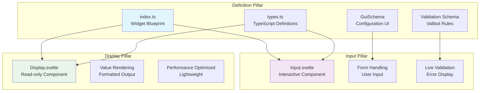
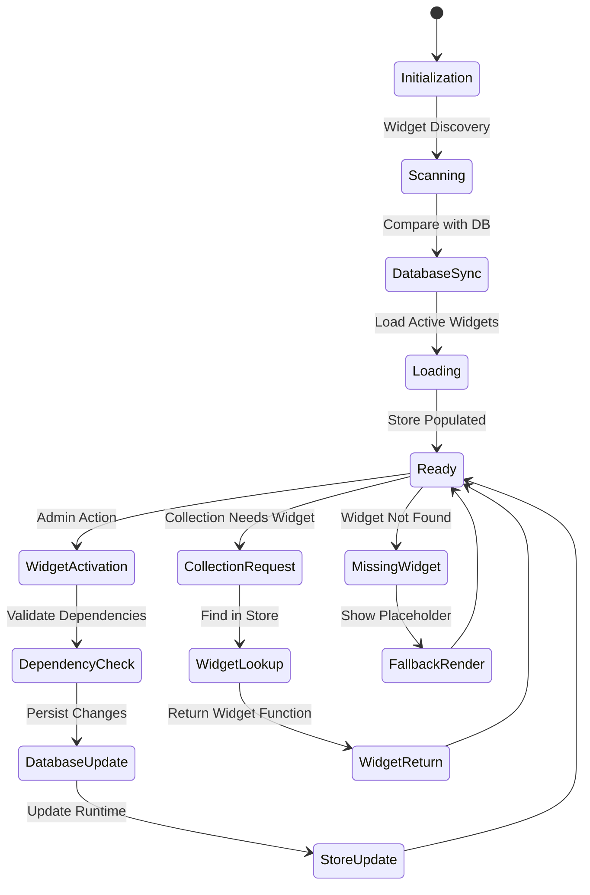
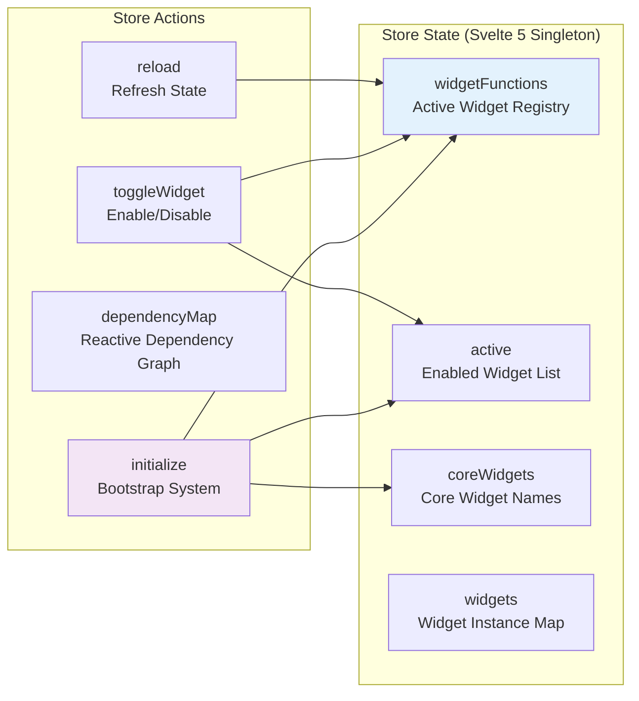
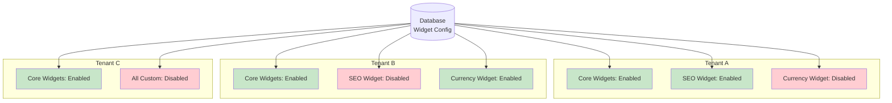
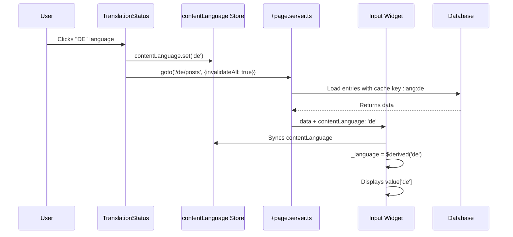
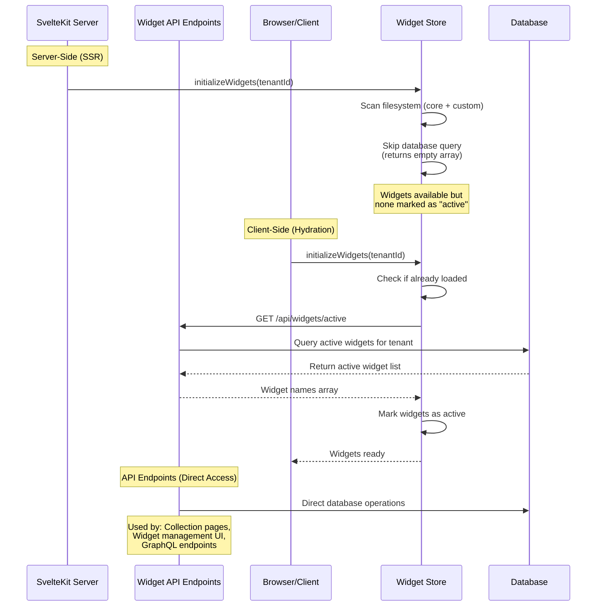
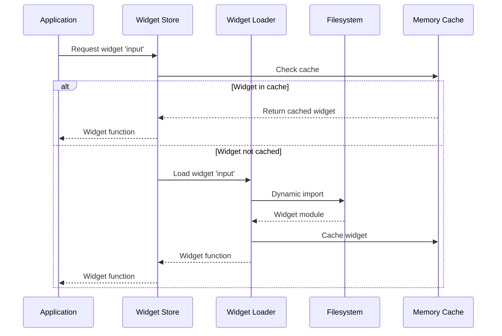
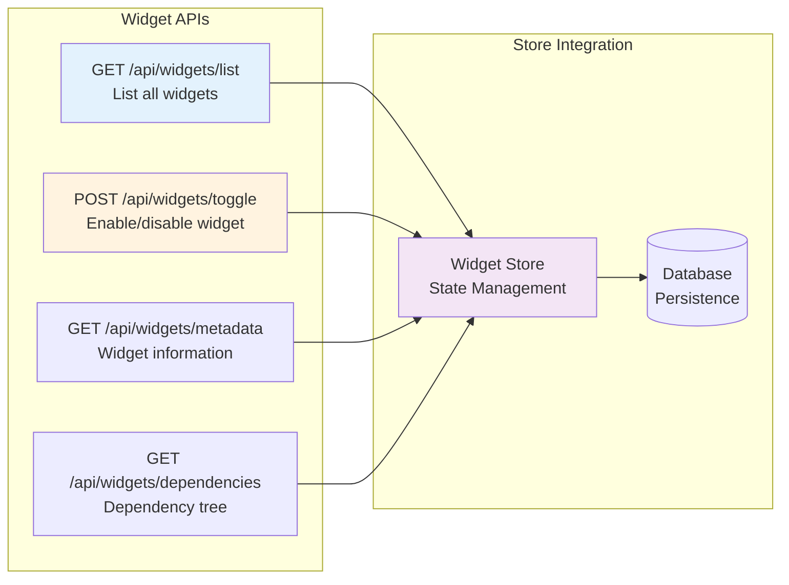
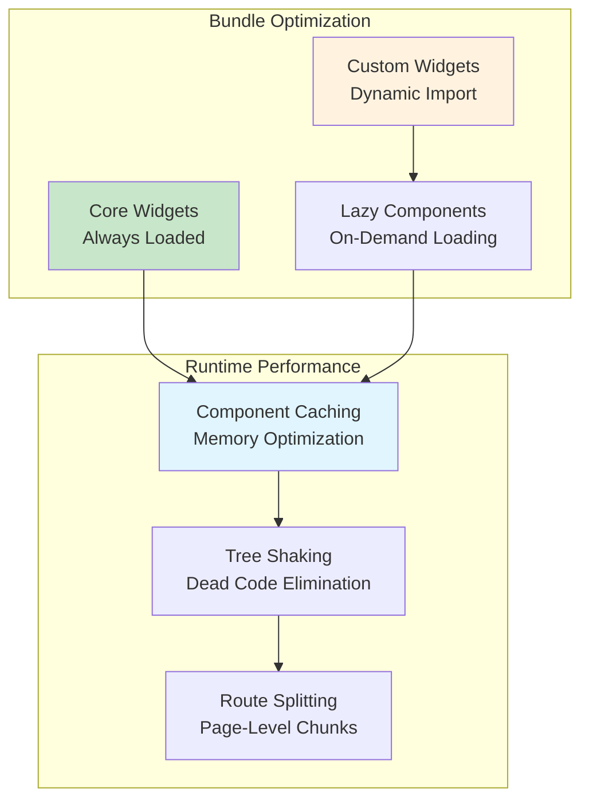

# Widget Architecture

This document covers the technical architecture and implementation details of the SveltyCMS widget system.

## 🏗️ System Architecture

### Component Overview

```mermaid
graph TB
    subgraph "Widget Factory System"
        WF[widget/factory.ts<br/>createWidget()]
        WT[widget/types.ts<br/>Type Definitions]
        WI[widget/index.ts<br/>Widget Loader]
    end

    subgraph "Widget Store Management"
        WS[widgetStore.svelte.ts<br/>State Management]
        WD[widgetDiscovery.ts<br/>Filesystem Scanner]
        API[Widget APIs<br/>REST Endpoints]
    end

    subgraph "Database Layer"
        DB[(widgets table<br/>Configuration)]
        MT[(multi_tenant<br/>Support)]
    end

    subgraph "Runtime System"
        CR[Collection Runtime<br/>Field Instances]
        CB[Collection Builder<br/>Widget Selection]
        MW[MissingWidget.svelte<br/>Fallback Handler]
    end

    WF --> WS
    WI --> WS
    WD --> WS
    WS --> DB
    WS --> API
    WS --> CR
    WS --> CB
    CR --> MW

    style WF fill:#e1f5fe
    style WS fill:#f3e5f5
    style DB fill:#fff8e1
    style CR fill:#e8f5e8
```

## 🏭 Widget Factory System

### Factory Pattern Implementation

The widget factory provides type-safe widget creation with the `createWidget()` function:

```typescript
// src/widgets/widgetFactory.ts
export function createWidget<TProps extends WidgetProps = WidgetProps>(config: WidgetConfig<TProps>) {
	// 1. Create immutable widget definition
	const widgetDefinition: WidgetDefinition = {
		widgetId: config.Name,
		Name: config.Name,
		Icon: config.Icon,
		Description: config.Description,
		inputComponentPath: config.inputComponentPath || '',
		displayComponentPath: config.displayComponentPath || '',
		validationSchema: config.validationSchema,
		defaults: config.defaults,
		GuiFields: config.GuiSchema || {},
		aggregations: config.aggregations
	};

	// 2. Return factory function for field instances
	const widgetFactory = (fieldConfig: FieldConfig<TProps>): FieldInstance => {
		const combinedProps = { ...config.defaults, ...fieldConfig };

		return {
			widget: widgetDefinition,
			label: fieldConfig.label,
			db_fieldName: fieldConfig.db_fieldName || generateFieldName(fieldConfig.label),
			required: fieldConfig.required ?? false,
			translated: fieldConfig.translated ?? false,
			...combinedProps
		};
	};

	// 3. Attach metadata for system compatibility
	widgetFactory.Name = config.Name;
	widgetFactory.GuiSchema = config.GuiSchema;
	// ... other properties

	return widgetFactory;
}
```

### Three Pillars Implementation



## 🏪 Widget Store Management

### Store Architecture



### Widget Discovery Process

```typescript
// src/services/widgetDiscovery.ts
export async function discoverWidgets(): Promise<WidgetDiscoveryResult> {
	// 1. Scan filesystem for widgets
	const filesystemWidgets = await scanWidgetDirectories();

	// 2. Load existing database configuration
	const databaseWidgets = await loadWidgetConfig();

	// 3. Compare and identify changes
	const analysis = compareWidgetStates(filesystemWidgets, databaseWidgets);

	// 4. Auto-register new widgets
	await registerNewWidgets(analysis.newWidgets);

	// 5. Mark missing widgets as unavailable
	await markMissingWidgets(analysis.missingWidgets);

	return {
		available: analysis.availableWidgets,
		active: analysis.activeWidgets,
		changes: analysis.changes
	};
}
```

### Store State Management

### Store State Management



## 🗄️ Database Integration

### Schema Design

```sql
-- Widget configuration table
CREATE TABLE widgets (
  id INTEGER PRIMARY KEY,
  name VARCHAR(255) UNIQUE NOT NULL,    -- Widget folder name (case-sensitive)
  display_name VARCHAR(255),            -- Human-readable name
  description TEXT,
  icon VARCHAR(255),
  widget_type ENUM('core', 'custom'),
  is_active BOOLEAN DEFAULT true,
  dependencies JSON,                     -- Array of dependent widget names
  configuration JSON,                    -- Widget-specific settings
  tenant_id VARCHAR(255),               -- Multi-tenant support
  created_at TIMESTAMP DEFAULT CURRENT_TIMESTAMP,
  updated_at TIMESTAMP DEFAULT CURRENT_TIMESTAMP ON UPDATE CURRENT_TIMESTAMP
);

-- Indexes for performance
CREATE INDEX idx_widgets_name ON widgets(name);
CREATE INDEX idx_widgets_type ON widgets(widget_type);
CREATE INDEX idx_widgets_active ON widgets(is_active);
CREATE INDEX idx_widgets_tenant ON widgets(tenant_id);
```

### Multi-Tenant Configuration



## 🌍 Multilingual Widget Architecture

### Content Language Integration

Widgets in SveltyCMS support multilingual content through the `contentLanguage` store and the `translated` field property. This architecture ensures widgets can handle translated content seamlessly while remaining database-agnostic.

```mermaid
graph TD
    subgraph "Language Context"
        CL[contentLanguage Store<br/>Current Language]
        URL[URL Parameter<br/>/:lang/:collection]
        SERVER[Server Load<br/>contentLanguage: 'de']
    end

    subgraph "Widget Layer"
        FIELD[Field Definition<br/>translated: true/false]
        WIDGET[Widget Component<br/>Input/Display]
        LANG[_language Derivation<br/>$derived()]
    end

    subgraph "Data Layer"
        VALUE[Value Object<br/>{en: '...', de: '...'}]
        DB[(Database<br/>Language-Agnostic)]
    end

    URL --> SERVER
    SERVER --> CL
    CL --> LANG
    FIELD --> LANG
    LANG --> WIDGET
    WIDGET --> VALUE
    VALUE --> DB

    style CL fill:#03A9F4
    style FIELD fill:#4CAF50
    style VALUE fill:#FF9800
```

### Multilingual Widget Pattern

All text-based widgets follow this standard pattern for multilingual support:

```svelte
<!-- Example: Input Widget with Multilingual Support -->
<script lang="ts">
	import { contentLanguage } from '@stores/store.svelte';
	import { DEFAULT_CONTENT_LANGUAGE } from '@src/utils/constants';

	interface Props {
		field: FieldInstance;
		value: Record<string, string> | string; // Multilingual or plain
	}

	let { field, value = $bindable() }: Props = $props();

	// 1. Determine which language to use based on field.translated
	const _language = $derived(field.translated ? app.contentLanguage : DEFAULT_CONTENT_LANGUAGE);

	// 2. Extract language-specific value
	const safeValue = $derived(
		field.translated && typeof value === 'object' && value !== null ? (value[_language] ?? '') : typeof value === 'string' ? value : ''
	);

	// 3. Update function maintains multilingual structure
	function updateValue(newValue: string) {
		if (field.translated) {
			// Merge with existing translations: { en: "...", de: "...", fr: newValue }
			value = { ...(value as object), [_language]: newValue };
		} else {
			// Replace entire value
			value = newValue;
		}
	}
</script>

<input type="text" value={safeValue} oninput={(e) => updateValue(e.currentTarget.value)} />
```

### Widget Categories by Language Support

| Widget Type            | Translated     | Reason                                         |
| ---------------------- | -------------- | ---------------------------------------------- |
| **Text-Based Widgets** |                |                                                |
| `input`                | ✅ Yes         | User-facing text content                       |
| `richText`             | ✅ Yes         | User-facing rich content                       |
| `email`                | ✅ Yes         | Can have localized descriptions                |
| `phoneNumber`          | ✅ Yes         | Can have localized labels                      |
| `number`               | ✅ Yes         | Can have localized formatting                  |
| `seo`                  | ✅ Yes         | SEO metadata per language                      |
| **Structural Widgets** |                |                                                |
| `checkbox`             | ❌ No          | Boolean value, language-independent            |
| `radio`                | ❌ No          | Selection value, options translated separately |
| `date`                 | ❌ No          | ISO date format, display localized by UI       |
| `mediaUpload`          | ❌ No          | File reference, alt text translated separately |
| **Relational Widgets** |                |                                                |
| `relation`             | ✅ Conditional | References can have translated display fields  |
| `megaMenu`             | ✅ Yes         | Menu items need per-language content           |

### Field Configuration

The `translated` property controls multilingual behavior:

```typescript
// Collection field definition
const fields: FieldInstance[] = [
	{
		widget: 'input',
		label: 'Title',
		db_fieldName: 'title',
		translated: true, // ← Multilingual field
		required: true
	},
	{
		widget: 'input',
		label: 'Slug',
		db_fieldName: 'slug',
		translated: false, // ← Single value across all languages
		unique: true,
		required: true
	}
];
```

### Data Flow Architecture



### Database-Agnostic Storage

The widget layer works with a normalized data structure, while database adapters handle storage:

```typescript
// Application layer (widgets always work with this)
const fieldData = {
	title: {
		en: 'Hello World',
		de: 'Hallo Welt',
		fr: 'Bonjour le monde'
	},
	slug: 'hello-world' // Not translated
};

// MongoDB adapter (current) - stores nested objects directly
db.collection('posts').insertOne(fieldData);

// SQL/Drizzle adapter (future) - transforms to relational tables
// posts: id, slug, created_at, updated_at
// post_translations:
//   - post_id, field='title', lang='en', value='Hello World'
//   - post_id, field='title', lang='de', value='Hallo Welt'
//   - post_id, field='title', lang='fr', value='Bonjour le monde'
//
// Adapter reconstructs: { title: { en: "...", de: "...", fr: "..." } }
```

### Widget State Reactivity

Widgets use Svelte 5 runes for reactive language handling:

```svelte
<script lang="ts">
	// ✅ CORRECT: Reactive language derivation
	const _language = $derived(field.translated ? contentLanguage.value : DEFAULT_CONTENT_LANGUAGE);

	// ✅ CORRECT: Reactive value access
	const displayValue = $derived(field.translated ? value[_language] : value);

	// ❌ WRONG: Hardcoded language
	const displayValue = value.en; // Not reactive, only shows English

	// ❌ WRONG: Missing field.translated check
	const displayValue = value[app.contentLanguage]; // Fails for untranslated fields
</script>

<!-- Automatically updates when contentLanguage changes -->
<input value={displayValue} />
```

### Translation-Aware Widget Features

**1. SEO Widget - Per-Language Optimization:**

```svelte
<script lang="ts">
	import { contentLanguage } from '@stores/store.svelte';

	// SEO data structure: { en: {...}, de: {...}, fr: {...} }
	const lang = $derived(field.translated ? app.contentLanguage : 'default');

	// Each language has complete SEO metadata
	$effect(() => {
		if (!value[lang]) {
			value[lang] = {
				title: '',
				description: '',
				focusKeyword: '',
				ogTitle: '',
				ogDescription: ''
				// ... full SEO config per language
			};
		}
	});
</script>
```

**2. RichText Widget - Language-Specific Editors:**

```svelte
<script lang="ts">
	const lang = $derived(field.translated ? app.contentLanguage : 'default');

	// Separate TipTap editor instance per language
	let editors = new Map<string, Editor>();

	$effect(() => {
		if (!editors.has(lang)) {
			editors.set(
				lang,
				new Editor({
					content: value[lang] || '',
					extensions: [
						/* ... */
					]
				})
			);
		}
	});
</script>
```

**3. Relation Widget - Display Translated References:**

```svelte
<script lang="ts">
	const lang = $derived(app.contentLanguage);

	// Show related entry's title in current language
	function getDisplayName(relatedEntry: any): string {
		const titleField = relatedEntry.title;
		if (typeof titleField === 'object' && titleField !== null) {
			return titleField[lang] || titleField.en || 'Untitled';
		}
		return titleField || 'Untitled';
	}
</script>

<select>
	{#each relatedEntries as entry}
		<option value={entry._id}>
			{getDisplayName(entry)}
		</option>
	{/each}
</select>
```

### Validation with Multilingual Data

Validation schemas must account for multilingual structure:

```typescript
import * as v from 'valibot';

// For translated fields
const TranslatedStringSchema = v.record(
	v.string(), // Language code key
	v.string() // Translated value
);

// For non-translated fields
const PlainStringSchema = v.string();

// Conditional validation based on field.translated
const InputValidationSchema = v.union([TranslatedStringSchema, PlainStringSchema]);

// Widget validation function
function validateValue(value: any, field: FieldInstance) {
	if (field.translated) {
		// Validate as multilingual object
		return v.safeParse(TranslatedStringSchema, value);
	} else {
		// Validate as plain string
		return v.safeParse(PlainStringSchema, value);
	}
}
```

### Display Component Considerations

Display widgets show read-only values and must handle multilingual data:

```svelte
<!-- Display.svelte for any text widget -->
<script lang="ts">
	import { contentLanguage } from '@stores/store.svelte';

	interface Props {
		field: FieldInstance;
		value: Record<string, string> | string;
	}

	let { field, value }: Props = $props();

	const lang = $derived(field.translated ? app.contentLanguage : 'en');

	const displayValue = $derived(field.translated && typeof value === 'object' && value !== null ? value[lang] || '-' : value || '-');
</script>

<span class="display-value">{displayValue}</span>
```

### Best Practices for Multilingual Widgets

**✅ DO:**

1. **Always check `field.translated` before accessing language keys:**

   ```typescript
   const _language = $derived(field.translated ? app.contentLanguage : DEFAULT_CONTENT_LANGUAGE);
   ```

2. **Use reactive derivations (`$derived`) for language-dependent values:**

   ```typescript
   const displayValue = $derived(field.translated ? value[_language] : value);
   ```

3. **Preserve existing translations when updating:**

   ```typescript
   value = { ...(value as object), [_language]: newValue };
   ```

4. **Provide fallbacks for missing translations:**

   ```typescript
   const text = value[app.contentLanguage] || value.en || value[DEFAULT_CONTENT_LANGUAGE] || '';
   ```

5. **Import from the store, not from props:**
   ```typescript
   import { contentLanguage } from '@stores/store.svelte'; // ✅
   // NOT: let { contentLanguage } = $props();  // ❌
   ```

**❌ DON'T:**

1. **Don't hardcode language keys:**

   ```typescript
   const value = data.en; // ❌ Always shows English
   ```

2. **Don't assume all fields are translated:**

   ```typescript
   const value = data[app.contentLanguage]; // ❌ Breaks for untranslated fields
   ```

3. **Don't mix UI language with content language:**

   ```typescript
   import { systemLanguage } from '@stores/store.svelte'; // For UI text
   import { contentLanguage } from '@stores/store.svelte'; // For content data
   // Don't confuse these!
   ```

4. **Don't forget to handle null/undefined values:**

   ```typescript
   // ❌ WRONG: Will crash if value is null
   const text = value[_language];

   // ✅ CORRECT: Safe access
   const text = value?.[_language] ?? '';
   ```

### Migration Guide for Existing Widgets

To add multilingual support to an existing widget:

**Step 1: Import contentLanguage**

```typescript
import { contentLanguage } from '@stores/store.svelte';
import { DEFAULT_CONTENT_LANGUAGE } from '@src/utils/constants';
```

**Step 2: Add language derivation**

```typescript
const _language = $derived(field.translated ? contentLanguage.value : DEFAULT_CONTENT_LANGUAGE);
```

**Step 3: Update value access**

```typescript
// Before:
let localValue = $state(value);

// After:
const safeValue = $derived(
	field.translated && typeof value === 'object' && value !== null ? (value[_language] ?? '') : typeof value === 'string' ? value : ''
);
```

**Step 4: Update value mutations**

```typescript
// Before:
function update(newValue: string) {
	value = newValue;
}

// After:
function update(newValue: string) {
	if (field.translated) {
		value = { ...(value as object), [_language]: newValue };
	} else {
		value = newValue;
	}
}
```

**Step 5: Update type definitions**

```typescript
// types.ts
export interface Props {
	field: FieldInstance;
	value: Record<string, string> | string; // ← Support both formats
	error?: string | null;
}
```

### Testing Multilingual Widgets

```typescript
import { describe, it, expect } from 'vitest';
import { render } from '@testing-library/svelte';
import { contentLanguage } from '@stores/store.svelte';
import InputWidget from './Input.svelte';

describe('Input Widget - Multilingual', () => {
	it('should display English value when language is "en"', () => {
		contentLanguage.set('en');

		const { getByRole } = render(InputWidget, {
			props: {
				field: { translated: true, label: 'Title' },
				value: { en: 'Hello', de: 'Hallo' }
			}
		});

		const input = getByRole('textbox');
		expect(input).toHaveValue('Hello');
	});

	it('should display German value when language is "de"', () => {
		contentLanguage.set('de');

		const { getByRole } = render(InputWidget, {
			props: {
				field: { translated: true, label: 'Title' },
				value: { en: 'Hello', de: 'Hallo' }
			}
		});

		const input = getByRole('textbox');
		expect(input).toHaveValue('Hallo');
	});

	it('should handle untranslated fields', () => {
		const { getByRole } = render(InputWidget, {
			props: {
				field: { translated: false, label: 'Slug' },
				value: 'hello-world'
			}
		});

		const input = getByRole('textbox');
		expect(input).toHaveValue('hello-world');
	});

	it('should update only current language', async () => {
		contentLanguage.set('de');
		let value = { en: 'Hello', de: 'Hallo' };

		const { getByRole } = render(InputWidget, {
			props: {
				field: { translated: true, label: 'Title' },
				value
			}
		});

		const input = getByRole('textbox');
		await fireEvent.input(input, { target: { value: 'Hallo Welt' } });

		expect(value).toEqual({
			en: 'Hello', // ← Unchanged
			de: 'Hallo Welt' // ← Updated
		});
	});
});
```

---

## 🔧 Runtime Implementation

### Widget Initialization Strategy

SveltyCMS uses a **hybrid initialization approach** to optimize both server-side rendering and client-side performance:



**Key Implementation Details:**

```typescript
// src/stores/widgetStore.svelte.ts
async function loadActiveWidgetsFromDatabase(tenantId?: string): Promise<string[]> {
	// Server-side: Return empty array (prevents SSR blocking)
	if (typeof window === 'undefined') {
		logger.debug('[widgetStore] Server-side - returning empty array');
		return [];
	}

	// Client-side: Fetch from API with cache-busting on first load
	const needsRefresh = Object.keys($store.widgetFunctions).length === 0;
	const url = `/api/widgets/active${needsRefresh ? '?refresh=true' : ''}`;

	const response = await fetch(url, {
		headers: {
			'Content-Type': 'application/json',
			...(tenantId && { 'X-Tenant-ID': tenantId })
		}
	});

	const data = await response.json();
	return data.widgets.map((w: { name: string }) => w.name);
}
```

**Why This Approach?**

1. **Fast SSR**: Server doesn't wait for database queries during page rendering
2. **No Race Conditions**: Client fetches fresh data after hydration
3. **Tenant Isolation**: Each tenant gets their specific widget configuration
4. **Cache Efficiency**: First load bypasses cache, subsequent loads use cached data

### Widget Loading Process



### Component Integration (No Client-Side Initialization Required)

**Before (❌ Old Pattern - Removed):**

```svelte
<!-- Fields.svelte - OLD APPROACH -->
<script>
	import { onMount } from 'svelte';
	import { widgetStoreActions } from '@stores/widgetStore.svelte';

	let widgetsReady = false;

	// ❌ DON'T DO THIS: Client-side widget initialization
	onMount(async () => {
		await widgets.initialize(tenantId);
		widgetsReady = true;
	});
</script>

{#if !widgetsReady}
	<div>Loading widgets...</div>
{:else}
	<!-- Render fields -->
{/if}
```

**After (✅ Current Pattern):**

```svelte
<!-- Fields.svelte - CURRENT APPROACH -->
<script>
	import { widgetFunctions } from '@stores/widgetStore.svelte';

	// ✅ Widgets are pre-initialized by layout or API endpoints
	// Just use them directly - no onMount required
	const { field, value } = $props();

	// Direct access to widget functions
	const widgetFn = $derived(widgets.widgetFunctions[field.widget]);
</script>

<!-- Widgets are always ready - render immediately -->
{#if widgetFn}
	<svelte:component this={widgetFn.Input} {field} {value} />
{:else}
	<MissingWidget widgetName={field.widget} />
{/if}
```

**Benefits of Server-Side Pre-Initialization:**

- ✅ **No Loading States**: Widgets available immediately on component mount
- ✅ **Better UX**: No flickering or "Loading..." messages
- ✅ **Simpler Code**: Components don't manage widget initialization
- ✅ **Consistent State**: All routes see the same initialized widgets
- ✅ **SSR Compatible**: Works seamlessly with server-side rendering

### Error Handling and Fallbacks

```typescript
// MissingWidget.svelte - Fallback component
export class MissingWidgetHandler {
	static render(widgetName: string, context: WidgetContext) {
		logger.warn(`Widget '${widgetName}' not found, rendering fallback`);

		return {
			component: MissingWidget,
			props: {
				widgetName,
				message: `Widget "${widgetName}" is not available`,
				suggestions: this.getSuggestions(widgetName),
				context
			}
		};
	}

	static getSuggestions(widgetName: string): string[] {
		// Fuzzy matching for similar widget names
		return availableWidgets.filter((name) => levenshteinDistance(name, widgetName) <= 2);
	}
}
```

## 🔌 API Integration

### REST Endpoints



### API Response Format

```typescript
// GET /api/widgets/list response
interface WidgetListResponse {
	widgets: Array<{
		name: string; // Filesystem identifier
		displayName: string; // UI display name
		description: string; // Widget description
		icon: string; // Icon identifier
		type: 'core' | 'custom'; // Widget category
		isActive: boolean; // Current activation state
		dependencies: string[]; // Required widgets
		pillar: {
			definition: {
				hasGuiSchema: boolean;
				hasValidation: boolean;
				hasAggregations: boolean;
			};
			input: {
				componentPath: string;
				hasDocumentation: boolean;
			};
			display: {
				componentPath: string;
				isOptimized: boolean;
			};
		};
	}>;
	metadata: {
		totalWidgets: number;
		activeWidgets: number;
		coreWidgets: number;
		customWidgets: number;
	};
}
```

## 🛡️ Type Safety Implementation

### Widget Type Definitions

```typescript
// src/widgets/types.ts
export interface WidgetDefinition {
	widgetId: string;
	Name: string;
	Icon?: string;
	Description?: string;
	inputComponentPath: string;
	displayComponentPath: string;
	validationSchema: BaseSchema<unknown, unknown, BaseIssue<unknown>>;
	defaults?: Record<string, unknown>;
	GuiFields: Record<string, unknown>;
	aggregations?: unknown;
}

export interface FieldInstance {
	widget: WidgetDefinition;
	label: string;
	db_fieldName: string;
	required: boolean;
	translated: boolean;
	width?: number;
	helper?: string;
	permissions?: Record<string, Record<string, boolean>>;
	[key: string]: unknown; // Widget-specific properties
}
```

### Generic Factory Types

```typescript
// Type-safe widget properties
type WidgetProps = Record<string, unknown>;

// Widget configuration interface
export interface WidgetConfig<TProps extends WidgetProps = WidgetProps> {
	Name: string;
	Icon?: string;
	Description?: string;
	inputComponentPath?: string;
	displayComponentPath?: string;
	defaults?: Partial<TProps>;
	validationSchema: unknown | ((field: FieldInstance) => unknown);
	GuiSchema?: Record<string, unknown>;
	aggregations?: unknown;
}

// Field configuration type
export type FieldConfig<TProps extends WidgetProps = WidgetProps> = {
	label: string;
	db_fieldName?: string;
	required?: boolean;
	translated?: boolean;
	width?: number;
	helper?: string;
	permissions?: Record<string, Record<string, boolean>>;
} & Partial<TProps>;
```

## 🔍 Validation System

### Valibot Integration

```typescript
// Dynamic validation schema creation
const createValidationSchema = (field: FieldInstance) => {
	const baseSchema = string();
	const rules = [];

	// Apply field-specific rules
	if (field.required) {
		rules.push(minLength(1, 'This field is required'));
	}

	if (field.maxLength) {
		rules.push(maxLength(field.maxLength, `Maximum ${field.maxLength} characters`));
	}

	// Build final schema
	const schema = pipe(baseSchema, ...rules);

	// Handle translation
	if (field.translated) {
		return object({ _any: any() }); // Flexible object for translations
	}

	return field.required ? schema : optional(schema, '');
};
```

## 📊 Performance Optimizations

### Code Splitting Strategy



### Memory Management

- **Widget Instances**: Cached and reused across collections
- **Component Cleanup**: Automatic disposal when not needed
- **Store Optimization**: Minimal reactive state for performance
- **Bundle Analysis**: Regular monitoring of widget bundle sizes

## 🧪 Testing Strategy

### Unit Testing

```typescript
// Widget factory testing
describe('createWidget', () => {
	test('should create widget with proper type safety', () => {
		const widget = createWidget<InputProps>({
			Name: 'TestInput',
			validationSchema: string(),
			GuiSchema: {
				label: { widget: Input, required: true }
			}
		});

		expect(widget.Name).toBe('TestInput');
		expect(widget.GuiSchema).toBeDefined();
	});
});
```

### Integration Testing

- **Store Operations**: Widget activation/deactivation
- **Database Sync**: Configuration persistence
- **API Endpoints**: REST API functionality
- **Collection Integration**: Widget usage in collections

## 🚀 Deployment Considerations

### Build Process

1. **Widget Discovery**: Scan filesystem during build
2. **Type Generation**: Generate TypeScript definitions
3. **Bundle Optimization**: Split widgets into chunks
4. **Documentation**: Generate widget documentation

### Production Monitoring

- **Widget Usage**: Track widget usage across collections
- **Performance Metrics**: Monitor load times and memory usage
- **Error Tracking**: Log widget-related errors
- **Dependency Alerts**: Monitor for breaking changes

---

## Related Documentation

- [Widget System Overview](/docs/widgets/widget-system-overview.mdx) - High-level concepts
- [Development Guide](/docs/widgets/widget-development-guide.mdx) - Creating widgets
- [API Documentation](/docs/api/Widget_API.mdx) - API reference
  const titleField = widgetFactory({
  label: 'Article Title',
  db_fieldName: 'title',
  required: true,
  placeholder: 'Enter title here',
  maxlength: 100
  });

````

### 2. Type Safety

All widgets now use TypeScript interfaces:

```typescript
interface WidgetDefinition {
	widgetId: string;
	Name: string;
	Icon?: string;
	Description?: string;
	GuiFields: Record<string, unknown>;
	componentPath?: string;
	aggregations?: WidgetAggregations;
}

interface FieldInstance {
	widget: WidgetDefinition;
	label: string;
	db_fieldName?: string;
	translated?: boolean;
	required?: boolean;
	// ... widget-specific properties
}
````

### 3. Language Support

The architecture provides built-in multi-language support:

```typescript
// For translated widgets (stores data per language)
const translatedDisplay = createDefaultDisplay(true);

// For non-translated widgets (single language storage)
const defaultDisplay = createDefaultDisplay(false);
```

### 4. Database Aggregations

Widgets can define database operations for filtering and sorting:

```typescript
const widgetFactory = createWidget({
	Name: 'SearchableText',
	aggregations: {
		filters: async (info) => [
			{
				$match: {
					[`${info.field.db_fieldName}.${info.contentLanguage}`]: {
						$regex: info.filter,
						$options: 'i'
					}
				}
			}
		],
		sorts: async (info) => ({
			[`${info.field.db_fieldName}.${info.contentLanguage}`]: info.sortDirection
		})
	}
});
```

## Widget Development

### Creating a New Widget

1. **Create the widget directory**:

   ```
   src/widgets/custom/mywidget/
   ├── index.ts          # Widget factory and configuration
   ├── MyWidget.svelte   # Svelte component
   └── types.ts          # TypeScript types
   ```

2. **Define the widget factory** (`index.ts`):

   ```typescript
   import { createWidget, createDefaultDisplay } from '@src/widgets/widgetFactory';
   import { GuiSchema, GraphqlSchema, type Params } from './types';

   const WIDGET_NAME = 'MyWidget' as const;

   const widgetFactory = createWidget({
   	Name: WIDGET_NAME,
   	Icon: 'mdi:my-icon',
   	Description: 'My custom widget',
   	componentPath: '/src/widgets/custom/mywidget/MyWidget.svelte',
   	GuiSchema,
   	GraphqlSchema
   });

   const widget = (params: Params) => {
   	const display = params.display || createDefaultDisplay(params.translated);

   	return widgetFactory({
   		label: params.label,
   		db_fieldName: params.db_fieldName,
   		translated: params.translated,
   		required: params.required
   		// ... widget-specific properties
   	});
   };

   export default widget;
   ```

3. **Create the Svelte component** (`MyWidget.svelte`):

   ```svelte
   <script lang="ts">
   	import type { FieldInstance } from '@src/content/types';
   	import { getFieldName } from '@utils/utils';

   	interface Props {
   		field: FieldInstance;
   		value?: any;
   	}

   	let { field, value }: Props = $props();

   	const fieldName = getFieldName(field);
   	// Component logic here
   </script>

   <!-- Widget UI here -->
   ```

### Widget Guidelines

1. **Always use TypeScript**: Define proper interfaces for props and types
2. **Follow naming conventions**: Use PascalCase for widget names
3. **Implement display functions**: For showing data in lists and previews
4. **Add proper validation**: Use schema validation for user inputs
5. **Support translations**: Use the `translated` parameter correctly
6. **Document thoroughly**: Add JSDoc comments and examples

## Testing Widgets

### Unit Tests

```typescript
import { test, expect } from 'bun:test';
import { createWidget } from '@src/widgets/widgetFactory';

test('should create widget with proper configuration', () => {
	const widget = createWidget({
		Name: 'TestWidget',
		Description: 'Test widget'
	});

	const field = widget({
		label: 'Test Field',
		db_fieldName: 'test'
	});

	expect(field.label).toBe('Test Field');
	expect(field.widget.Name).toBe('TestWidget');
});
```

### Integration Tests

Test widgets within the collection builder context using Playwright tests.

## Migration from Legacy Widgets

The system includes utilities to detect and migrate legacy widgets:

```typescript
import { isModernField, ensureModernField } from '@src/widgets/widgetFactory';

// Check if field uses modern architecture
if (isModernField(field)) {
	// Handle modern field
} else {
	// Migrate or handle legacy field
}
```

## Performance Considerations

1. **Lazy Loading**: Widgets are loaded on-demand
2. **Caching**: Widget definitions are cached in memory
3. **Bundle Splitting**: Each widget is a separate module
4. **Tree Shaking**: Unused widgets are excluded from builds

## Best Practices

1. **Keep widgets focused**: One widget should do one thing well
2. **Use proper validation**: Validate inputs at the widget level
3. **Support accessibility**: Include proper ARIA attributes
4. **Handle errors gracefully**: Provide meaningful error messages
5. **Test thoroughly**: Include unit and integration tests
6. **Document behavior**: Explain widget functionality and configuration options

## Troubleshooting

### Common Issues

1. **Widget not appearing**: Check if widget is activated in Widget Management
2. **Type errors**: Ensure proper TypeScript interfaces are used
3. **Display issues**: Verify display function implementation
4. **Validation errors**: Check schema definitions and validation logic

### Debugging

Use the browser dev tools to inspect widget state and the widget store for debugging issues.

---

## Related Documentation

- [Widget System Architecture](/docs/widgets/widget-system-architecture) - Comprehensive widget system overview
- [Widget Management](/docs/widgets/widget-management) - Managing widgets in the dashboard
- [Widget Development](/docs/widgets/widget-development) - Creating custom widgets
- [Troubleshooting](/docs/troubleshooting#widget-issues) - Widget troubleshooting guide
