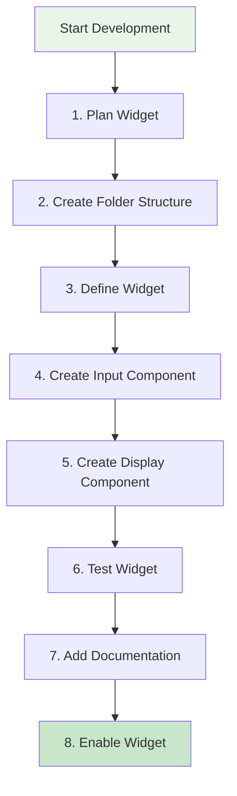
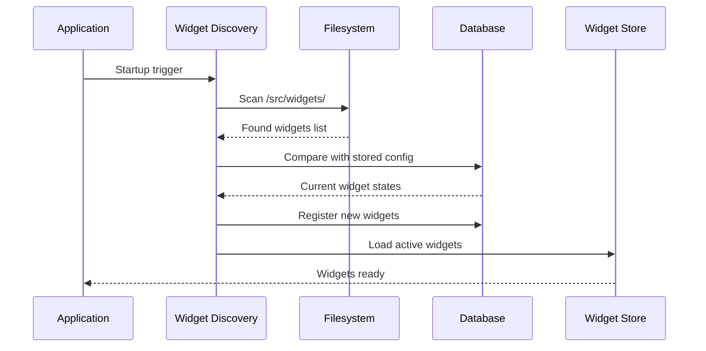

# Widget Development Guide

This guide provides practical instructions for creating, customizing, and managing widgets in SveltyCMS.

## 🚀 Quick Start

### Creating Your First Widget

Follow these steps to create a custom widget:



### 1. Planning Your Widget

Before coding, consider:

- **Purpose**: What specific functionality does your widget provide?
- **Data Type**: What type of data will it store? (string, object, array, etc.)
- **User Interface**: How will users interact with it?
- **Validation**: What validation rules are needed?
- **Dependencies**: Does it require other widgets or libraries?

### 2. Folder Structure

Create the widget directory structure:

```
src/widgets/custom/myWidget/
├── index.ts           # Definition pillar
├── Input.svelte       # Input pillar
├── Display.svelte     # Display pillar
├── types.ts           # TypeScript definitions
└── myWidget.mdx       # Documentation
```

**⚠️ Critical**: The folder name must match the widget identifier exactly (case-sensitive).

## 📝 Step-by-Step Tutorial

### Step 1: Define the Widget

Create `src/widgets/custom/myWidget/index.ts`:

```typescript
/**
 * @file src/widgets/custom/myWidget/index.ts
 * @description My Custom Widget Definition
 */

import { createWidget } from '@src/widgets/widgetFactory';
import { string, minLength, optional, pipe, type InferInput as ValibotInput } from 'valibot';
import Input from '@components/system/inputs/Input.svelte';
import Toggles from '@components/system/inputs/Toggles.svelte';
import type { MyWidgetProps } from './types';
import * as m from '@src/paraglide/messages';

// Validation schema - can be static or dynamic
const createValidationSchema = (field: FieldInstance) => {
	const baseSchema = pipe(string(), minLength(1, 'This field is required'));

	return field.required ? baseSchema : optional(baseSchema, '');
};

// Create the widget using the factory
const MyWidget = createWidget<MyWidgetProps>({
	Name: 'MyWidget',
	Icon: 'mdi:star',
	Description: 'My custom widget description',

	// Three Pillars paths
	inputComponentPath: '/src/widgets/custom/myWidget/Input.svelte',
	displayComponentPath: '/src/widgets/custom/myWidget/Display.svelte',

	// Validation
	validationSchema: createValidationSchema,

	// Default values
	defaults: {
		placeholder: 'Enter value...',
		translated: false
	},

	// Configuration UI for Collection Builder
	GuiSchema: {
		label: { widget: Input, required: true },
		db_fieldName: { widget: Input, required: false },
		required: { widget: Toggles, required: false },
		placeholder: { widget: Input, required: false },
		helper: { widget: Input, required: false }
	}
});

export default MyWidget;

// Type exports for consumers
export type FieldType = ReturnType<typeof MyWidget>;
export type MyWidgetData = ValibotInput<ReturnType<typeof createValidationSchema>>;
```

### Step 2: Create Types

Create `src/widgets/custom/myWidget/types.ts`:

```typescript
/**
 * @file src/widgets/custom/myWidget/types.ts
 * @description Type definitions for MyWidget
 */

export interface MyWidgetProps {
	placeholder?: string;
	maxLength?: number;
	prefix?: string;
	suffix?: string;
	[key: string]: unknown;
}
```

### Step 3: Create Input Component

Create `src/widgets/custom/myWidget/Input.svelte`:

```svelte
<!--
@file src/widgets/custom/myWidget/Input.svelte
@description Interactive input component for MyWidget
-->

<script lang="ts">
	import type { FieldInstance } from '@src/content/types';
	import { contentLanguage } from '@stores/store.svelte';

	// Props
	interface Props {
		field: FieldInstance;
		value: unknown;
		errors?: string[];
		disabled?: boolean;
	}

	let { field, value = $bindable(), errors = [], disabled = false }: Props = $props();

	// Extract widget-specific props
	const placeholder = field.placeholder || 'Enter value...';
	const maxLength = field.maxLength;
	const required = field.required || false;

	// Handle translation
	let currentValue = $state('');

	$effect(() => {
		if (field.translated && value && typeof value === 'object') {
			currentValue = (value as Record<string, string>)[$contentLanguage] || '';
		} else if (typeof value === 'string') {
			currentValue = value;
		}
	});

	function handleInput(event: Event) {
		const target = event.target as HTMLInputElement;
		const inputValue = target.value;

		if (field.translated) {
			const translatedValue = (value as Record<string, string>) || {};
			translatedValue[$contentLanguage] = inputValue;
			value = translatedValue;
		} else {
			value = inputValue;
		}
	}

	// Error state
	const hasErrors = errors && errors.length > 0;
</script>

<div class="widget-input">
	<label class="label">
		<span class="label-text">
			{field.label}
			{#if required}
				<span class="text-error">*</span>
			{/if}
		</span>

		<input
			type="text"
			class="input-bordered input w-full"
			class:input-error={hasErrors}
			{placeholder}
			{maxLength}
			{required}
			{disabled}
			value={currentValue}
			oninput={handleInput}
		/>

		{#if field.helper}
			<div class="label-text-alt text-gray-500">
				{field.helper}
			</div>
		{/if}

		{#if hasErrors}
			<div class="label-text-alt text-error">
				{#each errors as error}
					<div>{error}</div>
				{/each}
			</div>
		{/if}
	</label>
</div>

<style>
	.widget-input {
		@apply space-y-1;
	}
</style>
```

### Step 4: Create Display Component

Create `src/widgets/custom/myWidget/Display.svelte`:

```svelte
<!--
@file src/widgets/custom/myWidget/Display.svelte
@description Read-only display component for MyWidget
-->

<script lang="ts">
  import type { FieldInstance } from '@src/content/types';
  import { contentLanguage } from '@stores/store.svelte';

  // Props
  interface Props {
    field: FieldInstance;
    value: unknown;
    compact?: boolean;
  }

  let { field, value, compact = false }: Props = $props();

  // Get display value based on translation
  const displayValue = $derived(() => {
    if (!value) return '';

    if (field.translated && typeof value === 'object') {
      return (value as Record<string, string>)[$contentLanguage] || '';
    }

    return String(value);
  });

  // Truncate for compact display
  const truncatedValue = $derived(() => {
    if (!compact) return displayValue;
    return displayValue.length > 50
      ? displayValue.substring(0, 50) + '...'
      : displayValue;
  });
</script>

<div class="widget-display" class:compact>
  {#if field.prefix}
    <span class="prefix">{field.prefix}</span>
  {/if}

  <span class="value">
    {truncatedValue || <em>Empty</em>}
  </span>

  {#if field.suffix}
    <span class="suffix">{field.suffix}</span>
  {/if}
</div>

<style>
  .widget-display {
    @apply flex items-center gap-1;
  }

  .widget-display.compact {
    @apply text-sm;
  }

  .prefix, .suffix {
    @apply text-gray-500 text-sm;
  }

  .value {
    @apply flex-1;
  }

  em {
    @apply text-gray-400 italic;
  }
</style>
```

### Step 5: Add Documentation

Create `src/widgets/custom/myWidget/myWidget.mdx`:

````mdx
---
path: 'src/widgets/custom/myWidget/myWidget.mdx'
title: 'My Custom Widget'
description: 'A custom widget example for SveltyCMS'
order: 1
icon: 'mdi:star'
author: 'your-name'
created: '2025-10-17'
updated: '2025-10-17'
tags:
  - 'widget'
  - 'custom'
  - 'example'
---

# My Custom Widget

## Overview

My custom widget provides enhanced text input functionality with custom features.

## Features

- Custom placeholder text
- Prefix/suffix support
- Translation support
- Length validation
- Helper text

## Configuration Options

| Field         | Type    | Description         | Default          |
| ------------- | ------- | ------------------- | ---------------- |
| `label`       | string  | Field label         | Required         |
| `placeholder` | string  | Input placeholder   | "Enter value..." |
| `required`    | boolean | Make field required | false            |
| `maxLength`   | number  | Maximum characters  | none             |
| `helper`      | string  | Helper text         | none             |

## Usage Example

```typescript
import { widgets } from '@src/widgets';

// In a collection schema
export default {
	fields: [
		widgets.MyWidget({
			label: 'Custom Field',
			placeholder: 'Enter custom value...',
			required: true,
			maxLength: 100,
			helper: 'This is a custom widget field'
		})
	]
};
```
````

## Validation

The widget validates input based on configuration:

- **Required**: Ensures non-empty value when `required: true`
- **Length**: Enforces `maxLength` when specified
- **Type**: Ensures string input

## Translation Support

### Understanding Multilingual Data

SveltyCMS supports multilingual content through the `translated` field property. When enabled, widgets store values as language-keyed objects instead of simple strings:

**Untranslated Field (`translated: false`):**

```typescript
{
  "slug": "hello-world"  // Single value across all languages
}
```

**Translated Field (`translated: true`):**

```typescript
{
  "title": {
    "en": "Hello World",
    "de": "Hallo Welt",
    "fr": "Bonjour le monde",
    "es": "Hola Mundo"
  }
}
```

### Implementing Multilingual Support

**Step 1: Import the contentLanguage store**

```typescript
import { contentLanguage } from '@stores/store.svelte';
import { DEFAULT_CONTENT_LANGUAGE } from '@src/utils/constants';
```

**Step 2: Derive the current language**

```typescript
// Use contentLanguage for translated fields, default language otherwise
const _language = $derived(field.translated ? contentLanguage.value : DEFAULT_CONTENT_LANGUAGE);
```

**Step 3: Extract language-specific value**

```typescript
const safeValue = $derived(
	field.translated && typeof value === 'object' && value !== null ? (value[_language] ?? '') : typeof value === 'string' ? value : ''
);
```

**Step 4: Update values correctly**

```typescript
function updateValue(newValue: string) {
	if (field.translated) {
		// Preserve other language translations
		value = { ...(value as object), [_language]: newValue };
	} else {
		// Replace entire value
		value = newValue;
	}
}
```

### Complete Multilingual Input Example

```svelte
<script lang="ts">
	import { contentLanguage } from '@stores/store.svelte';
	import { DEFAULT_CONTENT_LANGUAGE } from '@src/utils/constants';
	import type { FieldInstance } from '@src/content/types';

	interface Props {
		field: FieldInstance;
		value: Record<string, string> | string;
		error?: string | null;
	}

	let { field, value = $bindable(), error }: Props = $props();

	// Reactive language selection
	const _language = $derived(field.translated ? contentLanguage.value : DEFAULT_CONTENT_LANGUAGE);

	// Safe value extraction with fallback
	const safeValue = $derived(
		field.translated && typeof value === 'object' && value !== null ? (value[_language] ?? '') : typeof value === 'string' ? value : ''
	);

	// Update handler that preserves translations
	function handleInput(event: Event) {
		const target = event.target as HTMLInputElement;
		const newValue = target.value;

		if (field.translated) {
			// Merge with existing translations
			value = {
				...(typeof value === 'object' ? value : {}),
				[_language]: newValue
			};
		} else {
			value = newValue;
		}
	}

	// Optional: Show translation status
	const translationCount = $derived(field.translated && typeof value === 'object' && value !== null ? Object.keys(value).length : 0);
</script>

<div class="input-wrapper">
	<label>
		{field.label}
		{#if field.required}
			<span class="required">*</span>
		{/if}

		{#if field.translated && translationCount > 0}
			<span class="translation-badge">
				{translationCount} language{translationCount !== 1 ? 's' : ''}
			</span>
		{/if}
	</label>

	<input type="text" value={safeValue} oninput={handleInput} placeholder={field.placeholder} required={field.required} />

	{#if error}
		<div class="error">{error}</div>
	{/if}
</div>

<style>
	.translation-badge {
		font-size: 0.75rem;
		color: #666;
		margin-left: 0.5rem;
	}

	.required {
		color: red;
	}
</style>
```

### Complete Multilingual Display Example

```svelte
<script lang="ts">
	import { contentLanguage } from '@stores/store.svelte';
	import { DEFAULT_CONTENT_LANGUAGE } from '@src/utils/constants';
	import type { FieldInstance } from '@src/content/types';

	interface Props {
		field: FieldInstance;
		value: Record<string, string> | string;
	}

	let { field, value }: Props = $props();

	// Derive current language
	const _language = $derived(field.translated ? contentLanguage.value : DEFAULT_CONTENT_LANGUAGE);

	// Extract display value with fallbacks
	const displayValue = $derived(
		field.translated && typeof value === 'object' && value !== null
			? value[_language] || value[DEFAULT_CONTENT_LANGUAGE] || Object.values(value)[0] || '-'
			: value || '-'
	);

	// Check if translation exists for current language
	const hasTranslation = $derived(field.translated && typeof value === 'object' && value !== null && _language in value);
</script>

<div class="display-wrapper">
	<span class="value" class:missing-translation={field.translated && !hasTranslation}>
		{displayValue}
	</span>

	{#if field.translated && !hasTranslation}
		<span class="warning-badge" title="No translation for {_language}"> ⚠️ </span>
	{/if}
</div>

<style>
	.missing-translation {
		font-style: italic;
		opacity: 0.6;
	}

	.warning-badge {
		margin-left: 0.25rem;
		font-size: 0.875rem;
	}
</style>
```

### Validation for Multilingual Data

Validation schemas must handle both translated and untranslated data:

```typescript
import * as v from 'valibot';

const createValidationSchema = (field: FieldInstance) => {
	// Base validation rules
	const stringRules = [v.string()];

	if (field.required) {
		stringRules.push(v.minLength(1, 'This field is required'));
	}

	if (field.maxLength) {
		stringRules.push(v.maxLength(field.maxLength as number, `Maximum ${field.maxLength} characters`));
	}

	const stringSchema = v.pipe(...stringRules);

	// Handle multilingual fields
	if (field.translated) {
		// Accept object with language keys
		const translatedSchema = v.record(
			v.string(), // Language code key (en, de, fr, etc.)
			stringSchema // Validated string value
		);

		// Make optional if not required
		return field.required ? translatedSchema : v.optional(translatedSchema);
	}

	// Handle non-translated fields
	return field.required ? stringSchema : v.optional(stringSchema, '');
};
```

### Language-Aware Aggregations

When implementing database queries, account for translated fields:

```typescript
const MyWidget = createWidget({
	// ... other config

	aggregations: {
		filters: async ({ field, filter, contentLanguage }) => {
			// Build field path based on translation status
			const fieldPath = field.translated ? `${field.db_fieldName}.${contentLanguage}` : field.db_fieldName;

			return [
				{
					$match: {
						[fieldPath]: {
							$regex: filter,
							$options: 'i'
						}
					}
				}
			];
		},

		sorts: async ({ field, sortDirection, contentLanguage }) => {
			// Build field path for sorting
			const fieldPath = field.translated ? `${field.db_fieldName}.${contentLanguage}` : field.db_fieldName;

			return {
				[fieldPath]: sortDirection === 'asc' ? 1 : -1
			};
		}
	}
});
```

### Common Pitfalls to Avoid

**❌ WRONG: Hardcoding language**

```typescript
// Bad - always shows English
const value = data.en;
```

**✅ CORRECT: Using reactive language**

```typescript
// Good - responds to language changes
const value = data[contentLanguage.value];
```

**❌ WRONG: Not checking field.translated**

```typescript
// Bad - crashes on untranslated fields
const value = data[contentLanguage.value];
```

**✅ CORRECT: Conditional access**

```typescript
// Good - handles both translated and untranslated
const value = field.translated ? data[contentLanguage.value] : data;
```

**❌ WRONG: Replacing entire object**

```typescript
// Bad - deletes other translations
value = { [contentLanguage.value]: newValue };
```

**✅ CORRECT: Preserving translations**

```typescript
// Good - keeps all translations
value = { ...value, [contentLanguage.value]: newValue };
```

**❌ WRONG: Using systemLanguage for content**

```typescript
// Bad - mixes UI language with content language
import { systemLanguage } from '@stores/store.svelte';
const value = data[systemLanguage.value]; // Wrong store!
```

**✅ CORRECT: Using contentLanguage for content**

```typescript
// Good - correct store for content data
import { contentLanguage } from '@stores/store.svelte';
const value = data[contentLanguage.value];
```

### Testing Multilingual Widgets

```typescript
import { describe, it, expect, beforeEach } from 'vitest';
import { render, fireEvent } from '@testing-library/svelte';
import { contentLanguage } from '@stores/store.svelte';
import MyWidget from './Input.svelte';

describe('MyWidget - Multilingual', () => {
	beforeEach(() => {
		// Reset to default language
		contentLanguage.set('en');
	});

	it('displays English value when language is "en"', () => {
		const { getByRole } = render(MyWidget, {
			props: {
				field: { translated: true, label: 'Title' },
				value: { en: 'English', de: 'Deutsch' }
			}
		});

		const input = getByRole('textbox');
		expect(input).toHaveValue('English');
	});

	it('displays German value when language switches to "de"', async () => {
		const { getByRole } = render(MyWidget, {
			props: {
				field: { translated: true, label: 'Title' },
				value: { en: 'English', de: 'Deutsch' }
			}
		});

		// Switch language
		contentLanguage.set('de');

		// Wait for reactivity
		await tick();

		const input = getByRole('textbox');
		expect(input).toHaveValue('Deutsch');
	});

	it('updates only current language on input', async () => {
		let value = { en: 'English', de: 'Deutsch' };

		contentLanguage.set('de');

		const { getByRole } = render(MyWidget, {
			props: {
				field: { translated: true, label: 'Title' },
				value
			}
		});

		const input = getByRole('textbox');
		await fireEvent.input(input, { target: { value: 'Neu' } });

		expect(value).toEqual({
			en: 'English', // Unchanged
			de: 'Neu' // Updated
		});
	});

	it('handles untranslated fields correctly', () => {
		const { getByRole } = render(MyWidget, {
			props: {
				field: { translated: false, label: 'Slug' },
				value: 'hello-world'
			}
		});

		const input = getByRole('textbox');
		expect(input).toHaveValue('hello-world');

		// Language change should not affect untranslated fields
		contentLanguage.set('de');
		expect(input).toHaveValue('hello-world');
	});

	it('handles empty translations gracefully', () => {
		const { getByRole } = render(MyWidget, {
			props: {
				field: { translated: true, label: 'Title' },
				value: { en: 'English' } // No German translation
			}
		});

		contentLanguage.set('de');

		const input = getByRole('textbox');
		expect(input).toHaveValue(''); // Empty, not undefined or crash
	});
});
```

### Migration Checklist

When adding multilingual support to an existing widget:

- [ ] Import `contentLanguage` from `@stores/store.svelte`
- [ ] Import `DEFAULT_CONTENT_LANGUAGE` from `@src/utils/constants`
- [ ] Add `const _language = $derived(field.translated ? contentLanguage.value : DEFAULT_CONTENT_LANGUAGE)`
- [ ] Update value access to check `field.translated`
- [ ] Update value mutations to preserve existing translations
- [ ] Update type definitions to support `Record<string, string> | string`
- [ ] Update validation schema to handle multilingual structure
- [ ] Update aggregations to use language-specific field paths
- [ ] Add tests for multilingual behavior
- [ ] Update widget documentation with translation examples

---

````

## 🔧 Advanced Features

### Dynamic Validation

Create validation schemas that adapt to field configuration:

```typescript
const createValidationSchema = (field: FieldInstance) => {
  const rules = [string()];

  // Conditional validation
  if (field.required) {
    rules.push(minLength(1, 'This field is required'));
  }

  if (field.minLength) {
    rules.push(minLength(field.minLength as number, `Minimum ${field.minLength} characters`));
  }

  if (field.maxLength) {
    rules.push(maxLength(field.maxLength as number, `Maximum ${field.maxLength} characters`));
  }

  if (field.pattern) {
    rules.push(regex(new RegExp(field.pattern as string), 'Invalid format'));
  }

  const schema = pipe(...rules);

  // Handle translation
  if (field.translated) {
    return object({ _any: any() });
  }

  return field.required ? schema : optional(schema, '');
};
````

### Database Aggregations

Add database query support for filtering and sorting:

```typescript
const MyWidget = createWidget({
	// ... other config

	aggregations: {
		// Filter support
		filters: async ({ field, filter, contentLanguage }) => {
			const fieldPath = field.translated ? `${field.db_fieldName}.${contentLanguage}` : field.db_fieldName;

			return [
				{
					$match: {
						[fieldPath]: {
							$regex: filter,
							$options: 'i' // Case insensitive
						}
					}
				}
			];
		},

		// Sort support
		sorts: async ({ field, sortDirection, contentLanguage }) => {
			const fieldPath = field.translated ? `${field.db_fieldName}.${contentLanguage}` : field.db_fieldName;

			return {
				[fieldPath]: sortDirection === 'asc' ? 1 : -1
			};
		}
	}
});
```

### Complex GUI Schema

Create advanced configuration interfaces:

```typescript
GuiSchema: {
  // Standard fields
  label: { widget: Input, required: true },
  db_fieldName: { widget: Input, required: false },
  required: { widget: Toggles, required: false },
  translated: { widget: Toggles, required: false },

  // Widget-specific configuration
  inputType: {
    widget: Select,
    required: false,
    options: [
      { label: 'Text', value: 'text' },
      { label: 'Email', value: 'email' },
      { label: 'Phone', value: 'tel' },
      { label: 'URL', value: 'url' }
    ]
  },

  validation: {
    widget: Group,
    label: 'Validation Rules',
    fields: {
      minLength: { widget: Input, type: 'number' },
      maxLength: { widget: Input, type: 'number' },
      pattern: { widget: Input, helper: 'Regular expression pattern' }
    }
  },

  appearance: {
    widget: Group,
    label: 'Appearance',
    fields: {
      placeholder: { widget: Input },
      prefix: { widget: Input },
      suffix: { widget: Input },
      width: { widget: Select, options: ['full', 'half', 'third'] }
    }
  }
}
```

## 🧪 Testing Your Widget

### Unit Testing

Create tests for your widget:

```typescript
// src/widgets/custom/myWidget/myWidget.test.ts
import { describe, test, expect } from 'vitest';
import MyWidget from './index';

describe('MyWidget', () => {
	test('should create widget with default configuration', () => {
		const field = MyWidget({
			label: 'Test Field'
		});

		expect(field.label).toBe('Test Field');
		expect(field.placeholder).toBe('Enter value...');
		expect(field.required).toBe(false);
	});

	test('should apply custom configuration', () => {
		const field = MyWidget({
			label: 'Custom Field',
			placeholder: 'Custom placeholder',
			required: true,
			maxLength: 50
		});

		expect(field.placeholder).toBe('Custom placeholder');
		expect(field.required).toBe(true);
		expect(field.maxLength).toBe(50);
	});

	test('should have proper widget definition', () => {
		expect(MyWidget.Name).toBe('MyWidget');
		expect(MyWidget.Icon).toBe('mdi:star');
		expect(MyWidget.GuiSchema).toBeDefined();
	});
});
```

### Component Testing

Test your Svelte components:

```typescript
// src/widgets/custom/myWidget/Input.test.ts
import { render, fireEvent } from '@testing-library/svelte';
import Input from './Input.svelte';

describe('MyWidget Input Component', () => {
	test('should render input field', () => {
		const field = {
			label: 'Test Field',
			required: true,
			placeholder: 'Test placeholder'
		};

		const { getByLabelText } = render(Input, {
			props: { field, value: '' }
		});

		const input = getByLabelText('Test Field');
		expect(input).toBeInTheDocument();
		expect(input).toHaveAttribute('placeholder', 'Test placeholder');
	});

	test('should handle value changes', async () => {
		const field = { label: 'Test Field' };
		let value = '';

		const { getByLabelText } = render(Input, {
			props: {
				field,
				value,
				onvaluechange: (e) => {
					value = e.detail;
				}
			}
		});

		const input = getByLabelText('Test Field');
		await fireEvent.input(input, { target: { value: 'test value' } });

		expect(value).toBe('test value');
	});
});
```

## 📦 Widget Management

### Enabling Your Widget

After creating your widget:

1. **Restart the application** to trigger widget discovery
2. **Check the admin interface** for your widget in the widget list
3. **Enable the widget** for your tenant
4. **Use in collections** via the Collection Builder

### Widget Discovery Process



### Dependency Management

If your widget depends on others:

```typescript
const MyWidget = createWidget({
	// ... other config

	// Specify dependencies
	dependencies: ['Input', 'Select'], // Widget names it depends on

	// Or check in validation
	validationSchema: (field) => {
		// Access other widgets if needed
		const inputWidget = getWidget('Input');
		if (!inputWidget) {
			throw new Error('MyWidget requires Input widget to be enabled');
		}

		return string();
	}
});
```

## 🚀 Deployment and Distribution

### Best Practices

1. **Follow Naming Conventions**: Folder name = widget identifier
2. **Add Comprehensive Documentation**: Include `.mdx` file with examples
3. **Write Tests**: Ensure reliability with unit and component tests
4. **Performance Optimization**: Keep display components lightweight
5. **Accessibility**: Follow WCAG guidelines in components
6. **TypeScript**: Use proper type definitions throughout

### Publishing Custom Widgets

For sharing widgets across projects:

1. **Create NPM Package**: Package your widget as a separate module
2. **Include Installation Instructions**: Document setup process
3. **Provide Examples**: Include working examples and demos
4. **Version Management**: Use semantic versioning for releases

### Migration Guide

When updating existing widgets:

1. **Backup Collections**: Export collections using the widget
2. **Test Changes**: Verify compatibility with existing data
3. **Update Gradually**: Use feature flags for rollout
4. **Monitor Usage**: Track performance and error rates

---

## 🔗 Related Resources

- [Widget System Overview](/docs/widgets/widget-system-overview.mdx) - High-level concepts
- [Widget Architecture](/docs/widgets/widget-architecture.mdx) - Technical details
- [API Documentation](/docs/api/Widget_API.mdx) - API reference
- [Testing Guide](/docs/testing/testing.mdx) - Testing strategies
- [TypeScript Guide](/docs/guides/typescript.mdx) - Type safety best practices
