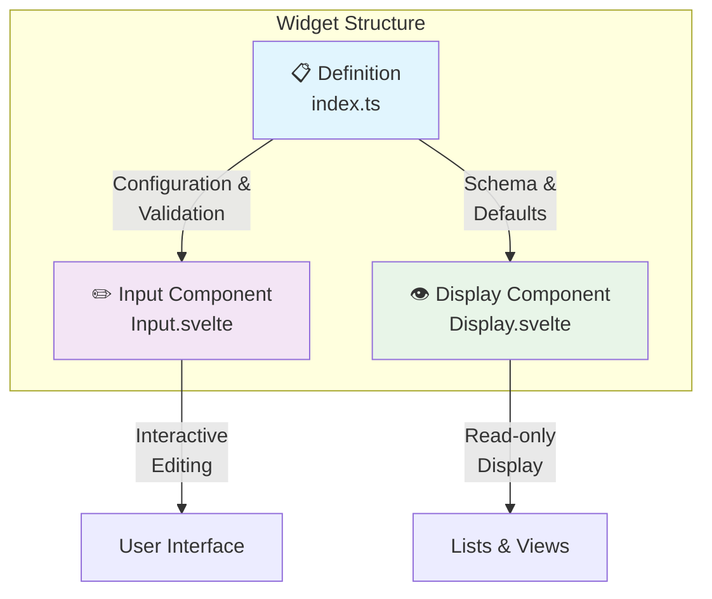
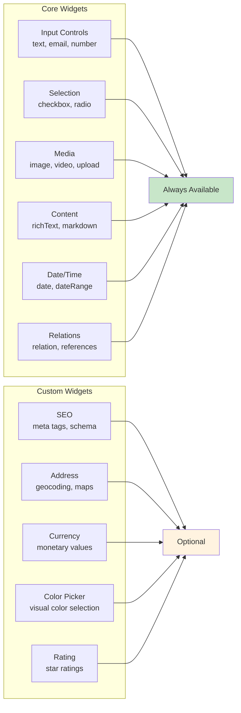
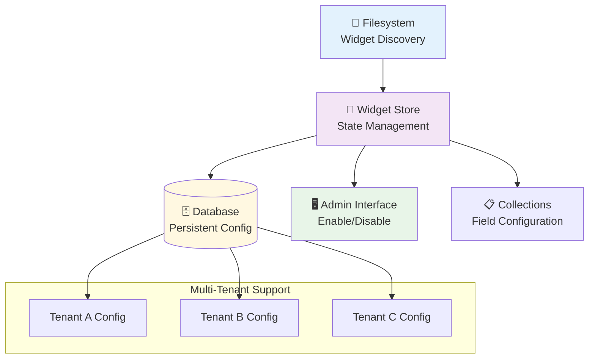
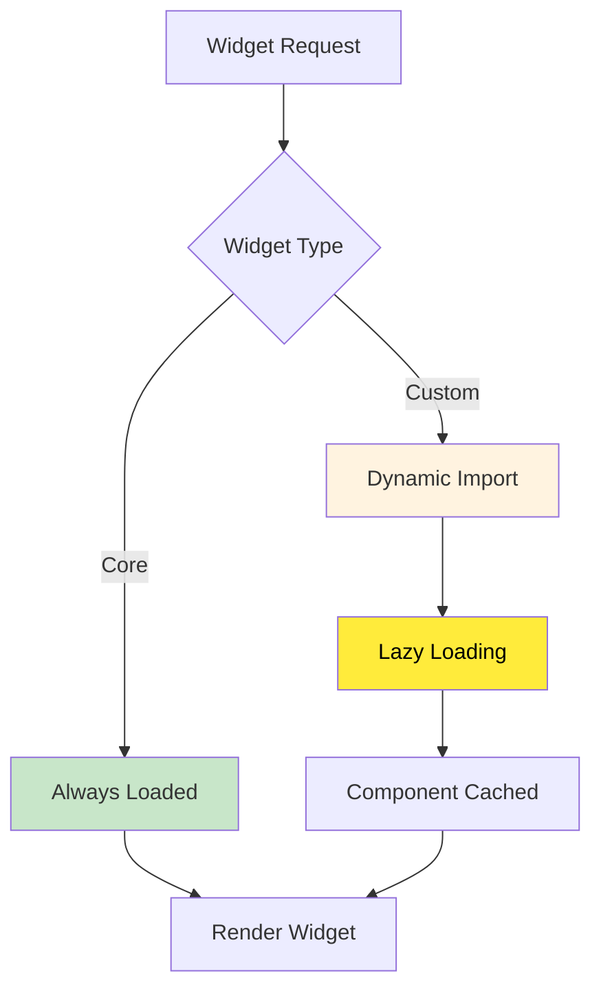

# Widget System Overview

SveltyCMS features a comprehensive widget system based on the **3-Pillar Architecture** with integrated management and marketplace capabilities. This modern architecture provides type safety, performance optimization, and developer-friendly patterns.

## 🏗️ Core Concepts

### 3-Pillar Architecture

The widget system separates concerns into three distinct pillars:



**Benefits:**

- 🚀 **Performance**: Lightweight display components for lists
- 🔧 **Maintainability**: Clear separation of concerns
- 🔄 **Reusability**: Components can be shared across implementations
- 🛡️ **Type Safety**: Full TypeScript support throughout

### Widget Types



## 🎯 System Features

### Widget Management



### Key Capabilities

- **🔄 Dynamic Loading**: Code splitting with `import.meta.glob`
- **📦 Dependency Management**: Automatic resolution and validation
- **🏢 Multi-Tenant**: Per-tenant widget configurations
- **🔒 Security**: Permission-based access control
- **📚 Self-Documenting**: MDX documentation per widget
- **✅ Validation**: Valibot schemas for type safety
- **🌍 Multilingual**: Built-in support for translated content with contentLanguage integration

### Multilingual Support

All text-based widgets support multilingual content through the `translated` field property:

```typescript
// Field configuration
{
  widget: 'input',
  label: 'Title',
  db_fieldName: 'title',
  translated: true,  // ← Enables multilingual support
  required: true
}
```

**Data Storage:**

```typescript
// Translated field stores language-keyed values
{
  "title": {
    "en": "Hello World",
    "de": "Hallo Welt",
    "fr": "Bonjour le monde"
  }
}

// Non-translated field stores single value
{
  "slug": "hello-world"
}
```

**Widget Behavior:**

- Widgets automatically read from `contentLanguage` store
- Display and edit values for current language only
- Preserve translations when updating
- Support validation per language
- Database-agnostic storage format

**Supported Widgets:**

| Widget      | Multilingual   | Notes                         |
| ----------- | -------------- | ----------------------------- |
| input       | ✅ Yes         | Text content per language     |
| richText    | ✅ Yes         | Rich content per language     |
| email       | ✅ Yes         | Localized email text          |
| phoneNumber | ✅ Yes         | Localized labels              |
| number      | ✅ Yes         | Localized formatting          |
| seo         | ✅ Yes         | SEO meta per language         |
| relation    | ✅ Conditional | Display fields translated     |
| megaMenu    | ✅ Yes         | Menu items per language       |
| checkbox    | ❌ No          | Boolean, language-independent |
| date        | ❌ No          | ISO format, display localized |
| mediaUpload | ❌ No          | File reference only           |

---

## 📁 Directory Structure

```
src/widgets/
├── factory.ts              # Widget factory system
├── index.ts                # Widget loader and registry
├── types.ts                # TypeScript definitions
├── MissingWidget.svelte    # Fallback component
├── core/                   # Always available widgets
│   ├── input/
│   │   ├── index.ts        # Definition pillar
│   │   ├── Input.svelte    # Input pillar
│   │   ├── Display.svelte  # Display pillar
│   │   ├── input.mdx       # Documentation
│   │   └── types.ts        # Widget-specific types
│   ├── richText/
│   ├── date/
│   └── ...
└── custom/                 # Optional widgets
    ├── seo/
    ├── address/
    ├── currency/
    └── ...
```

## 🔄 Widget Lifecycle

```mermaid
sequencer
    participant FS as Filesystem
    participant WD as Widget Discovery
    participant WS as Widget Store
    participant DB as Database
    participant UI as User Interface
    participant COL as Collection

    FS->>WD: Scan widgets on startup
    WD->>DB: Compare with stored config
    WD->>WS: Load active widgets
    WS->>UI: Populate widget list
    UI->>WS: Enable/disable widgets
    WS->>DB: Persist changes
    COL->>WS: Request available widgets
    WS->>COL: Return active widgets
```

## 🎨 User Experience

### Collection Builder Integration

When building collections, users interact with widgets through:

1. **Widget Selection**: Choose from available widgets
2. **Configuration**: Set widget-specific properties via GuiSchema
3. **Validation**: Real-time validation feedback
4. **Preview**: Live preview of widget behavior

### Admin Interface

Administrators can:

- **Enable/Disable** widgets per tenant
- **View Dependencies** and resolve conflicts
- **Monitor Usage** across collections
- **Manage Permissions** for widget access

## 🚀 Performance Optimizations

### Code Splitting



### Memory Management

- **Lazy Loading**: Components loaded only when needed
- **Tree Shaking**: Unused widgets excluded from bundle
- **Caching**: Widget instances cached for reuse
- **Cleanup**: Automatic disposal of unused components

## 📚 Documentation Structure

The widget system includes comprehensive documentation:

- **System Overview** (this document): High-level concepts and features
- **[Widget Architecture](/docs/widgets/widget-architecture.mdx)**: Technical implementation details
- **[Development Guide](/docs/widgets/widget-development-guide.mdx)**: Creating and customizing widgets
- **Individual Widget Docs**: Each widget has its own `.mdx` file

## 🔧 Quick Start

### Using Existing Widgets

```typescript
// In a collection schema
import { widgets } from '@src/widgets';

export default {
	fields: [
		widgets.Input({
			label: 'Title',
			required: true
		}),
		widgets.RichText({
			label: 'Content'
		}),
		widgets.Date({
			label: 'Published Date'
		})
	]
};
```

### Creating Custom Widgets

```typescript
// src/widgets/custom/myWidget/index.ts
import { createWidget } from '@src/widgets/factory';

const MyWidget = createWidget({
	Name: 'MyWidget',
	Icon: 'mdi:star',
	Description: 'Custom widget example',
	inputComponentPath: '/src/widgets/custom/myWidget/Input.svelte',
	displayComponentPath: '/src/widgets/custom/myWidget/Display.svelte',
	validationSchema: string(),
	GuiSchema: {
		label: { widget: Input, required: true }
	}
});

export default MyWidget;
```

## 🎯 Next Steps

- **Developers**: Read the [Widget Architecture](/docs/widgets/widget-architecture.mdx) for technical details
- **Content Creators**: Explore available widgets in the Collection Builder
- **Administrators**: Configure widget settings in the Admin Interface

---

## Related Documentation

- [Widget Architecture](/docs/widgets/widget-architecture.mdx) - Technical implementation
- [Development Guide](/docs/widgets/widget-development-guide.mdx) - Creating widgets
- [API Documentation](/docs/api/Widget_API.mdx) - Widget API reference
