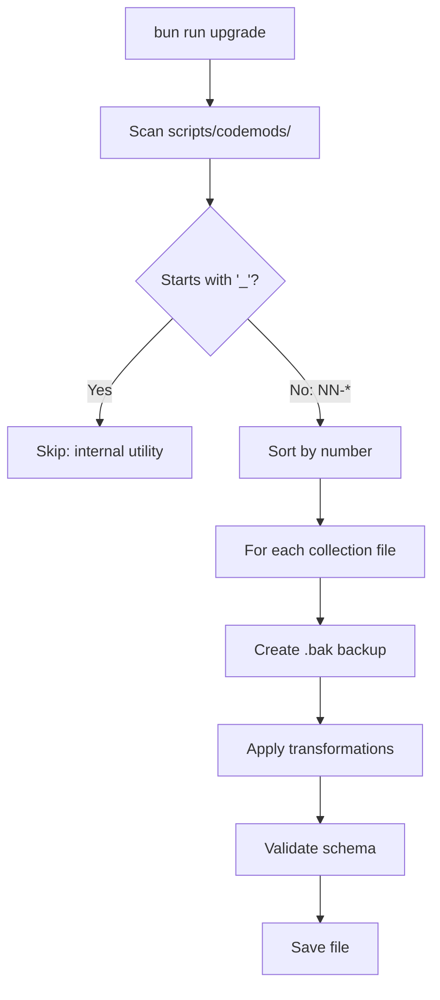

# 🔧 SveltyCMS Codemods

> Automatic scripts that keep your collections working after a SveltyCMS version upgrade.

---

## When do I need this?

You have SveltyCMS installed. One day you check for updates:

```bash
bun outdated        # Shows: graphql 16 → 17, oxfmt 0.56 → 0.57
bun update          # Downloads new packages into node_modules/
```

So far so good — your dependencies are current. But what if the SveltyCMS **framework itself** changed how collections work? For example:

- `publicAccess: true` is now `permissions: { public: ["read"], ... }`
- Every collection now needs a `version: 2` marker
- All collections must include a soft-delete field

`bun update` can't help with this — it only touches `node_modules/`. **Your collection files in `config/collections/` are still written in the old format.**

That's when you run:

```bash
bun run upgrade
```

It scans your collection files and automatically rewrites them to match the new format. No manual editing needed.

---

## What happens when I run `bun run upgrade`?

| Step            | What it does                                               |
| :-------------- | :--------------------------------------------------------- |
| 1. Check        | Verifies your working tree is clean (no uncommitted files) |
| 2. Backup       | Creates a git rollback tag so you can undo everything      |
| 3. Fetch        | Pulls the latest SveltyCMS code from upstream              |
| 4. Dependencies | Runs `bun install` to update packages                      |
| 5. **Codemods** | Executes scripts that rewrite your collection files        |
| 6. DB           | Runs `bun run db:push` to sync database schema             |
| 7. Tests        | Runs the unit test suite to verify nothing is broken       |

Each codemod creates a `.bak` backup of every file it touches, so you can always revert.

---

## Example: before and after

**Before** `bun run upgrade` (your current file):

```ts
export default {
  name: "posts",
  publicAccess: true,
  fields: [{ name: "title", type: "string" }],
};
```

**After** (automatically rewritten by codemods):

```ts
export default {
  name: "posts",
  version: 2,
  permissions: {
    public: ["read"],
    authenticated: ["read", "write"],
    apiKey: [],
  },
  fields: [
    { name: "title", type: "string" },
    { name: "isDeleted", type: "boolean", defaultValue: false },
  ],
};
```

Three codemods ran on this single file without you touching a line of code.

---

## How it works (for maintainers)

When `bun run upgrade` reaches the codemod step, it:

1. Scans `scripts/codemods/` for numbered scripts (`01-*`, `02-*`, ...)
2. Runs them in order (skipping files starting with `_`)
3. Each script opens your collection files, transforms the code using `ts-morph` (AST parser), creates a backup, and saves



---

## Safety features

- **Git rollback tag**: Created before any changes — `git reset --hard pre-upgrade-...` undoes everything
- **`.bak` backups**: Every modified file gets a timestamped backup
- **Dry-run mode**: `bun run upgrade --dry-run` shows what would change without touching files
- **Idempotent**: Safe to run multiple times — won't double-apply migrations
- **Schema validation**: Checks that `name` and `fields` still exist after transformation
- **Clean-tree gate**: Refuses to run if you have uncommitted changes

---

## FAQ

**Q: Isn't `bun update` enough?**
A: No. `bun update` updates npm packages in `node_modules/`. Codemods update **your** collection files in `config/collections/` when the framework's expected format changes.

**Q: How often do I need to run this?**
A: Only when upgrading to a new SveltyCMS release that includes schema changes. Check the changelog.

**Q: What if something breaks?**
A: Run `git reset --hard pre-upgrade-...` to roll back everything, or restore individual files from the `.bak` backups.

**Q: Can I test without changing anything?**
A: Yes: `bun run upgrade --dry-run`

---

## Current codemods

| #   | File                                 | What it does                                              |
| :-- | :----------------------------------- | :-------------------------------------------------------- |
| 01  | `01-migrate-collection-schema-v2.ts` | Adds `version: 2` and renames deprecated fields           |
| 02  | `02-update-permissions-structure.ts` | Converts `publicAccess` → structured `permissions` object |
| 03  | `03-add-soft-delete-fields.ts`       | Injects `isDeleted` boolean field into every collection   |
| 04  | `04-migrate-role-names.ts`           | Role name standardization (coming soon)                   |
| —   | `_utils.ts`                          | Shared utilities (not executed directly)                  |
