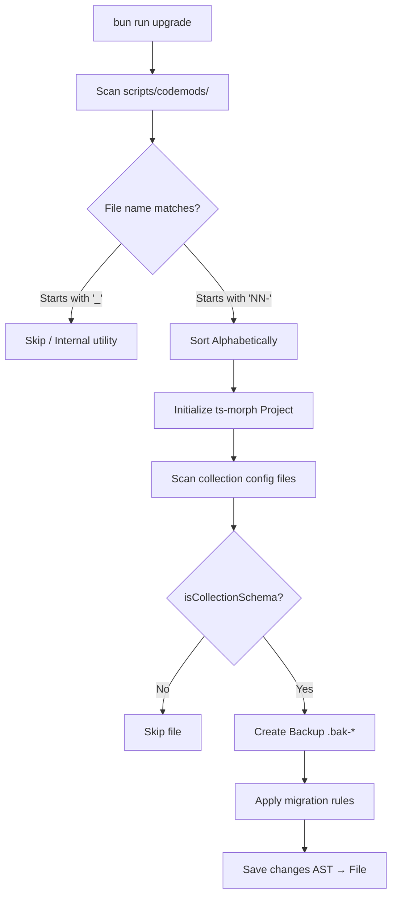

# 🔧 SveltyCMS Codemods

> **Automatic code migrations** that run during `bun run upgrade`

## ❓ Why Codemods? (vs. `bun update`)

A common point of confusion is the difference between `bun update` and `bun run upgrade`:

| Feature | `bun update` | `bun run upgrade` (Codemods) |
| :--- | :--- | :--- |
| **Target** | **External Libraries** (Svelte, Vite, etc.) | **Internal Source Code** (Your own schemas) |
| **What it updates** | The `node_modules` folder | Your `.ts`, `.svelte`, and `.json` files |
| **Mechanism** | Version Matching (SemVer) | **AST Transformation** (Understanding code logic) |
| **Analogy** | **Updating your tools** (getting a newer hammer). | **Remodeling your house** (moving the kitchen walls). |

**In short**: `bun update` ensures the "engine" is current. **Codemods** are how we evolve the product's features and data structures safely at scale. Without codemods, updating a single field name in 50 different collections would require 50 manual file edits; with codemods, it takes one script.

---

## How It Works

When you run `bun run upgrade`, the system scans the `scripts/codemods/` directory and executes each migration script in alphabetical order (excluding utility files beginning with `_`).

The flow is visualized below:



---

## Performance Optimizations

Our codemod framework is optimized for speed and safety:

- **AST Speedup**: The `ts-morph` compiler engine in `./_utils.ts` has `skipLoadingLibFiles: true` enabled, which stops the parser from loading standard TypeScript library definitions (`lib.d.ts`). This reduces project initialization time by **1.5s - 3s** per codemod run.
- **Native Bun Glob**: The test hardening and helper scanners use Bun's native C++ `Glob` module instead of external npm dependencies, running up to **10x faster**.
- **Asynchronous I/O**: File reads and writes are offloaded to Bun's asynchronous threading (`Bun.file(path).text()` / `Bun.write(...)`) to prevent blocking execution cycles.

---

## Adding a New Codemod

1. Create a new file with naming: `NN-description.ts` (e.g., `05-add-new-field.ts`)
2. Import utilities from `./_utils.ts`
3. Implement your migration logic
4. **Always create backups** before modifying files using `await backupFile(filePath)`

---

## Best Practices

### ✅ DO:

- Use shared utilities from `./_utils.ts`.
- Create backups with `await backupFile(filePath)`.
- Make migrations **idempotent** (safe to run multiple times).
- Log what you're changing clearly.
- Exit with code 0 if nothing to migrate.

### ❌ DON'T:

- Modify files without backups.
- Assume the migration runs only once.
- Delete user data without explicit instruction.
- Create breaking changes without warning.

---

## File Naming Convention

| Prefix           | Purpose                           | Example                  |
| ---------------- | --------------------------------- | ------------------------ |
| `NN-`            | Execution order (01, 02, 03...)   | `01-migrate-fields.ts`   |
| `migrate-`       | Data structure migrations         | `migrate-collections.ts` |
| `update-`        | Configuration updates             | `update-permissions.ts`  |
| `fix-`           | Bug fixes in schema               | `fix-role-names.ts`      |
| `_` (underscore) | Internal utilities (NOT executed) | `_utils.ts`              |

---

## Current Codemods

| File | Description | Status | Safe to Re-run |
| :--- | :--- | :--- | :--- |
| `01-migrate-collection-schema-v2.ts` | v1 → v2 collection schema | ✅ Active | ✅ Yes |
| `02-update-permissions-structure.ts` | Legacy `publicAccess` → structured RBAC | ✅ Active | ✅ Yes |
| `03-add-soft-delete-fields.ts` | Inject `isDeleted` flag into all collections | ✅ Active | ✅ Yes |
| `04-migrate-role-names.ts` | Role name standardization (placeholder) | 📋 Planned | — |
| `_utils.ts` | Shared AST utilities (MigrationManager, etc.) | 📦 Internal | N/A |

---

## Testing a Codemod

```bash
# Test on a single file first
bun scripts/codemods/01-migrate-collection-schema-v2.ts config/collections/test-collection.ts

# Dry run (if supported)
bun run upgrade --dry-run

# Full upgrade with all codemods
bun run upgrade
```
