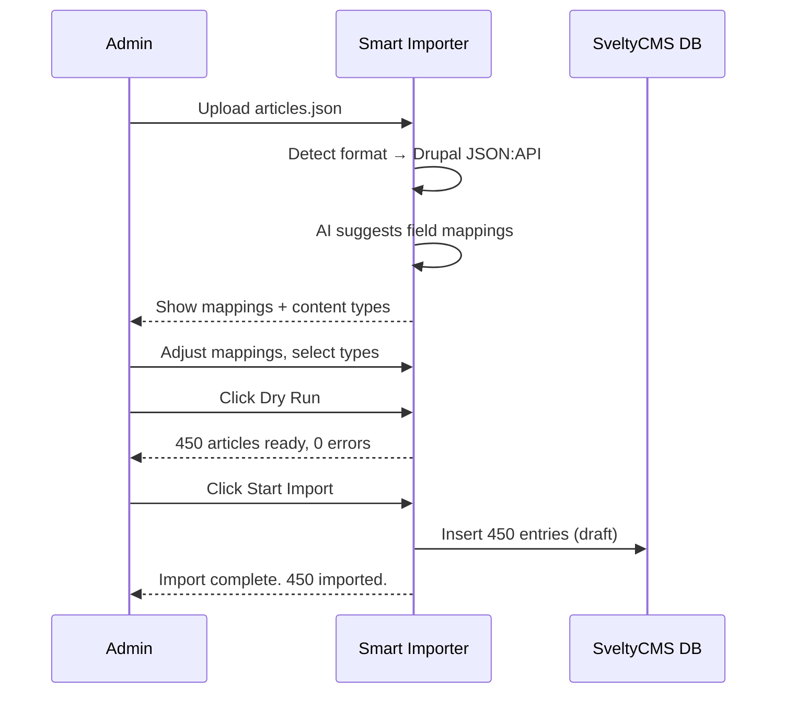

# Drupal → SveltyCMS Migration Guide

This guide walks you through migrating a Drupal 9/10 site to SveltyCMS. It covers three export methods, explains what migrates and what doesn't, and provides a post-migration checklist.

## What Migrates

| Drupal Feature                          | SveltyCMS Equivalent        | How                                                     |
| :-------------------------------------- | :-------------------------- | :------------------------------------------------------ |
| **Content Types** (node bundles)        | Collections                 | Auto-detected from JSON:API, can scaffold automatically |
| **Nodes** (articles, pages, custom)     | Entries in collections      | Full content + custom fields                            |
| **Taxonomy Terms** (tags, categories)   | Taxonomy arrays on entries  | Resolved from JSON:API `included` data                  |
| **Entity References** (related content) | Relation fields             | Collected for post-import resolution                    |
| **Media / Files** (images, documents)   | Media library               | URLs extracted, optional download                       |
| **Revisions** (vid, revision_log)       | `contentRevisions` metadata | Preserved in `rawCustomFields._revisions`               |
| **URL Aliases** (pathauto)              | Entry slugs                 | `path/alias` → `slug`                                   |
| **Languages** (langcode)                | Entry language field        | Preserved as-is                                         |
| **Authors** (uid)                       | Entry author field          | Display name extracted                                  |
| **Body + Format** (richtext)            | RichText widget content     | `body.value` → `content`                                |

## What Doesn't Migrate (And Alternatives)

| Drupal Feature               | Why                           | SveltyCMS Alternative                                                                   |
| :--------------------------- | :---------------------------- | :-------------------------------------------------------------------------------------- |
| **Views**                    | Database queries, not content | [Collection Presets](/docs/guides/content/collections) — saved filters + sorts          |
| **Rules / Workflows**        | PHP logic                     | [Automations](/docs/guides/configuration/automations) — event-driven tasks              |
| **Custom Modules**           | PHP code                      | [Plugins](/docs/guides/development/plugin/architecture.mdx) or [Widgets](/docs/widgets) |
| **Themes**                   | Twig/PHP templates            | [Appearance](/docs/guides/configuration/appearance) — admin theme + Tailwind v4         |
| **User Roles / Permissions** | Different RBAC model          | Manually recreate in [Access Management](/docs/guides/configuration/access-management)  |
| **Webforms**                 | Custom form builder           | [BuzzForm Builder](/docs/guides/content/buzzform) — visual form builder                 |
| **Paragraphs**               | Nested entity references      | Imported as `rawCustomFields` — restructure into Group widgets after import             |
| **Layout Builder**           | Visual layout system          | [Storyblok-style slices](/docs/widgets) — component-based layouts                       |

---

## Prerequisites

1. **SveltyCMS installed and running** — with the Smart Importer plugin enabled
2. **Drupal site with JSON:API enabled** — enabled by default in Drupal 9+
3. **Admin access to both systems**
4. **For authenticated access**: Basic Auth module or API key on Drupal

---

## Method A: JSON:API Live Sync (Recommended)

Best for: active sites where you can connect directly to the Drupal API.

### Step 1 — Enable JSON:API on Drupal

1. JSON:API is included in Drupal core 9+. Verify at **Extend** (`/admin/modules`):
   - ✅ JSON:API (enabled by default)
   - ✅ HTTP Basic Authentication (for authenticated access)
   - ✅ RESTful Web Services (for fallback)

2. For authenticated access to unpublished content, enable **HTTP Basic Authentication**:

   ```
   drush en basic_auth -y
   ```

   Or go to `/admin/modules` → check "HTTP Basic Authentication" → Install.

3. Verify the API works:
   ```bash
   curl https://your-drupal-site.com/jsonapi/node/article
   ```
   You should see a JSON response with article data.

### Step 2 — Export from Drupal

You can export per content type or everything at once:

```bash
# Export all articles
curl -H "Accept: application/vnd.api+json" \
  https://your-drupal-site.com/jsonapi/node/article > articles.json

# Export with authentication
curl -u admin:password \
  -H "Accept: application/vnd.api+json" \
  https://your-drupal-site.com/jsonapi/node/article > articles.json

# Export all nodes (all content types)
curl -H "Accept: application/vnd.api+json" \
  "https://your-drupal-site.com/jsonapi/node?page[limit]=50" > all-content.json
```

### Step 3 — Import into SveltyCMS

1. Go to **Config → Migration** in SveltyCMS admin (or `\config\migration`).
2. Drag your `.json` file onto the upload area.
3. The importer auto-detects it as **Drupal (JSON:API)**.
4. Content types are detected — select which to import (e.g., `article`, `page`).



5. **Review AI field mappings:**

| Drupal Source                   | SveltyCMS Target      | Confidence |
| :------------------------------ | :-------------------- | :--------: |
| `title` → `title`               | ✅ Title              |    95%     |
| `body` → `content`              | ✅ Content (RichText) |    90%     |
| `field_summary` → `excerpt`     | ✅ Excerpt            |    80%     |
| `path/alias` → `slug`           | ✅ Slug               |    85%     |
| `created` → `createdAt`         | ✅ Created Date       |    90%     |
| `changed` → `updatedAt`         | ✅ Updated Date       |    90%     |
| `uid` → `author`                | ✅ Author             |    75%     |
| `langcode` → `language`         | ✅ Language           |    80%     |
| `field_tags` → `tags`           | ✅ Tags               |    85%     |
| `field_category` → `categories` | ✅ Categories         |    85%     |
| `field_image` → `featuredImage` | ✅ Featured Image     |    80%     |

6. Click **Dry Run** to validate without writing data.
7. Click **Start Import** to begin the migration.
8. All imported entries are in **Draft** status — review before publishing.

### Step 4 — Post-Import Checklist

- [ ] **Review taxonomy**: Tags and categories should appear in the taxonomy tab of each entry
- [ ] **Check media**: If you enabled media download, images should be in the media library
- [ ] **Verify entity references**: Check `rawCustomFields._entityRefs` and resolve using the source→destination ID map
- [ ] **Review revisions**: `rawCustomFields._revisions` contains `vid`, `log`, and `timestamp`
- [ ] **Check slugs**: URL aliases should be preserved as entry slugs
- [ ] **Set up redirects**: If URLs changed, use the [Redirect Manager](/docs/plugins/redirect-manager) to create 301 redirects
- [ ] **Recreate Views**: Use Collection Presets to save filtered/sorted views equivalent to Drupal Views
- [ ] **Recreate Roles**: Manually set up user roles in Access Management to match Drupal roles
- [ ] **Paragraphs restructuring**: If you used Paragraphs, the data is in `rawCustomFields` — create Group widgets and restructure

---

## Method B: Single Content Sync YAML

Best for: migrating specific nodes with full fidelity, or when you can't access the live API.

### Step 1 — Install Single Content Sync on Drupal

```bash
composer require drupal/single_content_sync
drush en single_content_sync -y
```

### Step 2 — Export from Drupal

1. Go to **Content** → find the nodes you want to export.
2. Select multiple nodes, choose **Export content** from the action dropdown.
3. Click **Apply** — downloads a ZIP file with YAML files + assets.

Or via Drush:

```bash
drush content:export node 1,2,3 --output=/tmp/export
```

### Step 3 — Import into SveltyCMS

1. Drag the `.yml` file onto the upload area.
2. The importer auto-detects Drupal YAML format.
3. Nested YAML structures are parsed: `body` with `value`/`format`, taxonomy references, entity references.
4. Review mappings and start import.

---

## Method C: Content Export CSV

Best for: simple content without complex relationships, or spreadsheet-based review.

### Step 1 — Install Content Export CSV on Drupal

```bash
composer require drupal/content_export_csv
drush en content_export_csv -y
```

### Step 2 — Export from Drupal

1. Go to **Content → Content Export** (`/admin/content/content-export`).
2. Choose content type (e.g., Article) and click **Export**.
3. Download the `.csv` file.

### Step 3 — Import into SveltyCMS

1. Drag the `.csv` file onto the upload area.
2. The importer auto-detects headers as field names.
3. Field types are inferred from column name patterns (`field_image` → media, `field_tags` → tags).
4. Review mappings and start import.

---

## Advanced: Incremental / Delta Migrations

After the initial full import, use delta mode to only import new or changed content:

```bash
# CLI delta import — only items modified since last import
bun run migrate delta --file=new-export.json --format=drupal --collection=articles
```

The system tracks highwater marks per import — only entries with `changed` timestamps after the last import are processed.

---

## Advanced: Partial Migrations

Use the [Migration Control Plane](/docs/plugins/smart-importer#control-plane) to import selectively:

```bash
# Import only articles from 2024
bun run migrate import --file=export.json --format=drupal --collection=articles \
  --filter-created-after=2024-01-01 \
  --filter-created-before=2024-12-31

# Import only published content, first 10 as test
bun run migrate import --file=export.json --format=drupal --collection=articles \
  --filter-status=published \
  --sample-first=10
```

---

## Common Issues & Solutions

| Problem                          | Solution                                                                                                |
| :------------------------------- | :------------------------------------------------------------------------------------------------------ |
| **"Connection refused"**         | Verify Drupal JSON:API is enabled; check firewall allows the request                                    |
| **Missing taxonomy**             | Ensure `included` data is present in the export; use `?include=field_tags` in the URL                   |
| **Media URLs broken**            | Media files may use relative paths; prefix with your Drupal base URL                                    |
| **Entity references unresolved** | Collected during import as `_entityRefs`; resolve in a second pass using source UUID → SveltyCMS ID map |
| **Richtext lost formatting**     | Ensure `body.format` is preserved; SveltyCMS RichText widget renders HTML                               |
| **Large export times out**       | Use CLI mode for files >50MB: `bun run migrate import --file=...`                                       |
| **Duplicate entries**            | Use `--conflict=skip` or `--conflict=overwrite` to control behavior                                     |
| **Language content missing**     | Drupal `langcode` is preserved; check the language filter isn't excluding entries                       |

---

## Migration Timeline (Typical)

| Site Size                      | Content                                         | Estimated Time |
| :----------------------------- | :---------------------------------------------- | :------------- |
| **Small** (<500 nodes)         | Articles, pages, basic taxonomy                 | 30 min         |
| **Medium** (500-5,000 nodes)   | Multiple content types, media, revisions        | 2-4 hours      |
| **Large** (5,000-50,000 nodes) | Complex relationships, Paragraphs, multilingual | 1-2 days       |
| **Enterprise** (50,000+ nodes) | E-commerce, workflows, custom integrations      | 3-5 days       |

> Times include export, import, validation, and post-migration restructuring. CLI mode reduces import time by 10-50x for large sites.

---

## Related

- [Smart AI-Driven Migration Pro Docs](smart-importer.mdx)
- [WordPress Migration Guide](wordpress-migration.mdx)
- [Collection Builder Guide](/docs/guides/development/collection-builder.mdx)
- [Redirect Manager Plugin](/docs/plugins/redirect-manager)
- [Access Management Guide](/docs/guides/configuration/access-management)
