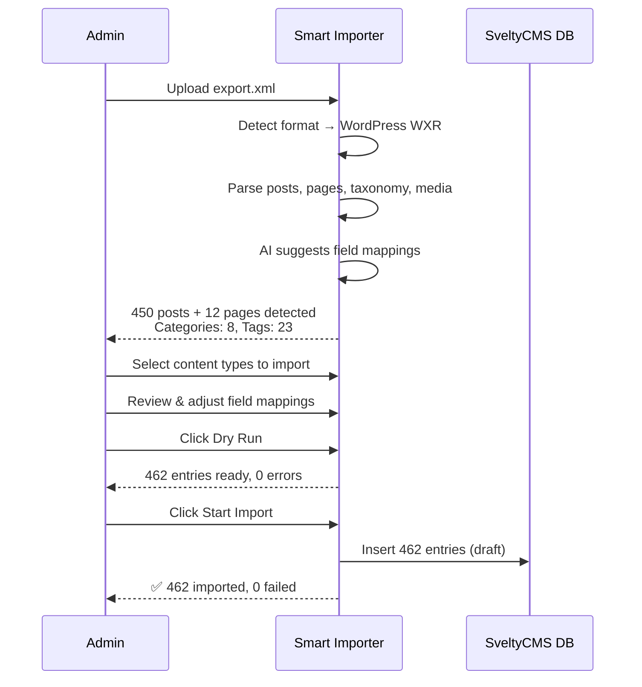

# WordPress → SveltyCMS Migration Guide

This guide walks you through migrating a WordPress site to SveltyCMS. It covers the WXR export method (recommended), the REST API method, explains what migrates and what doesn't, and provides a post-migration checklist.

## What Migrates

| WordPress Feature     | SveltyCMS Equivalent                        | How                                                                      |
| :-------------------- | :------------------------------------------ | :----------------------------------------------------------------------- |
| **Posts**             | Entries in `posts` collection               | Full content, excerpt, slug, status, dates                               |
| **Pages**             | Entries in `pages` collection               | Parent/child hierarchy preserved via `parentExternalId`                  |
| **Custom Post Types** | Custom collections                          | Auto-detected, can scaffold new collections                              |
| **Categories**        | Taxonomy arrays on entries                  | Hierarchical categories preserved                                        |
| **Tags**              | Taxonomy arrays on entries                  | All tags extracted                                                       |
| **Featured Images**   | Media library entries                       | `_thumbnail_id` → attachment URL, queued for download                    |
| **Media Attachments** | Media library                               | URLs extracted, optional download and optimization                       |
| **Comments**          | Comment data in `rawCustomFields._comments` | Author, email, date, content, parent thread                              |
| **ACF / CMB2 Fields** | Custom fields in `rawCustomFields`          | Non-underscore meta keys mapped automatically                            |
| **Post Meta**         | Custom fields                               | All meta keys preserved (underscore-prefixed keys stored without prefix) |
| **Authors**           | Author name on entries                      | `dc:creator` → `authorName`                                              |
| **URL Slugs**         | Entry slugs                                 | `wp:post_name` → `slug`                                                  |
| **Post Formats**      | Stored in `rawCustomFields._postFormat`     | standard, aside, gallery, link, etc.                                     |
| **Menu Order**        | Entry `menuOrder` field                     | `wp:menu_order` → `menuOrder`                                            |
| **Post Status**       | Entry status                                | publish→published, draft→draft, pending→pending, trash→archived          |

## What Doesn't Migrate (And Alternatives)

| WordPress Feature                      | Why                       | SveltyCMS Alternative                                                                         |
| :------------------------------------- | :------------------------ | :-------------------------------------------------------------------------------------------- |
| **Plugins** (Yoast, WooCommerce, etc.) | PHP code, not data        | [Plugins](/docs/guides/development/plugin/architecture.mdx) — Stripe, SEO, etc.               |
| **Themes**                             | PHP/CSS templates         | [Appearance](/docs/guides/configuration/appearance) — admin theme + Tailwind v4               |
| **Widgets** (sidebar)                  | PHP widgets               | [Widget System](/docs/widgets) — Svelte 5 native                                              |
| **Shortcodes**                         | PHP-rendered placeholders | [Token System](/docs/architecture/token-system.mdx) — auto-converted during import            |
| **User Accounts**                      | Different auth system     | Manually recreate in [Access Management](/docs/guides/configuration/access-management)        |
| **Menus**                              | Navigation structure      | Rebuild using [Collection Presets](/docs/guides/content/collections)                          |
| **Gutenberg Blocks**                   | React-based editor        | RichText widget (HTML preserved, block structure in `rawCustomFields`)                        |
| **Custom Post Type Definitions**       | Register in PHP           | [Collection Builder](/docs/guides/development/collection-builder.mdx) — visual schema builder |
| **URL Structure** (/blog/post-name)    | WordPress permalink rules | [Redirect Manager](/docs/plugins/redirect-manager) + entry slugs                              |

---

## Prerequisites

1. **SveltyCMS installed and running** — with the Smart Importer plugin enabled
2. **WordPress admin access** — to export content
3. **For REST API method**: WordPress 4.7+ with REST API enabled (enabled by default)

---

## Method A: WXR Export File (Recommended)

Best for: complete site migration with full fidelity — posts, pages, media, comments, ACF fields.

### Step 1 — Export from WordPress

1. In your WordPress admin, go to **Tools → Export** (`/wp-admin/export.php`).
2. Choose **All content** to export everything, or select specific post types.
3. Click **Download Export File**. You'll get a `.xml` WXR file.

For large sites, use WP-CLI:

```bash
wp export --dir=/tmp/export/
```

### Step 2 — Import into SveltyCMS

1. Go to **Config → Migration** in SveltyCMS admin.
2. Drag your `.xml` file onto the upload area.
3. The importer auto-detects it as **WordPress (WXR XML)**.



4. **Content types are detected** — select which to import:

```
☑ post    (450 items)  — Blog posts
☑ page    (12 items)   — Static pages
☐ attachment (89 items) — Media files (imported on demand via _thumbnail_id)
```

5. **Review AI field mappings:**

| WordPress Source   | SveltyCMS Target     | Confidence |
| :----------------- | :------------------- | :--------: |
| `post_title`       | `title`              |   🟢 95%   |
| `content:encoded`  | `content` (RichText) |   🟢 90%   |
| `excerpt:encoded`  | `excerpt`            |   🟢 85%   |
| `wp:post_name`     | `slug`               |   🟢 90%   |
| `wp:status`        | `status`             |   🟢 85%   |
| `wp:post_date`     | `createdAt`          |   🟢 90%   |
| `wp:post_modified` | `updatedAt`          |   🟢 90%   |
| `dc:creator`       | `author`             |   🟡 75%   |
| `wp:post_parent`   | `parentId`           |   🟡 70%   |
| `wp:menu_order`    | `order`              |   🟡 70%   |
| `category`         | `categories`         |   🟢 85%   |
| `post_tag`         | `tags`               |   🟢 85%   |
| `_thumbnail_id`    | `featuredImage`      |   🟢 80%   |

6. Click **Dry Run** to validate without writing data.
7. Click **Start Import** to begin the migration.
8. All imported entries are in **Draft** status — review before publishing.

### Step 3 — Post-Import Checklist

- [ ] **Review authors**: WordPress usernames are preserved as `authorName`. Map them to SveltyCMS users if needed
- [ ] **Check featured images**: If `_thumbnail_id` references exist, verify images downloaded
- [ ] **Download media**: Set `importMedia: true` to download attachments referenced in content
- [ ] **Verify hierarchy**: Pages with `post_parent` should show parent/child relationships
- [ ] **Review ACF fields**: All ACF/CMB2 custom fields are in `rawCustomFields` — consider creating dedicated widget fields for important ones
- [ ] **Check comments**: `rawCustomFields._comments` contains author, email, date, content, parent structure
- [ ] **Set up redirects**: If permalink structure changed, use [Redirect Manager](/docs/plugins/redirect-manager) for 301 redirects
- [ ] **Rebuild menus**: WordPress menus don't export — rebuild navigation using collection relationships
- [ ] **Shortcode cleanup**: WordPress shortcodes like `[year]`, `[site_title]` are **auto-converted to SveltyCMS tokens** — verify they render correctly
- [ ] **Test a few entries**: Publish 5-10 entries and verify content, images, and taxonomy display correctly

---

## Method B: Live REST API Sync

Best for: simple content, no need for comments/ACF/media fidelity.

### Step 1 — Verify REST API on WordPress

WordPress REST API is enabled by default. Verify:

```bash
curl https://your-site.com/wp-json/wp/v2/posts
```

For authenticated access, create an Application Password:

1. Go to **Users → Profile** → **Application Passwords**.
2. Add a new application password for "SveltyCMS Migration".
3. Copy the generated password.

### Step 2 — Import via SveltyCMS

1. Go to **Config → Migration**.
2. Select **WordPress (REST API)** as source.
3. Enter your WordPress URL (e.g., `https://mysite.com`).
4. Enter the content type: `posts`, `pages`, or a custom post type.
5. Optionally provide Application Password for authenticated access.
6. Click **Connect** — fetches schema and sample data.
7. Review AI field mappings and start import.

> **Note**: REST API sync is best for simple content. For full fidelity (comments, ACF fields, media, hierarchy), use the WXR file method.

---

## Token Auto-Conversion During Import

WordPress shortcodes in your content are automatically converted to SveltyCMS tokens:

| WordPress Shortcode   | SveltyCMS Token        | What It Does      |
| :-------------------- | :--------------------- | :---------------- |
| `[year]`              | `{{ system.year }}`    | Current year      |
| `[site_title]`        | `{{ site.SITE_NAME }}` | Site name         |
| `[current_date]`      | `{{ system.now }}`     | Current date/time |
| `[the_author]`        | `{{ entry.author }}`   | Entry author      |
| `[the_title]`         | `{{ entry.title }}`    | Entry title       |
| `[the_permalink]`     | `{{ entry.slug }}`     | Entry URL         |
| `[the_excerpt]`       | `{{ entry.excerpt }}`  | Entry excerpt     |
| `[bloginfo name]`     | `{{ site.SITE_NAME }}` | Site name         |
| `[bloginfo url]`      | `{{ site.HOST_PROD }}` | Site URL          |
| `[user_display_name]` | `{{ user.name }}`      | User name         |

This means your imported content immediately uses dynamic tokens — no manual shortcode migration needed.

---

## Advanced: Migrating Specific Content Types

### Blog Posts Only

```bash
bun run migrate import --file=export.xml --format=wordpress --collection=posts \
  --filter-content-type=post
```

### Pages with Hierarchy

```bash
bun run migrate import --file=export.xml --format=wordpress --collection=pages \
  --filter-content-type=page
```

### WooCommerce Products

```bash
bun run migrate import --file=export.xml --format=wordpress --collection=products \
  --filter-content-type=product
```

> WooCommerce product data (price, SKU, stock) is in `rawCustomFields` — create dedicated fields after import.

### Sample / Test Import (First 10 Posts)

```bash
bun run migrate import --file=export.xml --format=wordpress --collection=posts \
  --sample-first=10
```

---

## Common Issues & Solutions

| Problem                            | Solution                                                                                                                      |
| :--------------------------------- | :---------------------------------------------------------------------------------------------------------------------------- |
| **"Unknown format" on upload**     | Ensure file is valid WXR XML (starts with `<rss>` or contains `<wp:`). Try re-exporting from WordPress                        |
| **Images not appearing**           | Set `--import-media` flag. Check that attachment URLs are accessible from your SveltyCMS server                               |
| **ACF fields missing**             | ACF fields with underscore-prefixed keys (`_my_field`) are stored as `my_field` (without underscore). Check `rawCustomFields` |
| **PHP serialized data in meta**    | Complex serialized objects are preserved as strings. Use `rawCustomFields` to access them                                     |
| **Gutenberg blocks show raw HTML** | HTML is preserved. Gutenberg block comments (`<!-- wp:paragraph -->`) are stripped. Content renders in RichText widget        |
| **Comments not imported**          | Comments are in `rawCustomFields._comments` array. Create a dedicated comments widget to display them                         |
| **Large WXR file (>100MB)**        | Use CLI mode: `bun run migrate import --file=export.xml --format=wordpress --collection=posts`                                |
| **Duplicate content on re-import** | Use `--conflict=skip` to skip existing entries, or `--conflict=overwrite` to update them                                      |
| **Hierarchical pages wrong order** | `menuOrder` is preserved. Use the entry list sorting to order by `menuOrder`                                                  |
| **Special characters garbled**     | WXR parser handles CDATA sections correctly. If issues persist, check your WordPress database encoding is UTF-8               |

---

## Migration Timeline (Typical)

| Site Size                           | Content                                | Estimated Time |
| :---------------------------------- | :------------------------------------- | :------------- |
| **Small blog** (<100 posts)         | Posts, pages, few images               | 15 min         |
| **Medium site** (100-1,000 posts)   | Blog + pages + media library           | 1-2 hours      |
| **Large site** (1,000-10,000 posts) | Multiple post types, WooCommerce, ACF  | 4-8 hours      |
| **Enterprise** (10,000+ posts)      | Multisite, custom plugins, complex ACF | 1-3 days       |

> Times include export, import, media download, and post-migration validation. CLI mode reduces import time by 50-100x.

---

## Related

- [Smart AI-Driven Migration Pro Docs](smart-importer.mdx)
- [Drupal Migration Guide](drupal-migration.mdx)
- [Token System Documentation](/docs/architecture/token-system.mdx)
- [Redirect Manager Plugin](/docs/plugins/redirect-manager)
- [Access Management Guide](/docs/guides/configuration/access-management)
