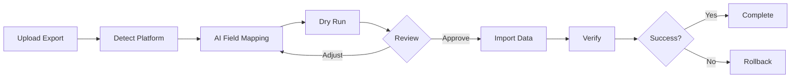
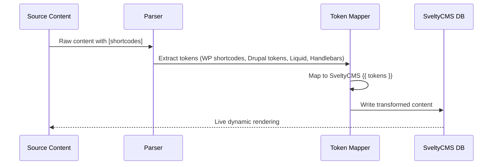

# Smart AI-Driven Migration Pro v2.1

A comprehensive migration tool for headless CMS platforms — as of June 2026, supporting 40+ source platforms, spreadsheets, databases, APIs, and Markdown — with AI-guided field mapping, visual transformation, background jobs, and enterprise-grade security.

## 🚀 v2.1 Highlights

- **40+ CMS platforms** — WordPress, Drupal, Shopify, Contentful, Strapi, Ghost, Webflow, and 34 more
- **Forward-Reference Auto-Stubbing** — handles circular dependencies automatically with placeholder resolution
- **In-Body Media Harvesting** — scans HTML content for `` tags, downloads images, rewrites paths
- **Cyclic Dependency Resolution** — DFS-based topological sort with cycle detection for complex graphs
- **Direct DB Cursor Streaming** — stream from MySQL/PostgreSQL/SQLite directly, no file export needed
- **Deep JSONPath Resolution** — `resolveDeepJsonPath(obj, "store.books[0].meta.pages")` for complex payloads
- **Schema Diff Previews** — Git-style color-coded diff of what will change before scaffold runs
- **4 conflict strategies** — skip, overwrite, merge, keep_both
- **5 pipeline steps** — Detect → Map → Dry Run → Import → Verify
- **Zero-risk rollback** — full transactional undo with ledger tracking



## Visual Wizard Architecture (v2.1)

The 5-step wizard opens via the `plugin_workspace` slot (`/config?plugin=smart-importer`) and is backed by shared orchestration modules:

| Module                           | Role                                                                                                |
| :------------------------------- | :-------------------------------------------------------------------------------------------------- |
| `import-runner.ts`               | Parse → filter → delta → ingest; license gates; background queue at 500+ entries                    |
| `import-options.ts`              | Wizard JSON → control-plane `ImportFilter`                                                          |
| `mapping-tree.ts`                | Flat mappings ↔ `TransformationTree` nodes                                                          |
| `schema-preview.ts`              | Dry-run schema diff vs target collection                                                            |
| `known-mappings.ts`              | Shared default field mappings per platform (wizard + CLI)                                           |
| `infer-collection.ts`            | Auto-detect target collection from content types / parsed entries                                   |
| `collection-scaffold.ts`         | Auto-provision missing collections via Collection Builder pipeline (TS → compile → refresh → model) |
| `delta-engine.ts`                | Highwater marks + checksum delta (`plugin_importer_delta`)                                          |
| `job-queue.ts`                   | Background imports with SSE progress polling                                                        |
| `utils/migrated-media.server.ts` | Full CMS media pipeline: original on disk + `saveResizedImages` variants (sm/md/lg + WebP sidecars) |
| `utils/media-optimize.ts`        | Standalone sharp helper; migration uses `saveResizedImages` for parity with gallery uploads         |

**Pro-gated wizard options:** delta/incremental import, PII scrubbing.  
**SSE endpoint:** `POST /api/migration/import` streams `progress` → `complete` events.

### Auto-Scaffold (Fresh CMS)

When the target collection does not exist, Step 3 (Validate) offers **Create Collection from Mappings**. This mirrors the official Collection Builder save path:

1. `buildCollectionSchemaFromMappings()` — maps importer field types → SveltyCMS widgets
2. `generateCollectionSourceFile()` — writes `config/collections/{id}.ts`
3. `markFileDirty()` → `compile()` → `contentSystem.refresh()` → `createModel()`

Imports also call `ensureTargetCollectionProvisioned()` before ingestion when mappings are present, so CLI/API paths auto-create missing collections. Target collection names are **inferred from migration data** (e.g. WordPress `wp:post_type` → `post`, Strapi `type` → collection id) via `infer-collection.ts`; IDs are normalized (`My Posts` → `my_posts`) for file paths and CRUD.

### Multi-content-type imports (v2.1)

When multiple source content types are selected (e.g. WordPress `post` + `page`), the wizard still imports into **one** SveltyCMS collection:

| Scenario                             | Primary type rule                                                      |
| :----------------------------------- | :--------------------------------------------------------------------- |
| Parsed entries available             | Highest count among selected types (e.g. 80 posts + 20 pages → `post`) |
| Wizard detect only (no entry sample) | First type in the active selection order                               |
| User override                        | Target Collection field always wins                                    |

All selected types are still **filtered in** via `contentTypes` on import — only the **destination collection name** uses the primary type. Splitting into separate collections per type (e.g. `post` and `page` as distinct targets) is **planned**; see [Roadmap — Per-Content-Type Collection Split](../../../docs/project/roadmap-2026.mdx).

**Permission:** scaffold and import-into-new-collection require admin or the registered `config:collectionbuilder` permission (see `hasCollectionBuilderPermission()` in `permissions.ts`).

**Import result:** when auto-provision runs, `scaffold: { created, collectionId, fieldCount }` is included in the SSE `complete` event and wizard review step.

## Quick Start

```bash
# UI mode: Config → Migration tile
# CLI mode (uses runMigrationImport + known-mappings + auto-scaffold):
bun run migrate import --file=export.xml --format=wordpress --collection=posts
bun run migrate validate --file=data.json --format=strapi
bun run migrate scaffold --file=export.xml --format=wordpress --collection=posts
bun run migrate delta --file=export.xml --format=wordpress --since=2025-01-01
bun run migrate rollback --token=txn_abc123
bun run migrate status
```

## Feature Matrix

### Core Features (Free Tier)

| #   | Feature                                                                   |
| :-- | :------------------------------------------------------------------------ |
| 1   | Auto-detect 40+ CMS platforms + CSV/Markdown/SQL/API                      |
| 2   | AI field mapping with confidence scores (🟢 🟡 🔴)                        |
| 3   | Content type selection (choose what to import)                            |
| 4   | 7 transform actions: map, split, merge, transform, enrich, relink, filter |
| 5   | Sample preview — see transformed data before import                       |
| 6   | Dry-run validation — test without writing                                 |
| 7   | Batch processing with configurable sizes                                  |
| 8   | 4 conflict strategies: skip, overwrite, merge, keep_both                  |
| 9   | AI health score (0-100) with improvement suggestions                      |
| 10  | Smart defaults — auto-filled collection, mappings, strategy               |
| 11  | Platform-specific guidance tips                                           |
| 12  | 5-step visual wizard: Upload → Map → Validate → Import → Review           |
| 13  | Dead-Letter Queue with inline error correction                            |
| 14  | Draft-by-Default Airgap — all imports are drafts                          |
| 15  | Tenant isolation per import                                               |

### Pro Tier (Marketplace License)

| #   | Feature                                                             |
| :-- | :------------------------------------------------------------------ |
| 16  | 31 additional platforms (Contentful, Sanity, Shopify, Ghost, etc.)  |
| 17  | AST compilers: RichText, PortableText, Lexical                      |
| 18  | AI enrichments: word count, reading time, SEO, auto-tagging         |
| 19  | Delta/incremental imports (highwater marks, only changed items)     |
| 20  | Transaction rollback with asset cleanup                             |
| 21  | Background job queue for 100K+ imports                              |
| 22  | SSE streaming progress                                              |
| 23  | Rate-limited media downloads with retry logic                       |
| 24  | S3-compatible cloud storage for mirrored assets                     |
| 25  | PII scrubbing (GDPR/CCPA) — auto-redact email, phone, SSN           |
| 26  | Crypto-chained audit logging (SHA-256, tamper-evident)              |
| 27  | Exportable migration reports (JSON)                                 |
| 28  | Webhooks on import complete/failure (CI/CD integration)             |
| 29  | i18n/locale field handling (Contentful, Drupal, Storyblok)          |
| 30  | Custom parser plugin API (marketplace)                              |
| 31  | Migration presets (save/load configurations)                        |
| 32  | CLI: rollback, status, delta, preset management                     |
| 33  | Schema auto-scaffolding from source                                 |
| 34  | Post-migration validation with spot checks                          |
| 35  | Forward-reference auto-stubbing (circular dependency healing)       |
| 36  | Deep JSONPath resolution for nested structures                      |
| 37  | Schema diff previews (Git-style before/after)                       |
| 38  | Token auto-conversion during import (shortcodes → SveltyCMS tokens) |

---

## Data Restructuring & Content Rewriting

Migration is not just copying data — it's about restructuring it for optimal performance in the target CMS.

### Token Replacement During Import

Source platform tokens, shortcodes, and placeholders are automatically converted to SveltyCMS dynamic tokens:

| WordPress      | SveltyCMS Token        | Effect       |
| :------------- | :--------------------- | :----------- |
| `[year]`       | `{{ system.year }}`    | Current year |
| `[site_title]` | `{{ site.SITE_NAME }}` | Site name    |
| `[the_author]` | `{{ entry.author }}`   | Entry author |
| `[the_title]`  | `{{ entry.title }}`    | Entry title  |

| Drupal                     | SveltyCMS Token                            | Effect         |
| :------------------------- | :----------------------------------------- | :------------- |
| `[current-date:html_date]` | `{{ system.now \| date("MMM do, yyyy") }}` | Formatted date |
| `[site:name]`              | `{{ site.SITE_NAME }}`                     | Site name      |
| `[node:title]`             | `{{ entry.title }}`                        | Node title     |
| `[user:display-name]`      | `{{ user.name }}`                          | User name      |

| Shopify Liquid        | SveltyCMS Token        |
| :-------------------- | :--------------------- |
| `{{ product.title }}` | `{{ entry.title }}`    |
| `{{ shop.name }}`     | `{{ site.SITE_NAME }}` |

| Ghost Handlebars  | SveltyCMS Token        |
| :---------------- | :--------------------- |
| `{{@site.title}}` | `{{ site.SITE_NAME }}` |
| `{{title}}`       | `{{ entry.title }}`    |

50+ token mappings across 6 source platforms. Content is immediately dynamic after import — no manual template migration needed.



### Field Transformations (7 Actions)

Every field can be transformed during import:

| Action        | Effect                        | Example                                             |
| :------------ | :---------------------------- | :-------------------------------------------------- |
| **map**       | Direct 1:1 copy               | `post_title` → `title`                              |
| **split**     | One source → multiple targets | `fullName` → `firstName` + `lastName`               |
| **merge**     | Multiple sources → one target | `street` + `city` + `zip` → `address`               |
| **transform** | Value conversion              | `status` "publish" → "published", dates reformatted |
| **enrich**    | AI-generated metadata         | Word count, reading time, SEO title from content    |
| **relink**    | Resolve references            | Author ID → actual user reference                   |
| **filter**    | Conditional skip              | Only import if field meets criteria                 |

```typescript
// Example: merge first_name + last_name → authorName during import
mappings: [
  {
    sourceField: "first_name,last_name",
    targetField: "authorName",
    action: "merge",
    confidence: "high",
  },
];
```

### Content Rewriting with Deep JSONPath

For deeply nested source structures, use dot-notated paths instead of custom code:

```typescript
// Instead of: entry.rawCustomFields.store.books[0].meta.pages
// Use:      "store.books[0].meta.pages"
resolveDeepJsonPath(sourceData, "store.books[0].meta.pages");
```

Works with bracket notation for arrays, dot notation for objects, and mixed paths.

### Forward-Reference Auto-Stubbing

When Entry A references Entry B but B appears later in the import file, the system:

1. Creates a lightweight "stub" placeholder for B
2. Preserves A's relation pointer to B's database ID
3. When B arrives later, upgrades the stub to full data
4. All relations stay intact — no broken links

```typescript
// Before importing, pre-resolve all forward references
await preResolveAllReferences(dbAdapter, entries, "posts", txnToken);
```

### Schema Diff Previews

Before auto-scaffolding a collection, preview exactly what will change:

```
➕ +body (richtext)          ← New field added
🔄 status: text → select     ← Type change (safe)
⚠️ content: richtext → number ← DANGEROUS: data loss risk
❌ -oldField                 ← Field removed
```

The system blocks dangerous type conversions by default and shows a mermaid diagram of all changes.

### Content Deduplication

Duplicate detection runs before import using SHA-256 content hashing:

```typescript
const { unique, report } = await detectDuplicates(entries);
// report.totalEntries: 1000
// report.exactDuplicates: 23
// unique.length: 977
```

### PII Scrubbing During Import

Auto-detect and redact sensitive data during import:

| Strategy | Effect                                   |
| :------- | :--------------------------------------- |
| `redact` | `john@example.com` → `[REDACTED]`        |
| `hash`   | `john@example.com` → `hash_a1b2c3d4e5f6` |
| `mask`   | `john@example.com` → `jo***om`           |
| `remove` | Field deleted entirely                   |

Configurable per field or auto-detected by pattern (email, phone, credit card, SSN, IP).

---

## Performance Tuning

### Database-Native Bulk Strategies

| Database   | Strategy                             | Speedup  | When to Use                             |
| :--------- | :----------------------------------- | :------: | :-------------------------------------- |
| PostgreSQL | `COPY FROM` binary protocol          | **100x** | Default — bypasses SQL parser entirely  |
| MongoDB    | `insertMany()` ordered:false         | **50x**  | Single network round-trip for 100K docs |
| SQLite     | WAL mode + PRAGMA synchronous=NORMAL | **50x**  | 64MB cache, single transaction          |
| MariaDB    | Multi-row INSERT (1000/batch)        | **10x**  | `INSERT ... VALUES (...), (...)`        |

### Adaptive Batch Sizing

```typescript
// Auto-calculates optimal batch size based on entry size
const batchSize = adaptiveBatchSize(avgEntrySizeBytes);
// 1KB entries  → 256,000 per batch
// 10KB entries → 25,600 per batch
// 100KB entries → 2,560 per batch
```

### Concurrent Multi-Stream Import

Dependent collections (posts after categories) are sequenced. Independent collections (tags, media, users) run in parallel:

```
Phase 1 (parallel):  [categories] [tags] [media]
Phase 2 (parallel):  [posts] [pages]
Phase 3 (sequential): [comments]
```

### Deferred Indexing

Drop non-primary indexes before import, recreate after — 2-5x faster writes on large datasets:

```typescript
await withDeferredIndexes(dbAdapter, "posts", ["slug", "createdAt"], async () => {
  await executeUCPIngestion(dbAdapter, envelope, [], "posts", options);
});
// Indexes rebuilt concurrently after import
```

### Media Download Optimization

| Strategy            | Effect                                                        |
| :------------------ | :------------------------------------------------------------ |
| Rate limiting       | Configurable requests/sec to avoid overwhelming source server |
| Concurrency control | Max parallel downloads (default: 5)                           |
| Exponential retry   | 3 attempts with 1s→2s→4s backoff                              |
| Resume support      | Range headers for interrupted downloads                       |
| Format conversion   | Auto-convert to WebP/AVIF with configurable quality           |
| S3 upload           | Direct upload to S3-compatible storage during migration       |

### Large Import Guidance

```
<10K entries:   UI wizard (~100 rps)
10K-100K:       CLI recommended (~5,000 rps)
100K-1M:        Background queue (~10,000 rps)
1M+:            Pre-resolve references + deferred indexes + CLI
```

---

## Partial & Selective Migration

### Smart Filters

Filter what to import with precision:

```bash
# By date range
--filter-created-after=2024-01-01 --filter-created-before=2024-12-31

# By content type
--filter-content-type=post,page

# By status
--filter-status=published

# By field value
--filter-field=category --filter-operator=equals --filter-value=Technology

# Sample for testing
--sample-first=10
--sample-random=50
--sample-every-nth=5
```

### Per-Field Conflict Resolution

Different strategies for different fields in the same import:

```typescript
fieldStrategies: {
  title: "overwrite",       // Always update
  content: "keep_longer",   // Keep whichever is longer
  tags: "merge_arrays",     // Combine arrays
  author: "keep_existing",  // Never overwrite
}
```

### Import Preview / Diff

See exactly what will change before committing:

```
📊 Preview: 450 entries total
  ✅ 412 will be created (new)
  🔄 23 will be updated (changed fields)
  ⏭️ 15 will be skipped (no changes or conflict strategy)
```

### Resumable Imports

Checkpoint every N items — if interrupted, resume from last checkpoint:

```typescript
const checkpoint = await loadCheckpoint(dbAdapter, txnToken);
if (checkpoint) {
  const { remaining, skipCount } = resumeFromCheckpoint(entries, checkpoint);
  // Continue from where we left off
}
```

### Partial Rollback

Roll back only specific content types or date ranges:

```bash
bun run migrate rollback --token=txn_abc123 --content-type=post --created-after=2024-06-01
```

---

## Performance

| Database   | Strategy                 | Speedup  |
| :--------- | :----------------------- | :------: |
| PostgreSQL | `COPY FROM` binary       | **100x** |
| MongoDB    | `insertMany()` unordered | **50x**  |
| SQLite     | WAL + batch TX           | **50x**  |
| MariaDB    | Multi-row INSERT         | **10x**  |

### Deployment Modes

| Mode             | Best For                | Throughput  |
| :--------------- | :---------------------- | :---------: |
| UI Wizard        | Interactive, <50K items |  ~100 rps   |
| CLI              | Automated, 50K+ items   | ~5,000 rps  |
| Background Queue | 1M+ items, non-blocking | ~10,000 rps |

## Supported Platforms

### Free (5 platforms)

WordPress (WXR XML), Drupal (JSON:API/YAML/CSV), Strapi, Directus, SveltyCMS

### Pro (31 platforms)

**Headless:** Contentful, Sanity, Payload, Storyblok, Prismic, Hygraph, Contentstack, DatoCMS, Kontent.ai, Cockpit

**E-commerce:** Shopify, Magento, PrestaShop, OpenCart

**SaaS:** Ghost, Webflow, HubSpot, Wix, Squarespace, Duda, Tilda, Builder.io

**PHP CMS:** Joomla, TYPO3, Craft CMS, Statamic, Grav, ProcessWire, Concrete CMS, October CMS, Bolt CMS, ExpressionEngine, Backdrop, Contao, Silverstripe, Pimcore

### Universal Formats (All Tiers)

CSV/TSV (auto-delimiter), Markdown+YAML, SQL dumps (MySQL/PG/SQLite), REST/GraphQL APIs, Airtable, Notion, Firebase, MongoDB exports

## Security & Compliance

- **PII Scrubbing**: Auto-detect and redact/hash/mask email, phone, credit card, SSN, IP
- **Audit Logging**: SHA-256 crypto-chained entries, tamper-evident, verifiable
- **Draft-by-Default Airgap**: All imports are drafts — no data published without review
- **Tenant Isolation**: All operations scoped to current tenant
- **License Verification**: Marketplace integration with 24h offline grace period

## Extensibility

```typescript
// Custom parser plugin API — publish on marketplace
import { customParserRegistry } from "@plugins/smart-importer/enterprise";

customParserRegistry.register({
  id: "my-custom-cms",
  name: "My Custom CMS Parser",
  format: "mycms",
  version: "1.0.0",
  extensions: [".mycms", ".mcx"],
  parse: async (rawText, token) => {
    return { sourcePlatform: "mycms", version: "1.0", transactionToken: token, entries: [] };
  },
  detect: (header) => header.includes("MYCMS_EXPORT"),
});
```

## Platform-Specific Guides

- [Drupal → SveltyCMS Step-by-Step Guide](docs/drupal-migration.mdx)
- [WordPress → SveltyCMS Step-by-Step Guide](docs/wordpress-migration.mdx)

## CLI Reference

```bash
bun run migrate import    --file=<path> --format=<platform> --collection=<name>
bun run migrate validate  --file=<path> --format=<platform>
bun run migrate scaffold  --file=<path> --format=<platform> [--collection=<name>]
bun run migrate delta     --file=<path> --format=<platform> --since=<ISO-date>
bun run migrate rollback  --token=<txn_token>
bun run migrate status    --token=<txn_token>
bun run migrate preset    --save --name=<name> --format=<platform>
bun run migrate preset    --list
bun run migrate preset    --apply=<name>
```

## Limitations & Known Edge Cases

| Scenario                                | Behavior                                 | Workaround                                                                        |
| :-------------------------------------- | :--------------------------------------- | :-------------------------------------------------------------------------------- |
| **Gutenberg blocks**                    | Preserved as raw HTML comments           | RichText widget renders common blocks; custom blocks need manual migration        |
| **Paragraphs (Drupal)**                 | Stored in `rawCustomFields`              | Restructure into Group widgets after import                                       |
| **Custom PHP modules**                  | Not migratable                           | Rebuild as Svelte 5 widgets or plugins                                            |
| **WooCommerce variants**                | Product variants with >100 SKUs          | Use batch mode with `--batch-size=20`                                             |
| **Very large WXR files (>500MB)**       | Memory pressure                          | Use CLI streaming mode: `bun run migrate import --file=... --stream`              |
| **Deeply nested relations (>5 levels)** | May require multiple passes              | Use forward-reference stubbing; resolve in 2nd pass                               |
| **Non-UTF-8 exports**                   | May cause encoding issues                | Convert to UTF-8 before import: `iconv -f ISO-8859-1 -t UTF-8 export.xml`         |
| **S3/CDN-hosted media**                 | Requires accessible URLs                 | Media download works with any public URL; authenticated CDNs need pre-signed URLs |
| **Real-time DB migrations**             | Direct DB cursor mode is simulation-only | Use file export as intermediate step for production                               |

## Related

- [Plugin Architecture](/docs/guides/development/plugin/architecture.mdx)
- [Marketplace System](/docs/architecture/marketplace.mdx)
- [AI Integration](/docs/guides/development/ai-integration.mdx)
- [Token System](/docs/architecture/token-system.mdx)
