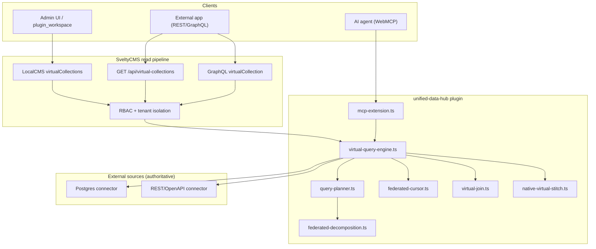
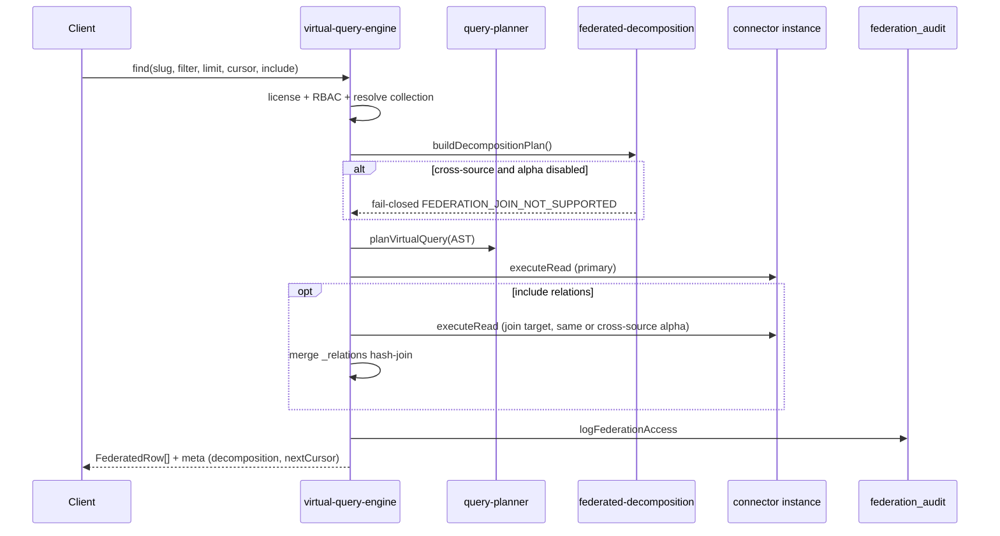
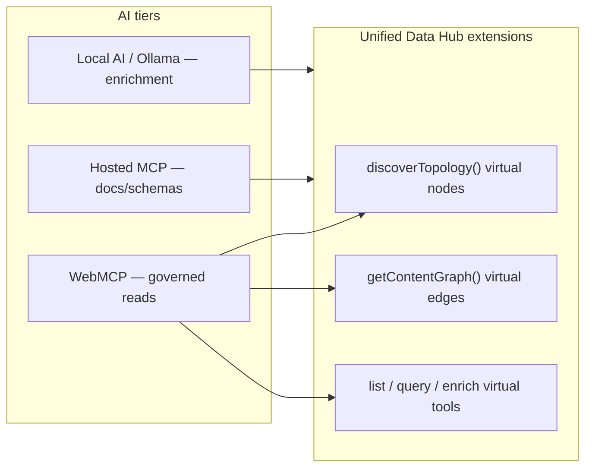
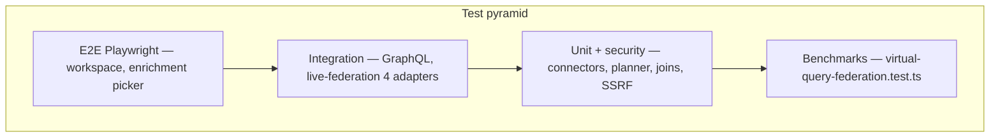

# Unified Data Hub Plugin

**Goal:** Connect external Postgres and REST data sources as governed **virtual collections** — live federation without copying data into SveltyCMS native tables.

Use this plugin when an external system remains the source of truth and SveltyCMS should expose unified reads for admins, headless frontends, GraphQL consumers, and WebMCP agents.

> [!NOTE]
> This page is the **single source of truth** for Unified Data Hub — architecture, POC findings, phase gates, and shipped behavior on `next` as of plugin **v2.4.0**.

---

## Quick start

1. Enable the plugin in **Config → Extensions**.
2. Open **Config → Unified Hub** (`plugin_workspace` slot).
3. Add a connector (Postgres, MariaDB, SQLite, MongoDB, or REST — credentials stay server-only).
4. Map a virtual collection to the connector.
5. Read federated rows:

```typescript
import { LocalCMS } from "@src/services/sdk";

const cms = new LocalCMS(adapter);
const result = await cms.virtualCollections.find("wp-articles", {
  tenantId,
  limit: 25,
  include: ["author"], // same-source join (Phase B)
});
```

**Headless HTTP:** `GET /api/virtual-collections/:slug`

**Per-source cursor (v3 stable):**

```bash
GET /api/virtual-collections/bench-articles?limit=25
# → meta.nextCursor + X-Federation-Next-Cursor

GET /api/virtual-collections/bench-articles?limit=25&cursor=<nextCursor>
```

---

## Smart Importer vs Unified Data Hub

| Dimension   | Smart Importer                                | Unified Data Hub                                         |
| ----------- | --------------------------------------------- | -------------------------------------------------------- |
| Purpose     | One-time / batch migration **into** SveltyCMS | Ongoing **live federation** — source stays authoritative |
| Data flow   | Source → native collections (copy)            | Source ← proxy (no copy)                                 |
| UI entry    | Migration tile → `/config/migration`          | Unified Hub tile → `plugin_workspace`                    |
| Shared code | `smart-importer/parsers/` for exports         | `shared-schema/wordpress-rest.ts` for live REST          |

**Decision tree:**

1. Migrate away from a legacy CMS → [Smart Importer](https://marketplace.sveltycms.com) (marketplace plugin)
2. Keep legacy CMS as source of truth → Unified Data Hub
3. Federate first, migrate later → Hub, then Smart Importer snapshot bridge

---

## Architecture overview



### Query read pipeline (v1.0 → v3.0)



### Plugin structure (config page + plugin pattern)

| Layer                     | Path                                          | Role                                                                                    |
| ------------------------- | --------------------------------------------- | --------------------------------------------------------------------------------------- |
| Metadata + UI slots       | `index.ts`                                    | `config_grid`, `plugin_workspace`, `collection_builder`, `entry_edit_sidebar`           |
| Server hooks + migrations | `index.server.ts`                             | `ensureCollection` migrations; license `beforeSave` on `plugin_unified-data-hub_*` only |
| Admin workspace           | `hub-page.server.ts` + `hub-workspace.svelte` | Connector/virtual CRUD via `/api/plugins/unified-data-hub`                              |
| Headless contracts        | `headless-contracts.ts`                       | Virtual slot schemas + REST catalog                                                     |
| Business logic            | `server/*`                                    | Connectors, cache, audit, SSRF allowlist                                                |

Follows [Plugin Architecture](/docs/development/plugins/architecture.mdx) and [Plugin Development Guide](/docs/development/plugins/development.mdx).

---

## Feature Matrix

### Core Features (Free Tier)

| #   | Feature                                                              | Implementation                                                        |
| :-- | :------------------------------------------------------------------- | --------------------------------------------------------------------- |
| 1   | Passthrough executor — single-source virtual read                    | `virtual-query-engine.ts`                                             |
| 2   | SQL + Mongo database connectors (read + write)                       | `postgres.ts`, `mariadb.ts`, `sqlite.ts`, `mongodb.ts`                |
| 3   | REST API connector (read + opt-in writes)                            | `rest-openapi.ts`, `rest-egress.ts`                                   |
| 4   | Single-source write-back via LocalCMS + API                          | `virtual-write-engine.ts`                                             |
| 5   | LocalCMS `virtualCollections` namespace                              | `virtual-collections-namespace.ts`                                    |
| 6   | HTTP `GET /api/virtual-collections/:slug`                            | `handlers/virtual-collections.ts`                                     |
| 7   | GraphQL `virtualCollections` / `virtualCollection` / `virtualEnrich` | `resolvers/virtual-collections.ts`                                    |
| 8   | AST normalization + connector capability pre-check                   | `query-planner.ts`                                                    |
| 9   | Postgres connection pool cache (p95 ~12ms)                           | `postgres-pool-cache.ts`                                              |
| 10  | WordPress REST filter/sort pushdown                                  | `query-planner.ts` + `wordpress-rest.ts`                              |
| 11  | Circuit breaker — 3 failures / 60s                                   | `connector-circuit-breaker.ts`                                        |
| 12  | Cache tenant index                                                   | `cache.ts`                                                            |
| 13  | Same-source virtual joins `?include=`                                | `virtual-join.ts`                                                     |
| 14  | Native entry stitch enrich (`/enrich`)                               | `native-virtual-stitch.ts`                                            |
| 15  | Entry preview sidebar + federation enrichment picker                 | `virtual-entry-preview.svelte`, `federation-enrichment-picker.svelte` |
| 16  | N+1 stitch telemetry + response headers                              | `stitch-telemetry.ts`                                                 |
| 17  | Per-source cursor pagination                                         | `federated-cursor.ts`, `meta.nextCursor`                              |
| 18  | Decomposition plan tree (v3.0)                                       | `federated-decomposition.ts`                                          |
| 19  | Crypto-chained federation audit                                      | `audit.ts`                                                            |
| 20  | Tier-enforced limits — 1 connector, 3 virtual collections            | `tier-limits.ts`                                                      |

### Pro Tier (Marketplace License)

| #   | Feature                                                                    | Implementation                                                                      |
| :-- | :------------------------------------------------------------------------- | ----------------------------------------------------------------------------------- |
| 21  | Unlimited connectors + virtual collections                                 | `tier-limits.ts` (threshold gating)                                                 |
| 22  | Cross-source join execution (v3.1 alpha)                                   | `enableCrossSourceAlpha` config flag                                                |
| 23  | WebMCP virtual tools — list, query, enrich                                 | `list_virtual_collections`, `query_virtual_collection`, `enrich_virtual_collection` |
| 24  | Topology + content graph extension for AI agents                           | `mcp-extension.ts`, `navigation.ts`                                                 |
| 25  | Headless API contracts — slot schemas + REST catalog                       | `headless-contracts.ts`                                                             |
| 26  | GraphQL `createVirtualEntry` / `updateVirtualEntry` / `deleteVirtualEntry` | Same LocalCMS write path                                                            |
| 27  | SaaS connectors (roadmap: GraphQL, Salesforce, HubSpot)                    | Post-MVP                                                                            |
| 28  | Custom connector SDK for marketplace                                       | Post-MVP                                                                            |
| 29  | Visual Studio query builder                                                | Post-MVP                                                                            |
| 30  | Materialized views with configurable refresh schedules                     | Post-MVP                                                                            |

### Explicitly deferred (not in current scope)

| Feature                                  | Notes                                                         |
| ---------------------------------------- | ------------------------------------------------------------- |
| REST write-back hardening                | OAuth2 forwarding, response schema validation, retry policies |
| Row/column policy engine                 | Collection-level RBAC covers read access today                |
| GraphQL supergraph / federation spec     | Per-collection GraphQL queries only in v2.x                   |
| `search_entries` + `includeVirtual`      | Not shipped                                                   |
| AI Command Bar cross-source NL queries   | WebMCP tools provide governed reads already                   |
| GraphQL / SaaS OAuth connectors          | MariaDB, SQLite, MongoDB shipped — SaaS connectors post-MVP   |
| Hosted MCP `search_federation_docs` tool | Plugin `.mdx` indexed via hosted MCP docs (roadmap)           |

---

## Query planner POC findings

Phase 0 discovery answers. Shipped outcomes:

| #   | POC question                   | v2.2.0 answer                                                                                |
| --- | ------------------------------ | -------------------------------------------------------------------------------------------- |
| 1   | Filter pushdown coverage?      | Postgres: full WHERE. REST: WordPress slug/status/search pushdown; remainder client-filtered |
| 2   | Pagination across REST vs SQL? | Per-source opaque `cursor` / `nextCursor`; global offset cannot span connectors              |
| 3   | Normalization shape?           | `FederatedRow` with `_id` (`connectorId:sourceKey`) and `_source` metadata                   |
| 4   | modifyRequest / LocalCMS cost? | Benchmark scaffold: `tests/benchmarks/virtual-query-federation.test.ts`                      |
| 5   | Cache key strategy?            | `udh:{tenantId}:{collectionId}:{queryHash}` LRU 2000; TTL from connector                     |
| 6   | REST error surfacing?          | `FederationError` `CONNECTOR_QUERY_FAILED` (502); 15s timeout; circuit breaker               |
| 7   | Smart Importer WP parity?      | `shared-schema/wordpress-rest.ts` — REST JSON path, not WXR export                           |

### Hard rejection rules (fail-closed)

| Condition                            | Error code                              |
| ------------------------------------ | --------------------------------------- |
| Multi-collection filter in one query | `FEDERATION_JOIN_NOT_SUPPORTED`         |
| Native + virtual field in one filter | `FEDERATION_HYBRID_QUERY_NOT_SUPPORTED` |
| Op exceeds `ConnectorCapabilities`   | `CONNECTOR_CAPABILITY_EXCEEDED`         |
| Cross-source join (alpha off)        | `FEDERATION_JOIN_NOT_SUPPORTED`         |
| Join / stitch key budget exceeded    | `FEDERATION_JOIN_BUDGET_EXCEEDED`       |
| `limit` above `maxPageSize`          | Clamped + `X-Federation-Clamped: true`  |

### Connector capability matrix

```typescript
type ConnectorCapabilities = {
  filterPushdown: boolean;
  sortPushdown: boolean;
  joinable: false | "same-source-only";
  maxPageSize: number;
  supportsTransactions: boolean;
  staleness: "real-time" | "poll" | "cache";
  ttlSeconds?: number;
};
```

Cross-source joins require **v3.1 alpha** (`enableCrossSourceAlpha` + Pro license). Default remains same-source-only.

---

## LocalCMS API (mandatory server-side path)

Server code must use `LocalCMS` — not `fetch('/api/virtual-collections/...')` — per [Local SDK vs HTTP API](/docs/development/local-vs-http-api.mdx).

```typescript
const cms = new LocalCMS(adapter);

// Paginated read
await cms.virtualCollections.find("external_articles", {
  tenantId,
  filter: { status: "active" },
  limit: 25,
  cursor: opaqueCursor,
  include: ["author"],
});

// Batch native-key enrich (entry preview)
await cms.virtualCollections.enrichByKeys("bench-authors", ["1", "2"], {
  tenantId,
  virtualKeyField: "id",
});

// List virtual schemas
await cms.virtualCollections.listSchemas({ tenantId });

// Connector health (sanitized — no credentials)
await cms.virtualCollections.getConnectorHealth(connectorId, { tenantId });
```

**Guarantees:** Same permission pipeline as HTTP/GraphQL; tenant isolation; audit logging; connector I/O outside 5s sandbox hooks (`index.server.ts`).

---

## GraphQL

```graphql
query {
  virtualCollections {
    id
    slug
    name
    connectorId
    type
  }
  virtualCollection(
    slug: "wp-articles"
    limit: 25
    cursor: "opaque-cursor"
    include: ["author"]
    bypassCache: true
  ) {
    total
    meta {
      connectorId
      staleness
      clamped
      included
      nextCursor
      cursorOffset
      decomposition {
        version
        crossSource
        mergeStrategy
        subExpressionCount
        cursorModel
      }
      stitchWarning
      joinKeyCount
    }
    data {
      _id
      sourceKey
      payload
    }
  }
  virtualEnrich(slug: "bench-authors", keys: ["1", "2"], field: "id") {
    meta {
      keyCount
      matched
      stitchWarning
      nearBudget
      warningCode
    }
    data {
      key
      payload
    }
  }
}

mutation CreateVirtualArticle {
  createVirtualEntry(slug: "articles", payload: "{\"title\":\"Hello\",\"slug\":\"hello\"}") {
    meta {
      connectorId
      operation
      sourceKey
    }
    data {
      _id
      sourceKey
      payload
    }
  }
}
```

Write mutations require `collection:write` (same RBAC as REST). `payload` is a JSON object string — field names match the virtual collection schema (not `sourceField`).

> [!IMPORTANT]
> **Known non-blocker:** GraphQL schema cache (`_getYogaApp()` watches `contentSystem.version`) — plugin enable/disable does not refresh the schema until a version bump. Same pattern as other resolvers.

---

## Entry editor sidebar preview

Add `federationEnrichments` to a native collection schema:

```typescript
federationEnrichments: [
  {
    label: "Author",
    nativeField: "authorId",
    virtualSlug: "bench-authors",
    virtualKeyField: "id",
    displayFields: ["name"],
  },
],
```

The `entry_edit_sidebar` slot (`virtual-entry-preview.svelte`) batch-fetches via `/api/virtual-collections/:slug/enrich`. Configure mappings in Collection Builder (`federation-enrichment-picker.svelte` on the Settings tab).

---

## WebMCP and AI integration



| Tool                        | Description                                         |
| --------------------------- | --------------------------------------------------- |
| `list_virtual_collections`  | Virtual schemas + sanitized connector metadata      |
| `query_virtual_collection`  | Governed read with `cursor` / `include` (read-only) |
| `enrich_virtual_collection` | Batch native-key stitch enrich (read-only)          |

GraphQL write mutations (`createVirtualEntry`, `updateVirtualEntry`, `deleteVirtualEntry`) are available for headless clients; WebMCP has no write tools.

Headless bridge: `globalThis.__webmcp_headless_tools`. Topology: `globalThis.__webmcp_headless_navigation.discoverTopology()`. Content graph: `getContentGraph()` adds virtual→virtual and native→virtual enrichment edges.

> [!CAUTION]
> **Draft-by-Default:** WebMCP mutations on **native** collections force `status: "draft"`. Virtual **write** is available via HTTP/LocalCMS for SQL/Mongo connectors only — WebMCP virtual tools remain **read-only** (no agent write tools in v2.3.0).

---

## Headless contracts

External frontends (Next.js, Astro, mobile) consume documented REST/GraphQL endpoints — no Svelte dependency.

```typescript
// POST /api/plugins/unified-data-hub?action=getHeadlessContracts
import { unifiedDataHubHeadlessContracts } from "@plugins/unified-data-hub/headless-contracts";
```

Includes virtual slot schemas, endpoint catalog, GraphQL query list, and WebMCP tool parity references.

### Cross-source alpha (v3.1, Pro-gated)

```typescript
// plugin config (private)
config: {
  private: { enableCrossSourceAlpha: true },
}
```

Requires active Pro license. Integration tests may set `FEDERATION_CROSS_SOURCE_ALPHA=1`. Default: decomposition is plan-only and execution fails closed on cross-source joins.

---

## Licensing

Unified Data Hub uses the same **freemium** model as [Smart Importer](/src/plugins/smart-importer/smart-importer.mdx):

| Tier              | Connectors | Virtual collections | Notable features                                                      |
| ----------------- | ---------- | ------------------- | --------------------------------------------------------------------- |
| Community / trial | 1          | 3                   | Passthrough reads, database + REST connectors, GraphQL, audit         |
| Pro               | Unlimited  | Unlimited           | Cross-source joins, WebMCP tools, headless contracts, SaaS connectors |
| Enterprise        | Unlimited  | Unlimited           | Custom connector SDK, compliance dashboard, priority support          |

See [marketplace.sveltycms.com](https://marketplace.sveltycms.com) for current pricing.

Enforced via `checkExtensionLicense("plugin", "unified-data-hub")` — 14-day trial; `SLM-DEMO-` keys supported. UI shows `<UpgradePrompt>` when trial expires.

[Purchase on Marketplace](https://marketplace.sveltycms.com)

---

## Database agnosticism

SveltyCMS stores plugin metadata through `dbAdapter.crud` on all four production adapters:

| CMS adapter | Plugin collections | Integration test          |
| ----------- | ------------------ | ------------------------- |
| SQLite      | ✅                 | `live-federation.test.ts` |
| MongoDB     | ✅                 | `live-federation.test.ts` |
| MariaDB     | ✅                 | `live-federation.test.ts` |
| PostgreSQL  | ✅                 | `live-federation.test.ts` |

**External connectors** are independent of CMS `DB_TYPE` (e.g., Postgres fixture for connector leg only).

Plugin-owned collections (sandbox prefix):

- `plugin_unified-data-hub_connectors`
- `plugin_unified-data-hub_virtual_schemas`
- `plugin_unified-data-hub_federation_audit`

---

## Security

- Connector credentials: server-only (`hub-page.server.ts`, never in `.svelte` props)
- REST egress: per-connector SSRF host allowlist (`server/ssrf.ts`)
- API dispatcher: `collection:read` for `/api/virtual-collections`
- Federation audit: crypto-chained entries on cross-source reads
- Regression: `tests/unit/plugins/unified-data-hub/unified-data-hub-security.test.ts`

```bash
bun test tests/unit/hooks/defense-in-depth.test.ts \
         tests/unit/plugins/unified-data-hub/unified-data-hub-security.test.ts
```

---

## Testing



| Suite                            | Path                                                                    |
| -------------------------------- | ----------------------------------------------------------------------- |
| Unit POC                         | `tests/unit/plugins/unified-data-hub/federation-poc.test.ts`            |
| Query planner                    | `tests/unit/plugins/unified-data-hub/query-planner.test.ts`             |
| License gate                     | `tests/unit/plugins/unified-data-hub/license-gate.test.ts`              |
| WebMCP virtual tools             | `tests/unit/plugins/unified-data-hub/webmcp-virtual-tools.test.ts`      |
| Tier limits                      | `tests/unit/plugins/unified-data-hub/tier-limits.test.ts`               |
| v3 decomposition / cursor        | `federated-decomposition.test.ts`, `federated-cursor.test.ts`           |
| Cross-source alpha               | `tests/unit/plugins/unified-data-hub/cross-source-alpha.test.ts`        |
| Headless contracts               | `tests/unit/plugins/unified-data-hub/headless-contracts.test.ts`        |
| Content graph                    | `tests/unit/plugins/unified-data-hub/mcp-content-graph.test.ts`         |
| GraphQL integration              | `tests/integration/unified-data-hub/federation.test.ts`                 |
| Live federation (4 CMS adapters) | `tests/integration/unified-data-hub/live-federation.test.ts`            |
| E2E workspace                    | `tests/e2e/routes/config/unified-hub.spec.ts`                           |
| E2E enrichment picker            | `tests/e2e/routes/collection-builder/federation-enrichment.spec.ts`     |
| Security regression              | `tests/unit/plugins/unified-data-hub/unified-data-hub-security.test.ts` |
| Benchmark scaffold               | `tests/benchmarks/virtual-query-federation.test.ts`                     |

### Benchmark targets (single-source, cache-warm)

| Path                          | v2.2.0 target                   | Record command                                                                  |
| ----------------------------- | ------------------------------- | ------------------------------------------------------------------------------- |
| LocalCMS virtual read         | p95 &lt; 50 ms (local Postgres) | `BENCHMARK_RECORD=1 bun test tests/benchmarks/virtual-query-federation.test.ts` |
| HTTP virtual read             | p95 &lt; 200 ms                 | Same benchmark, HTTP path                                                       |
| Cross-source join (alpha off) | Rejection test, not perf        | `virtual-query-engine.test.ts`                                                  |

---

## Related

- [Smart Importer](https://marketplace.sveltycms.com) — one-time migration sibling (marketplace plugin)
- [Local SDK vs HTTP API](/docs/development/local-vs-http-api.mdx)
- [Plugin Architecture](/docs/development/plugins/architecture.mdx)
- [Plugin Development Guide](/docs/development/plugins/development.mdx)
- [WebMCP](/src/plugins/webmcp/webmcp.mdx)
- [AI Integration](/docs/development/ai-integration.mdx)
- [Hosted MCP](https://mcp.sveltycms.com/mcp)
- [Marketplace](/docs/reference/architecture/marketplace.mdx)
